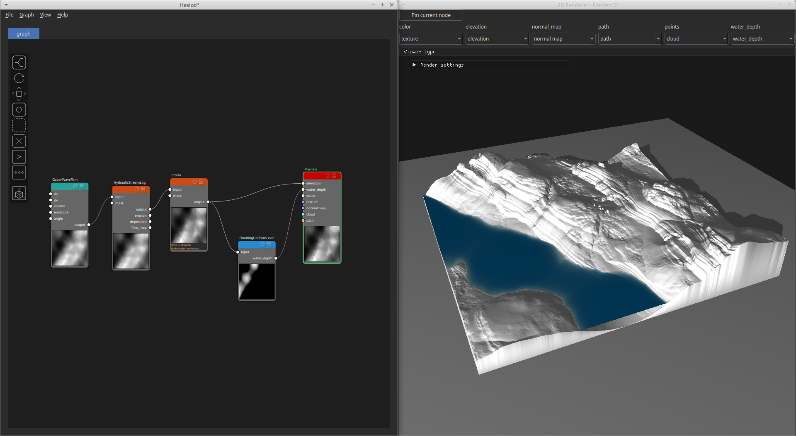

# Hesiod

A desktop application for node-based procedural terrain generation.
- documentation: https://hesioddoc.readthedocs.io
- binaries: https://sourceforge.net/projects/hesiod

>[!WARNING] 
> Work in progress, use at your own risk!




## License

This project is licensed under the GNU General Public License v3.0.

## Getting started

### Standalone executables for Windows and Linux

Available here: https://sourceforge.net/projects/hesiod

### Windows

#### Getting the sources

Use `PowerShell` to clone the repository (because Visual Studio won't clone the submodules) using `git` command lines:
``` bash
git clone --recurse-submodules git@github.com:otto-link/Hesiod.git
```

To get the submodules, you will need a GitHub account with its SSH key configured.

Install [Qt5 SDK](https://wiki.qt.io/Install_Qt_5_Dev_Suite_Windows) and install the missing OpenSource dependencies using `vcpkg`:
```
vcpkg install glfw3 opengl gsl glew freeglut glm libpng glm opencl assimp spdlog opencv
```

You should then be able to build the sources using Visual Studio.

### Linux

There are also required external dependencies for ubuntu you can execute:
```
sudo apt-get -y install libglfw3 libglfw3-dev libglew-dev libopengl-dev freeglut3-dev libboost-all-dev libeigen3-dev libglm-dev fuse libfuse2 ocl-icd-opencl-dev libassimp-dev
```

#### Getting the sources

Use `git` to retrieve the sources: 
``` bash
git clone git@github.com:otto-link/Hesiod.git
cd Hesiod
git submodule update --init --recursive
```

To get the submodules, you will need a GitHub account with its SSH key configured.

#### Building

Build by making a build directory (i.e. `build/`), run `cmake` in that dir, and then use `make` to build the desired target.

Example:
``` bash
mkdir build && cd build
cmake ..
make hesiod
```

Start the main executable:
```
bin/./hesiod
```

## Development roadmap

See https://github.com/otto-link/HighMap.

## Error: Failed to initialize_window OpenGL loader!

Try to install the package `glfw` or `glfw-devel`!

## Dependencies

- https://github.com/otto-link/HighMap / A C++ library to generate two-dimensional terrain heightmaps for software rendering or video games.

- https://github.com/paceholder/nodeeditor/tree/master / Qt Node Editor. Dataflow programming framework
- https://github.com/dmcrodrigues/macro-logger / A simplified logging system using macros
- https://github.com/mgaillard/Noise / Dendry: A Procedural Model for Dendritic Patterns
- https://github.com/Taywee/args / A simple header-only C++ argument parser library
