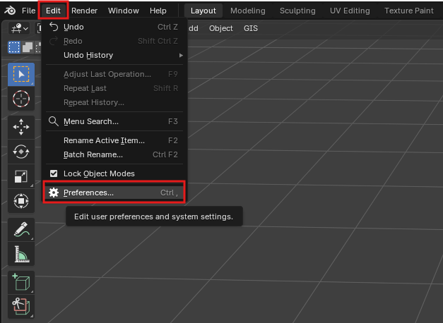
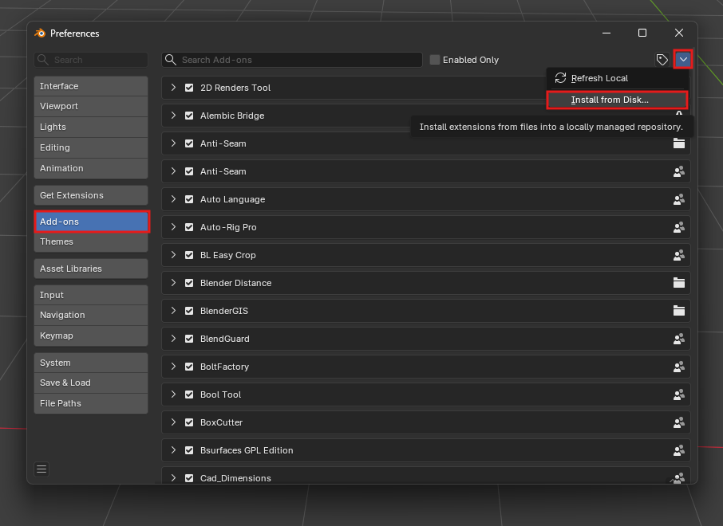
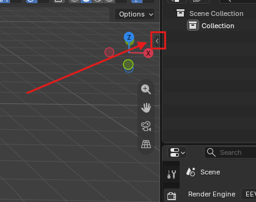
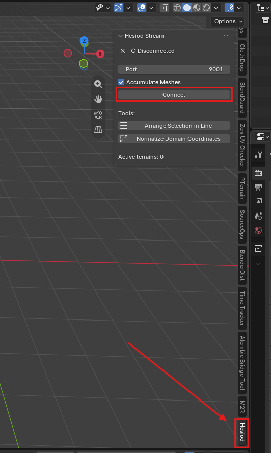

# Blender Bridge

 

The Blender Bridge allows Hesiod to stream terrain data directly into Blender for visualization and further editing. This tutorial explains how to install the Blender add-on and establish a connection between Hesiod and Blender.

The add-on `.zip` is located [here!](./hesiod_streamer.zip)

## Installing the Add-on in Blender

### Method 1: Installing via Zip File (Recommended)

In modern Blender versions (Blender 4.2+), you can install the add-on directly using the `.zip` archive:

- **Drag and Drop**: Simply drag and drop `hesiod_streamer.zip` directly into the Blender viewport.
- **Or via Preferences**:
  1. Open Blender and go to **Edit → Preferences**.
  2. Select the **Get Extensions** / **Add-ons** section.
  3. Click the drop-down menu in the top-right corner and choose **Install from Disk...**
  4. Select `hesiod_streamer.zip` and confirm.

### Method 2: Legacy / Manual Installation

For older Blender versions or manual installation from source:

1. Launch Blender and open the Preferences window: **Edit → Preferences**

2. Open the **Add-ons** tab.

3. Click **Install from Disk...** (or **Install...** in older versions).

4. Navigate to and select the add-on folder or script.

5. Once installed, ensure that the add-on is enabled (checked).

---

### Connecting to Hesiod

1. Return to the main Blender 3D Viewport and open the sidebar by pressing **N** (if it is not already visible).
2. Select the **Hesiod** tab.

3. Click the **Connect** button to establish communication with Hesiod. If Blender is started before Hesiod, the initial connection attempt may fail. Once Hesiod is running, simply press **Connect** again to reconnect.

## Streaming Data from Hesiod

To stream terrain data to Blender:

- Add a BlenderBridge node to your graph.
- Connect a heightmap and/or texture to the node inputs.
- Optional: update the graph.

The bridge automatically creates:

- A mesh generated from the heightmap
- A default material using the streamed texture

Once created, the Blender object can be manipulated normally.

Subsequent graph updates only modify the terrain elevation and texture data, preserving the object's transform and other Blender-side edits.

## Persistence

The connection between Hesiod and Blender is preserved when saving and reopening both Blender scenes and Hesiod projects, provided that the generated Blender object keeps the same name.

After loading a scene, it is recommended to verify that all bridge connections have been restored correctly before continuing to work.

## Performance

The current implementation prioritizes simplicity over rendering performance. At the moment, the entire terrain mesh is streamed from Hesiod to Blender at full resolution whenever the graph is updated. No mesh optimization (tessellation) is currently applied during the transfer.

These features are planned for future versions of the Blender Bridge. Work is already underway to improve performance through optimized mesh streaming, support for normal maps, and more efficient terrain representation techniques.

## Reporting Issues

The Blender Bridge is still under active development and your feedback is greatly appreciated.

If you encounter bugs, connection problems, unexpected behavior, or have suggestions for improvements, please report them on the Hesiod issue tracker: [GitHub Issues](https://github.com/otto-link/Hesiod/issues).
