Node Reference
==============

# Some kind of introduction

# Nodes

## Abs

Apply an absolute function to every values.

### Category

Math/Base
### Inputs

|Name|Type|Description|
| :--- | :--- | :--- |
|input|Heightmap|Input heightmap.|

### Outputs

|Name|Type|Description|
| :--- | :--- | :--- |
|output|Heightmap|Output heightmap.|

### Parameters

|Name|Type|Description|
| :--- | :--- | :--- |
|vshift|Float|Reference value for the zero-equivalent value of the absolute value.|

## AbsSmooth

Apply a smooth absolute value function to every values. The smooth absolute operator computes the absolute value of an input while providing a smooth transition around zero, ensuring continuity and smoothness in the output.

### Category

Math/Base
### Inputs

|Name|Type|Description|
| :--- | :--- | :--- |
|input|Heightmap|Input heightmap.|

### Outputs

|Name|Type|Description|
| :--- | :--- | :--- |
|output|Heightmap|Output heightmap.|

### Parameters

|Name|Type|Description|
| :--- | :--- | :--- |
|inverse|Bool|Toggle inversion of the output values.|
|mu|Float|Smoothing intensity.|
|remap|Value range|Remap the operator's output to a specified range, defaulting to [0, 1].|
|vshift|Float|Reference value for the zero-equivalent value of the absolute value.|

## AccumulationCurvature

Computes the accumulation curvature of a heightmap, indicating how terrain shape influences water flow. Positive values suggest converging flow (e.g., channels or valleys), while negative values indicate diverging flow (e.g., ridges or hilltops).

### Category

Features/Landform
### Inputs

|Name|Type|Description|
| :--- | :--- | :--- |
|input|Heightmap|Input heightmap used for accumulation curvature analysis.|

### Outputs

|Name|Type|Description|
| :--- | :--- | :--- |
|output|Heightmap|Computed accumulation curvature of the input heightmap.|

### Parameters

|Name|Type|Description|
| :--- | :--- | :--- |
|GPU|Bool|Toggle GPU acceleration on or off.|
|inverse|Bool|Invert the output values.|
|radius|Float|Defines the filter radius relative to the domain size, controlling the scale of curvature analysis.|
|remap|Bool|Remap the output values to a specified range, defaulting to [0, 1].|
|smoothing|Bool|Enable or disable smoothing to reduce noise in the curvature computation.|
|smoothing_radius|Float|Specifies the radius for smoothing, determining how much the curvature is averaged over neighboring pixels.|

## Blend

The Blend operator takes two input heightmaps.

### Category

Operator/Blend
### Inputs

|Name|Type|Description|
| :--- | :--- | :--- |
|input 1|Heightmap|Input heightmap.|
|input 2|Heightmap|Input heightmap.|

### Outputs

|Name|Type|Description|
| :--- | :--- | :--- |
|output|Heightmap|Output heightmap.|

### Parameters

|Name|Type|Description|
| :--- | :--- | :--- |
|blending_method|Enumeration|Blending method. Available values: add, exclusion, gradients, maximum, maximum_smooth, minimum, minimum_smooth, multiply, multiply_add, negate, overlay, soft, substract.|
|inverse|Bool|Toggle inversion of the output values.|
|k|Float|Smoothing intensity (if any).|
|radius|Float|Filter radius with respect to the domain size (if any).|
|remap|Value range|Remap the operator's output to a specified range, defaulting to [0, 1].|

## BlendPoissonBf

TODO

### Category

Operator/Blend
### Inputs

|Name|Type|Description|
| :--- | :--- | :--- |
|input 1|Heightmap|Primary heightmap input.|
|input 2|Heightmap|Secondary heightmap input for blending.|
|mask|Heightmap|Mask heightmap controlling blending regions.|

### Outputs

|Name|Type|Description|
| :--- | :--- | :--- |
|output|Heightmap|Resulting heightmap after Poisson blending.|

### Parameters

|Name|Type|Description|
| :--- | :--- | :--- |
|inverse|Bool|Toggle inversion of the output values.|
|iterations|Integer|Number of solver iterations for the Poisson blending process.|
|remap|Value range|Remap the operator's output to a specified range, defaulting to [0, 1].|

## Border

Highlights terrain boundaries by subtracting the eroded version of a DEM from the original. Useful for detecting ridges, valleys, and sharp elevation transitions in terrain analysis.

### Category

Operator/Morphology
### Inputs

|Name|Type|Description|
| :--- | :--- | :--- |
|input|Heightmap|Heightmap input on which the morphological border operation is applied.|

### Outputs

|Name|Type|Description|
| :--- | :--- | :--- |
|output|Heightmap|Resulting heightmap after computing the morphological border.|

### Parameters

|Name|Type|Description|
| :--- | :--- | :--- |
|GPU|Bool|Toogle GPU acceleration on or off.|
|radius|Float|Filter radius with respect to the domain size.|
|remap|Value range|Remap the operator's output to a specified range, defaulting to [0, 1].|

## Broadcast

Makes the input heightmap available to other graph nodes using a shared tag.

### Category

Routing
### Inputs

|Name|Type|Description|
| :--- | :--- | :--- |
|input|Heightmap|Heightmap data to be shared with other graph nodes.|

### Outputs

|Name|Type|Description|
| :--- | :--- | :--- |
|thru|Heightmap|Pass-through of the input heightmap, unchanged.|

### Parameters

|Name|Type|Description|
| :--- | :--- | :--- |
|tag|String|Identifier used to reference this heightmap in other graph nodes.|

## Brush

A manual brush tool for directly painting heightmaps, allowing interactive terrain editing.

### Category

Primitive/Authoring
### Outputs

|Name|Type|Description|
| :--- | :--- | :--- |
|out|Heightmap|The generated heightmap from brush strokes.|

### Parameters

|Name|Type|Description|
| :--- | :--- | :--- |
|Heightmap|Array|The heightmap data representing the painted terrain.|
|inverse|Bool|Invert the drawn values, swapping elevations between high and low.|
|remap|Value range|Remap the brush output to a specified range, defaulting to [0, 1].|

## Bump

Bump generates a smooth transitions between zero-valued boundaries and the center of the domain.

### Category

Primitive/Function
### Inputs

|Name|Type|Description|
| :--- | :--- | :--- |
|control|Heightmap|Control parameter, acts as a multiplier for the weight parameter.|
|dx|Heightmap|Displacement with respect to the domain size (x-direction).|
|dy|Heightmap|Displacement with respect to the domain size (y-direction).|

### Outputs

|Name|Type|Description|
| :--- | :--- | :--- |
|output|Heightmap|Bump heightmap.|

### Parameters

|Name|Type|Description|
| :--- | :--- | :--- |
|center|Vec2Float|Reference center within the heightmap.|
|gain|Float|Shape control parameter.|
|inverse|Bool|Toggle inversion of the output values.|
|remap|Value range|Remap the operator's output to a specified range, defaulting to [0, 1].|

## Caldera

Caldera generates a volcanic caldera landscape.

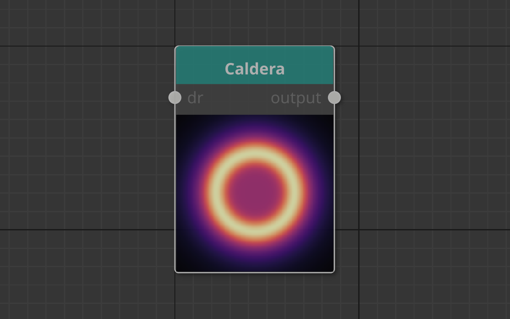
### Category

Primitive/Geological
### Inputs

|Name|Type|Description|
| :--- | :--- | :--- |
|dr|Heightmap|Displacement with respect to the domain size (normal direction).|

### Outputs

|Name|Type|Description|
| :--- | :--- | :--- |
|output|Heightmap|Caldera heightmap.|

### Parameters

|Name|Type|Description|
| :--- | :--- | :--- |
|center|Vec2Float|Reference center within the heightmap.|
|inverse|Bool|Toggle inversion of the output values.|
|noise_r_amp|Float|Noise amplitude for the radial displacement.|
|noise_ratio_z|Float|Noise amplitude for the vertical displacement.|
|radius|Float|Crater radius.|
|remap|Value range|Remap the operator's output to a specified range, defaulting to [0, 1].|
|sigma_inner|Float|Crater inner lip half-width.|
|sigma_outer|Float|Crater outer lip half-width.|
|z_bottom|Float|Crater bottom elevation.|

## Clamp

Clamp restrict a value within a specified range. Essentially, it ensures that a value does not exceed a defined upper limit or fall below a defined lower limit.

### Category

Filter/Range
### Inputs

|Name|Type|Description|
| :--- | :--- | :--- |
|input|Heightmap|Input heightmap.|

### Outputs

|Name|Type|Description|
| :--- | :--- | :--- |
|output|Heightmap|Clamped heightmap.|

### Parameters

|Name|Type|Description|
| :--- | :--- | :--- |
|clamp|Value range|Clamping range.|
|k_max|Float|Upper bound smoothing intensity.|
|k_min|Float|Lower bound smoothing intensity.|
|remap|Bool|Remap the operator's output to a specified range, defaulting to [0, 1].|
|smooth_max|Bool|Activate smooth clamping for the upper bound.|
|smooth_min|Bool|Activate smooth clamping for the lower bound.|

## Closing

Closing is a combination of dilation followed by erosion. It is primarily used for closing small holes or gaps in mask.

### Category

Operator/Morphology
### Inputs

|Name|Type|Description|
| :--- | :--- | :--- |
|input|Heightmap|Input heightmap.|

### Outputs

|Name|Type|Description|
| :--- | :--- | :--- |
|output|Heightmap|Dilated heightmap.|

### Parameters

|Name|Type|Description|
| :--- | :--- | :--- |
|GPU|Bool|Toogle GPU acceleration on or off.|
|radius|Float|Filter radius with respect to the domain size.|

## Cloud

Set of points.

### Category

Geometry/Cloud
### Outputs

|Name|Type|Description|
| :--- | :--- | :--- |
|cloud|Cloud|Set of points (x, y) and elevations z.|

### Parameters

|Name|Type|Description|
| :--- | :--- | :--- |
|cloud|Cloud|Cloud data.|

## CloudLattice

Generate a grid lattice set of points.

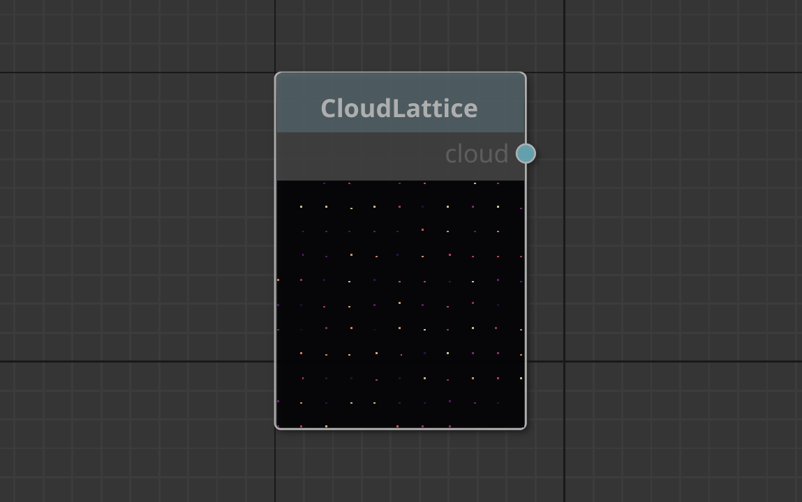
### Category

Geometry/Cloud
### Outputs

|Name|Type|Description|
| :--- | :--- | :--- |
|cloud|Cloud|Set of points (x, y) and elevations z.|

### Parameters

|Name|Type|Description|
| :--- | :--- | :--- |
|delta|Wavenumber|Point spacing in x and y directions.|
|jitter_ratio|Wavenumber|Point jittering (noise) in x and y directions.|
|remap|Value range|Remap the operator's output to a specified range, defaulting to [0, 1].|
|seed|Random seed number|Random seed number|
|stagger_ratio|Wavenumber|Point offset in x and y directions for every two lines or columns.|

## CloudMerge

CloudMerge merges two clouds into a single one.

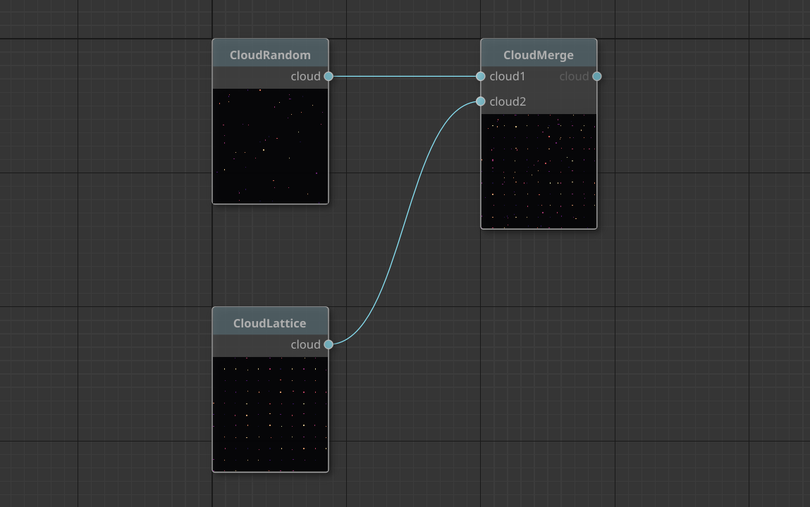
### Category

Geometry/Cloud
### Inputs

|Name|Type|Description|
| :--- | :--- | :--- |
|cloud1|Cloud|Input cloud.|
|cloud2|Cloud|Input cloud.|

### Outputs

|Name|Type|Description|
| :--- | :--- | :--- |
|cloud|Cloud|Merged cloud.|

## CloudRandom

Random set of points.

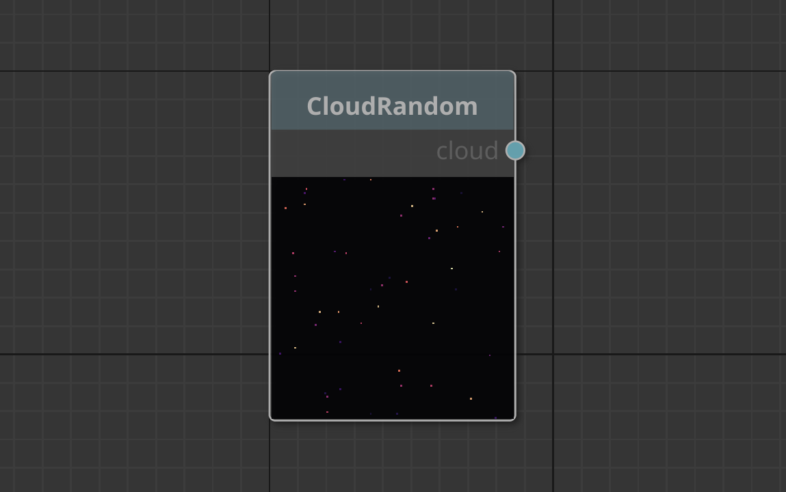
### Category

Geometry/Cloud
### Outputs

|Name|Type|Description|
| :--- | :--- | :--- |
|cloud|Cloud|Set of points (x, y) and elevations z.|

### Parameters

|Name|Type|Description|
| :--- | :--- | :--- |
|npoints|Integer|Number of points.|
|remap|Value range|Remap the operator's output to a specified range, defaulting to [0, 1].|
|seed|Random seed number|Random seed number.|

## CloudRemapValues

CloudRemapValues remap the range of the cloud point values.

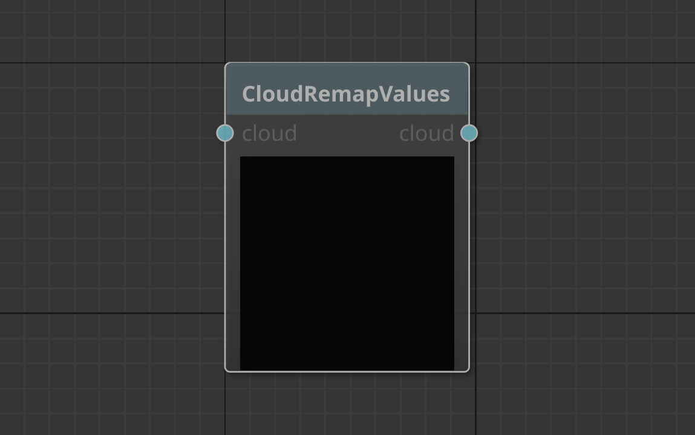
### Category

Geometry/Cloud
### Inputs

|Name|Type|Description|
| :--- | :--- | :--- |
|input|Cloud|Input cloud.|

### Outputs

|Name|Type|Description|
| :--- | :--- | :--- |
|output|Cloud|Output cloud with new value range.|

### Parameters

|Name|Type|Description|
| :--- | :--- | :--- |
|remap|Value range|Remap the operator's output to a specified range, defaulting to [0, 1].|

## CloudSDF

CloudSDF evaluates the signed distance function of a set of points. It assigns a signed distance value to every point in space.

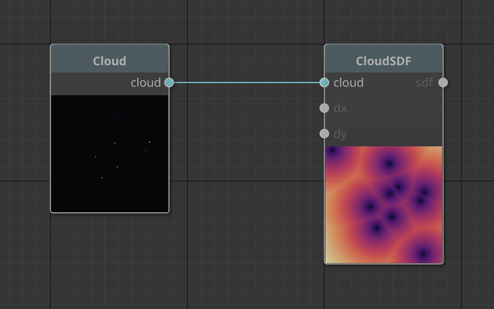
### Category

Geometry/Cloud
### Inputs

|Name|Type|Description|
| :--- | :--- | :--- |
|cloud|Cloud|Input cloud.|
|dx|Heightmap|Displacement with respect to the domain size (x-direction).|
|dy|Heightmap|Displacement with respect to the domain size (y-direction).|

### Outputs

|Name|Type|Description|
| :--- | :--- | :--- |
|sdf|Heightmap|Signed distance as an heightmap.|

### Parameters

|Name|Type|Description|
| :--- | :--- | :--- |
|inverse|Bool|Toggle inversion of the output values.|
|remap|Bool|Remap the operator's output to a specified range, defaulting to [0, 1].|

## CloudToArrayInterp

CloudToArrayInterp generates a smooth and continuous 2D elevation map from a set of scattered points using Delaunay linear interpolation.

### Category

Geometry/Cloud
### Inputs

|Name|Type|Description|
| :--- | :--- | :--- |
|cloud|Cloud|Set of points (x, y) and elevations z.|
|dx|Heightmap|Displacement with respect to the domain size (x-direction).|
|dy|Heightmap|Displacement with respect to the domain size (y-direction).|

### Outputs

|Name|Type|Description|
| :--- | :--- | :--- |
|heightmap|Heightmap|Interpolated heightmap.|

## CloudToPath

CloudToPath convert a Cloud to a Path.

### Category

Geometry/Cloud
### Inputs

|Name|Type|Description|
| :--- | :--- | :--- |
|cloud|Cloud|Input cloud.|

### Outputs

|Name|Type|Description|
| :--- | :--- | :--- |
|path|Path|Output path.|

### Parameters

|Name|Type|Description|
| :--- | :--- | :--- |
|closed|Bool|Decides whether the path is open and closed on itself.|
|reorder_nns|Bool|Decides whether the path points are reordered using a nearest neighbor search.|

## ColorizeCmap

ColorizeCmap generates a texture based on colormaps to assign colors to data values.

### Category

Texture
### Inputs

|Name|Type|Description|
| :--- | :--- | :--- |
|alpha|Heightmap|Texture alpha map.|
|level|Heightmap|Data values for color selection.|
|noise|Heightmap|TODO|

### Outputs

|Name|Type|Description|
| :--- | :--- | :--- |
|texture|HeightmapRGBA|Texture (RGBA).|

### Parameters

|Name|Type|Description|
| :--- | :--- | :--- |
|clamp_alpha|Bool|Clamp to [0, 1] to input alpha map.|
|colormap|Enumeration|Color mapping selection.|
|reverse_alpha|Bool|Reverse the input alpha map.|
|reverse_colormap|Bool|Reverse the colormap range.|
|saturate_alpha|Value range|TODO|
|saturate_input|Value range|TODO|

## ColorizeGradient

ColorizeGradient generates a texture based on colormaps to assign colors to data values.

### Category

Texture
### Inputs

|Name|Type|Description|
| :--- | :--- | :--- |
|alpha|Heightmap|Texture alpha map.|
|level|Heightmap|Data values for color selection.|
|noise|Heightmap|TODO|

### Outputs

|Name|Type|Description|
| :--- | :--- | :--- |
|texture|HeightmapRGBA|Texture (RGBA).|

### Parameters

|Name|Type|Description|
| :--- | :--- | :--- |
|clamp_alpha|Bool|Clamp to [0, 1] to input alpha map.|
|gradient|Color gradient|Colormap as a manually defined color gradient.|
|reverse_alpha|Bool|Reverse the input alpha map.|
|reverse_colormap|Bool|Reverse the colormap range.|

## ColorizeSolid

ColorizeSolid generates an uniform texture based on an input color.

### Category

Texture
### Outputs

|Name|Type|Description|
| :--- | :--- | :--- |
|texture|HeightmapRGBA|Texture (RGBA).|

### Parameters

|Name|Type|Description|
| :--- | :--- | :--- |
|alpha|Float|Transparency as a scalar value|
|color|Color|Solid color.|

## CombineMask

CombineMask performs basic logical operations on a pair of heightmaps (assuming they are used as masks).

### Category

Mask
### Inputs

|Name|Type|Description|
| :--- | :--- | :--- |
|input 1|Heightmap|Input mask.|
|input 2|Heightmap|Input mask.|

### Outputs

|Name|Type|Description|
| :--- | :--- | :--- |
|output|Heightmap|Combined mask.|

### Parameters

|Name|Type|Description|
| :--- | :--- | :--- |
|method|Enumeration|Combining method. Available values: exclusion, intersection, union.|

## ConvolveSVD

ConvolveSVD performs convolution using a Singular Value Decomposition (SVD) of the kernel to accelerate the process.

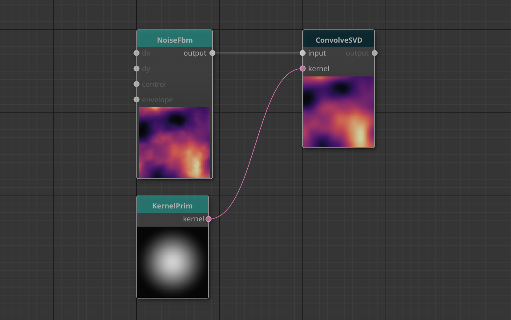
### Category

Math/Convolution
### Inputs

|Name|Type|Description|
| :--- | :--- | :--- |
|input|Heightmap|Input heightmap.|
|kernel|Array|Convolution kernel.|

### Outputs

|Name|Type|Description|
| :--- | :--- | :--- |
|output|Heightmap|Output heightmap.|

### Parameters

|Name|Type|Description|
| :--- | :--- | :--- |
|rank|Integer|Rank of the singular value decomposition.|
|remap|Value range|Remap the operator's output to a specified range, defaulting to [0, 1].|

## Cos

Apply a cosine function to every values.

### Category

Math/Base
### Inputs

|Name|Type|Description|
| :--- | :--- | :--- |
|input|Heightmap|Input heightmap.|

### Outputs

|Name|Type|Description|
| :--- | :--- | :--- |
|output|Heightmap|Output heightmap.|

### Parameters

|Name|Type|Description|
| :--- | :--- | :--- |
|frequency|Float|Frequency.|
|inverse|Bool|Toggle inversion of the output values.|
|phase_shift|Float|Phase shift.|
|remap|Value range|Remap the operator's output to a specified range, defaulting to [0, 1].|

## Crater

Crater generates a crater landscape..

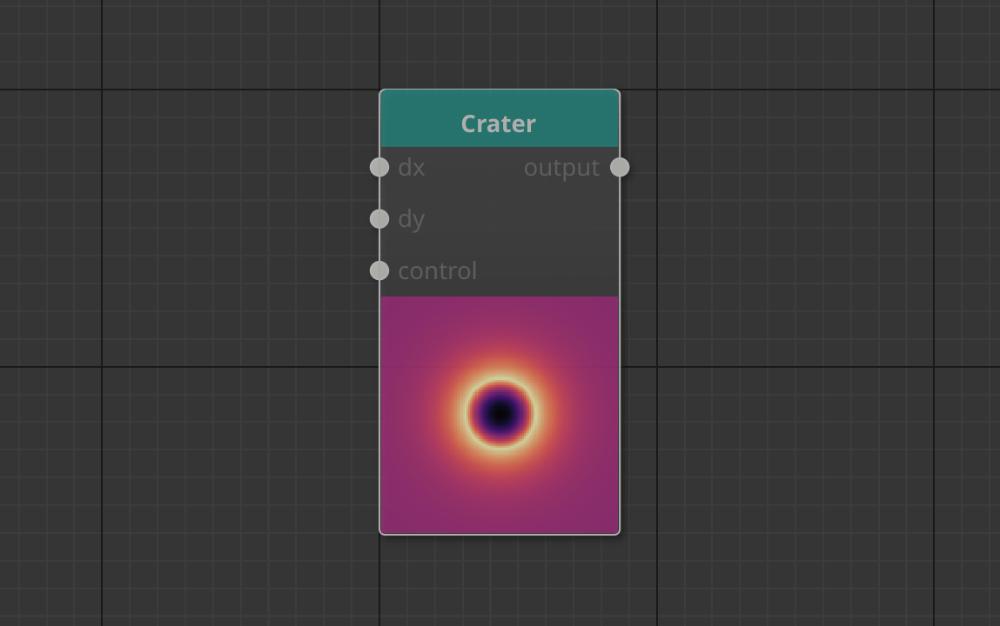
### Category

Primitive/Geological
### Inputs

|Name|Type|Description|
| :--- | :--- | :--- |
|control|Heightmap|Control parameter, acts as a multiplier for the weight parameter.|
|dx|Heightmap|Displacement with respect to the domain size (x-direction).|
|dy|Heightmap|Displacement with respect to the domain size (y-direction).|

### Outputs

|Name|Type|Description|
| :--- | :--- | :--- |
|output|Heightmap|Crater heightmap.|

### Parameters

|Name|Type|Description|
| :--- | :--- | :--- |
|center|Vec2Float|Reference center within the heightmap.|
|depth|Float|Crater depth.|
|inverse|Bool|Toggle inversion of the output values.|
|lip_decay|Float|Ejecta lip decay.|
|lip_height_ratio|Float|Controls the ejecta lip relative height.|
|radius|Float|Crater radius.|
|remap|Value range|Remap the operator's output to a specified range, defaulting to [0, 1].|

## Dendry

Dendry is a procedural model for dendritic patterns generation.

### Category

Primitive/Coherent
### Inputs

|Name|Type|Description|
| :--- | :--- | :--- |
|control|Heightmap|Global control heightmap that defines the overall shape of the output.|
|dx|Heightmap|Displacement with respect to the domain size (x-direction).|
|dy|Heightmap|Displacement with respect to the domain size (y-direction).|
|envelope|Heightmap|Output noise amplitude envelope.|

### Outputs

|Name|Type|Description|
| :--- | :--- | :--- |
|out|Heightmap|TODO|

### Parameters

|Name|Type|Description|
| :--- | :--- | :--- |
|displacement|Float|Maximum displacement of segments.|
|eps|Float|Used to bias the area where points are generated in cells.|
|inverse|Bool|Toggle inversion of the output values.|
|kw|Wavenumber|Noise wavenumbers (kx, ky) for each directions.|
|noise_amplitude_proportion|Float|Proportion of the amplitude of the control function as noise.|
|primitives_resolution_steps|Integer|Additional resolution steps in the primitive resolution.|
|remap|Value range|Remap the operator's output to a specified range, defaulting to [0, 1].|
|resolution|Integer|Number of resolutions in the noise function.|
|seed|Random seed number|Random seed number.|
|slope_power|Float|Additional parameter to control the variation of slope on terrains.|
|subsampling|Integer|Function evaluation subsampling, use higher values for faster computation at the cost of a coarser resolution.|

## DepressionFilling

DepressionFilling is used to fill depressions or sinks in an heightmap. It ensures that there are no depressions, i.e. areas within a digital elevation model that are surrounded by higher terrain, with no outlet to lower areas.

### Category

Erosion
### Inputs

|Name|Type|Description|
| :--- | :--- | :--- |
|input|Heightmap|Input heightmap.|

### Outputs

|Name|Type|Description|
| :--- | :--- | :--- |
|fill map|Heightmap|Filling map.|
|output|Heightmap|Filled heightmap.|

### Parameters

|Name|Type|Description|
| :--- | :--- | :--- |
|epsilon|Float|Minimum slope tolerance.|
|iterations|Integer|Maximum number of iterations.|
|remap fill map|Bool|Remap to [0, 1] the filling map.|

## Detrend

The Detrend operator is used to adjust the elevation using a very basic (uncorrect) detrending operator.

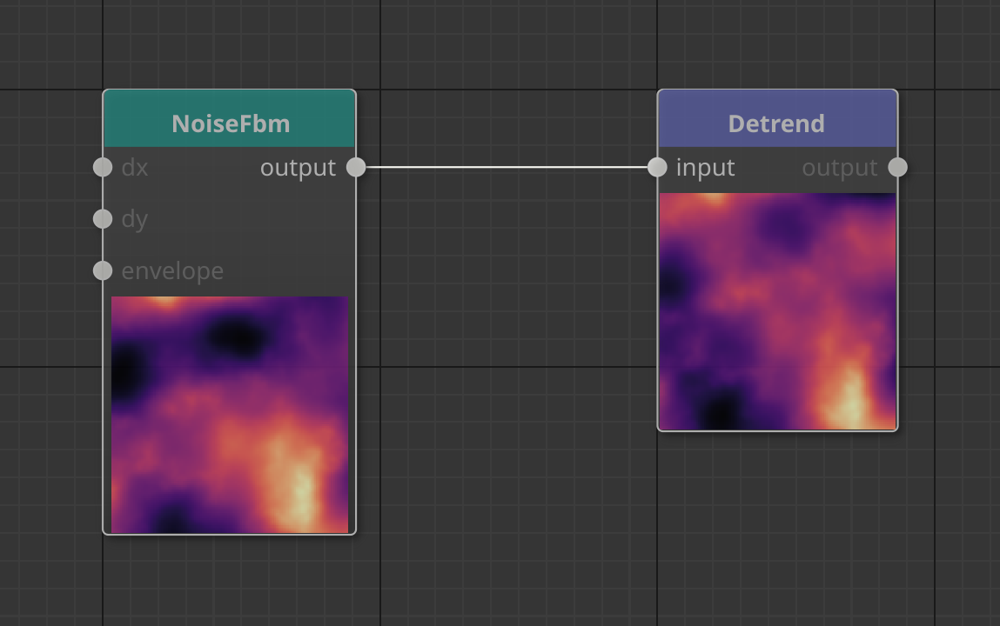
### Category

WIP
### Inputs

|Name|Type|Description|
| :--- | :--- | :--- |
|input|Heightmap|Input heightmap.|

### Outputs

|Name|Type|Description|
| :--- | :--- | :--- |
|output|Heightmap|Detrended heightmap.|

## DiffusionLimitedAggregation

DiffusionLimitedAggregation creates branching, fractal-like structures that resemble the rugged, irregular contours of mountain ranges.

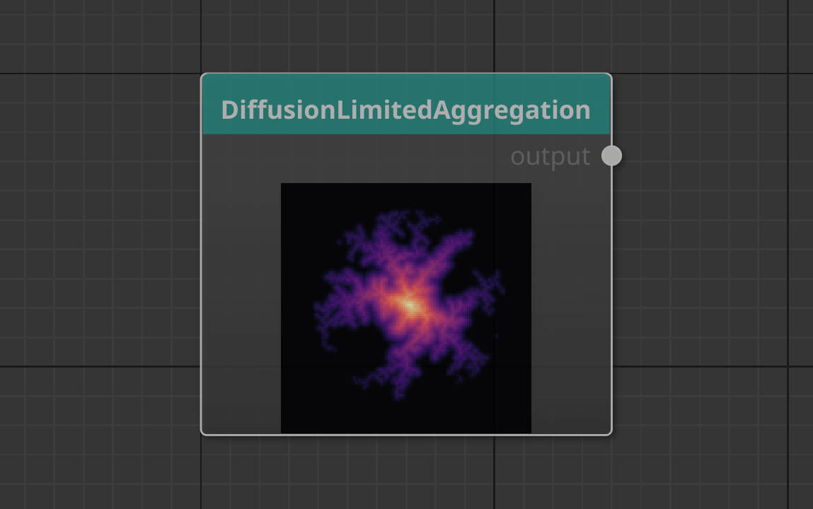
### Category

WIP
### Outputs

|Name|Type|Description|
| :--- | :--- | :--- |
|output|Heightmap|DiffusionLimitedAggregation heightmap.|

### Parameters

|Name|Type|Description|
| :--- | :--- | :--- |
|inverse|Bool|Toggle inversion of the output values.|
|noise_ratio|Float| A parameter that controls the amount of randomness or noise introduced in the talus formation process.|
|remap|Value range|Remap the operator's output to a specified range, defaulting to [0, 1].|
|scale|Float|A scaling factor that influences the density of the particles in the DLA pattern.|
|seed|Random seed number|The seed for the random number generator.|
|seeding_outer_radius_ratio|Float|The ratio between the outer seeding radius and the initial seeding radius. It determines the outer boundary for particle seeding.|
|seeding_radius|Float|The radius within which initial seeding of particles occurs. This radius defines the area where the first particles are placed.|
|slope|Float|Slope of the talus added to the DLA pattern.|

## Dilation

Dilation expands the boundaries of objects in an image and fills in small gaps or holes in those objects. Use Cases: (+) Filling gaps: Dilation can be used to fill small gaps or holes in objects, making them more solid. (+) Merging objects: Dilation can help merge nearby objects or connect broken segments in an image.

### Category

Operator/Morphology
### Inputs

|Name|Type|Description|
| :--- | :--- | :--- |
|input|Heightmap|Input heightmap.|

### Outputs

|Name|Type|Description|
| :--- | :--- | :--- |
|output|Heightmap|Dilated heightmap.|

### Parameters

|Name|Type|Description|
| :--- | :--- | :--- |
|GPU|Bool|Toogle GPU acceleration on or off.|
|radius|Float|Filter radius with respect to the domain size.|

## DistanceTransform

Generates a distance map where each pixel's value represents the shortest distance to the nearest non-zero value in the input heightmap.

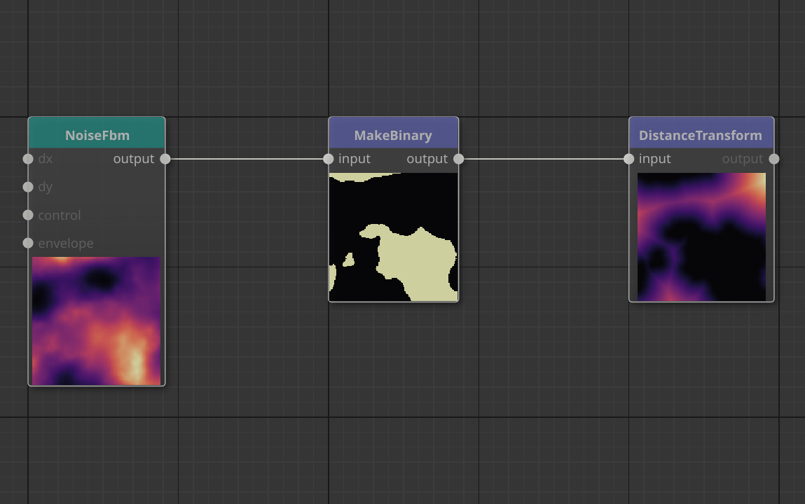
### Category

Operator/Morphology
### Inputs

|Name|Type|Description|
| :--- | :--- | :--- |
|input|Heightmap|Input heightmap used to compute the distance transform.|

### Outputs

|Name|Type|Description|
| :--- | :--- | :--- |
|output|Heightmap|Generated distance map based on the input heightmap.|

### Parameters

|Name|Type|Description|
| :--- | :--- | :--- |
|remap|Bool|Remap the operator's output to a specified range, defaulting to [0, 1].|
|reverse_input|Bool|Invert the input values before processing.|
|reverse_output|Bool|Invert the output values after processing.|
|threshold|Float|Defines the cutoff value for considering non-zero input pixels.|
|transform_type|Enumeration|Specifies the distance metric used for transformation (e.g., Euclidean, Manhattan, or Chessboard distance).|

## Erosion

Erosion removes small structures or noise from an image, and it also shrinks the boundaries of objects in an image. Use Cases: (+) Noise reduction: Erosion can help remove small, unwanted pixels or noise from the image. (+) Separating objects: Erosion can be used to separate touching or overlapping objects in an image by shrinking their boundaries.

### Category

Operator/Morphology
### Inputs

|Name|Type|Description|
| :--- | :--- | :--- |
|input|Heightmap|Input heightmap.|

### Outputs

|Name|Type|Description|
| :--- | :--- | :--- |
|output|Heightmap|Dilated heightmap.|

### Parameters

|Name|Type|Description|
| :--- | :--- | :--- |
|GPU|Bool|Toogle GPU acceleration on or off.|
|radius|Float|Filter radius with respect to the domain size.|

## ExpandShrink

ExpandShrink is a maximum/minimum filter with a weighted kernel. It can be used to enhance or extract features while preserving the essential structure of the heightmap.

### Category

Filter/Recast
### Inputs

|Name|Type|Description|
| :--- | :--- | :--- |
|input|Heightmap|Input heightmap.|
|mask|Heightmap|Mask defining the filtering intensity (expected in [0, 1]).|

### Outputs

|Name|Type|Description|
| :--- | :--- | :--- |
|output|Heightmap|Filtered heightmap.|

### Parameters

|Name|Type|Description|
| :--- | :--- | :--- |
|GPU|Bool|Toogle GPU acceleration on or off.|
|kernel|Enumeration|Weighting kernel. Available values: biweight, cone, cone_smooth, cubic_pulse, disk, lorentzian, smooth_cosine, square, tricube.|
|radius|Float|Filter radius with respect to the domain size.|
|shrink|Bool|Shrink (if true) or expand (if false).|

## ExportAsCubemap

TODO

### Category

WIP
### Inputs

|Name|Type|Description|
| :--- | :--- | :--- |
|input|Heightmap|TODO|

### Parameters

|Name|Type|Description|
| :--- | :--- | :--- |
|auto_export|Bool|Controls whether the output file is automatically written when the node is updated. Default is false. When set to true, the file is saved automatically on updates. If false, use the 'Force Reload' button on the node to manually trigger the export.|
|cubemap_resolution|Integer|TODO|
|fname|Filename|TODO|
|ir|Integer|TODO|
|overlap|Float|TODO|
|splitted|Bool|TODO|

## ExportAsset

Exports both the heightmap and texture as a single asset. The mesh can either be used as is or retriangulated using an optimization algorithm. Additionally, a normal map can be provided to model light effects of small details not represented by the mesh.

### Category

IO/Files
### Inputs

|Name|Type|Description|
| :--- | :--- | :--- |
|elevation|Heightmap|Heightmap data defining elevation values.|
|normal map details|HeightmapRGBA|Optional normal map for enhancing lighting effects on small details.|
|texture|HeightmapRGBA|Heightmap data defining texture color values.|

### Parameters

|Name|Type|Description|
| :--- | :--- | :--- |
|auto_export|Bool|Controls whether the output file is automatically written when the node is updated. Default is false. When set to true, the file is saved automatically on updates. If false, use the 'Force Reload' button on the node to manually trigger the export.|
|blending_method|Enumeration|Defines the method used to blend the normal map for small details.|
|detail_scaling|Float|Scaling factor applied to the detail normal map.|
|elevation_scaling|Float|Factor used to scale elevation values.|
|export_format|Enumeration|Defines the file format for export. Available formats include Assimp Binary (*.assbin), Assxml Document (*.assxml), Autodesk 3DS (*.3ds), Autodesk FBX (ASCII/Binary) (*.fbx), COLLADA (*.dae), Extensible 3D (*.x3d), GL Transmission Format (GLB/GLTF v1 & v2), Stanford Polygon Library (*.ply), Step Files (*.stp), Stereolithography (*.stl), 3MF (*.3mf), and Wavefront OBJ (*.obj) with or without material files.|
|fname|Filename|Specifies the name of the exported file.|
|max_error|Float|Maximum allowable error when generating an optimized triangulated mesh.|
|mesh_type|Enumeration|Specifies the type of mesh geometry used. Options include 'triangles' and 'triangles (optimized)'.|

## ExportCloud

ExportCloud is an operator for exporting cloud data to a csv file.

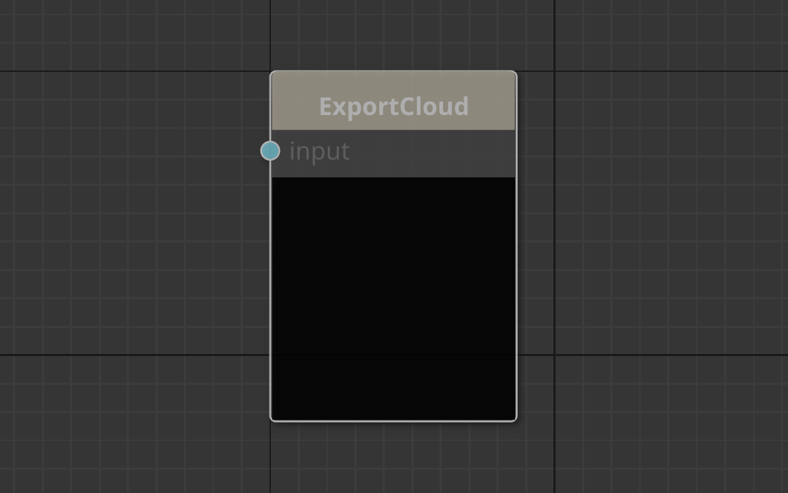
### Category

IO/Files
### Inputs

|Name|Type|Description|
| :--- | :--- | :--- |
|input|Cloud|Input heightmap.|

### Parameters

|Name|Type|Description|
| :--- | :--- | :--- |
|auto_export|Bool|Controls whether the output file is automatically written when the node is updated. Default is false. When set to true, the file is saved automatically on updates. If false, use the 'Force Reload' button on the node to manually trigger the export.|
|fname|Filename|Export file name.|

## ExportHeightmap

ExportHeightmap is an operator for exporting a heightmap in various file formats.

### Category

IO/Files
### Inputs

|Name|Type|Description|
| :--- | :--- | :--- |
|input|Heightmap|Input heightmap.|

### Parameters

|Name|Type|Description|
| :--- | :--- | :--- |
|auto_export|Bool|Controls whether the output file is automatically written when the node is updated. Default is false. When set to true, the file is saved automatically on updates. If false, use the 'Force Reload' button on the node to manually trigger the export.|
|fname|Filename|Export file name.|
|format|Enumeration|Export format. Available values: png (16 bit), png (8 bit), raw (16 bit, Unity).|

## ExportNormalMap

ExportNormalMap is an operator for exporting the normal map of an heightmap as a PNG image file.

### Category

IO/Files
### Inputs

|Name|Type|Description|
| :--- | :--- | :--- |
|input|Heightmap|Input heightmap.|

### Parameters

|Name|Type|Description|
| :--- | :--- | :--- |
|16bit|Bool|Whether the output file is a 16bit PNG file (instead of 8bit).|
|auto_export|Bool|Controls whether the output file is automatically written when the node is updated. Default is false. When set to true, the file is saved automatically on updates. If false, use the 'Force Reload' button on the node to manually trigger the export.|
|fname|Filename|Export file name.|

## ExportPath

ExportPath is an operator for exporting path data to a csv file.

### Category

IO/Files
### Inputs

|Name|Type|Description|
| :--- | :--- | :--- |
|input|Path|Input heightmap.|

### Parameters

|Name|Type|Description|
| :--- | :--- | :--- |
|auto_export|Bool|Controls whether the output file is automatically written when the node is updated. Default is false. When set to true, the file is saved automatically on updates. If false, use the 'Force Reload' button on the node to manually trigger the export.|
|fname|Filename|Export file name.|

## ExportTexture

ExportTexture is a texture to a PNG image file.

### Category

IO/Files
### Inputs

|Name|Type|Description|
| :--- | :--- | :--- |
|texture|HeightmapRGBA|Input texture.|

### Parameters

|Name|Type|Description|
| :--- | :--- | :--- |
|16 bit|Bool|Decides whether the output is an 8 bit or a 16 bit PNG file.|
|auto_export|Bool|Controls whether the output file is automatically written when the node is updated. Default is false. When set to true, the file is saved automatically on updates. If false, use the 'Force Reload' button on the node to manually trigger the export.|
|fname|Filename|Export file name.|

## Falloff

Falloff is an operator that enforces values close to zero at the domain edges.

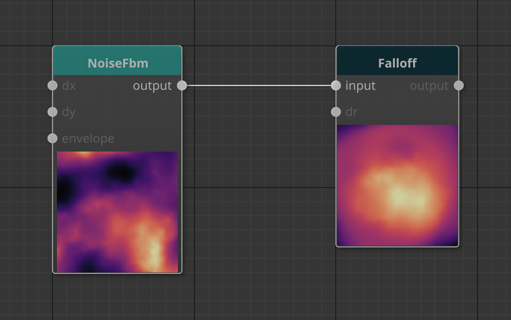
### Category

Math/Boundaries
### Inputs

|Name|Type|Description|
| :--- | :--- | :--- |
|dr|Heightmap|Displacement with respect to the domain size (radial direction).|
|input|Heightmap|Input heightmap.|

### Outputs

|Name|Type|Description|
| :--- | :--- | :--- |
|output|Heightmap|Filtered heightmap.|

### Parameters

|Name|Type|Description|
| :--- | :--- | :--- |
|distance_function|Enumeration|Measure used for the distance calculation. Available values: Chebyshev, Euclidian, Euclidian/Chebyshev, Manhattan.|
|remap|Value range|Remap the operator's output to a specified range, defaulting to [0, 1].|
|strength|Float|Falloff strength.|

## FillTalus

Fill the heightmap starting from the highest elevations using a regular downslope.

### Category

WIP
### Inputs

|Name|Type|Description|
| :--- | :--- | :--- |
|input|Heightmap|Input heightmap.|

### Outputs

|Name|Type|Description|
| :--- | :--- | :--- |
|output|Heightmap|Output heightmap.|

### Parameters

|Name|Type|Description|
| :--- | :--- | :--- |
|noise_ratio|Float|Noise ratio, added to the downslope.|
|seed|Random seed number|Random seed number.|
|slope|Float|Downslope used for filling.|

## FlowStream

TODO

### Category

WIP
### Inputs

|Name|Type|Description|
| :--- | :--- | :--- |
|input|Heightmap|TODO|
|sources|Cloud|TODO|

### Outputs

|Name|Type|Description|
| :--- | :--- | :--- |
|output|Heightmap|TODO|
|river_mask|Heightmap|TODO|

### Parameters

|Name|Type|Description|
| :--- | :--- | :--- |
|depth|Float|TODO|
|distance_exponent|Float|TODO|
|elevation_ratio|Float|TODO|
|merging_radius|Float|TODO|
|noise_ratio|Float|TODO|
|river_radius|Float|TODO|
|riverbank_slope|Float|TODO|
|riverbed_slope|Float|TODO|
|seed|Random seed number|TODO|
|upward_penalization|Float|TODO|

## Fold

Fold iteratively applies the absolute value function to the input field, effectively folding negative values to their positive counterparts.

### Category

Filter/Recast
### Inputs

|Name|Type|Description|
| :--- | :--- | :--- |
|input|Heightmap|Input heightmap.|

### Outputs

|Name|Type|Description|
| :--- | :--- | :--- |
|output|Heightmap|Folded heightmap.|

### Parameters

|Name|Type|Description|
| :--- | :--- | :--- |
|iterations|Integer|Number of successive foldings.|
|k|Float|Smoothing parameter of the smooth absolute value.|

## GaborWaveFbm

Generates fractal Brownian motion (fBm) noise using Gabor wavelets, producing anisotropic textures with directional control.

### Category

Primitive/Coherent
### Inputs

|Name|Type|Description|
| :--- | :--- | :--- |
|angle|Heightmap|Optional input for dynamically controlling the wavelet orientation per pixel.|
|control|Heightmap|Optional input for modulating noise intensity or distribution.|
|dx|Heightmap|Optional input to control horizontal displacement in the noise generation.|
|dy|Heightmap|Optional input to control vertical displacement in the noise generation.|
|envelope|Heightmap|Modulates the noise amplitude across the heightmap.|

### Outputs

|Name|Type|Description|
| :--- | :--- | :--- |
|output|Heightmap|The generated Gabor wavelet-based fractal noise heightmap.|

### Parameters

|Name|Type|Description|
| :--- | :--- | :--- |
|angle|Float|Controls the base orientation of the Gabor wavelets, influencing the dominant direction of the noise pattern.|
|angle_spread_ratio|Float|Determines how much the local angle of the Gabor kernel can vary. A low value results in straighter structures, while a high value introduces more directional variation.|
|kw|Wavenumber|Defines the wavenumber, which controls the frequency of the Gabor wavelets in the noise function.|
|lacunarity|Float|Controls the frequency scaling between successive octaves of the fractal noise. Higher values create larger gaps between frequencies.|
|octaves|Integer|Specifies the number of noise layers (octaves) used in the fractal Brownian motion. More octaves add finer details.|
|persistence|Float|Controls how much each successive octave contributes to the final noise pattern. Higher values result in more prominent fine details.|
|post_gain|Float|Set the gain. Gain is a power law transformation altering the distribution of signal values, compressing or expanding certain regions of the signal depending on the exponent of the power law.|
|post_inverse|Bool|Inverts the output values after processing, flipping low and high values across the midrange.|
|post_remap|Value range|Linearly remaps the output values to a specified target range (default is [0, 1]).|
|post_smoothing_radius|Float|Defines the radius for post-processing smoothing, determining the size of the neighborhood used to average local values and reduce high-frequency detail. A radius of 0 disables smoothing.|
|seed|Random seed number|Sets the random seed for noise generation, ensuring reproducibility.|
|weight|Float|Adjusts the intensity of the noise contribution at each point.|

## Gain

Gain is a power law transformation altering the distribution of signal values, compressing or expanding certain regions of the signal depending on the exponent of the power law.

### Category

Filter/Recurve
### Inputs

|Name|Type|Description|
| :--- | :--- | :--- |
|input|Heightmap|Input heightmap.|
|mask|Heightmap|Mask defining the filtering intensity (expected in [0, 1]).|

### Outputs

|Name|Type|Description|
| :--- | :--- | :--- |
|output|Heightmap|Filtered heightmap.|

### Parameters

|Name|Type|Description|
| :--- | :--- | :--- |
|gain|Float|Power law exponent.|

## GammaCorrection

Gamma correction involves applying a nonlinear transformation to the pixel values of the heightmap. This transformation is based on a power-law function, where each pixel value is raised to the power of the gamma value. The gamma value is a parameter that determines the degree and direction of the correction.

### Category

Filter/Recurve
### Inputs

|Name|Type|Description|
| :--- | :--- | :--- |
|input|Heightmap|Input heightmap.|
|mask|Heightmap|Mask defining the filtering intensity (expected in [0, 1]).|

### Outputs

|Name|Type|Description|
| :--- | :--- | :--- |
|output|Heightmap|Filtered heightmap.|

### Parameters

|Name|Type|Description|
| :--- | :--- | :--- |
|gamma|Float|Gamma exponent.|

## GammaCorrectionLocal

Gamma correction involves applying a nonlinear transformation to the pixel values of the heightmap. For GammaCorrectionLocal, the transformation parameters are locally defined within a perimeter 'radius'.

### Category

Filter/Recurve
### Inputs

|Name|Type|Description|
| :--- | :--- | :--- |
|input|Heightmap|Input heightmap.|
|mask|Heightmap|Mask defining the filtering intensity (expected in [0, 1]).|

### Outputs

|Name|Type|Description|
| :--- | :--- | :--- |
|output|Heightmap|Filtered heightmap.|

### Parameters

|Name|Type|Description|
| :--- | :--- | :--- |
|GPU|Bool|Toogle GPU acceleration on or off.|
|gamma|Float|Gamma exponent.|
|k|Float|Smoothing factor (typically in [0, 1]).|
|radius|Float|Filter radius with respect to the domain size.|

## GaussianDecay

Apply a Gaussian function to every values.

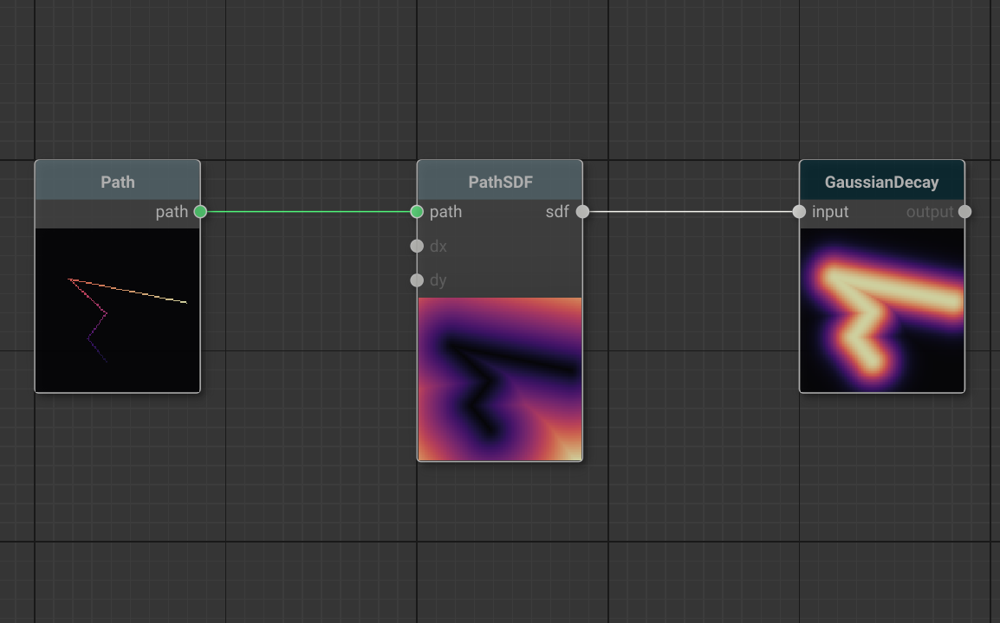
### Category

Math/Base
### Inputs

|Name|Type|Description|
| :--- | :--- | :--- |
|input|Heightmap|Input heightmap.|

### Outputs

|Name|Type|Description|
| :--- | :--- | :--- |
|output|Heightmap|Output heightmap.|

### Parameters

|Name|Type|Description|
| :--- | :--- | :--- |
|sigma|Float|Gaussian half-width, represents the distance from the peak of the Gaussian curve to the points where the amplitude drops to half of its maximum value.|

## GaussianPulse

GaussianPulse generates a Gaussian pulse.

### Category

Primitive/Function
### Inputs

|Name|Type|Description|
| :--- | :--- | :--- |
|control|Heightmap|Control parameter, acts as a multiplier for the weight parameter.|
|dx|Heightmap|Displacement with respect to the domain size (x-direction).|
|dy|Heightmap|Displacement with respect to the domain size (y-direction).|

### Outputs

|Name|Type|Description|
| :--- | :--- | :--- |
|output|Heightmap|Gaussian heightmap.|

### Parameters

|Name|Type|Description|
| :--- | :--- | :--- |
|center|Vec2Float|Reference center within the heightmap.|
|inverse|Bool|Toggle inversion of the output values.|
|radius|Float|Pulse half-width.|
|remap|Value range|Remap the operator's output to a specified range, defaulting to [0, 1].|

## Gavoronoise

Generates a 2D heightmap using the GavoroNoise algorithm, a procedural noise technique for terrain generation.

### Category

Primitive/Coherent
### Inputs

|Name|Type|Description|
| :--- | :--- | :--- |
|angle|Heightmap|Optional input for dynamically modifying the wavelet orientation per pixel.|
|control|Heightmap|Optional input that modulates noise intensity or distribution.|
|dx|Heightmap|Optional input for perturbing noise in the X-direction.|
|dy|Heightmap|Optional input for perturbing noise in the Y-direction.|
|envelope|Heightmap|Modulates the amplitude of the noise across the heightmap.|

### Outputs

|Name|Type|Description|
| :--- | :--- | :--- |
|output|Heightmap|The final heightmap generated using the GavoroNoise algorithm.|

### Parameters

|Name|Type|Description|
| :--- | :--- | :--- |
|amplitude|Float|Controls the overall intensity of the noise function.|
|angle|Float|Sets the primary orientation of the wave structures in the noise.|
|angle_spread_ratio|Float|Determines the degree of variation in the angle of the wave structures. Lower values create more aligned structures.|
|branch_strength|Float|Controls the prominence of branch-like features in the generated noise.|
|inverse|Bool|Invert the output values of the noise function.|
|kw|Wavenumber|Wave number vector that determines the base frequency of the noise.|
|kw_multiplier|Wavenumber|Multiplier applied to the wave numbers, affecting the frequency scaling of the noise function.|
|lacunarity|Float|Controls the frequency scaling between successive octaves in the fractal noise function. Higher values create larger gaps between frequencies.|
|octaves|Integer|Number of noise layers (octaves) used in fractal Brownian motion (fBm). More octaves add finer details.|
|persistence|Float|Determines how much each successive octave contributes to the final noise pattern. Higher values amplify finer details.|
|remap|Value range|Remap the noise output values to a specified range, defaulting to [0, 1].|
|seed|Random seed number|Sets the random seed for reproducible noise generation.|
|slope_strength|Float|Controls the strength of slope-based directional erosion in the noise function.|
|z_cut_max|Float|Defines the maximum cutoff value for the Z-axis in the generated noise.|
|z_cut_min|Float|Defines the minimum cutoff value for the Z-axis in the generated noise.|

## Gradient

Gradient provides insight into the spatial distribution of a function's gradient, conveying both direction and intensity of change across the xy-plane

### Category

Math/Gradient
### Inputs

|Name|Type|Description|
| :--- | :--- | :--- |
|input|Heightmap|Input heightmap.|

### Outputs

|Name|Type|Description|
| :--- | :--- | :--- |
|dx|Heightmap|Gradient with respect to the x-direction.|
|dy|Heightmap|Gradient with respect to the y-direction.|

### Parameters

|Name|Type|Description|
| :--- | :--- | :--- |
|remap|Value range|Remap the operator's output to a specified range, defaulting to [0, 1].|

## GradientAngle

The gradient angle of a heightmap refers to the direction in which the slope points toward. It represents the orientation of the terrain surface relative to a horizontal plane

### Category

Math/Gradient
### Inputs

|Name|Type|Description|
| :--- | :--- | :--- |
|input|Heightmap|Input heightmap.|

### Outputs

|Name|Type|Description|
| :--- | :--- | :--- |
|output|Heightmap|Gradient angle.|

### Parameters

|Name|Type|Description|
| :--- | :--- | :--- |
|remap|Value range|Remap the operator's output to a specified range, defaulting to [0, 1].|

## GradientNorm

The gradient norm of a heightmap refers to the magnitude or intensity of the rate of change of elevation at each point on the map. It represents the steepness or slope of the terrain surface, irrespective of its direction.

### Category

Math/Gradient
### Inputs

|Name|Type|Description|
| :--- | :--- | :--- |
|input|Heightmap|Input heightmap.|

### Outputs

|Name|Type|Description|
| :--- | :--- | :--- |
|output|Heightmap|Gradient norm.|

### Parameters

|Name|Type|Description|
| :--- | :--- | :--- |
|remap|Value range|Remap the operator's output to a specified range, defaulting to [0, 1].|

## GradientTalus

Gradient talus refers to the local steepest downslope, or the direction in which the terrain descends most rapidly, at each point on the heightmap.

### Category

Math/Gradient
### Inputs

|Name|Type|Description|
| :--- | :--- | :--- |
|input|Heightmap|Input heightmap.|

### Outputs

|Name|Type|Description|
| :--- | :--- | :--- |
|output|Heightmap|Gradient talus.|

### Parameters

|Name|Type|Description|
| :--- | :--- | :--- |
|remap|Value range|Remap the operator's output to a specified range, defaulting to [0, 1].|

## HeightmapToKernel

Convert an heightmap to a kernel.

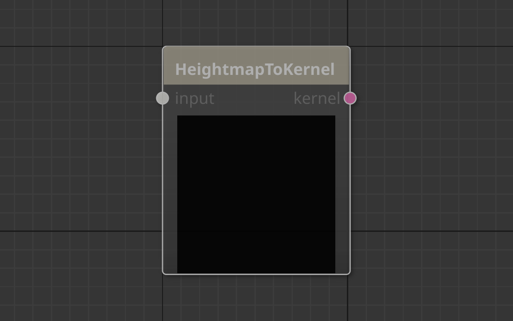
### Category

Converter
### Inputs

|Name|Type|Description|
| :--- | :--- | :--- |
|heightmap|Heightmap|Input heightmap.|

### Outputs

|Name|Type|Description|
| :--- | :--- | :--- |
|kernel|Array|Output kernel.|

### Parameters

|Name|Type|Description|
| :--- | :--- | :--- |
|envelope|Bool|Determine if an enveloppe is applied to the kernel.|
|envelope_kernel|Enumeration|Envelope kernel. Available values: biweight, cone, cone_smooth, cubic_pulse, disk, lorentzian, smooth_cosine, square, tricube.|
|normalize|Bool|Normalize kernel so that the sum of the elements equals 1, preserving the overall intensity of an heightmap after convolution for instance.|
|radius|Float|Kernel radius with respect to the domain size.|

## HeightmapToMask

Convert an heightmap to a mask (remap values).

### Category

Converter
### Inputs

|Name|Type|Description|
| :--- | :--- | :--- |
|input|Heightmap|Heightmap.|

### Outputs

|Name|Type|Description|
| :--- | :--- | :--- |
|mask|Heightmap|Mask.|

### Parameters

|Name|Type|Description|
| :--- | :--- | :--- |
|inverse|Bool|Toggle inversion of the output values.|
|saturate_k|Float|Smoothing intensity of the amplitude saturation.|
|saturate_range|Value range|Saturation range: define the minimum and maximum values of the saturation process.|
|smoothing|Bool|Enable or disable smoothing to reduce noise in the curvature computation.|
|smoothing_radius|Float|Specifies the radius for smoothing, determining how much the curvature is averaged over neighboring pixels.|

## HeightmapToRGBA

HeightmapToRGBA converts a series of heightmaps into an RGBA splatmap.

### Category

Converter
### Inputs

|Name|Type|Description|
| :--- | :--- | :--- |
|A|Heightmap|Alpha channel.|
|B|Heightmap|Blue channel.|
|G|Heightmap|Green channel.|
|R|Heightmap|Red channel.|

### Outputs

|Name|Type|Description|
| :--- | :--- | :--- |
|RGBA|HeightmapRGBA|RGBA heightmap.|

## HydraulicBlur

Hydraulic Blur applied a cell-based hydraulic erosion using a nonlinear diffusion model.

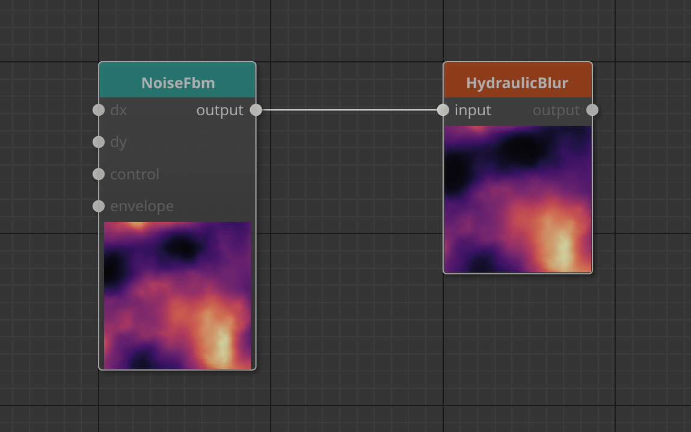
### Category

WIP
### Inputs

|Name|Type|Description|
| :--- | :--- | :--- |
|input|Heightmap|Input heightmap.|

### Outputs

|Name|Type|Description|
| :--- | :--- | :--- |
|output|Heightmap|Eroded heightmap.|

### Parameters

|Name|Type|Description|
| :--- | :--- | :--- |
|k_smoothing|Float|Smoothing factor, if any.|
|radius|Float|Gaussian filter radius (with respect to a unit domain).|
|remap|Value range|Remap the operator's output to a specified range, defaulting to [0, 1].|
|vmax|Float|Maximum elevation for the details.|

## HydraulicMusgrave

TODO

### Category

WIP
### Inputs

|Name|Type|Description|
| :--- | :--- | :--- |
|input|Heightmap|TODO|
|moisture|Heightmap|TODO|

### Outputs

|Name|Type|Description|
| :--- | :--- | :--- |
|output|Heightmap|TODO|

### Parameters

|Name|Type|Description|
| :--- | :--- | :--- |
|c_capacity|Float|TODO|
|c_deposition|Float|TODO|
|c_erosion|Float|TODO|
|evap_rate|Float|TODO|
|iterations|Integer|TODO|
|water_level|Float|TODO|

## HydraulicParticle

HydraulicParticle is a particle-based hydraulic erosion operator that simulates the erosion and sediment transport processes that occur due to the flow of water over a terrain represented by the input heightmap. This type of operator models erosion by tracking the movement of virtual particles (or sediment particles) as they are transported by water flow and interact with the terrain.

### Category

Erosion/Hydraulic
### Inputs

|Name|Type|Description|
| :--- | :--- | :--- |
|bedrock|Heightmap|Bedrock elevation, erosion process cannot carve the heightmap further down this point.|
|input|Heightmap|Input heightmap.|
|mask|Heightmap|Mask defining the filtering intensity (expected in [0, 1]).|
|moisture|Heightmap|Moisture map, influences the amount of water locally deposited.|

### Outputs

|Name|Type|Description|
| :--- | :--- | :--- |
|deposition|Heightmap|Deposition map (in [0, 1]).|
|erosion|Heightmap|Erosion map (in [0, 1]).|
|output|Heightmap|Eroded heightmap.|

### Parameters

|Name|Type|Description|
| :--- | :--- | :--- |
|c_capacity|Float|Particle capacity.|
|c_deposition|Float|Particle deposition coefficient.|
|c_erosion|Float|Particle erosion cofficient.|
|c_inertia|Float|TODO|
|deposition_only|Bool|TODO|
|downscale|Bool|TODO|
|drag_rate|Float|Particle drag rate.|
|evap_rate|Float|Particle water evaporation rate.|
|kc|Float|TODO|
|particle_density|Float|TODO|
|post_filtering|Bool|TODO|
|post_filtering_local|Bool|TODO|
|seed|Random seed number|Random seed number.|

## HydraulicProcedural

TODO

### Category

WIP
### Inputs

|Name|Type|Description|
| :--- | :--- | :--- |
|input|Heightmap|TODO|
|mask|Heightmap|Mask defining the filtering intensity (expected in [0, 1]).|

### Outputs

|Name|Type|Description|
| :--- | :--- | :--- |
|output|Heightmap|TODO|
|ridge_mask|Heightmap|TODO|

### Parameters

|Name|Type|Description|
| :--- | :--- | :--- |
|delta|Float|TODO|
|density_factor|Float|TODO|
|erosion_profile|Enumeration|TODO|
|kernel_width_ratio|Float|TODO|
|noise_ratio|Float|TODO|
|phase_noise_amp|Float|TODO|
|phase_smoothing|Float|TODO|
|reverse_phase|Bool|TODO|
|ridge_scaling|Float|TODO|
|ridge_wavelength|Float|TODO|
|rotate90|Bool|TODO|
|seed|Random seed number|TODO|
|slope_mask|Float|TODO|
|use_default_mask|Bool|TODO|

## HydraulicSchott

TODO

### Category

WIP
### Inputs

|Name|Type|Description|
| :--- | :--- | :--- |
|input|Heightmap|TODO|
|mask|Heightmap|Mask defining the filtering intensity (expected in [0, 1]).|

### Outputs

|Name|Type|Description|
| :--- | :--- | :--- |
|flow_map|Heightmap|TODO|
|output|Heightmap|TODO|

### Parameters

|Name|Type|Description|
| :--- | :--- | :--- |
|c_deposition|Float|TODO|
|c_erosion|Float|TODO|
|c_thermal|Float|TODO|
|deposition_weight|Float|TODO|
|flow_acc_exponent|Float|TODO|
|flow_acc_exponent_depo|Float|TODO|
|flow_routing_exponent|Float|TODO|
|iterations|Integer|TODO|
|scale_talus_with_elevation|Bool|TODO|
|talus_global|Float|TODO|
|thermal_weight|Float|TODO|

## HydraulicStream

HydraulicStream is an hydraulic erosion operator using the flow stream approach and an infinite flow direction algorithm for simulating the erosion processes. Simulate water flow across the terrain using the infinite flow direction algorithm. As water flows over the terrain, flow accumulation representing the volume of water that passes through each point on the map, is computed to evaluate the erosive power of the water flow.

### Category

WIP
### Inputs

|Name|Type|Description|
| :--- | :--- | :--- |
|input|Heightmap|Input heightmap.|
|mask|Heightmap|Mask defining the filtering intensity (expected in [0, 1]).|

### Outputs

|Name|Type|Description|
| :--- | :--- | :--- |
|erosion|Heightmap|Erosion map (in [0, 1]).|
|output|Heightmap|Eroded heightmap.|

### Parameters

|Name|Type|Description|
| :--- | :--- | :--- |
|c_erosion|Float|Erosion intensity.|
|clipping_ratio|Float|Flow accumulation clipping ratio.|
|radius|Float|Carving kernel radius.|
|talus_ref|Float|Reference talus, with small values of talus_ref leading to thinner flow streams.|

## HydraulicStreamLog

HydraulicStream is an hydraulic erosion operator using the flow stream approach and an infinite flow direction algorithm for simulating the erosion processes. Simulate water flow across the terrain using the infinite flow direction algorithm. As water flows over the terrain, flow accumulation representing the volume of water that passes through each point on the map, is computed to evaluate the erosive power of the water flow. Deposition is mimicked using convolution filters.

### Category

Erosion/Hydraulic
### Inputs

|Name|Type|Description|
| :--- | :--- | :--- |
|input|Heightmap|TODO|
|mask|Heightmap|Mask defining the filtering intensity (expected in [0, 1]).|

### Outputs

|Name|Type|Description|
| :--- | :--- | :--- |
|deposition|Heightmap|Deposition map (in [0, 1]).|
|erosion|Heightmap|Erosion map (in [0, 1]).|
|flow_map|Heightmap|TODO|
|output|Heightmap|TODO|

### Parameters

|Name|Type|Description|
| :--- | :--- | :--- |
|GPU|Bool|Toogle GPU acceleration on or off.|
|c_erosion|Float|Erosion intensity.|
|deposition_radius|Float|TODO|
|deposition_scale_ratio|Float|TODO|
|gradient_power|Float|TODO|
|gradient_prefilter_radius|Float|TODO|
|gradient_scaling_ratio|Float|TODO|
|saturation_ratio|Float|Flow accumulation clipping ratio.|
|talus_ref|Float|Reference talus, with small values of talus_ref  leading to thinner flow streams.|

## HydraulicStreamUpscaleAmplification

TODO

### Category

WIP
### Inputs

|Name|Type|Description|
| :--- | :--- | :--- |
|input|Heightmap|TODO|
|mask|Heightmap|Mask defining the filtering intensity (expected in [0, 1]).|

### Outputs

|Name|Type|Description|
| :--- | :--- | :--- |
|output|Heightmap|TODO|

### Parameters

|Name|Type|Description|
| :--- | :--- | :--- |
|c_erosion|Float|TODO|
|clipping_ratio|Float|TODO|
|persistence|Float|TODO|
|radius|Float|TODO|
|talus_ref|Float|TODO|
|upscaling_levels|Integer|TODO|

## HydraulicVpipes

HydraulicVpipes performs hydraulic erosion using a virtual pipe algorithm, which is a method that simulates erosion and sediment transport processes by mimicking the behavior of water flowing through a network of virtual pipes. This approach models erosion based on the principles of fluid dynamics and sediment transport, while also considering the local topography of the terrain represented by the input heightmap.

### Category

WIP
### Inputs

|Name|Type|Description|
| :--- | :--- | :--- |
|bedrock|Heightmap|Bedrock elevation, erosion process cannot carve the heightmap further down this point.|
|input|Heightmap|Input heightmap.|
|mask|Heightmap|Mask defining the filtering intensity (expected in [0, 1]).|
|moisture|Heightmap|Moisture map, influences the amount of water locally deposited.|

### Outputs

|Name|Type|Description|
| :--- | :--- | :--- |
|deposition|Heightmap|Deposition map (in [0, 1]).|
|erosion|Heightmap|Erosion map (in [0, 1]).|
|output|Heightmap|Eroded heightmap.|

### Parameters

|Name|Type|Description|
| :--- | :--- | :--- |
|c_capacity|Float|Particle capacity.|
|c_deposition|Float|Particle deposition coefficient.|
|c_erosion|Float|Particle erosion cofficient.|
|evap_rate|Float|Particle water evaporation rate.|
|iterations|Integer|Number of simulation iterations.|
|rain_rate|Float|Water evaporation rate.|
|water_height|Float|Total water height..|

## ImportHeightmap

ImportHeightmap imports an heighmap from a grayscale PNG 8bit file.

### Category

IO/Files
### Outputs

|Name|Type|Description|
| :--- | :--- | :--- |
|output|Heightmap|Output heightmap.|

### Parameters

|Name|Type|Description|
| :--- | :--- | :--- |
|fname|Filename|Filename of the image file to import.|
|remap|Bool|Remap imported heightmap elevation to [0, 1].|

## ImportTexture

TODO

### Category

IO/Files
### Outputs

|Name|Type|Description|
| :--- | :--- | :--- |
|texture|HeightmapRGBA|TODO|

### Parameters

|Name|Type|Description|
| :--- | :--- | :--- |
|fname|Filename|TODO|

## Inverse

Inverse flips the sign of every values.

### Category

Math/Base
### Inputs

|Name|Type|Description|
| :--- | :--- | :--- |
|input|Heightmap|Input heightmap.|

### Outputs

|Name|Type|Description|
| :--- | :--- | :--- |
|output|Heightmap|Binary heightmap.|

## KernelGabor

KernelGabor generates a Gabor kernel.

### Category

Primitive/Kernel
### Outputs

|Name|Type|Description|
| :--- | :--- | :--- |
|kernel|Array|Output kernel.|

### Parameters

|Name|Type|Description|
| :--- | :--- | :--- |
|angle|Float|Kernel angle.|
|kw|Float|Kernel wavenumber (spatial frequency).|
|normalize|Bool|Normalize kernel so that the sum of the elements equals 1, preserving the overall intensity of an heightmap after convolution for instance.|
|radius|Float|Kernel radius with respect to the domain size.|

## KernelPrim

KernelPrim generates a 'kernel', refering to a small matrix used to apply specific effects based on convolution for instance.

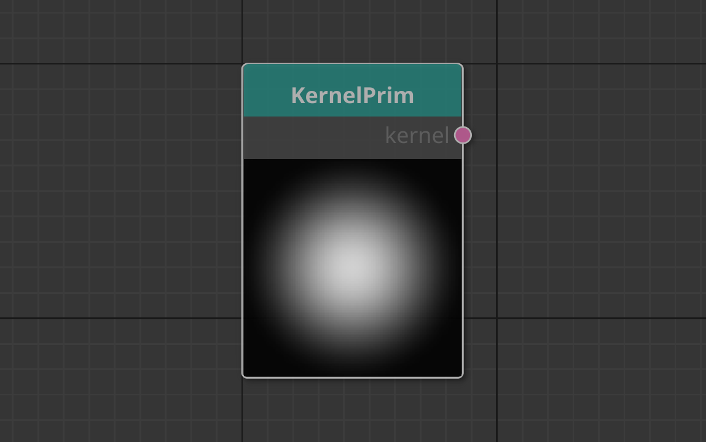
### Category

Primitive/Kernel
### Outputs

|Name|Type|Description|
| :--- | :--- | :--- |
|kernel|Array|Output kernel.|

### Parameters

|Name|Type|Description|
| :--- | :--- | :--- |
|kernel|Enumeration|Kernel type. Available values: biweight, cone, cone_smooth, cubic_pulse, disk, lorentzian, smooth_cosine, square, tricube.|
|normalize|Bool|Normalize kernel so that the sum of the elements equals 1, preserving the overall intensity of an heightmap after convolution for instance.|
|radius|Float|Kernel radius with respect to the domain size.|

## KmeansClustering2

KmeansClustering2 node groups the data into clusters based on the values of the two input features.

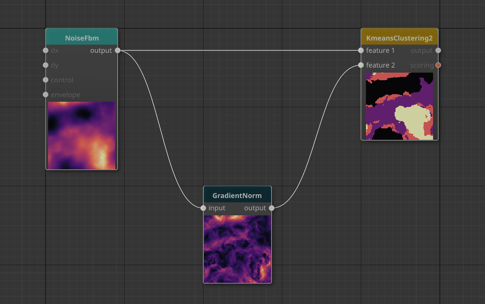
### Category

Features/Clustering
### Inputs

|Name|Type|Description|
| :--- | :--- | :--- |
|feature 1|Heightmap|First measurable property or characteristic of the data points being analyzed (e.g elevation, gradient norm, etc...|
|feature 2|Heightmap|Second measurable property or characteristic of the data points being analyzed (e.g elevation, gradient norm, etc...|

### Outputs

|Name|Type|Description|
| :--- | :--- | :--- |
|output|Heightmap|Cluster labelling.|
|scoring|vector<Heightmap>|Score in [0, 1] of the cell to belong to a given cluster|

### Parameters

|Name|Type|Description|
| :--- | :--- | :--- |
|compute_scoring|Bool|Determine whether scoring is computed.|
|nclusters|Integer|Number of clusters.|
|normalize_inputs|Bool|Determine whether the feature amplitudes are normalized before the clustering.|
|seed|Random seed number|Random seed number.|
|weights.x|Float|Weight of the first feature.|
|weights.y|Float|Weight of the second feature.|

## KmeansClustering3

KmeansClustering2 node groups the data into clusters based on the values of the three input features.

### Category

Features/Clustering
### Inputs

|Name|Type|Description|
| :--- | :--- | :--- |
|feature 1|Heightmap|First measurable property or characteristic of the data points being analyzed (e.g elevation, gradient norm, etc...|
|feature 2|Heightmap|First measurable property or characteristic of the data points being analyzed (e.g elevation, gradient norm, etc...|
|feature 3|Heightmap|Third measurable property or characteristic of the data points being analyzed (e.g elevation, gradient norm, etc...|

### Outputs

|Name|Type|Description|
| :--- | :--- | :--- |
|output|Heightmap|Cluster labelling.|
|scoring|vector<Heightmap>|Score in [0, 1] of the cell to belong to a given cluster|

### Parameters

|Name|Type|Description|
| :--- | :--- | :--- |
|compute_scoring|Bool|Determine whether scoring is computed.|
|nclusters|Integer|Number of clusters.|
|normalize_inputs|Bool|Determine whether the feature amplitudes are normalized before the clustering.|
|seed|Random seed number|Random seed number.|
|weights.x|Float|Weight of the first feature.|
|weights.y|Float|Weight of the third feature.|
|weights.z|Float|TODO|

## Kuwahara

TODO

### Category

WIP
### Inputs

|Name|Type|Description|
| :--- | :--- | :--- |
|input|Heightmap|TODO|
|mask|Heightmap|Mask defining the filtering intensity (expected in [0, 1]).|

### Outputs

|Name|Type|Description|
| :--- | :--- | :--- |
|output|Heightmap|TODO|

### Parameters

|Name|Type|Description|
| :--- | :--- | :--- |
|mix_ratio|Float|TODO|
|radius|Float|TODO|

## Laplace

Laplace smoothing filter reduces noise and smooth out variations in pixel intensity while preserving the overall structure of an image.

### Category

Filter/Smoothing
### Inputs

|Name|Type|Description|
| :--- | :--- | :--- |
|input|Heightmap|Input heightmap.|
|mask|Heightmap|Mask defining the filtering intensity (expected in [0, 1]).|

### Outputs

|Name|Type|Description|
| :--- | :--- | :--- |
|output|Heightmap|Filtered heightmap.|

### Parameters

|Name|Type|Description|
| :--- | :--- | :--- |
|iterations|Integer|Number of successive filtering iterations.|
|sigma|Float|Filtering strength.|

## Lerp

The Lerp operator, short for linear interpolation, is a method for smoothly transitioning between two values over a specified range or interval.

### Category

Math/Base
### Inputs

|Name|Type|Description|
| :--- | :--- | :--- |
|a|Heightmap|Start heightmap (t = 0).|
|b|Heightmap|End heightmap (t = 1).|
|t|Heightmap|Lerp factor, expected in [0, 1].|

### Outputs

|Name|Type|Description|
| :--- | :--- | :--- |
|output|Heightmap|Interpolated heightmap.|

### Parameters

|Name|Type|Description|
| :--- | :--- | :--- |
|t|Float|Lerp factor (in [0, 1]). Used only if the node input 't' is not set.|

## MakeBinary

MakeBinary is a thresholding operator. It transforms an input heightmap into a binary heightmap, where each pixel is assigned either a value of 0 or 1, depending on whether its intensity value surpasses a specified threshold.

### Category

Operator/Morphology
### Inputs

|Name|Type|Description|
| :--- | :--- | :--- |
|input|Heightmap|Input heightmap.|

### Outputs

|Name|Type|Description|
| :--- | :--- | :--- |
|output|Heightmap|Binary heightmap.|

### Parameters

|Name|Type|Description|
| :--- | :--- | :--- |
|threshold|Float|Threshold value.|

## MakePeriodic

Makes the input heightmap tileable by creating a smooth linear transition at the boundaries. This is useful for generating seamless textures or terrains that can be repeated without visible seams.

### Category

Operator/Tiling
### Inputs

|Name|Type|Description|
| :--- | :--- | :--- |
|input|Heightmap|The input heightmap to be made tileable.|

### Outputs

|Name|Type|Description|
| :--- | :--- | :--- |
|output|Heightmap|The output heightmap with smooth transitions at the boundaries, making it tileable.|

### Parameters

|Name|Type|Description|
| :--- | :--- | :--- |
|overlap|Float|The ratio of overlap at the boundaries. A higher value creates a smoother transition but may reduce the usable area of the heightmap.|

## MakePeriodicStitching

Makes the input heightmap tileable by creating a smooth transition at the boundaries using stitching. This is useful for generating seamless textures or terrains that can be repeated without visible seams.

### Category

Operator/Tiling
### Inputs

|Name|Type|Description|
| :--- | :--- | :--- |
|input|Heightmap|The input heightmap to be made tileable.|

### Outputs

|Name|Type|Description|
| :--- | :--- | :--- |
|output|Heightmap|The output heightmap with smooth transitions at the boundaries, making it tileable.|

### Parameters

|Name|Type|Description|
| :--- | :--- | :--- |
|overlap|Float|The ratio of overlap at the boundaries. A higher value creates a smoother transition but may reduce the usable area of the heightmap.|

## MeanShift

TODO

### Category

WIP
### Inputs

|Name|Type|Description|
| :--- | :--- | :--- |
|input|Heightmap|TODO|

### Outputs

|Name|Type|Description|
| :--- | :--- | :--- |
|output|Heightmap|TODO|

### Parameters

|Name|Type|Description|
| :--- | :--- | :--- |
|GPU|Bool|Toogle GPU acceleration on or off.|
|iterations|Integer|TODO|
|radius|Float|TODO|
|talus_global|Float|TODO|
|talus_weighted|Bool|TODO|

## Median3x3

Median3x3 filter is a median filter with a 3x3 kernel used to reduce noise while preserving edges in an image. This process removes outliers and smooths the image without noise reduction and feature preservation in digital images.

### Category

Filter/Smoothing
### Inputs

|Name|Type|Description|
| :--- | :--- | :--- |
|input|Heightmap|Input heightmap.|
|mask|Heightmap|Mask defining the filtering intensity (expected in [0, 1]).|

### Outputs

|Name|Type|Description|
| :--- | :--- | :--- |
|output|Heightmap|Filtered heightmap.|

### Parameters

|Name|Type|Description|
| :--- | :--- | :--- |
|GPU|Bool|Toogle GPU acceleration on or off.|

## MixNormalMap

TODO

### Category

Texture
### Inputs

|Name|Type|Description|
| :--- | :--- | :--- |
|normal map base|HeightmapRGBA|TODO|
|normal map detail|HeightmapRGBA|TODO|

### Outputs

|Name|Type|Description|
| :--- | :--- | :--- |
|normal map|HeightmapRGBA|TODO|

### Parameters

|Name|Type|Description|
| :--- | :--- | :--- |
|blending_method|Enumeration|TODO|
|detail_scaling|Float|TODO|

## MixTexture

MixTexture enables the seamless integration of multiple textures by utilizing the alpha channel information to control the blending.

### Category

Texture
### Inputs

|Name|Type|Description|
| :--- | :--- | :--- |
|texture1|HeightmapRGBA|Input texture.|
|texture2|HeightmapRGBA|Input texture.|
|texture3|HeightmapRGBA|Input texture.|
|texture4|HeightmapRGBA|Input texture.|

### Outputs

|Name|Type|Description|
| :--- | :--- | :--- |
|texture|HeightmapRGBA|Output texture.|

### Parameters

|Name|Type|Description|
| :--- | :--- | :--- |
|reset_output_alpha|Bool|Reset the output alpha channel to 1 (opaque).|
|use_sqrt_avg|Bool|Use square averaging for alpha-compositing (instead of linear averaging).|

## Mixer

The Mixer operator takes several input heightmaps and blend them according to a mixing parameter expected in [0, 1].

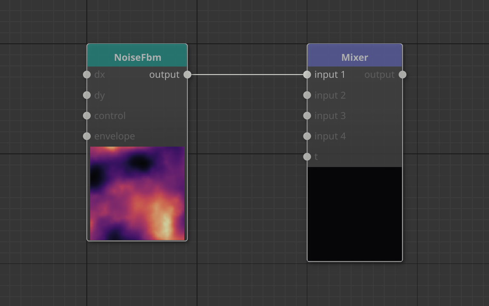
### Category

Operator/Blend
### Inputs

|Name|Type|Description|
| :--- | :--- | :--- |
|input 1|Heightmap|Input heightmap.|
|input 2|Heightmap|Input heightmap.|
|input 3|Heightmap|Input heightmap.|
|input 4|Heightmap|Input heightmap.|
|t|Heightmap|Mixing parameter, expected in [0, 1].|

### Outputs

|Name|Type|Description|
| :--- | :--- | :--- |
|output|Heightmap|Output heightmap.|

## MorphologicalGradient

MorphologicalGradient calculates the difference between dilation and erosion of an image, resulting in the outline of objects. Use Cases: Edge detection, boundary extraction.

### Category

Operator/Morphology
### Inputs

|Name|Type|Description|
| :--- | :--- | :--- |
|input|Heightmap|Input heightmap.|

### Outputs

|Name|Type|Description|
| :--- | :--- | :--- |
|output|Heightmap|Gradient heightmap.|

### Parameters

|Name|Type|Description|
| :--- | :--- | :--- |
|GPU|Bool|Toogle GPU acceleration on or off.|
|inverse|Bool|Toggle inversion of the output values.|
|radius|Float|Filter radius with respect to the domain size.|
|remap|Value range|Remap the operator's output to a specified range, defaulting to [0, 1].|

## MorphologicalTopHat

Applies a morphological operator to detect ridges (top hat) or valleys (black hat) in a Digital Elevation Model (DEM).

### Category

Operator/Morphology
### Inputs

|Name|Type|Description|
| :--- | :--- | :--- |
|input|Heightmap|Input heightmap.|

### Outputs

|Name|Type|Description|
| :--- | :--- | :--- |
|output|Heightmap|Output heightmap.|

### Parameters

|Name|Type|Description|
| :--- | :--- | :--- |
|GPU|Bool|Toogle GPU acceleration on or off.|
|inverse|Bool|Toggle inversion of the output values.|
|radius|Float|Filter radius with respect to the domain size.|
|remap|Value range|Remaps the operator's output values to a specified range, defaulting to [0, 1].|
|top_hat|Bool|Toggle between top hat (ridge detection) and black hat (valley detection) morphological operator.|

## MountainRangeRadial

Generates a heightmap representing a radial mountain range emanating from a specified center.

### Category

Primitive/Geological
### Inputs

|Name|Type|Description|
| :--- | :--- | :--- |
|control|Heightmap|Optional input that modulates the terrain shape and noise distribution.|
|dx|Heightmap|Optional input for perturbing the terrain in the X-direction.|
|dy|Heightmap|Optional input for perturbing the terrain in the Y-direction.|
|envelope|Heightmap|Modulates the amplitude of the mountain range across the heightmap.|

### Outputs

|Name|Type|Description|
| :--- | :--- | :--- |
|angle|Heightmap|Optional output providing the computed angle values for terrain features.|
|output|Heightmap|The final heightmap representing the radial mountain range.|

### Parameters

|Name|Type|Description|
| :--- | :--- | :--- |
|angle_spread_ratio|Float|Controls the angular spread of the mountain range. Lower values create more concentrated ridges, while higher values distribute them more evenly.|
|center|Vec2Float|The center point of the radial mountain range as normalized coordinates within [0, 1].|
|core_size_ratio|Float|Determines the relative size of the core mountain region before tapering begins.|
|half_width|Float|Defines the half-width of the radial mountain range, controlling its spread.|
|inverse|Bool|Toggle inversion of the output values, flipping elevations.|
|kw|Wavenumber|The wave numbers (frequency components) that define the base frequency of the noise function.|
|lacunarity|Float|The frequency scaling factor for successive noise octaves. Higher values increase the frequency of each successive octave.|
|octaves|Integer|The number of octaves for fractal noise generation. More octaves add finer details to the terrain.|
|persistence|Float|The amplitude scaling factor for subsequent noise octaves. Lower values reduce the contribution of higher octaves.|
|remap|Value range|Remaps the operator's output values to a specified range, defaulting to [0, 1].|
|seed|Random seed number|Sets the seed for random noise generation, ensuring reproducibility.|
|weight|Float|Initial weight for noise contribution. Higher values amplify the primary terrain features.|

## Noise

Noise node generates coherent and random-looking patterns.

### Category

Primitive/Coherent
### Inputs

|Name|Type|Description|
| :--- | :--- | :--- |
|dx|Heightmap|Displacement with respect to the domain size (x-direction).|
|dy|Heightmap|Displacement with respect to the domain size (y-direction).|
|envelope|Heightmap|Output noise amplitude envelope.|

### Outputs

|Name|Type|Description|
| :--- | :--- | :--- |
|out|Heightmap|TODO|

### Parameters

|Name|Type|Description|
| :--- | :--- | :--- |
|GPU|Bool|Toogle GPU acceleration on or off.|
|kw|Wavenumber|Noise wavenumbers (kx, ky) for each directions.|
|noise_type|Enumeration|Base primitive noise. Available values: OpenSimplex2, OpenSimplex2S, Perlin, Perlin (billow), Perlin (half), Value, Value (cubic), Value (delaunay), Value (linear), Worley, Worley (doube), Worley (value).|
|post_gain|Float|Set the gain. Gain is a power law transformation altering the distribution of signal values, compressing or expanding certain regions of the signal depending on the exponent of the power law.|
|post_inverse|Bool|Inverts the output values after processing, flipping low and high values across the midrange.|
|post_remap|Value range|Linearly remaps the output values to a specified target range (default is [0, 1]).|
|post_smoothing_radius|Float|Defines the radius for post-processing smoothing, determining the size of the neighborhood used to average local values and reduce high-frequency detail. A radius of 0 disables smoothing.|
|seed|Random seed number|Random seed number.|

## NoiseFbm

Fractal noise is a mathematical algorithm used to generate complex and detailed patterns characterized by self-similarity across different scales.

### Category

Primitive/Coherent
### Inputs

|Name|Type|Description|
| :--- | :--- | :--- |
|control|Heightmap|Control parameter, acts as a multiplier for the weight parameter.|
|dx|Heightmap|Displacement with respect to the domain size (x-direction).|
|dy|Heightmap|Displacement with respect to the domain size (y-direction).|
|envelope|Heightmap|Output noise amplitude envelope.|

### Outputs

|Name|Type|Description|
| :--- | :--- | :--- |
|output|Heightmap|Generated noise.|

### Parameters

|Name|Type|Description|
| :--- | :--- | :--- |
|GPU|Bool|Toogle GPU acceleration on or off.|
|kw|Wavenumber|Noise wavenumbers (kx, ky) for each directions.|
|lacunarity|Float|Wavenumber ratio between each octaves.|
|noise_type|Enumeration|Base primitive noise. Available values: OpenSimplex2, OpenSimplex2S, Perlin, Perlin (billow), Perlin (half), Value, Value (cubic), Worley, Worley (doube), Worley (value).|
|octaves|Integer|Number of octaves.|
|persistence|Float|Octave persistence.|
|post_gain|Float|Set the gain. Gain is a power law transformation altering the distribution of signal values, compressing or expanding certain regions of the signal depending on the exponent of the power law.|
|post_inverse|Bool|Inverts the output values after processing, flipping low and high values across the midrange.|
|post_remap|Value range|Linearly remaps the output values to a specified target range (default is [0, 1]).|
|post_smoothing_radius|Float|Defines the radius for post-processing smoothing, determining the size of the neighborhood used to average local values and reduce high-frequency detail. A radius of 0 disables smoothing.|
|seed|Random seed number|Random seed number.|
|weight|Float|Octave weighting.|

## NoiseIq

NoiseIq, variant of NoiseFbm.

### Category

Primitive/Coherent
### Inputs

|Name|Type|Description|
| :--- | :--- | :--- |
|control|Heightmap|Control parameter, acts as a multiplier for the weight parameter.|
|dx|Heightmap|Displacement with respect to the domain size (x-direction).|
|dy|Heightmap|Displacement with respect to the domain size (y-direction).|
|envelope|Heightmap|Output noise amplitude envelope.|

### Outputs

|Name|Type|Description|
| :--- | :--- | :--- |
|output|Heightmap|Generated noise.|

### Parameters

|Name|Type|Description|
| :--- | :--- | :--- |
|gradient_scale|Float|Gradient influence scaling.|
|inverse|Bool|Toggle inversion of the output values.|
|kw|Wavenumber|Noise wavenumbers (kx, ky) for each directions.|
|lacunarity|Float|Wavenumber ratio between each octaves.|
|noise_type|Enumeration|Base primitive noise. Available values: OpenSimplex2, OpenSimplex2S, Perlin, Perlin (billow), Perlin (half), Value, Value (cubic), Worley, Worley (doube), Worley (value).|
|octaves|Integer|Number of octaves.|
|persistence|Float|Octave persistence.|
|remap|Value range|Remap the operator's output to a specified range, defaulting to [0, 1].|
|seed|Random seed number|Random seed number.|
|weight|Float|Octave weighting.|

## NoiseJordan

NoiseJordan, variant of NoiseFbm.

### Category

Primitive/Coherent
### Inputs

|Name|Type|Description|
| :--- | :--- | :--- |
|control|Heightmap|Control parameter, acts as a multiplier for the weight parameter.|
|dx|Heightmap|Displacement with respect to the domain size (x-direction).|
|dy|Heightmap|Displacement with respect to the domain size (y-direction).|
|envelope|Heightmap|Output noise amplitude envelope.|

### Outputs

|Name|Type|Description|
| :--- | :--- | :--- |
|output|Heightmap|Generated noise.|

### Parameters

|Name|Type|Description|
| :--- | :--- | :--- |
|gradient_scale|Float|TODO|
|inverse|Bool|Toggle inversion of the output values.|
|kw|Wavenumber|Noise wavenumbers (kx, ky) for each directions.|
|lacunarity|Float|Wavenumber ratio between each octaves.|
|noise_type|Enumeration|Base primitive noise. Available values: OpenSimplex2, OpenSimplex2S, Perlin, Perlin (billow), Perlin (half), Value, Value (cubic), Worley, Worley (doube), Worley (value).|
|octaves|Integer|Number of octaves.|
|persistence|Float|Octave persistence.|
|remap|Value range|Remap the operator's output to a specified range, defaulting to [0, 1].|
|seed|Random seed number|Random seed number.|
|weight|Float|Octave weighting.|

## NoiseParberry

NoiseParberry, variant of NoiseFbm, is a Perlin noise based terrain generator from Ian Parberry, Tobler's First Law of Geography, Self Similarity, and Perlin Noise: A Large Scale Analysis of Gradient Distribution in Southern Utah with Application to Procedural Terrain Generation.

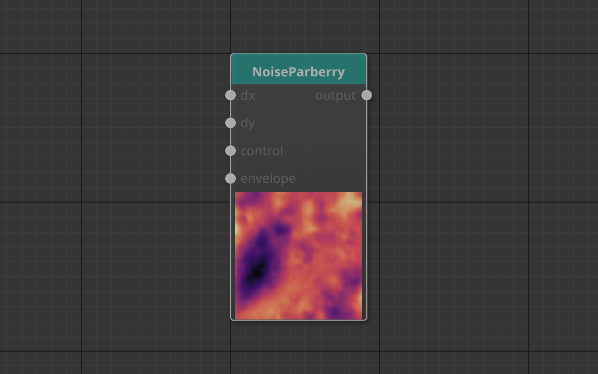
### Category

Primitive/Coherent
### Inputs

|Name|Type|Description|
| :--- | :--- | :--- |
|control|Heightmap|Control parameter, acts as a multiplier for the weight parameter.|
|dx|Heightmap|Displacement with respect to the domain size (x-direction).|
|dy|Heightmap|Displacement with respect to the domain size (y-direction).|
|envelope|Heightmap|Output noise amplitude envelope.|

### Outputs

|Name|Type|Description|
| :--- | :--- | :--- |
|output|Heightmap|Generated noise.|

### Parameters

|Name|Type|Description|
| :--- | :--- | :--- |
|inverse|Bool|Toggle inversion of the output values.|
|kw|Wavenumber|Noise wavenumbers (kx, ky) for each directions.|
|lacunarity|Float|Wavenumber ratio between each octaves.|
|mu|Float|Gradient magnitude exponent.|
|octaves|Integer|Number of octaves.|
|persistence|Float|Octave persistence.|
|remap|Value range|Remap the operator's output to a specified range, defaulting to [0, 1].|
|seed|Random seed number|Random seed number.|
|weight|Float|Octave weighting.|

## NoisePingpong

NoisePingPong, variant of NoiseFbm.

### Category

Primitive/Coherent
### Inputs

|Name|Type|Description|
| :--- | :--- | :--- |
|control|Heightmap|Control parameter, acts as a multiplier for the weight parameter.|
|dx|Heightmap|Displacement with respect to the domain size (x-direction).|
|dy|Heightmap|Displacement with respect to the domain size (y-direction).|
|envelope|Heightmap|Output noise amplitude envelope.|

### Outputs

|Name|Type|Description|
| :--- | :--- | :--- |
|output|Heightmap|Generated noise.|

### Parameters

|Name|Type|Description|
| :--- | :--- | :--- |
|inverse|Bool|Toggle inversion of the output values.|
|kw|Wavenumber|Noise wavenumbers (kx, ky) for each directions.|
|lacunarity|Float|Wavenumber ratio between each octaves.|
|noise_type|Enumeration|Base primitive noise. Available values: OpenSimplex2, OpenSimplex2S, Perlin, Perlin (billow), Perlin (half), Value, Value (cubic), Worley, Worley (doube), Worley (value).|
|octaves|Integer|Number of octaves.|
|persistence|Float|Octave persistence.|
|remap|Value range|Remap the operator's output to a specified range, defaulting to [0, 1].|
|seed|Random seed number|Random seed number.|
|weight|Float|Octave weighting.|

## NoiseRidged

NoiseRidged, variant of NoiseFbm.

### Category

Primitive/Coherent
### Inputs

|Name|Type|Description|
| :--- | :--- | :--- |
|control|Heightmap|Control parameter, acts as a multiplier for the weight parameter.|
|dx|Heightmap|Displacement with respect to the domain size (x-direction).|
|dy|Heightmap|Displacement with respect to the domain size (y-direction).|
|envelope|Heightmap|Output noise amplitude envelope.|

### Outputs

|Name|Type|Description|
| :--- | :--- | :--- |
|output|Heightmap|Generated noise.|

### Parameters

|Name|Type|Description|
| :--- | :--- | :--- |
|inverse|Bool|Toggle inversion of the output values.|
|k_smoothing|Float|Smoothing coefficient of the aboslute value.|
|kw|Wavenumber|Noise wavenumbers (kx, ky) for each directions.|
|lacunarity|Float|Wavenumber ratio between each octaves.|
|noise_type|Enumeration|Base primitive noise. Available values: OpenSimplex2, OpenSimplex2S, Perlin, Perlin (billow), Perlin (half), Value, Value (cubic), Worley, Worley (doube), Worley (value).|
|octaves|Integer|Number of octaves.|
|persistence|Float|Octave persistence.|
|remap|Value range|Remap the operator's output to a specified range, defaulting to [0, 1].|
|seed|Random seed number|Random seed number.|
|weight|Float|Octave weighting.|

## NoiseSwiss

NoiseSwiss, variant of NoiseFbm.

### Category

Primitive/Coherent
### Inputs

|Name|Type|Description|
| :--- | :--- | :--- |
|control|Heightmap|Control parameter, acts as a multiplier for the weight parameter.|
|dx|Heightmap|Displacement with respect to the domain size (x-direction).|
|dy|Heightmap|Displacement with respect to the domain size (y-direction).|
|envelope|Heightmap|Output noise amplitude envelope.|

### Outputs

|Name|Type|Description|
| :--- | :--- | :--- |
|output|Heightmap|Generated noise.|

### Parameters

|Name|Type|Description|
| :--- | :--- | :--- |
|inverse|Bool|Toggle inversion of the output values.|
|kw|Wavenumber|Noise wavenumbers (kx, ky) for each directions.|
|lacunarity|Float|Wavenumber ratio between each octaves.|
|noise_type|Enumeration|Base primitive noise. Available values: OpenSimplex2, OpenSimplex2S, Perlin, Perlin (billow), Perlin (half), Value, Value (cubic), Worley, Worley (doube), Worley (value).|
|octaves|Integer|Number of octaves.|
|persistence|Float|Octave persistence.|
|remap|Value range|Remap the operator's output to a specified range, defaulting to [0, 1].|
|seed|Random seed number|Random seed number.|
|warp_scale|Float|Warping influence scaling.|
|weight|Float|Octave weighting.|

## NormalDisplacement

NormalDisplacement applies a displacement to the terrain along the normal direction.

### Category

Filter/Recast
### Inputs

|Name|Type|Description|
| :--- | :--- | :--- |
|input|Heightmap|Input heightmap.|
|mask|Heightmap|Mask defining the filtering intensity (expected in [0, 1]).|

### Outputs

|Name|Type|Description|
| :--- | :--- | :--- |
|output|Heightmap|Output heightmap.|

### Parameters

|Name|Type|Description|
| :--- | :--- | :--- |
|GPU|Bool|Toogle GPU acceleration on or off.|
|amount|Float|Displacement scaling.|
|iterations|Integer|Number of successive use of the operator.|
|radius|Float|Filter radius with respect to the domain size.|
|reverse|Bool|Reverse displacement direction.|

## Opening

Opening is a combination of erosion followed by dilation. It is primarily used for removing noise while preserving the shape and size of objects. Use Cases: Noise removal: Opening is effective in removing small, isolated noise regions while keeping the main objects intact. Smoothing object boundaries: Opening can help smooth the boundaries of objects in an image while preserving their overall shape.

### Category

Operator/Morphology
### Inputs

|Name|Type|Description|
| :--- | :--- | :--- |
|input|Heightmap|Input heightmap.|

### Outputs

|Name|Type|Description|
| :--- | :--- | :--- |
|output|Heightmap|Dilated heightmap.|

### Parameters

|Name|Type|Description|
| :--- | :--- | :--- |
|GPU|Bool|Toogle GPU acceleration on or off.|
|radius|Float|Filter radius with respect to the domain size.|

## Paraboloid

.

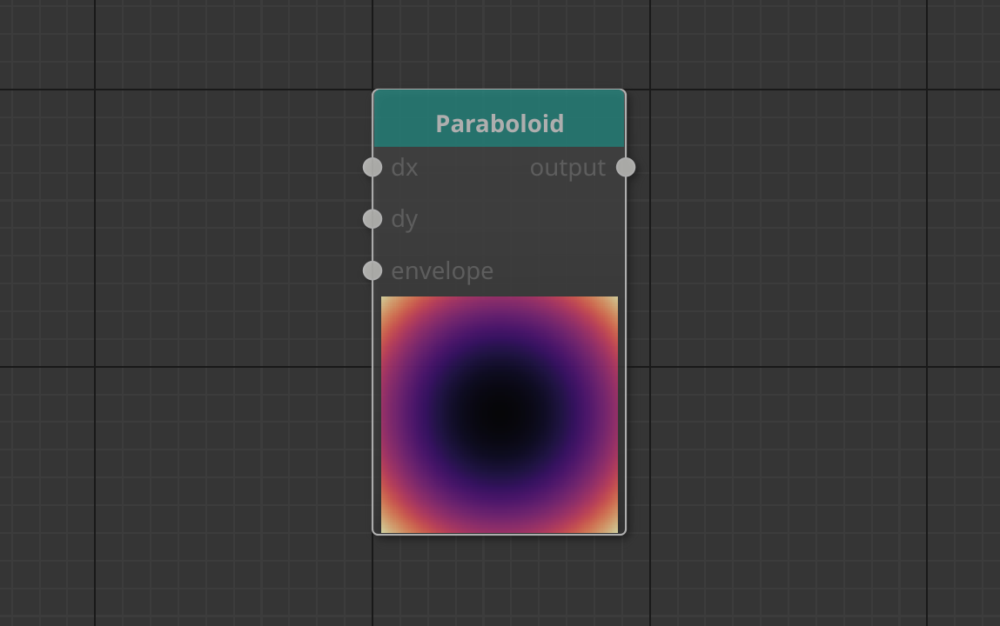
### Category

Primitive/Function
### Inputs

|Name|Type|Description|
| :--- | :--- | :--- |
|dx|Heightmap|Displacement with respect to the domain size (x-direction).|
|dy|Heightmap|Displacement with respect to the domain size (y-direction).|
|envelope|Heightmap|Output noise amplitude envelope.|

### Outputs

|Name|Type|Description|
| :--- | :--- | :--- |
|output|Heightmap|Paraboloid.|

### Parameters

|Name|Type|Description|
| :--- | :--- | :--- |
|a|Float|Curvature parameter, first principal axis.|
|angle|Float|Angle.|
|b|Float|Curvature parameter, second principal axis.|
|center|Vec2Float|Reference center within the heightmap.|
|inverse|Bool|Toggle inversion of the output values.|
|remap|Value range|Remap the operator's output to a specified range, defaulting to [0, 1].|
|reverse_x|Bool|Reverse coefficient of first principal axis.|
|reverse_y|Bool|Reverse coefficient of second principal axis.|
|v0|Float|Value at the paraboloid center.|

## Path

A polyline defined by a series of connected points (x, y) with elevation data (z). Paths can represent linear features such as roads, rivers, or boundaries.

### Category

Geometry/Path
### Outputs

|Name|Type|Description|
| :--- | :--- | :--- |
|path|Path|Outputs the path as a set of directed points (x, y) and elevations (z).|

### Parameters

|Name|Type|Description|
| :--- | :--- | :--- |
|path|Path|The sequence of points defining the path. Each point consists of coordinates (x, y) and an elevation (z).|

## PathBezier

PathBezier uses Bezier interpolation to replace sharp angles and straight segments with smooth, flowing curves.

### Category

Geometry/Path
### Inputs

|Name|Type|Description|
| :--- | :--- | :--- |
|input|Path|Input path.|

### Outputs

|Name|Type|Description|
| :--- | :--- | :--- |
|output|Path|Output path.|

### Parameters

|Name|Type|Description|
| :--- | :--- | :--- |
|curvature_ratio|Float|Amount of curvature (usually in [-1, 1] and commonly > 0).|
|edge_divisions|Integer|Edge sub-divisions of each edge. After the operation, the path is remeshed based on this new sub-division.|

## PathBezierRound

PathBezierRound uses Bezier interpolation to replace sharp angles and straight segments with smooth, round and flowing curves. PathBezierRound is an alternative to PathBezier.

### Category

Geometry/Path
### Inputs

|Name|Type|Description|
| :--- | :--- | :--- |
|input|Path|Input path.|

### Outputs

|Name|Type|Description|
| :--- | :--- | :--- |
|output|Path|Output path.|

### Parameters

|Name|Type|Description|
| :--- | :--- | :--- |
|curvature_ratio|Float|Amount of curvature (usually in [-1, 1] and commonly > 0).|
|edge_divisions|Integer|Edge sub-divisions of each edge. After the operation, the path is remeshed based on this new sub-division.|

## PathBspline

PathBspline uses Bspline interpolation to replace sharp angles and straight segments with smooth, flowing curves.

### Category

Geometry/Path
### Inputs

|Name|Type|Description|
| :--- | :--- | :--- |
|input|Path|Input path.|

### Outputs

|Name|Type|Description|
| :--- | :--- | :--- |
|output|Path|Output path.|

### Parameters

|Name|Type|Description|
| :--- | :--- | :--- |
|edge_divisions|Integer|Edge sub-divisions of each edge. After the operation, the path is remeshed based on this new sub-division.|

## PathDecasteljau

PathDecasteljau uses Decasteljau interpolation to replace sharp angles and straight segments with smooth, flowing curves.

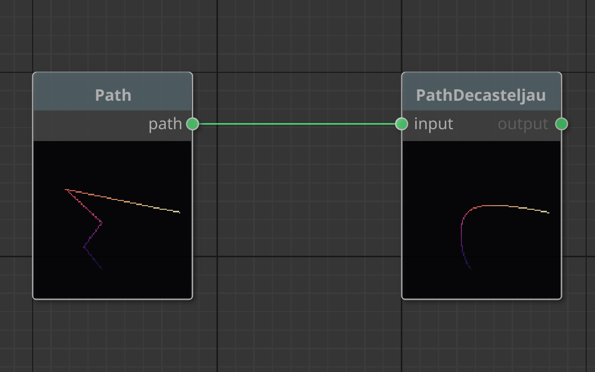
### Category

Geometry/Path
### Inputs

|Name|Type|Description|
| :--- | :--- | :--- |
|input|Path|Input path.|

### Outputs

|Name|Type|Description|
| :--- | :--- | :--- |
|output|Path|Output path.|

### Parameters

|Name|Type|Description|
| :--- | :--- | :--- |
|edge_divisions|Integer|Edge sub-divisions of each edge. After the operation, the path is remeshed based on this new sub-division.|

## PathDig

TODO

### Category

Geometry/Path
### Inputs

|Name|Type|Description|
| :--- | :--- | :--- |
|input|Heightmap|TODO|
|path|Path|TODO|

### Outputs

|Name|Type|Description|
| :--- | :--- | :--- |
|output|Heightmap|TODO|

### Parameters

|Name|Type|Description|
| :--- | :--- | :--- |
|decay|Float|TODO|
|depth|Float|TODO|
|flattening_radius|Float|TODO|
|force_downhill|Bool|TODO|
|width|Float|TODO|

## PathFind

TODO

### Category

Geometry/Path
### Inputs

|Name|Type|Description|
| :--- | :--- | :--- |
|heightmap|Heightmap|TODO|
|mask nogo|Heightmap|TODO|
|waypoints|Path|TODO|

### Outputs

|Name|Type|Description|
| :--- | :--- | :--- |
|path|Path|TODO|

### Parameters

|Name|Type|Description|
| :--- | :--- | :--- |
|distance_exponent|Float|TODO|
|downsampling|Integer|TODO|
|elevation_ratio|Float|TODO|

## PathFractalize

PathFractalize fractalizes a polyline using a mid-point displacement algorithm. The procedure involves iteratively modifying the polyline's geometry to increase its complexity, mimicking fractal characteristics.

### Category

Geometry/Path
### Inputs

|Name|Type|Description|
| :--- | :--- | :--- |
|input|Path|Input path.|

### Outputs

|Name|Type|Description|
| :--- | :--- | :--- |
|output|Path|Output path.|

### Parameters

|Name|Type|Description|
| :--- | :--- | :--- |
|iterations|Integer|Number of mid-point displacement iterations.|
|orientation|Integer|Displacement orientation (0 for random inward/outward displacement, 1 to inflate the path and -1 to deflate the path).|
|persistence|Float|Noise persistence (with iteration number).|
|seed|Random seed number|Random seed number.|
|sigma|Float|Half-width of the random Gaussian displacement, normalized by the distance between points.|

## PathMeanderize

PathMeanderize uses Bezier interpolation to add menaders to the input path.

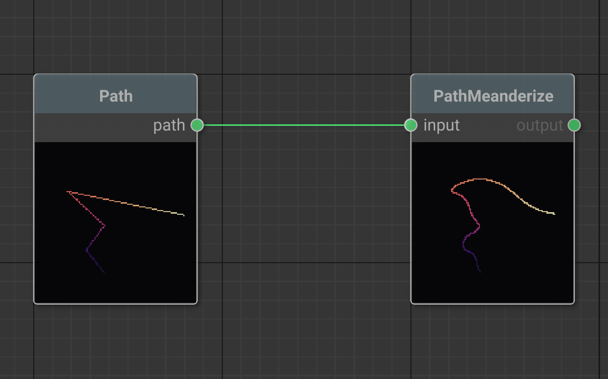
### Category

Geometry/Path
### Inputs

|Name|Type|Description|
| :--- | :--- | :--- |
|input|Path|Input path.|

### Outputs

|Name|Type|Description|
| :--- | :--- | :--- |
|output|Path|Output path.|

### Parameters

|Name|Type|Description|
| :--- | :--- | :--- |
|edge_divisions|Integer|Edge sub-divisions of each edge. After the operation, the path is remeshed based on this new sub-division.|
|iterations|Integer|Number of meandering iterations.|
|noise_ratio|Float|Randomness ratio.|
|ratio|Float|Meander amplitude ratio.|
|seed|Random seed number|Random seed number|

## PathResample

PathResample resamples the path based to get (approximately) a given distance between points.

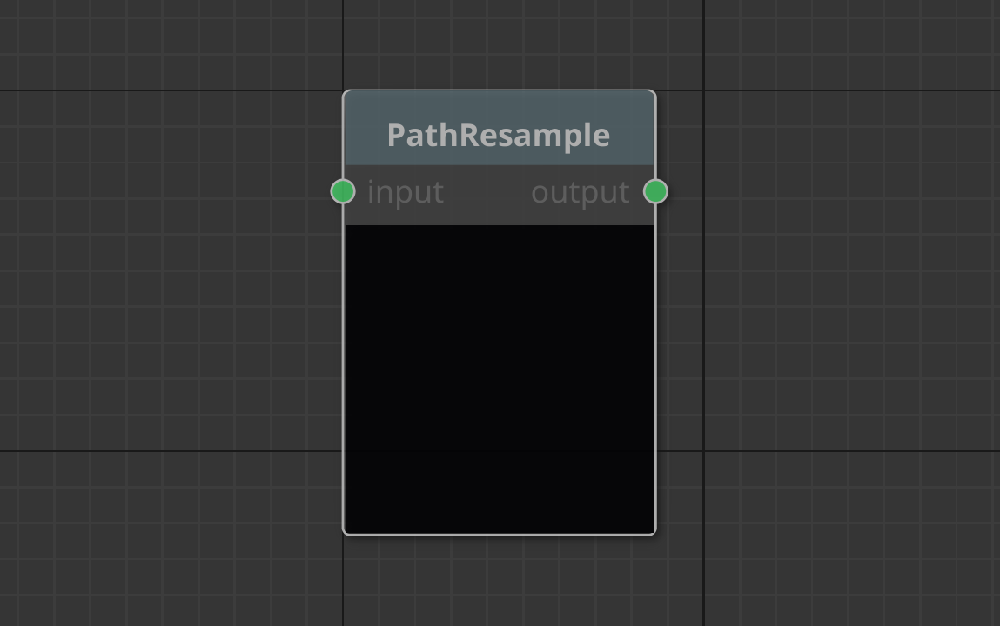
### Category

Geometry/Path
### Inputs

|Name|Type|Description|
| :--- | :--- | :--- |
|input|Path|Input path.|

### Outputs

|Name|Type|Description|
| :--- | :--- | :--- |
|output|Path|Output path.|

### Parameters

|Name|Type|Description|
| :--- | :--- | :--- |
|delta|Float|Target distance between the points.|

## PathSDF

PathSDF evaluates the signed distance function of a polyline. It assigns a signed distance value to every point in space. For points outside the polyline, the distance is positive, while for points inside, it's negative. The zero level set of this function precisely defines the polyline's path Project path points to an heightmap.

### Category

Geometry/Path
### Inputs

|Name|Type|Description|
| :--- | :--- | :--- |
|dx|Heightmap|TODO|
|dy|Heightmap|TODO|
|path|Path|Input path.|

### Outputs

|Name|Type|Description|
| :--- | :--- | :--- |
|sdf|Heightmap|Signed distance as an heightmap.|

### Parameters

|Name|Type|Description|
| :--- | :--- | :--- |
|inverse|Bool|Toggle inversion of the output values.|
|remap|Bool|Remap the operator's output to a specified range, defaulting to [0, 1].|

## PathSmooth

TODO

### Category

Geometry/Path
### Inputs

|Name|Type|Description|
| :--- | :--- | :--- |
|input|Path|TODO|

### Outputs

|Name|Type|Description|
| :--- | :--- | :--- |
|output|Path|TODO|

### Parameters

|Name|Type|Description|
| :--- | :--- | :--- |
|averaging_intensity|Float|TODO|
|inertia|Float|TODO|
|navg|Integer|TODO|

## PathToCloud

PathToCloud convert a Path to a set of points (Cloud).

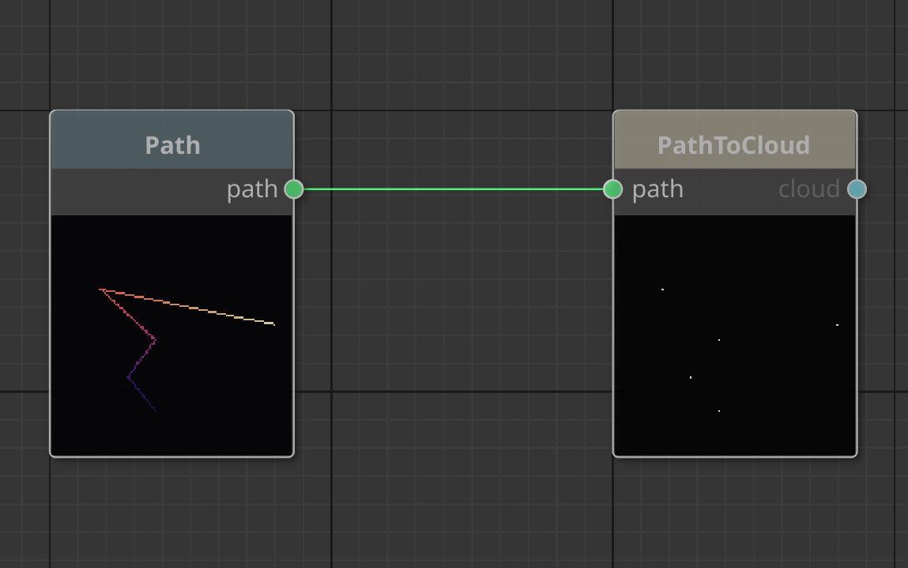
### Category

Geometry/Path
### Inputs

|Name|Type|Description|
| :--- | :--- | :--- |
|path|Path|Input path.|

### Outputs

|Name|Type|Description|
| :--- | :--- | :--- |
|cloud|Cloud|Output cloud.|

## PathToHeightmap

PathToHeightmap Project path points to an heightmap.

### Category

Geometry/Path
### Inputs

|Name|Type|Description|
| :--- | :--- | :--- |
|path|Path|Input path.|

### Outputs

|Name|Type|Description|
| :--- | :--- | :--- |
|heightmap|Heightmap|Output heightmap.|

### Parameters

|Name|Type|Description|
| :--- | :--- | :--- |
|filled|Bool|Whether the resulting path contour is filled (input Path needs to be closed).|
|inverse|Bool|Toggle inversion of the output values.|
|remap|Bool|Remap the operator's output to a specified range, defaulting to [0, 1].|
|smoothing|Bool|Enable or disable smoothing to reduce noise in the curvature computation.|
|smoothing_radius|Float|Specifies the radius for smoothing, determining how much the curvature is averaged over neighboring pixels.|

## Plateau

Plateau node manipulates the elevation values to create flats, elevated regions surrounded by steep slopes.

### Category

Filter/Recurve
### Inputs

|Name|Type|Description|
| :--- | :--- | :--- |
|input|Heightmap|Input heightmap.|
|mask|Heightmap|Mask defining the filtering intensity (expected in [0, 1]).|

### Outputs

|Name|Type|Description|
| :--- | :--- | :--- |
|output|Heightmap|Filtered heightmap.|

### Parameters

|Name|Type|Description|
| :--- | :--- | :--- |
|GPU|Bool|Toogle GPU acceleration on or off.|
|factor|Float|Influence the cliff elevation profile.|
|radius|Float|Filter radius with respect to the domain size.|

## Preview

TODO

### Category

Debug
### Inputs

|Name|Type|Description|
| :--- | :--- | :--- |
|elevation|Heightmap|TODO|
|normal map|HeightmapRGBA|TODO|
|scalar|Heightmap|TODO|
|texture|HeightmapRGBA|TODO|

## QuiltingBlend

TODO

### Category

Operator/Resynthesis
### Inputs

|Name|Type|Description|
| :--- | :--- | :--- |
|input 1|Heightmap|TODO|
|input 2|Heightmap|TODO|
|input 3|Heightmap|TODO|
|input 4|Heightmap|TODO|

### Outputs

|Name|Type|Description|
| :--- | :--- | :--- |
|output|Heightmap|TODO|

### Parameters

|Name|Type|Description|
| :--- | :--- | :--- |
|filter_width_ratio|Float|TODO|
|overlap|Float|TODO|
|patch_flip|Bool|TODO|
|patch_rotate|Bool|TODO|
|patch_transpose|Bool|TODO|
|patch_width|Float|TODO|
|seed|Random seed number|TODO|

## QuiltingExpand

QuiltingExpand is an operator based on quilting that changes the feature wavenumber of a heightmap by modifying the frequency or scale of features present in the heightmap using a quilting-like technique. This operator allows for the synthesis of heightmaps with different levels of detail or spatial frequency content.

### Category

Operator/Resynthesis
### Inputs

|Name|Type|Description|
| :--- | :--- | :--- |
|input|Heightmap|Input heightmap.|

### Outputs

|Name|Type|Description|
| :--- | :--- | :--- |
|output|Heightmap|Synthetized heightmap.|

### Parameters

|Name|Type|Description|
| :--- | :--- | :--- |
|expansion_ratio|Float|Determine the features expansion ratio of the new heightmap.|
|filter_width_ratio|Float|Smooth filter width with respect the overlap length.|
|overlap|Float|Overlap ratio between patches.|
|patch_flip|Bool|Allow patch flipping.|
|patch_rotate|Bool|Allow patch 90 degree rotation.|
|patch_transpose|Bool|Allow patch tranposition.|
|patch_width|Float|Decide on the size (with respect to the domain size) of the patches that will be used to create the new heightmap. This determines the level of detail and texture in the final result.|
|seed|Random seed number|Random seed number.|

## QuiltingShuffle

QuiltingShuffle performs a quilting procedure and generates a new image by seamlessly stitching together patches from an existing image.

### Category

Operator/Resynthesis
### Inputs

|Name|Type|Description|
| :--- | :--- | :--- |
|input|Heightmap|Input heightmap.|

### Outputs

|Name|Type|Description|
| :--- | :--- | :--- |
|output|Heightmap|Synthetized heightmap.|

### Parameters

|Name|Type|Description|
| :--- | :--- | :--- |
|filter_width_ratio|Float|Smooth filter width with respect the overlap length.|
|overlap|Float|Overlap ratio between patches.|
|patch_flip|Bool|Allow patch flipping.|
|patch_rotate|Bool|Allow patch 90 degree rotation.|
|patch_transpose|Bool|Allow patch tranposition.|
|patch_width|Float|Decide on the size (with respect to the domain size) of the patches that will be used to create the new heightmap. This determines the level of detail and texture in the final result.|
|seed|Random seed number|Random seed number.|

## RadialDisplacementToXy

RadialDisplacementToXy interprets the input array dr as a radial displacement and convert it to a pair of displacements dx and dy in cartesian coordinates.

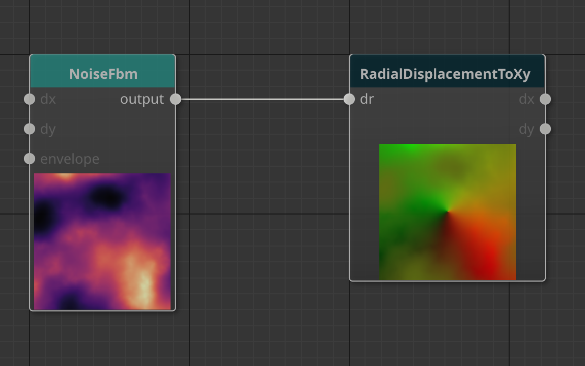
### Category

Math
### Inputs

|Name|Type|Description|
| :--- | :--- | :--- |
|dr|Heightmap|Radial displacement.|

### Outputs

|Name|Type|Description|
| :--- | :--- | :--- |
|dx|Heightmap|Displacement for  the x-direction.|
|dy|Heightmap|Displacement for  the y-direction.|

### Parameters

|Name|Type|Description|
| :--- | :--- | :--- |
|center|Vec2Float|Reference center within the heightmap.|
|smoothing|Float|Smoothing parameter to avoid discontinuity at the origin.|

## RecastCanyon

TODO

### Category

Filter/Recast
### Inputs

|Name|Type|Description|
| :--- | :--- | :--- |
|input|Heightmap|TODO|
|mask|Heightmap|Mask defining the filtering intensity (expected in [0, 1]).|
|noise|Heightmap|TODO|

### Outputs

|Name|Type|Description|
| :--- | :--- | :--- |
|output|Heightmap|TODO|

### Parameters

|Name|Type|Description|
| :--- | :--- | :--- |
|gamma|Float|TODO|
|vcut|Float|TODO|

## RecastCliff

RecastCliff add cliffs in a heightmap by introducing sharp changes in elevation to simulate steep vertical terrain features such as cliffs or escarpments.

### Category

Filter/Recast
### Inputs

|Name|Type|Description|
| :--- | :--- | :--- |
|input|Heightmap|Input heightmap.|
|mask|Heightmap|Mask defining the filtering intensity (expected in [0, 1]).|

### Outputs

|Name|Type|Description|
| :--- | :--- | :--- |
|output|Heightmap|Filtered heightmap.|

### Parameters

|Name|Type|Description|
| :--- | :--- | :--- |
|amplitude|Float|Cliff amplitude.|
|gain|Float|Gain, influence the cliff elevation profile.|
|radius|Float|Filter influence radius.|
|talus_global|Float|Reference talus at which the cliff are added.|

## RecastCliffDirectional

TODO

### Category

Filter/Recast
### Inputs

|Name|Type|Description|
| :--- | :--- | :--- |
|input|Heightmap|TODO|
|mask|Heightmap|Mask defining the filtering intensity (expected in [0, 1]).|

### Outputs

|Name|Type|Description|
| :--- | :--- | :--- |
|output|Heightmap|TODO|

### Parameters

|Name|Type|Description|
| :--- | :--- | :--- |
|amplitude|Float|TODO|
|angle|Float|TODO|
|gain|Float|TODO|
|radius|Float|TODO|
|talus_global|Float|TODO|

## RecastCracks

TODO

### Category

Filter/Recast
### Inputs

|Name|Type|Description|
| :--- | :--- | :--- |
|input|Heightmap|TODO|

### Outputs

|Name|Type|Description|
| :--- | :--- | :--- |
|output|Heightmap|TODO|

### Parameters

|Name|Type|Description|
| :--- | :--- | :--- |
|cut_max|Float|TODO|
|cut_min|Float|TODO|
|k_smoothing|Float|TODO|

## RecastSag

RecastSag add cliffs in a heightmap by introducing sinks, droops, or bends downward changes in elevation.

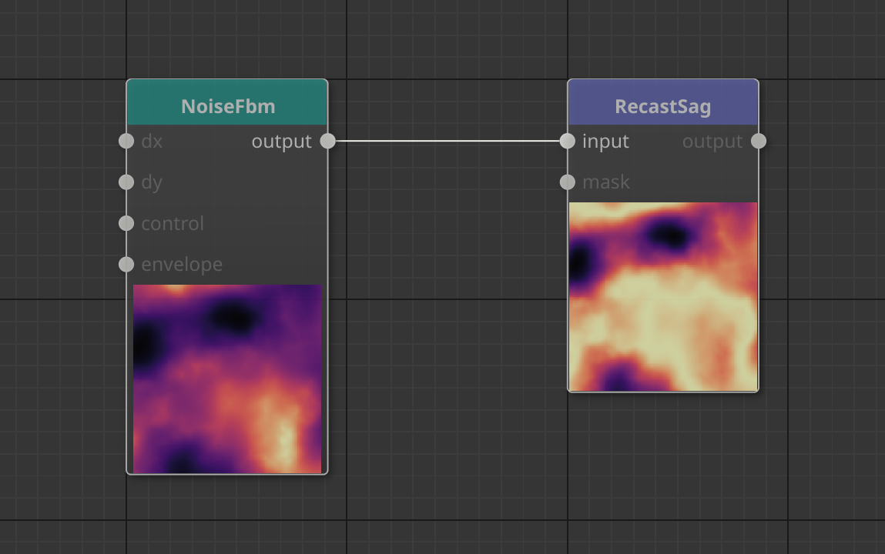
### Category

Filter/Recast
### Inputs

|Name|Type|Description|
| :--- | :--- | :--- |
|input|Heightmap|Input heightmap.|
|mask|Heightmap|Mask defining the filtering intensity (expected in [0, 1]).|

### Outputs

|Name|Type|Description|
| :--- | :--- | :--- |
|output|Heightmap|Filtered heightmap.|

### Parameters

|Name|Type|Description|
| :--- | :--- | :--- |
|k|Float|Smoothing parameter.|
|vref|Float|Reference elevation for the folding.|

## Receive

Retrieves a heightmap broadcasted by another node using the specified tag.

### Category

Routing
### Outputs

|Name|Type|Description|
| :--- | :--- | :--- |
|output|Heightmap|The heightmap retrieved from the broadcast source.|

### Parameters

|Name|Type|Description|
| :--- | :--- | :--- |
|tag|Choice|Tag identifying the broadcasted heightmap to receive.|

## Recurve

Applies a corrective curve to the heightmap values using a user-defined set of control points.

### Category

Filter/Recurve
### Inputs

|Name|Type|Description|
| :--- | :--- | :--- |
|input|Heightmap|Heightmap to be modified using the corrective curve.|
|mask|Heightmap|Mask defining the filtering intensity (expected in [0, 1]).|

### Outputs

|Name|Type|Description|
| :--- | :--- | :--- |
|output|Heightmap|Resulting heightmap after the curve has been applied.|

### Parameters

|Name|Type|Description|
| :--- | :--- | :--- |
|values|Vector of floats|List of control points defining the curve to remap height values (X = input, Y = output).|

## RecurveKura

RecurveKura is an operator based on the Kumaraswamy distribution that can be used to adjust the amplitude levels of a dataset.

### Category

Filter/Recurve
### Inputs

|Name|Type|Description|
| :--- | :--- | :--- |
|input|Heightmap|Input heightmap.|
|mask|Heightmap|Mask defining the filtering intensity (expected in [0, 1]).|

### Outputs

|Name|Type|Description|
| :--- | :--- | :--- |
|output|Heightmap|Filtered heightmap.|

### Parameters

|Name|Type|Description|
| :--- | :--- | :--- |
|a|Float|Primarily controls the rightward skewness and tail behavior of the distribution.|
|b|Float|Primarily controls the leftward skewness and tail behavior.|

## RecurveS

RecurveS applied a curve adjustment filter using a smooth S-shape curve.

### Category

Filter/Recurve
### Inputs

|Name|Type|Description|
| :--- | :--- | :--- |
|input|Heightmap|Input heightmap.|
|mask|Heightmap|Mask defining the filtering intensity (expected in [0, 1]).|

### Outputs

|Name|Type|Description|
| :--- | :--- | :--- |
|output|Heightmap|Filtered heightmap.|

## RelativeElevation

RelativeElevation identifies heightmap relative elevation based on the surrounding heightmap values.

### Category

Features/Landform
### Inputs

|Name|Type|Description|
| :--- | :--- | :--- |
|input|Heightmap|Input heightmap.|

### Outputs

|Name|Type|Description|
| :--- | :--- | :--- |
|output|Heightmap|Relative elevation.|

### Parameters

|Name|Type|Description|
| :--- | :--- | :--- |
|GPU|Bool|Toogle GPU acceleration on or off.|
|radius|Float|Filter radius with respect to the domain size.|

## Remap

The Remap operator is used to adjust the elevation values across the entire dataset, effectively changing the range of elevation data to match a desired output scale or to normalize the data.

### Category

Filter/Range
### Inputs

|Name|Type|Description|
| :--- | :--- | :--- |
|input|Heightmap|Input heightmap.|

### Outputs

|Name|Type|Description|
| :--- | :--- | :--- |
|output|Heightmap|Remapped heightmap.|

### Parameters

|Name|Type|Description|
| :--- | :--- | :--- |
|remap|Value range|Target range: define the new minimum and maximum values to remap the elevation values to.|

## Rescale

The Rescale operator involves adjusting each data point by multiplying it with a predetermined constant.

### Category

Filter/Range
### Inputs

|Name|Type|Description|
| :--- | :--- | :--- |
|input|Heightmap|Input heightmap.|

### Outputs

|Name|Type|Description|
| :--- | :--- | :--- |
|output|Heightmap|Rescaled heightmap.|

### Parameters

|Name|Type|Description|
| :--- | :--- | :--- |
|centered|Bool|Determine whether a mean offset is applied to the values to center the scaling.|
|scaling|Float|Constant by which each elevation values will be multiplied.|

## Reverse

TODO

### Category

Math/Base
### Inputs

|Name|Type|Description|
| :--- | :--- | :--- |
|input|Heightmap|TODO|

### Outputs

|Name|Type|Description|
| :--- | :--- | :--- |
|output|Heightmap|TODO|

## ReverseMidpoint

ReverseMidpoint generates an heightmap. It uses a polyline as a base, then recursively interpolate and displace midpoints to generate a terrain.

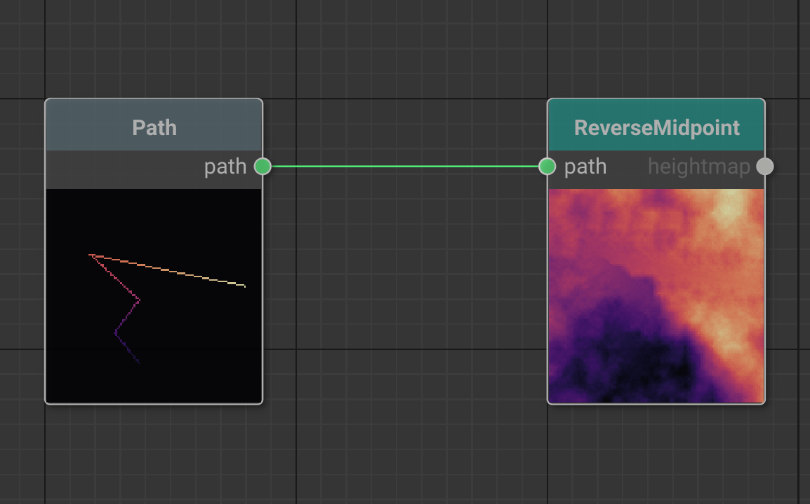
### Category

WIP
### Inputs

|Name|Type|Description|
| :--- | :--- | :--- |
|path|Path|Set of points (x, y) and elevations z.|

### Outputs

|Name|Type|Description|
| :--- | :--- | :--- |
|heightmap|Heightmap|Interpolated heightmap.|

### Parameters

|Name|Type|Description|
| :--- | :--- | :--- |
|inverse|Bool|Toggle inversion of the output values.|
|noise_scale|Float|Added noise scaling.|
|remap|Bool|Remap the operator's output to a specified range, defaulting to [0, 1].|
|seed|Random seed number|Random seed number.|

## Ridgelines

Ridgelines generates an heightmap assuming the input path defines a ridgeline.

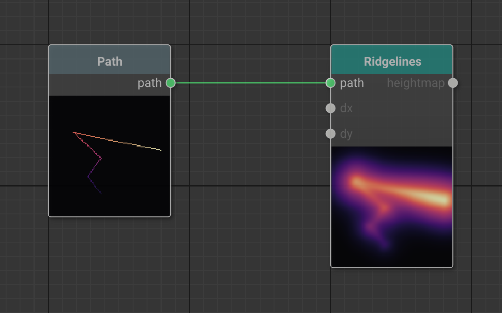
### Category

Primitive/Authoring
### Inputs

|Name|Type|Description|
| :--- | :--- | :--- |
|dx|Heightmap|Displacement with respect to the domain size (x-direction).|
|dy|Heightmap|Displacement with respect to the domain size (y-direction).|
|path|Path|Set of points (x, y) and elevations z.|

### Outputs

|Name|Type|Description|
| :--- | :--- | :--- |
|heightmap|Heightmap|Interpolated heightmap.|

### Parameters

|Name|Type|Description|
| :--- | :--- | :--- |
|k_smoothing|Float|Smoothing intensity.|
|talus_global|Float|Ridge slope.|
|vmin|Float|Minimum value (lower values are clamped).|
|width|Float|Ridge edge width.|

## Rift

Rift is function used to represent a conceptualized rift.

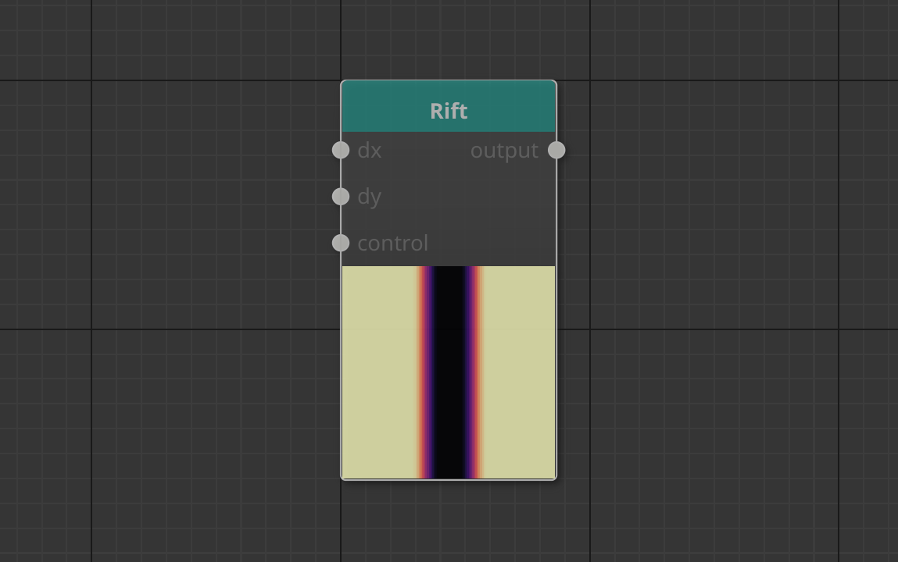
### Category

Primitive/Function
### Inputs

|Name|Type|Description|
| :--- | :--- | :--- |
|control|Heightmap|Control parameter, acts as a multiplier for the width parameter.|
|dx|Heightmap|Displacement with respect to the domain size (x-direction).|
|dy|Heightmap|Displacement with respect to the domain size (y-direction).|

### Outputs

|Name|Type|Description|
| :--- | :--- | :--- |
|output|Heightmap|Rift heightmap.|

### Parameters

|Name|Type|Description|
| :--- | :--- | :--- |
|angle|Float|Angle.|
|center|Vec2Float|Reference center within the heightmap.|
|inverse|Bool|Toggle inversion of the output values.|
|remap|Value range|Remap the operator's output to a specified range, defaulting to [0, 1].|
|sharp_bottom|Bool|Decide whether the rift bottom is sharp or not.|
|slope|Float|Rift slope.|
|width|Float|Rift width.|

## Ruggedness

Measures the terrain roughness by computing the square root of the sum of squared elevation differences within a specified radius. Indicates how rough or smooth the terrain is by analyzing how much the elevation changes between neighboring areas. Higher values mean a more rugged, uneven surface, while lower values indicate a flatter, smoother landscape.

### Category

Features
### Inputs

|Name|Type|Description|
| :--- | :--- | :--- |
|input|Heightmap|Heightmap input representing terrain elevations, used to calculate ruggedness.|

### Outputs

|Name|Type|Description|
| :--- | :--- | :--- |
|output|Heightmap|Resulting heightmap where each pixel represents the calculated ruggedness value.|

### Parameters

|Name|Type|Description|
| :--- | :--- | :--- |
|GPU|Bool|Toogle GPU acceleration on or off.|
|inverse|Bool|Toggle inversion of the output values.|
|radius|Float|Defines the neighborhood radius used for computing ruggedness. Larger values consider a wider area, capturing broader terrain variations.|
|smoothing|Bool|Enable or disable smoothing to reduce noise in the curvature computation.|
|smoothing_radius|Float|Specifies the radius for smoothing, determining how much the curvature is averaged over neighboring pixels.|

## Rugosity

Rugosity identifies heightmap rugosity, i.e. the roughness or irregularity of the surface.

### Category

Features
### Inputs

|Name|Type|Description|
| :--- | :--- | :--- |
|input|Heightmap|Input heightmap.|

### Outputs

|Name|Type|Description|
| :--- | :--- | :--- |
|output|Heightmap|Rugosity.|

### Parameters

|Name|Type|Description|
| :--- | :--- | :--- |
|GPU|Bool|Toogle GPU acceleration on or off.|
|clamp_max|Bool|Decides whether the rugosity values are clamped.|
|inverse|Bool|Toggle inversion of the output values.|
|radius|Float|Filter radius with respect to the domain size.|
|saturate|Value range|A process that modifies the amplitude of elevations by first clamping them to a given interval and then scaling them so that the restricted interval matches the original input range. This enhances contrast in elevation variations while maintaining overall structure.|
|smoothing|Bool|Enable or disable smoothing to reduce noise in the curvature computation.|
|smoothing_radius|Float|Specifies the radius for smoothing, determining how much the curvature is averaged over neighboring pixels.|
|vc_max|Float|Rugosity clamping upper bound.|

## Saturate

A process that modifies the amplitude of elevations by first clamping them to a given interval and then scaling them so that the restricted interval matches the original input range. This enhances contrast in elevation variations while maintaining overall structure.

### Category

Filter/Recurve
### Inputs

|Name|Type|Description|
| :--- | :--- | :--- |
|input|Heightmap|Input heightmap.|

### Outputs

|Name|Type|Description|
| :--- | :--- | :--- |
|output|Heightmap|Saturated heightmap.|

### Parameters

|Name|Type|Description|
| :--- | :--- | :--- |
|k_smoothing|Float|Smoothing intensity.|
|range|Value range|Saturation range: define the minimum and maximum values of the saturation process.|

## ScanMask

ScanMask adjusts the brightness and contrast of an input mask.

### Category

Mask
### Inputs

|Name|Type|Description|
| :--- | :--- | :--- |
|input|Heightmap|Input heightmap.|

### Outputs

|Name|Type|Description|
| :--- | :--- | :--- |
|output|Heightmap|Adjusted heightmap.|

### Parameters

|Name|Type|Description|
| :--- | :--- | :--- |
|brightness|Float|Brightness adjustment.|
|contrast|Float|Contrast adjustment.|
|remap|Bool|Remap the operator's output to a specified range, defaulting to [0, 1].|

## SedimentDeposition

TODO

### Category

WIP
### Inputs

|Name|Type|Description|
| :--- | :--- | :--- |
|input|Heightmap|TODO|
|mask|Heightmap|Mask defining the filtering intensity (expected in [0, 1]).|

### Outputs

|Name|Type|Description|
| :--- | :--- | :--- |
|deposition|Heightmap|Deposition map (in [0, 1]).|
|output|Heightmap|TODO|

### Parameters

|Name|Type|Description|
| :--- | :--- | :--- |
|iterations|Integer|TODO|
|max_deposition|Float|TODO|
|scale_talus_with_elevation|Bool|Scales the talus amplitude based on heightmap elevation, reducing it at lower elevations and maintaining the nominal value at higher elevations.|
|talus_global|Float|TODO|
|thermal_subiterations|Integer|TODO|

## SelectAngle

SelectAngle is a thresholding operator. It selects angle values within a specified range defined by the shape of a Gaussian pulse.

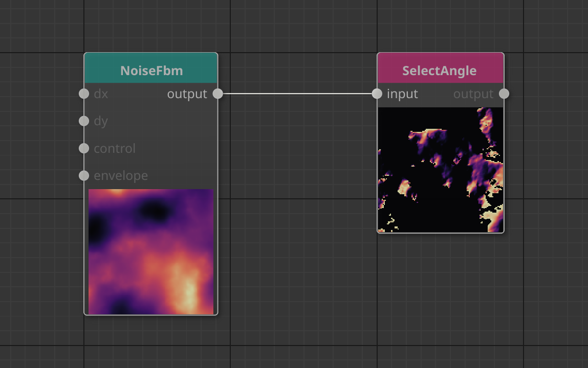
### Category

Mask/Selector
### Inputs

|Name|Type|Description|
| :--- | :--- | :--- |
|input|Heightmap|Input heightmap.|

### Outputs

|Name|Type|Description|
| :--- | :--- | :--- |
|output|Heightmap|Mask heightmap (in [0, 1]).|

### Parameters

|Name|Type|Description|
| :--- | :--- | :--- |
|angle|Float|Selection center value.|
|inverse|Bool|Toggle inversion of the output values.|
|radius|Float|Pre-filter radius.|
|sigma|Float|Selection half-width.|
|smoothing|Bool|Enable or disable smoothing to reduce noise in the curvature computation.|
|smoothing_radius|Float|Specifies the radius for smoothing, determining how much the curvature is averaged over neighboring pixels.|

## SelectBlobLog

SelectBlobLog performs 'blob' detection using oa Laplacian of Gaussian (log) method. Blobs are areas in an image that are either brighter or darker than the surrounding areas.

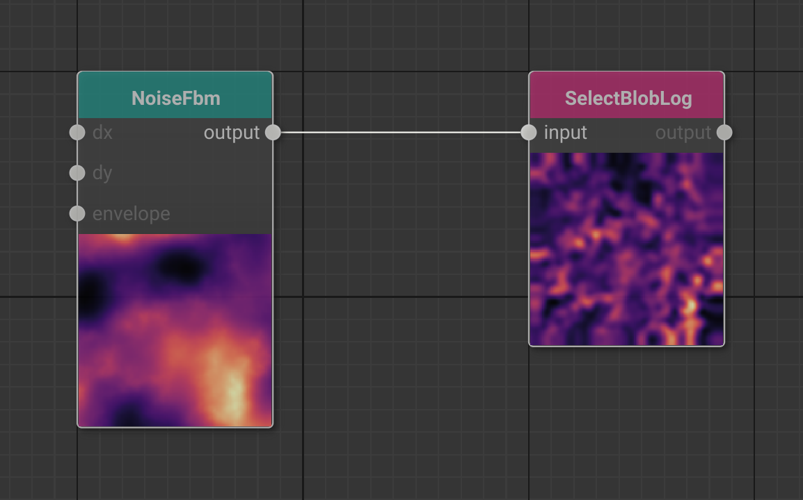
### Category

Mask/Selector
### Inputs

|Name|Type|Description|
| :--- | :--- | :--- |
|input|Heightmap|Input heightmap.|

### Outputs

|Name|Type|Description|
| :--- | :--- | :--- |
|output|Heightmap|Mask heightmap (in [0, 1]).|

### Parameters

|Name|Type|Description|
| :--- | :--- | :--- |
|inverse|Bool|Toggle inversion of the output values.|
|radius|Float|Detection radius with respect to the domain size.|
|smoothing|Bool|Enable or disable smoothing to reduce noise in the curvature computation.|
|smoothing_radius|Float|Specifies the radius for smoothing, determining how much the curvature is averaged over neighboring pixels.|

## SelectCavities

SelectCavities analyzes the curvature of an heightmap to identify concave or convex features such as valleys, depressions, ridges, or peaks.

### Category

Mask/Selector
### Inputs

|Name|Type|Description|
| :--- | :--- | :--- |
|input|Heightmap|Input heightmap.|

### Outputs

|Name|Type|Description|
| :--- | :--- | :--- |
|output|Heightmap|Mask heightmap (in [0, 1]).|

### Parameters

|Name|Type|Description|
| :--- | :--- | :--- |
|concave|Bool|Decides whether concave or convex features are detected.|
|inverse|Bool|Toggle inversion of the output values.|
|radius|Float|Detection radius with respect to the domain size.|
|smoothing|Bool|Enable or disable smoothing to reduce noise in the curvature computation.|
|smoothing_radius|Float|Specifies the radius for smoothing, determining how much the curvature is averaged over neighboring pixels.|

## SelectGt

SelectGt is a thresholding operator. It transforms an input heightmap into a binary heightmap, where each pixel is assigned either a value of 0 or 1, depending on whether its intensity value surpasses a specified threshold value.

### Category

Mask/Selector
### Inputs

|Name|Type|Description|
| :--- | :--- | :--- |
|input|Heightmap|Input heightmap.|

### Outputs

|Name|Type|Description|
| :--- | :--- | :--- |
|output|Heightmap|Mask heightmap (in [0, 1]).|

### Parameters

|Name|Type|Description|
| :--- | :--- | :--- |
|inverse|Bool|Toggle inversion of the output values.|
|smoothing|Bool|Enable or disable smoothing to reduce noise in the curvature computation.|
|smoothing_radius|Float|Specifies the radius for smoothing, determining how much the curvature is averaged over neighboring pixels.|
|value|Float|Selection value.|

## SelectInterval

SelectInterval is a thresholding operator. It transforms an input heightmap into a binary heightmap, where each pixel is assigned either a value of 0 or 1, depending on whether its intensity value is within an interval of values.

### Category

Mask/Selector
### Inputs

|Name|Type|Description|
| :--- | :--- | :--- |
|input|Heightmap|Input heightmap.|

### Outputs

|Name|Type|Description|
| :--- | :--- | :--- |
|output|Heightmap|Mask heightmap (in [0, 1]).|

### Parameters

|Name|Type|Description|
| :--- | :--- | :--- |
|inverse|Bool|Toggle inversion of the output values.|
|smoothing|Bool|Enable or disable smoothing to reduce noise in the curvature computation.|
|smoothing_radius|Float|Specifies the radius for smoothing, determining how much the curvature is averaged over neighboring pixels.|
|value1|Float|Selection value, lower bound.|
|value2|Float|Selection value, upper bound.|

## SelectInwardOutward

SelectInwardOutward returns values > 0.5 if the slope is pointing to the center (slope is inward), and values < 0.5 otherwise (slope is outward).

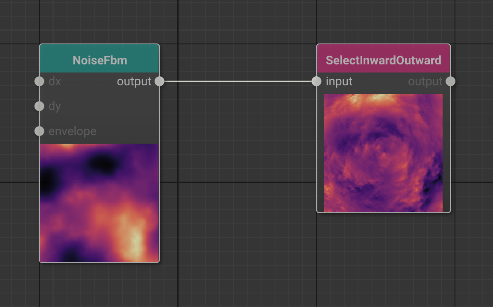
### Category

Mask/Selector
### Inputs

|Name|Type|Description|
| :--- | :--- | :--- |
|input|Heightmap|Input heightmap.|

### Outputs

|Name|Type|Description|
| :--- | :--- | :--- |
|output|Heightmap|Mask heightmap (in [0, 1]).|

### Parameters

|Name|Type|Description|
| :--- | :--- | :--- |
|center|Vec2Float|Reference center within the heightmap.|
|inverse|Bool|Toggle inversion of the output values.|
|smoothing|Bool|Enable or disable smoothing to reduce noise in the curvature computation.|
|smoothing_radius|Float|Specifies the radius for smoothing, determining how much the curvature is averaged over neighboring pixels.|

## SelectMidrange

TODO

### Category

Mask/Selector
### Inputs

|Name|Type|Description|
| :--- | :--- | :--- |
|input|Heightmap|TODO|

### Outputs

|Name|Type|Description|
| :--- | :--- | :--- |
|output|Heightmap|TODO|

### Parameters

|Name|Type|Description|
| :--- | :--- | :--- |
|gain|Float|TODO|
|inverse|Bool|Toggle inversion of the output values.|
|smoothing|Bool|Enable or disable smoothing to reduce noise in the curvature computation.|
|smoothing_radius|Float|Specifies the radius for smoothing, determining how much the curvature is averaged over neighboring pixels.|

## SelectMultiband3

TODO

### Category

Mask/Selector
### Inputs

|Name|Type|Description|
| :--- | :--- | :--- |
|input|Heightmap|TODO|

### Outputs

|Name|Type|Description|
| :--- | :--- | :--- |
|high|Heightmap|TODO|
|low|Heightmap|TODO|
|mid|Heightmap|TODO|

### Parameters

|Name|Type|Description|
| :--- | :--- | :--- |
|overlap|Float|TODO|
|ratio1|Float|TODO|
|ratio2|Float|TODO|

## SelectPulse

SelectPulse is a thresholding operator. It selects values within a specified range defined by the shape of a Gaussian pulse.

### Category

Mask/Selector
### Inputs

|Name|Type|Description|
| :--- | :--- | :--- |
|input|Heightmap|Input heightmap.|

### Outputs

|Name|Type|Description|
| :--- | :--- | :--- |
|output|Heightmap|Mask heightmap (in [0, 1]).|

### Parameters

|Name|Type|Description|
| :--- | :--- | :--- |
|inverse|Bool|Toggle inversion of the output values.|
|remap|Bool|Remap the operator's output to a specified range, defaulting to [0, 1].|
|sigma|Float|Selection half-width.|
|smoothing|Bool|Enable or disable smoothing to reduce noise in the curvature computation.|
|smoothing_radius|Float|Specifies the radius for smoothing, determining how much the curvature is averaged over neighboring pixels.|
|value|Float|Selection center value.|

## SelectRivers

SelectRivers is a thresholding operator. It creates a mask for river systems based on a flow accumulation threshold.

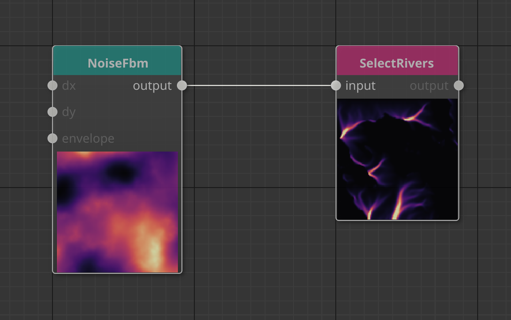
### Category

Mask/Selector
### Inputs

|Name|Type|Description|
| :--- | :--- | :--- |
|input|Heightmap|Input heightmap.|

### Outputs

|Name|Type|Description|
| :--- | :--- | :--- |
|output|Heightmap|Mask heightmap (in [0, 1]).|

### Parameters

|Name|Type|Description|
| :--- | :--- | :--- |
|clipping_ratio|Float|TODO|
|inverse|Bool|Toggle inversion of the output values.|
|remap|Bool|Remap the operator's output to a specified range, defaulting to [0, 1].|
|smoothing|Bool|Enable or disable smoothing to reduce noise in the curvature computation.|
|smoothing_radius|Float|Specifies the radius for smoothing, determining how much the curvature is averaged over neighboring pixels.|
|talus_ref|Float|TODO|

## SelectSlope

TODO

### Category

Mask/Selector
### Inputs

|Name|Type|Description|
| :--- | :--- | :--- |
|input|Heightmap|TODO|

### Outputs

|Name|Type|Description|
| :--- | :--- | :--- |
|output|Heightmap|TODO|

### Parameters

|Name|Type|Description|
| :--- | :--- | :--- |
|GPU|Bool|Toogle GPU acceleration on or off.|
|inverse|Bool|Toggle inversion of the output values.|
|radius|Float|TODO|
|saturate|Value range|A process that modifies the amplitude of elevations by first clamping them to a given interval and then scaling them so that the restricted interval matches the original input range. This enhances contrast in elevation variations while maintaining overall structure.|
|smoothing|Bool|Enable or disable smoothing to reduce noise in the curvature computation.|
|smoothing_radius|Float|Specifies the radius for smoothing, determining how much the curvature is averaged over neighboring pixels.|

## SelectTransitions

SelectTransitions returns a mask filled with 1 at the blending transition between two heightmaps, and 0 elsewhere.

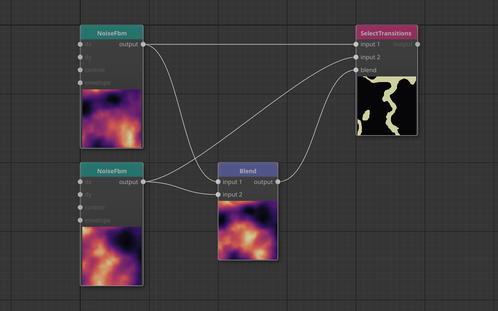
### Category

Mask/Selector
### Inputs

|Name|Type|Description|
| :--- | :--- | :--- |
|blend|Heightmap|Blended heightmap.|
|input 1|Heightmap|Input heightmap 1.|
|input 2|Heightmap|Input heightmap 2.|

### Outputs

|Name|Type|Description|
| :--- | :--- | :--- |
|output|Heightmap|Mask heightmap (in [0, 1]).|

### Parameters

|Name|Type|Description|
| :--- | :--- | :--- |
|inverse|Bool|Toggle inversion of the output values.|
|smoothing|Bool|Enable or disable smoothing to reduce noise in the curvature computation.|
|smoothing_radius|Float|Specifies the radius for smoothing, determining how much the curvature is averaged over neighboring pixels.|

## SelectValley

Identifies and selects valley-like regions in the heightmap based on curvature analysis. The selection can be inverted, and additional parameters allow fine-tuning of the selection process. The output is a mask representing the relative width of the valley. The value is 1 at the valley center and decreases to 0 at the edges of the valley.

### Category

Mask/Selector
### Inputs

|Name|Type|Description|
| :--- | :--- | :--- |
|input|Heightmap|Heightmap data used as input for valley detection.|

### Outputs

|Name|Type|Description|
| :--- | :--- | :--- |
|output|Heightmap|A mask representing the relative width of the valley. The value is 1 at the valley center and decreases to 0 at the edges of the valley.|

### Parameters

|Name|Type|Description|
| :--- | :--- | :--- |
|GPU|Bool|Enables or disables GPU acceleration for faster processing.|
|inverse|Bool|Inverts the selection, highlighting ridges instead of valleys.|
|radius|Float|Defines the search radius for valley detection, controlling how localized or broad the selection is.|
|ridge_select|Bool|If enabled, selects ridges instead of valleys.|
|smoothing|Bool|Applies smoothing to reduce noise in curvature calculations, resulting in a cleaner selection.|
|smoothing_radius|Float|Defines the radius for the smoothing operation, determining how much curvature values are averaged over neighboring pixels.|

## SetAlpha

SetAlpha adjusts the transparency of a texture based on an input alpha value, which can either be a single scalar or an array. When provided with a scalar alpha value, the function uniformly adjusts the transparency of the entire texture. Alternatively, when given an array of alpha values, it enables fine-grained control over the transparency of different parts of the texture, allowing for varied opacity across the texture's surface.

### Category

Texture
### Inputs

|Name|Type|Description|
| :--- | :--- | :--- |
|alpha|Heightmap|Transparency (expected to be in [0, 1]).|
|noise|Heightmap|TODO|
|texture in|HeightmapRGBA|TODO|

### Outputs

|Name|Type|Description|
| :--- | :--- | :--- |
|texture out|HeightmapRGBA|TODO|

### Parameters

|Name|Type|Description|
| :--- | :--- | :--- |
|alpha|Float|Transparency as a scalar value (overriden if this alpha input is set).|
|clamp|Bool|TODO|
|reverse|Bool|TODO|

## SetBorders

TODO

### Category

Math/Boundaries
### Inputs

|Name|Type|Description|
| :--- | :--- | :--- |
|input|Heightmap|TODO|

### Outputs

|Name|Type|Description|
| :--- | :--- | :--- |
|output|Heightmap|TODO|

### Parameters

|Name|Type|Description|
| :--- | :--- | :--- |
|radius|Float|TODO|
|unique_border_value|Bool|TODO|
|value_east|Float|TODO|
|value_north|Float|TODO|
|value_south|Float|TODO|
|value_west|Float|TODO|

## ShapeIndex

ShapeIndex is a measure used to quantify the shape complexity of landforms in an heightmap. It is calculated based on the second derivatives of the elevation surface. The surface index is greater than 0.5 for convex surface and lower than 0.5 for concave surface.

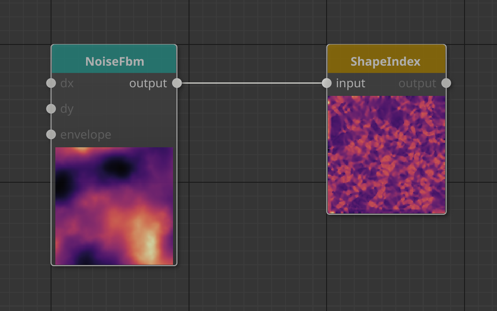
### Category

Filter/Smoothing
### Inputs

|Name|Type|Description|
| :--- | :--- | :--- |
|input|Heightmap|Input heightmap.|

### Outputs

|Name|Type|Description|
| :--- | :--- | :--- |
|output|Heightmap|Shape index.|

### Parameters

|Name|Type|Description|
| :--- | :--- | :--- |
|GPU|Bool|TODO|
|inverse|Bool|Toggle inversion of the output values.|
|radius|Float|Filter radius with respect to the domain size.|
|smoothing|Bool|Enable or disable smoothing to reduce noise in the curvature computation.|
|smoothing_radius|Float|Specifies the radius for smoothing, determining how much the curvature is averaged over neighboring pixels.|

## SharpenCone

SharpenCone is a cone kernel-based sharpen operator enhancing sharpness by emphasizing edges and fine details using a radial gradient shape.

### Category

Filter/Smoothing
### Inputs

|Name|Type|Description|
| :--- | :--- | :--- |
|input|Heightmap|Input heightmap.|
|mask|Heightmap|Mask defining the filtering intensity (expected in [0, 1]).|

### Outputs

|Name|Type|Description|
| :--- | :--- | :--- |
|output|Heightmap|Filtered heightmap.|

### Parameters

|Name|Type|Description|
| :--- | :--- | :--- |
|radius|Float|Filter radius with respect to the domain size.|
|scale|Float|Sharpening intensity.|

## ShiftElevation

The ShiftElevation operator involves adjusting each data point by adding it with a predetermined constant.

### Category

Filter/Range
### Inputs

|Name|Type|Description|
| :--- | :--- | :--- |
|input|Heightmap|Input heightmap.|

### Outputs

|Name|Type|Description|
| :--- | :--- | :--- |
|output|Heightmap|Resulting heightmap after applying the shift.|

### Parameters

|Name|Type|Description|
| :--- | :--- | :--- |
|shift|Float|Constant by which each elevation values will be added.|

## Slope

Slope is function used to represent continuous terrain slope.

### Category

Primitive/Function
### Inputs

|Name|Type|Description|
| :--- | :--- | :--- |
|control|Heightmap|Control parameter, acts as a multiplier for the weight parameter.|
|dx|Heightmap|Displacement with respect to the domain size (x-direction).|
|dy|Heightmap|Displacement with respect to the domain size (y-direction).|

### Outputs

|Name|Type|Description|
| :--- | :--- | :--- |
|output|Heightmap|Slope heightmap.|

### Parameters

|Name|Type|Description|
| :--- | :--- | :--- |
|angle|Float|Angle.|
|center|Vec2Float|Reference center within the heightmap.|
|inverse|Bool|Toggle inversion of the output values.|
|remap|Value range|Remap the operator's output to a specified range, defaulting to [0, 1].|
|talus_global|Float|Slope slope...|

## SmoothCpulse

Smoothing using a cubic pulse kernel can be considered somewhat similar to Gaussian smoothing. This technique is used to reduce noise and smooth data. The cubic pulse kernel has a cubic decrease in influence with distance within a finite interval. It is zero beyond a certain radius, providing a compact support that affects only nearby points.

### Category

Filter/Smoothing
### Inputs

|Name|Type|Description|
| :--- | :--- | :--- |
|input|Heightmap|Input heightmap.|
|mask|Heightmap|Mask defining the filtering intensity (expected in [0, 1]).|

### Outputs

|Name|Type|Description|
| :--- | :--- | :--- |
|output|Heightmap|Filtered heightmap.|

### Parameters

|Name|Type|Description|
| :--- | :--- | :--- |
|GPU|Bool|Toogle GPU acceleration on or off.|
|radius|Float|Filter radius with respect to the domain size.|

## SmoothFill

SmoothFill is a smoothing technique that takes the maximum between the input and the filtered field to simulate a sediment deposition effect.

### Category

Filter/Smoothing
### Inputs

|Name|Type|Description|
| :--- | :--- | :--- |
|input|Heightmap|Input heightmap.|
|mask|Heightmap|Mask defining the filtering intensity (expected in [0, 1]).|

### Outputs

|Name|Type|Description|
| :--- | :--- | :--- |
|deposition|Heightmap|Deposition map (in [0, 1]).|
|output|Heightmap|Filtered heightmap.|

### Parameters

|Name|Type|Description|
| :--- | :--- | :--- |
|GPU|Bool|Toogle GPU acceleration on or off.|
|k|Float|Smoothing intensity of the maximum operator.|
|normalized_map|Bool|Decides if the deposition map is normalized.|
|radius|Float|Filter radius with respect to the domain size.|

## SmoothFillHoles

SmoothFillHoles is a smoothing technique that restricts smoothing effect to convex regions.

### Category

Filter/Smoothing
### Inputs

|Name|Type|Description|
| :--- | :--- | :--- |
|input|Heightmap|Input heightmap.|
|mask|Heightmap|Mask defining the filtering intensity (expected in [0, 1]).|

### Outputs

|Name|Type|Description|
| :--- | :--- | :--- |
|output|Heightmap|Filtered heightmap.|

### Parameters

|Name|Type|Description|
| :--- | :--- | :--- |
|GPU|Bool|Toogle GPU acceleration on or off.|
|radius|Float|Filter radius with respect to the domain size.|

## SmoothFillSmearPeaks

SmoothFillSmearPeaks is a smoothing technique that restricts smoothing effect to concave regions.

### Category

Filter/Smoothing
### Inputs

|Name|Type|Description|
| :--- | :--- | :--- |
|input|Heightmap|Input heightmap.|
|mask|Heightmap|Mask defining the filtering intensity (expected in [0, 1]).|

### Outputs

|Name|Type|Description|
| :--- | :--- | :--- |
|output|Heightmap|Filtered heightmap.|

### Parameters

|Name|Type|Description|
| :--- | :--- | :--- |
|GPU|Bool|Toogle GPU acceleration on or off.|
|radius|Float|Filter radius with respect to the domain size.|

## Smoothstep

Applies a smoothstep function to the input heightmap, creating a smooth transition between values.

### Category

Math/Base
### Inputs

|Name|Type|Description|
| :--- | :--- | :--- |
|input|Heightmap|Input heightmap.|

### Outputs

|Name|Type|Description|
| :--- | :--- | :--- |
|output|Heightmap|Output heightmap with the smoothstep function applied.|

### Parameters

|Name|Type|Description|
| :--- | :--- | :--- |
|order|Choice|The order of the smoothstep function, determining the smoothness of the transition.|

## Stamping

Stamping .

### Category

Primitive/Coherent
### Inputs

|Name|Type|Description|
| :--- | :--- | :--- |
|cloud|Cloud|Stamping locations and intensities (as a Cloud).|
|kernel|Array|Kernel to be stamped.|

### Outputs

|Name|Type|Description|
| :--- | :--- | :--- |
|output|Heightmap|Output heightmap.|

### Parameters

|Name|Type|Description|
| :--- | :--- | :--- |
|blend_method|Enumeration|Blending method. Available values: add, maximum, minimum, multiply, substract.|
|inverse|Bool|Toggle inversion of the output values.|
|k_smoothing|Float|Smoothing parameter (if any).|
|kernel_flip|Bool|Randomly flip, or not, the kernel before stamping (includes tranposing).|
|kernel_radius|Float|Kernel base radius, with respect a unit square domain.|
|kernel_rotate|Bool|Randomly rotate, or not, the kernel before stamping (can be any rotation angle, can also be ressource consuming).|
|kernel_scale_amplitude|Bool|Determine whether the kernel amplitude is scaled with the point values.|
|kernel_scale_radius|Bool|Determine whether the kernel radius is scaled with the point values.|
|remap|Value range|Remap the operator's output to a specified range, defaulting to [0, 1].|
|seed|Random seed number|Random seed number.|

## SteepenConvective

TODO

### Category

Filter/Recast
### Inputs

|Name|Type|Description|
| :--- | :--- | :--- |
|input|Heightmap|TODO|
|mask|Heightmap|Mask defining the filtering intensity (expected in [0, 1]).|

### Outputs

|Name|Type|Description|
| :--- | :--- | :--- |
|output|Heightmap|TODO|

### Parameters

|Name|Type|Description|
| :--- | :--- | :--- |
|angle|Float|TODO|
|dt|Float|TODO|
|iterations|Integer|TODO|
|radius|Float|TODO|

## Step

Step is function used to represent a conceptualized escarpment, it serves as a tool for creating sharp, distinct changes in elevation.

### Category

Primitive/Function
### Inputs

|Name|Type|Description|
| :--- | :--- | :--- |
|control|Heightmap|Control parameter, acts as a multiplier for the weight parameter.|
|dx|Heightmap|Displacement with respect to the domain size (x-direction).|
|dy|Heightmap|Displacement with respect to the domain size (y-direction).|

### Outputs

|Name|Type|Description|
| :--- | :--- | :--- |
|output|Heightmap|Step heightmap.|

### Parameters

|Name|Type|Description|
| :--- | :--- | :--- |
|angle|Float|Angle.|
|center|Vec2Float|Reference center within the heightmap.|
|inverse|Bool|Toggle inversion of the output values.|
|remap|Value range|Remap the operator's output to a specified range, defaulting to [0, 1].|
|slope|Float|Step slope.|

## Stratify

Stratify adds horizontal stratifications to the input heightmap.

### Category

Erosion/Stratify
### Inputs

|Name|Type|Description|
| :--- | :--- | :--- |
|input|Heightmap|Input heightmap.|
|mask|Heightmap|Mask defining the filtering intensity (expected in [0, 1]).|
|noise|Heightmap|Local elevation noise, value range expected to be scaled with the one of the input heightmap.|

### Outputs

|Name|Type|Description|
| :--- | :--- | :--- |
|output|Heightmap|Eroded heightmap.|

### Parameters

|Name|Type|Description|
| :--- | :--- | :--- |
|gamma|Float|Reference value for the gamma correction applied to each strata, influence the cliff elevation profile.|
|gamma_noise|Float|Noise range for the gamma value.|
|n_strata|Integer|Numbner of strata.|
|seed|Random seed number|Random seed number.|
|strata_noise|Float|Noise range for the strata elevations.|

## StratifyMultiscale

TODO

### Category

Erosion/Stratify
### Inputs

|Name|Type|Description|
| :--- | :--- | :--- |
|input|Heightmap|TODO|
|mask|Heightmap|Mask defining the filtering intensity (expected in [0, 1]).|
|noise|Heightmap|TODO|

### Outputs

|Name|Type|Description|
| :--- | :--- | :--- |
|output|Heightmap|TODO|

### Parameters

|Name|Type|Description|
| :--- | :--- | :--- |
|gamma_list|Vector of floats|TODO|
|gamma_noise|Vector of floats|TODO|
|n_strata|Vector of integers|TODO|
|seed|Random seed number|TODO|
|strata_noise|Vector of floats|TODO|

## StratifyOblique

StratifyOblique adds oblique stratifications to the input heightmap.

### Category

Erosion/Stratify
### Inputs

|Name|Type|Description|
| :--- | :--- | :--- |
|input|Heightmap|Input heightmap.|
|mask|Heightmap|Mask defining the filtering intensity (expected in [0, 1]).|
|noise|Heightmap|Local elevation noise, value range expected to be scaled with the one of the input heightmap.|

### Outputs

|Name|Type|Description|
| :--- | :--- | :--- |
|output|Heightmap|Eroded heightmap.|

### Parameters

|Name|Type|Description|
| :--- | :--- | :--- |
|angle|Float|Angle in the horizontal plane.|
|gamma|Float|Reference value for the gamma correction applied to each strata, influence the cliff elevation profile.|
|gamma_noise|Float|Noise range for the gamma value.|
|n_strata|Integer|Numbner of strata.|
|seed|Random seed number|Random seed number.|
|strata_noise|Float|Noise range for the strata elevations.|
|talus_global|Float|Step slope.|

## Terrace

Applies a terracing effect to the input heightmap by quantizing elevation levels into discrete steps, optionally modulated by noise.

### Category

Filter/Recurve
### Inputs

|Name|Type|Description|
| :--- | :--- | :--- |
|input|Heightmap|The input heightmap to be transformed with terrace steps.|
|mask|Heightmap|Mask defining the filtering intensity (expected in [0, 1]).|
|noise|Heightmap|Optional noise map used to perturb the position of the terrace levels for a more natural look.|

### Outputs

|Name|Type|Description|
| :--- | :--- | :--- |
|output|Heightmap|Resulting heightmap after applying the terracing effect.|

### Parameters

|Name|Type|Description|
| :--- | :--- | :--- |
|gain|Float|Controls the amplification of the terrace steps; higher values create steeper transitions between levels.|
|mask_activate|Bool|Enables or disables the internal mask. If the node's 'mask' input is connected, this setting is bypassed and the input mask is used instead.|
|mask_gain|Float|Controls the intensity or influence of the internal mask. Bypassed if the 'mask' input is connected.|
|mask_inverse|Bool|Inverts the internal mask, applying the operator where the mask is low. Ignored if a 'mask' input is provided.|
|mask_radius|Float|Defines the smoothing radius for the internal mask. A value of 0 disables smoothing. This is bypassed if the 'mask' input is used.|
|mask_type|Choice|Specifies how the internal mask is computed: 'Elevation' uses height, 'Gradient Norm' uses slope, and 'Elevation mid-range' selects the middle portion of the height range. This parameter is ignored when a 'mask' input is connected.|
|nlevels|Integer|Number of discrete elevation steps (terraces) to apply to the input heightmap.|
|noise_ratio|Float|Ratio between deterministic and noisy placement of terrace levels; 0 uses only uniform levels, 1 uses full noise-based variation.|
|seed|Random seed number|Random seed used for generating noise when noise_ratio > 0.|

## TextureQuiltingExpand

TODO

### Category

Texture
### Inputs

|Name|Type|Description|
| :--- | :--- | :--- |
|heightmap (guide)|Heightmap|TODO|
|texture (guide)|HeightmapRGBA|TODO|
|texture A|HeightmapRGBA|TODO|
|texture B|HeightmapRGBA|TODO|
|texture C|HeightmapRGBA|TODO|
|texture D|HeightmapRGBA|TODO|

### Outputs

|Name|Type|Description|
| :--- | :--- | :--- |
|heightmap|Heightmap|TODO|
|texture|HeightmapRGBA|TODO|
|texture A out|HeightmapRGBA|TODO|
|texture B out|HeightmapRGBA|TODO|
|texture C out|HeightmapRGBA|TODO|
|texture D out|HeightmapRGBA|TODO|

### Parameters

|Name|Type|Description|
| :--- | :--- | :--- |
|expansion_ratio|Float|TODO|
|filter_width_ratio|Float|TODO|
|overlap|Float|TODO|
|patch_flip|Bool|TODO|
|patch_rotate|Bool|TODO|
|patch_transpose|Bool|TODO|
|patch_width|Float|TODO|
|seed|Random seed number|TODO|

## TextureQuiltingShuffle

TODO

### Category

Texture
### Inputs

|Name|Type|Description|
| :--- | :--- | :--- |
|heightmap (guide)|Heightmap|TODO|
|texture (guide)|HeightmapRGBA|TODO|
|texture A|HeightmapRGBA|TODO|
|texture B|HeightmapRGBA|TODO|
|texture C|HeightmapRGBA|TODO|
|texture D|HeightmapRGBA|TODO|

### Outputs

|Name|Type|Description|
| :--- | :--- | :--- |
|heightmap|Heightmap|TODO|
|texture|HeightmapRGBA|TODO|
|texture A out|HeightmapRGBA|TODO|
|texture B out|HeightmapRGBA|TODO|
|texture C out|HeightmapRGBA|TODO|
|texture D out|HeightmapRGBA|TODO|

### Parameters

|Name|Type|Description|
| :--- | :--- | :--- |
|filter_width_ratio|Float|TODO|
|overlap|Float|TODO|
|patch_flip|Bool|TODO|
|patch_rotate|Bool|TODO|
|patch_transpose|Bool|TODO|
|patch_width|Float|TODO|
|seed|Random seed number|TODO|

## TextureUvChecker

TODO

### Category

Texture
### Outputs

|Name|Type|Description|
| :--- | :--- | :--- |
|texture|HeightmapRGBA|TODO|

### Parameters

|Name|Type|Description|
| :--- | :--- | :--- |
|size|Choice|TODO|

## Thermal

Thermal is an erosion operator used to simulate the process of thermal erosion, which is a type of erosion that occurs due to temperature fluctuations causing the breakdown and movement of soil and rock materials.

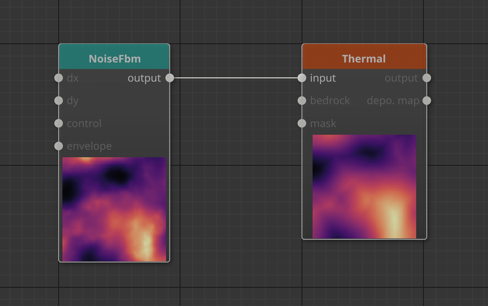
### Category

Erosion/Thermal
### Inputs

|Name|Type|Description|
| :--- | :--- | :--- |
|input|Heightmap|Input heightmap.|
|mask|Heightmap|Mask defining the filtering intensity (expected in [0, 1]).|

### Outputs

|Name|Type|Description|
| :--- | :--- | :--- |
|deposition|Heightmap|Deposition map (in [0, 1]).|
|output|Heightmap|Eroded heightmap.|

### Parameters

|Name|Type|Description|
| :--- | :--- | :--- |
|GPU|Bool|Toogle GPU acceleration on or off.|
|iterations|Integer|Number of iterations.|
|scale_talus_with_elevation|Bool|Scales the talus amplitude based on heightmap elevation, reducing it at lower elevations and maintaining the nominal value at higher elevations.|
|talus_global|Float|Repose slope.|

## ThermalAutoBedrock

TODO

### Category

Erosion/Thermal
### Inputs

|Name|Type|Description|
| :--- | :--- | :--- |
|input|Heightmap|TODO|
|mask|Heightmap|Mask defining the filtering intensity (expected in [0, 1]).|

### Outputs

|Name|Type|Description|
| :--- | :--- | :--- |
|deposition|Heightmap|Deposition map (in [0, 1]).|
|output|Heightmap|TODO|

### Parameters

|Name|Type|Description|
| :--- | :--- | :--- |
|GPU|Bool|Toogle GPU acceleration on or off.|
|iterations|Integer|TODO|
|scale_talus_with_elevation|Bool|Scales the talus amplitude based on heightmap elevation, reducing it at lower elevations and maintaining the nominal value at higher elevations.|
|talus_global|Float|TODO|

## ThermalFlatten

TODO

### Category

WIP
### Inputs

|Name|Type|Description|
| :--- | :--- | :--- |
|input|Heightmap|TODO|

### Outputs

|Name|Type|Description|
| :--- | :--- | :--- |
|output|Heightmap|TODO|

### Parameters

|Name|Type|Description|
| :--- | :--- | :--- |
|iterations|Integer|TODO|
|post_filter_radius|Float|TODO|
|scale_talus_with_elevation|Bool|Scales the talus amplitude based on heightmap elevation, reducing it at lower elevations and maintaining the nominal value at higher elevations.|
|talus_global|Float|TODO|

## ThermalInflate

TODO

### Category

Erosion/Thermal
### Inputs

|Name|Type|Description|
| :--- | :--- | :--- |
|input|Heightmap|TODO|
|mask|Heightmap|Mask defining the filtering intensity (expected in [0, 1]).|

### Outputs

|Name|Type|Description|
| :--- | :--- | :--- |
|output|Heightmap|TODO|

### Parameters

|Name|Type|Description|
| :--- | :--- | :--- |
|iterations|Integer|TODO|
|scale_talus_with_elevation|Bool|Scales the talus amplitude based on heightmap elevation, reducing it at lower elevations and maintaining the nominal value at higher elevations.|
|talus_global|Float|TODO|

## ThermalRib

ThermalRib performs thermal erosion using a 'rib' algorithm (taken from Geomorph)

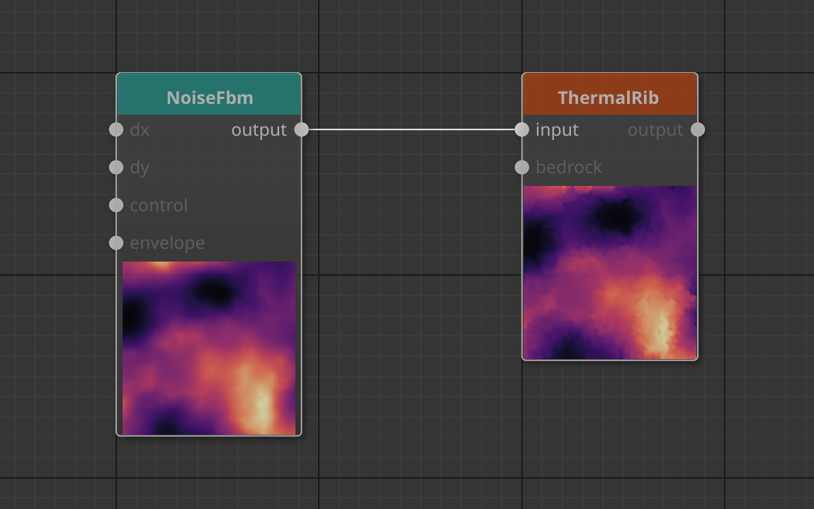
### Category

WIP
### Inputs

|Name|Type|Description|
| :--- | :--- | :--- |
|bedrock|Heightmap|Bedrock elevation, erosion process cannot carve the heightmap further down this point.|
|input|Heightmap|Input heightmap.|

### Outputs

|Name|Type|Description|
| :--- | :--- | :--- |
|output|Heightmap|Eroded heightmap.|

### Parameters

|Name|Type|Description|
| :--- | :--- | :--- |
|iterations|Integer|Number of iterations.|

## ThermalRidge

Applies a thermal erosion effect that simulates the collapse of unstable slopes by moving material from steep areas to lower regions, generating ridged features.

### Category

Erosion/Thermal
### Inputs

|Name|Type|Description|
| :--- | :--- | :--- |
|input|Heightmap|The input heightmap to which thermal erosion will be applied.|
|mask|Heightmap|Mask defining the filtering intensity (expected in [0, 1]).|

### Outputs

|Name|Type|Description|
| :--- | :--- | :--- |
|deposition|Heightmap|Heightmap showing the amount of material deposited during erosion, scaled in the range [0, 1].|
|output|Heightmap|The resulting heightmap after thermal ridge erosion has been applied.|

### Parameters

|Name|Type|Description|
| :--- | :--- | :--- |
|iterations|Integer|Number of thermal erosion iterations to apply. More iterations result in more pronounced erosion and smoothing of steep slopes.|
|remap|Value range|Remap the operator's output to a specified range, defaulting to [0, 1].|
|scale_talus_with_elevation|Bool|Scales the talus threshold based on elevation, reducing it at lower heights and preserving it at higher altitudes, to simulate realistic slope behavior.|
|talus_global|Float|Global talus angle threshold controlling the maximum slope before material starts to move. Higher values result in steeper terrain preservation.|

## ThermalSchott

TODO

### Category

WIP
### Inputs

|Name|Type|Description|
| :--- | :--- | :--- |
|input|Heightmap|TODO|
|mask|Heightmap|Mask defining the filtering intensity (expected in [0, 1]).|

### Outputs

|Name|Type|Description|
| :--- | :--- | :--- |
|output|Heightmap|TODO|

### Parameters

|Name|Type|Description|
| :--- | :--- | :--- |
|iterations|Integer|TODO|
|scale_talus_with_elevation|Bool|Scales the talus amplitude based on heightmap elevation, reducing it at lower elevations and maintaining the nominal value at higher elevations.|
|talus_global|Float|TODO|

## ThermalScree

TODO

### Category

Erosion/Thermal
### Inputs

|Name|Type|Description|
| :--- | :--- | :--- |
|input|Heightmap|TODO|
|mask|Heightmap|Mask defining the filtering intensity (expected in [0, 1]).|
|zmax|Heightmap|TODO|

### Outputs

|Name|Type|Description|
| :--- | :--- | :--- |
|deposition|Heightmap|Deposition map (in [0, 1]).|
|output|Heightmap|TODO|

### Parameters

|Name|Type|Description|
| :--- | :--- | :--- |
|iterations|Integer|TODO|
|scale_talus_with_elevation|Bool|Scales the talus amplitude based on heightmap elevation, reducing it at lower elevations and maintaining the nominal value at higher elevations.|
|talus_constraint|Bool|TODO|
|talus_global|Float|TODO|
|zmax|Float|TODO|

## Thru

Passes the input heightmap directly to the output without modification.

### Category

Routing
### Inputs

|Name|Type|Description|
| :--- | :--- | :--- |
|input|Heightmap|Input heightmap to be routed unchanged.|

### Outputs

|Name|Type|Description|
| :--- | :--- | :--- |
|output|Heightmap|Output identical to the input heightmap.|

## Translate

Translates an heightmap by a specified amount along the x and y axes. This function shifts the contents of the input array by `dx` and `dy` units along the x and y axes, respectively. It supports both periodic boundary conditions, where the array wraps around, and non-periodic conditions.

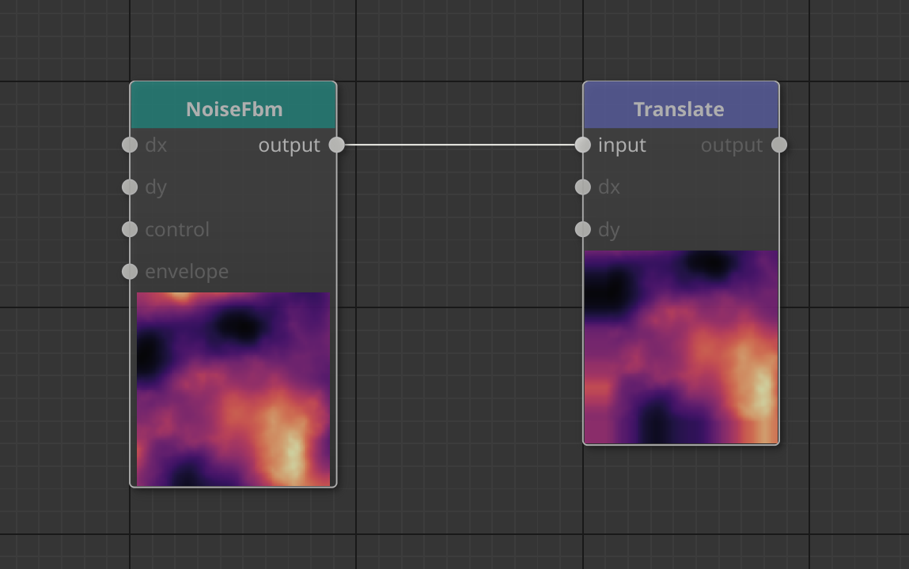
### Category

Operator/Transform
### Inputs

|Name|Type|Description|
| :--- | :--- | :--- |
|dx|Heightmap|Displacement with respect to the domain size (y-direction).|
|dy|Heightmap|Control parameter, acts as a multiplier for the weight parameter.|
|input|Heightmap|Displacement with respect to the domain size (x-direction).|

### Outputs

|Name|Type|Description|
| :--- | :--- | :--- |
|output|Heightmap|Translate heightmap.|

### Parameters

|Name|Type|Description|
| :--- | :--- | :--- |
|dx|Float|The translation distance along the x-axis. Positive values shift the array to the right.|
|dy|Float|The translation distance along the y-axis. Positive values shift the array downward.|
|periodic|Bool|If set to `true`, the translation is periodic, meaning that elements that move out of one side of the array reappear on the opposite side.|

## Unsphericity

Unsphericity is a measure used to quantify the deviation of the heightmap shape from a perfect sphere. In other words, it indicates how much the terrain differs from being perfectly round or spherical.

### Category

Features/Landform
### Inputs

|Name|Type|Description|
| :--- | :--- | :--- |
|input|Heightmap|Input heightmap.|

### Outputs

|Name|Type|Description|
| :--- | :--- | :--- |
|output|Heightmap|Shape index.|

### Parameters

|Name|Type|Description|
| :--- | :--- | :--- |
|GPU|Bool|Toogle GPU acceleration on or off.|
|inverse|Bool|Toggle inversion of the output values.|
|radius|Float|Filter radius with respect to the domain size.|
|remap|Bool|Remap the operator's output to a specified range, defaulting to [0, 1].|
|smoothing|Bool|Enable or disable smoothing to reduce noise in the curvature computation.|
|smoothing_radius|Float|Specifies the radius for smoothing, determining how much the curvature is averaged over neighboring pixels.|

## ValleyWidth

ValleyWidth identifies valley lines and measure the width of the valley at each cross-section.

### Category

Features/Landform
### Inputs

|Name|Type|Description|
| :--- | :--- | :--- |
|input|Heightmap|Input heightmap.|

### Outputs

|Name|Type|Description|
| :--- | :--- | :--- |
|output|Heightmap|Valley width heightmap.|

### Parameters

|Name|Type|Description|
| :--- | :--- | :--- |
|radius|Float|Filter radius with respect to the domain size.|
|remap|Value range|Remap the operator's output to a specified range, defaulting to [0, 1].|
|ridge_select|Bool|If enabled, selects ridges instead of valleys.|

## Voronoi

Generates a Voronoi heightmap based on spatial cell distances, with optional jitter, warping, and control inputs.

### Category

Primitive/Coherent
### Inputs

|Name|Type|Description|
| :--- | :--- | :--- |
|control|Heightmap|Optional input to guide Voronoi jittering.|
|dx|Heightmap|X-axis displacement map for directional warping of the Voronoi pattern.|
|dy|Heightmap|Y-axis displacement map for directional warping of the Voronoi pattern.|
|envelope|Heightmap|Heightmap used to modulate the visibility or strength of the Voronoi pattern.|

### Outputs

|Name|Type|Description|
| :--- | :--- | :--- |
|out|Heightmap|Resulting heightmap generated by the Voronoi algorithm.|

### Parameters

|Name|Type|Description|
| :--- | :--- | :--- |
|inverse|Bool|Toggle inversion of the output values.|
|jitter.x|Float|Amount of random jitter along the X-axis applied to Voronoi seed positions.|
|jitter.y|Float|Amount of random jitter along the Y-axis applied to Voronoi seed positions.|
|k_smoothing|Float|No description|
|kw|Wavenumber|Wavenumber controlling the spatial frequency (cell size) of the Voronoi pattern.|
|remap|Value range|Remaps the output values to a specified target range.|
|return_type|Enumeration|Determines the output type.|
|seed|Random seed number|Seed value for the random generator affecting jitter and cell layout.|
|sqrt_output|Bool|No description|

## VoronoiFbm

Generates a fractal Voronoi pattern using fBm (fractal Brownian motion) based on distance fields and multiple noise layers.

### Category

Primitive/Coherent
### Inputs

|Name|Type|Description|
| :--- | :--- | :--- |
|control|Heightmap|Optional input to guide Voronoi jittering.|
|dx|Heightmap|Displacement map along X-axis to warp the input coordinates.|
|dy|Heightmap|Displacement map along Y-axis to warp the input coordinates.|
|envelope|Heightmap|Optional modulation map to attenuate or mask the fBm pattern locally.|

### Outputs

|Name|Type|Description|
| :--- | :--- | :--- |
|output|Heightmap|Final heightmap result generated by the fBm Voronoi algorithm.|

### Parameters

|Name|Type|Description|
| :--- | :--- | :--- |
|inverse|Bool|Toggle inversion of the output values.|
|jitter.x|Float|Amount of random jitter applied to seed points along the X-axis.|
|jitter.y|Float|Amount of random jitter applied to seed points along the Y-axis.|
|k_smoothing|Float|No description|
|kw|Wavenumber|Base wavenumber that controls the frequency of the initial Voronoi pattern.|
|lacunarity|Float|Frequency multiplier between successive octaves in the fBm process.|
|octaves|Integer|Number of fBm layers to combine for added detail and complexity.|
|persistence|Float|Amplitude scaling factor applied to each successive octave.|
|remap|Value range|Remaps the output values to a defined value range.|
|return_type|Enumeration|Defines the type of Voronoi information returned.|
|seed|Random seed number|Seed for random generation, affecting jitter and point distribution.|
|sqrt_output|Bool|No description|
|weight|Float|Weight multiplier applied to the final fBm result for scaling the output.|

## Voronoise

TODO

### Category

Primitive/Coherent
### Inputs

|Name|Type|Description|
| :--- | :--- | :--- |
|dx|Heightmap|TODO|
|dy|Heightmap|TODO|
|envelope|Heightmap|Output noise amplitude envelope.|

### Outputs

|Name|Type|Description|
| :--- | :--- | :--- |
|output|Heightmap|TODO|

### Parameters

|Name|Type|Description|
| :--- | :--- | :--- |
|inverse|Bool|Toggle inversion of the output values.|
|kw|Wavenumber|TODO|
|remap|Value range|Remap the operator's output to a specified range, defaulting to [0, 1].|
|seed|Random seed number|TODO|
|u|Float|TODO|
|v|Float|TODO|

## Warp

The Warp node transforms a base heightmap by warping/pushing pixels as defined by the input displacements.

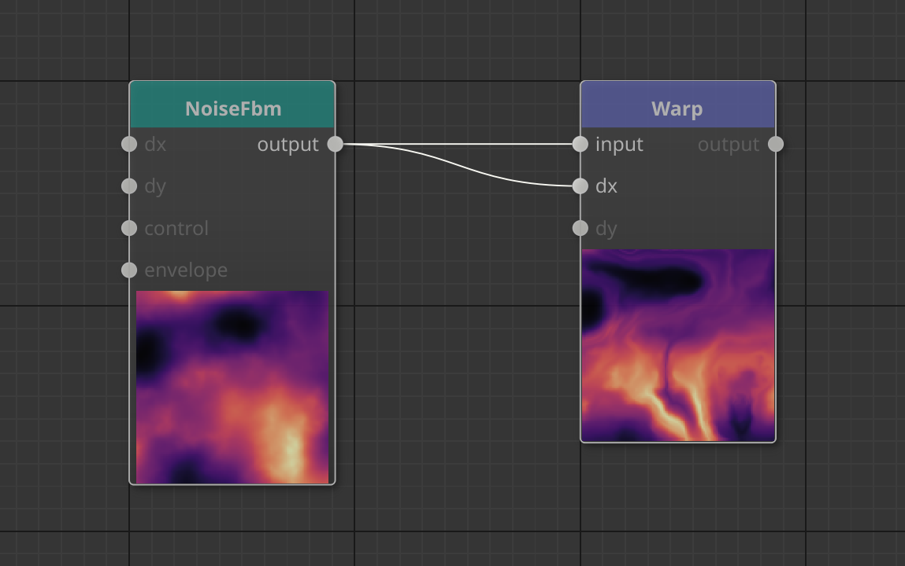
### Category

Operator/Transform
### Inputs

|Name|Type|Description|
| :--- | :--- | :--- |
|dx|Heightmap|Displacement with respect to the domain size (x-direction).|
|dy|Heightmap|Displacement with respect to the domain size (y-direction).|
|input|Heightmap|Input heightmap.|

### Outputs

|Name|Type|Description|
| :--- | :--- | :--- |
|output|Heightmap|Warped heightmap.|

### Parameters

|Name|Type|Description|
| :--- | :--- | :--- |
|GPU|Bool|Toogle GPU acceleration on or off.|

## WarpDownslope

Warp the heightmap with a direction and amount based on the local downslope.

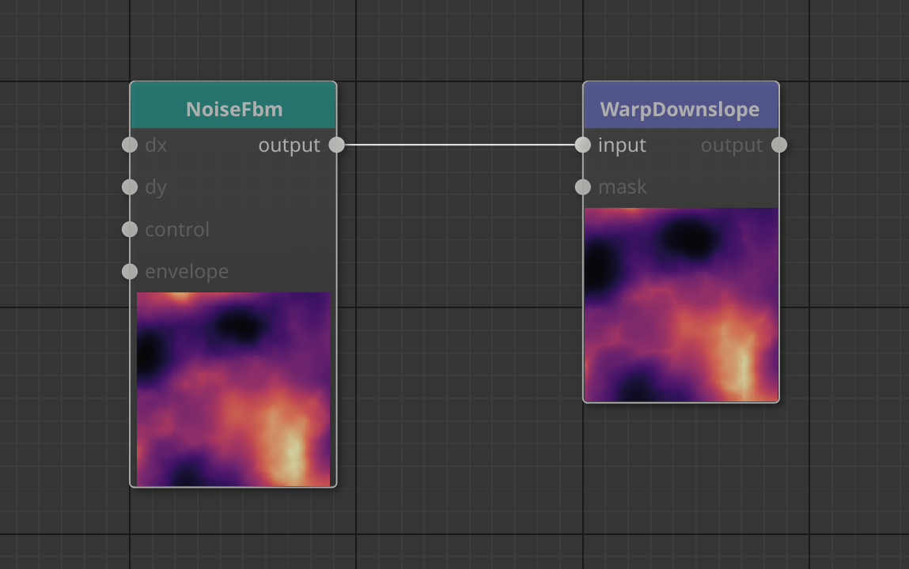
### Category

WIP
### Inputs

|Name|Type|Description|
| :--- | :--- | :--- |
|input|Heightmap|Input heightmap.|
|mask|Heightmap|Mask defining the filtering intensity (expected in [0, 1]).|

### Outputs

|Name|Type|Description|
| :--- | :--- | :--- |
|output|Heightmap|Filtered heightmap.|

### Parameters

|Name|Type|Description|
| :--- | :--- | :--- |
|amount|Float|Warp scaling with respect to the gradient.|
|radius|Float|Prefiltering radius for gradient computation.|
|reverse|Bool|Reverse warping direction (upslope if true and downslope otherwise).|

## WaveDune

WaveDune mimics using a periodic function the formation and spatial distribution of transverse sand dunes on a terrain.

### Category

Primitive/Function
### Inputs

|Name|Type|Description|
| :--- | :--- | :--- |
|dr|Heightmap|Displacement with respect to the domain size (normal direction).|

### Outputs

|Name|Type|Description|
| :--- | :--- | :--- |
|output|Heightmap|WaveDune heightmap.|

### Parameters

|Name|Type|Description|
| :--- | :--- | :--- |
|angle|Float|Angle in the horizontal plane.|
|inverse|Bool|Toggle inversion of the output values.|
|kw|Float|Noise wavenumbers (kx, ky) for each directions.|
|phase_shift|Float|Phase shift.|
|remap|Value range|Remap the operator's output to a specified range, defaulting to [0, 1].|
|xbottom|Float|Relative position of the dune bottom, in [0, 1].|
|xtop|Float|Relative position of the dune top, in [0, 1].|

## WaveSine

WaveSine generates sine waves.

### Category

Primitive/Function
### Inputs

|Name|Type|Description|
| :--- | :--- | :--- |
|dr|Heightmap|Displacement with respect to the domain size (normal direction).|

### Outputs

|Name|Type|Description|
| :--- | :--- | :--- |
|output|Heightmap|WaveSine heightmap.|

### Parameters

|Name|Type|Description|
| :--- | :--- | :--- |
|angle|Float|Angle in the horizontal plane.|
|inverse|Bool|Toggle inversion of the output values.|
|kw|Float|Noise wavenumbers (kx, ky) for each directions.|
|phase_shift|Float|Phase shift.|
|remap|Value range|Remap the operator's output to a specified range, defaulting to [0, 1].|

## WaveSquare

WaveSquare generates square waves.

### Category

Primitive/Function
### Inputs

|Name|Type|Description|
| :--- | :--- | :--- |
|dr|Heightmap|Displacement with respect to the domain size (normal direction).|

### Outputs

|Name|Type|Description|
| :--- | :--- | :--- |
|output|Heightmap|WaveSquare heightmap.|

### Parameters

|Name|Type|Description|
| :--- | :--- | :--- |
|angle|Float|Angle in the horizontal plane.|
|inverse|Bool|Toggle inversion of the output values.|
|kw|Float|Noise wavenumbers (kx, ky) for each directions.|
|phase_shift|Float|Phase shift.|
|remap|Value range|Remap the operator's output to a specified range, defaulting to [0, 1].|

## WaveTriangular

WaveTriangular generates triangular waves.

### Category

Primitive/Function
### Inputs

|Name|Type|Description|
| :--- | :--- | :--- |
|dr|Heightmap|Displacement with respect to the domain size (normal direction).|

### Outputs

|Name|Type|Description|
| :--- | :--- | :--- |
|output|Heightmap|WaveTriangular heightmap.|

### Parameters

|Name|Type|Description|
| :--- | :--- | :--- |
|angle|Float|Angle in the horizontal plane.|
|inverse|Bool|Toggle inversion of the output values.|
|kw|Float|Noise wavenumbers (kx, ky) for each directions.|
|phase_shift|Float|Phase shift.|
|remap|Value range|Remap the operator's output to a specified range, defaulting to [0, 1].|
|slant_ratio|Float|Decides on wave asymmetry, expected in [0, 1].|

## White

White noise operator generates a random signal with a flat power spectral density.

### Category

Primitive/Random
### Inputs

|Name|Type|Description|
| :--- | :--- | :--- |
|envelope|Heightmap|Output noise amplitude envelope.|

### Outputs

|Name|Type|Description|
| :--- | :--- | :--- |
|output|Heightmap|Generated noise.|

### Parameters

|Name|Type|Description|
| :--- | :--- | :--- |
|inverse|Bool|Toggle inversion of the output values.|
|remap|Value range|Remap the operator's output to a specified range, defaulting to [0, 1].|
|seed|Random seed number|Random seed number.|

## WhiteDensityMap

WhiteDensityMap noise operator generates a random signal with a flat power and a spatial density defined by an input heightmap.

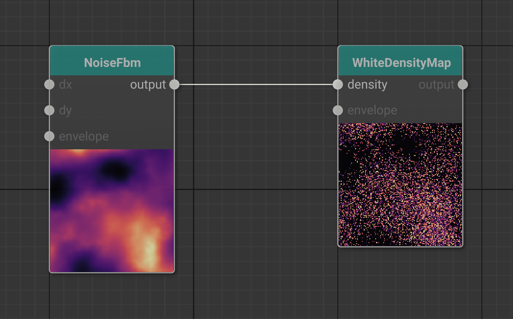
### Category

Primitive/Random
### Inputs

|Name|Type|Description|
| :--- | :--- | :--- |
|density|Heightmap|Output noise amplitude envelope.|
|envelope|Heightmap|Output noise amplitude envelope.|

### Outputs

|Name|Type|Description|
| :--- | :--- | :--- |
|output|Heightmap|Generated noise.|

### Parameters

|Name|Type|Description|
| :--- | :--- | :--- |
|inverse|Bool|Toggle inversion of the output values.|
|remap|Value range|Remap the operator's output to a specified range, defaulting to [0, 1].|
|seed|Random seed number|Random seed number.|

## WhiteSparse

WhiteSparse noise operator generates a random signal with a flat power spectral density, but with a sparse spatial density.

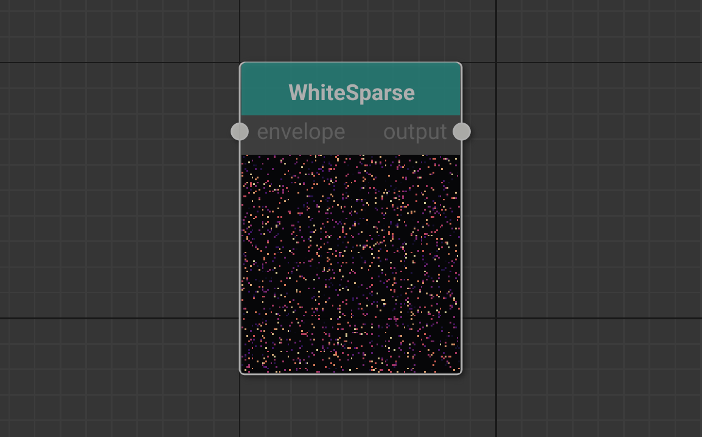
### Category

Primitive/Random
### Inputs

|Name|Type|Description|
| :--- | :--- | :--- |
|envelope|Heightmap|Output noise amplitude envelope.|

### Outputs

|Name|Type|Description|
| :--- | :--- | :--- |
|output|Heightmap|Generated noise.|

### Parameters

|Name|Type|Description|
| :--- | :--- | :--- |
|density|Float|Noise density.|
|inverse|Bool|Toggle inversion of the output values.|
|remap|Value range|Remap the operator's output to a specified range, defaulting to [0, 1].|
|seed|Random seed number|Random seed number.|

## Wrinkle

TODO

### Category

WIP
### Inputs

|Name|Type|Description|
| :--- | :--- | :--- |
|input|Heightmap|TODO|
|mask|Heightmap|Mask defining the filtering intensity (expected in [0, 1]).|

### Outputs

|Name|Type|Description|
| :--- | :--- | :--- |
|output|Heightmap|TODO|

### Parameters

|Name|Type|Description|
| :--- | :--- | :--- |
|displacement_amplitude|Float|TODO|
|kw|Float|TODO|
|octaves|Integer|TODO|
|radius|Float|TODO|
|seed|Random seed number|TODO|
|weight|Float|TODO|
|wrinkle_amplitude|Float|TODO|
|wrinkle_angle|Float|TODO|

## ZeroedEdges

An operator that enforces values close to zero at the domain edges.

### Category

Math/Boundaries
### Inputs

|Name|Type|Description|
| :--- | :--- | :--- |
|dr|Heightmap|Displacement relative to the domain size (radial direction).|
|input|Heightmap|The input heightmap.|

### Outputs

|Name|Type|Description|
| :--- | :--- | :--- |
|output|Heightmap|The filtered heightmap result.|

### Parameters

|Name|Type|Description|
| :--- | :--- | :--- |
|distance_function|Enumeration|Determines the method used for distance calculation. Options: Chebyshev, Euclidean, Euclidean/Chebyshev, Manhattan.|
|remap|Value range|Specifies the output range for the operator. Defaults to [0, 1].|
|sigma|Float|Controls the shape power law.|

## Zoom

Applies a zoom effect to an heightmap with an adjustable center. This function scales the input 2D array by a specified zoom factor, effectively resizing the array's contents. The zoom operation is centered around a specified point within the array, allowing for flexible zooming behavior.

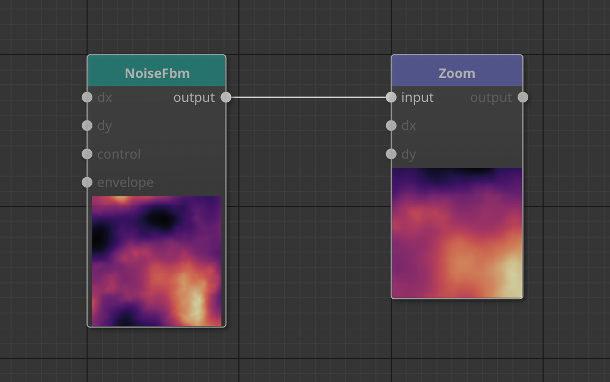
### Category

Operator/Transform
### Inputs

|Name|Type|Description|
| :--- | :--- | :--- |
|dx|Heightmap|Displacement with respect to the domain size (y-direction).|
|dy|Heightmap|Control parameter, acts as a multiplier for the weight parameter.|
|input|Heightmap|Displacement with respect to the domain size (x-direction).|

### Outputs

|Name|Type|Description|
| :--- | :--- | :--- |
|output|Heightmap|Zoom heightmap.|

### Parameters

|Name|Type|Description|
| :--- | :--- | :--- |
|center|Vec2Float|Reference center within the heightmap.|
|periodic|Bool|If set to `true`, the zoom is periodic.|
|remap|Bool|Remap the operator's output to a specified range, defaulting to [0, 1].|
|zoom_factor|Float|The factor by which to zoom the heightmap.|
