Node Reference
==============

# Some kind of introduction

# Nodes

## Abs

Apply an absolute function to every values.

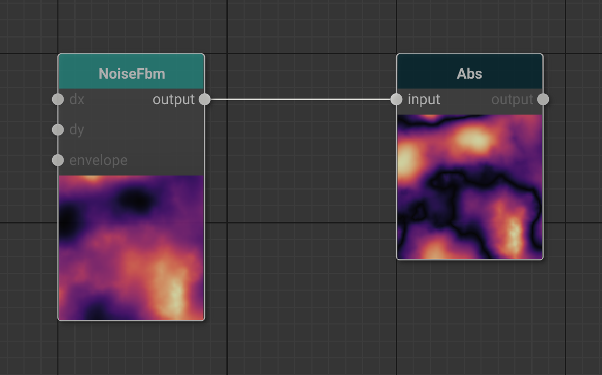  

### Category

Math/Base  

### Inputs

|Name|Type|Description|
| :--- | :--- | :--- |
|input|HeightMapData|Input heightmap.|
  

### Outputs

|Name|Type|Description|
| :--- | :--- | :--- |
|output|HeightMapData|Output heightmap.|
  

### Parameters

|Name|Type|Description|
| :--- | :--- | :--- |
|vshift|Float|Reference value for the zero-equivalent value of the absolute value.|

## AbsSmooth

Apply a smooth absolute value function to every values. The smooth absolute operator computes the absolute value of an input while providing a smooth transition around zero, ensuring continuity and smoothness in the output.

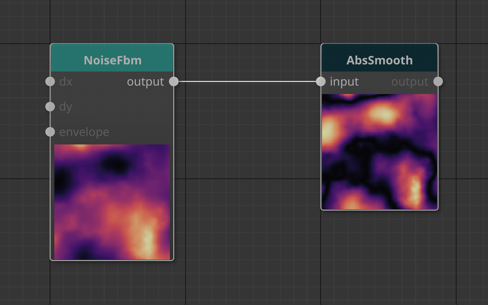  

### Category

Math/Base  

### Inputs

|Name|Type|Description|
| :--- | :--- | :--- |
|input|HeightMapData|Input heightmap.|
  

### Outputs

|Name|Type|Description|
| :--- | :--- | :--- |
|output|HeightMapData|Output heightmap.|
  

### Parameters

|Name|Type|Description|
| :--- | :--- | :--- |
|mu|Float|Smoothing intensity.|
|vshift|Float|Reference value for the zero-equivalent value of the absolute value.|

## Blend

The Blend operator takes two input heightmaps.

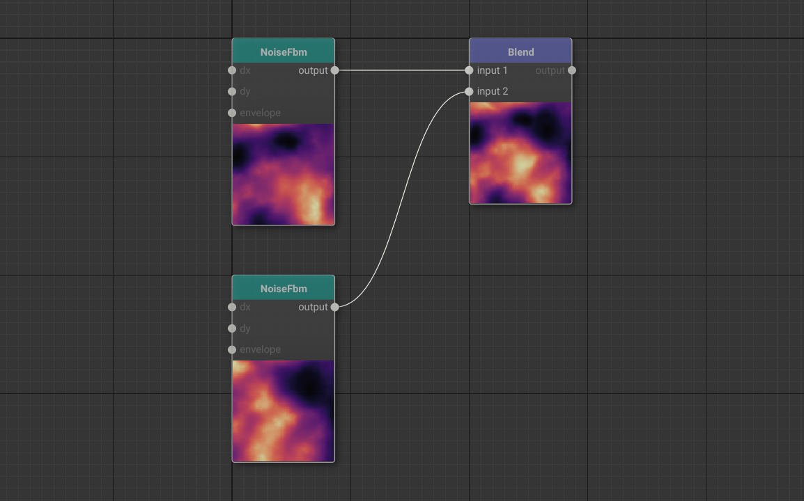  

### Category

Operator/Blend  

### Inputs

|Name|Type|Description|
| :--- | :--- | :--- |
|input 1|HeightMapData|Input heightmap.|
|input 2|HeightMapData|Input heightmap.|
  

### Outputs

|Name|Type|Description|
| :--- | :--- | :--- |
|output|HeightMapData|Output heightmap.|
  

### Parameters

|Name|Type|Description|
| :--- | :--- | :--- |
|blending_method|Enumeration|Blending method. Available values: add, exclusion, gradients, maximum, maximum_smooth, minimum, minimum_smooth, multiply, multiply_add, negate, overlay, soft, substract.|
|k|Float|Smoothing intensity (if any).|
|radius|Float|Filter radius with respect to the domain size (if any).|

## Bump

Bump generates a smooth transitions between zero-valued boundaries and the center of the domain.

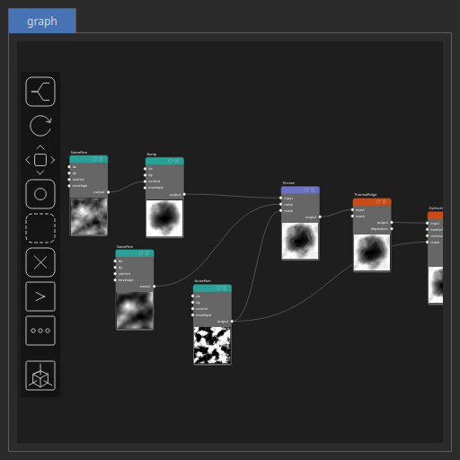  

### Category

Primitive/Function  

### Inputs

|Name|Type|Description|
| :--- | :--- | :--- |
|dx|HeightMapData|Displacement with respect to the domain size (x-direction).|
|dy|HeightMapData|Displacement with respect to the domain size (y-direction).|
  

### Outputs

|Name|Type|Description|
| :--- | :--- | :--- |
|output|HeightMapData|Bump heightmap.|
  

### Parameters

|Name|Type|Description|
| :--- | :--- | :--- |
|gain|Float|Shape control parameter.|

## Clamp

Clamp restrict a value within a specified range. Essentially, it ensures that a value does not exceed a defined upper limit or fall below a defined lower limit.

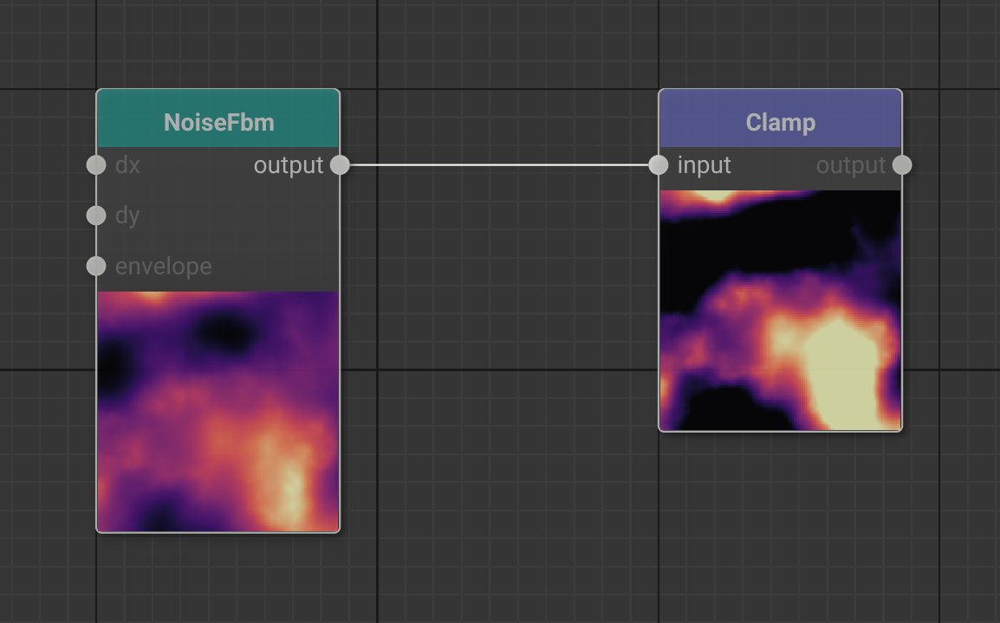  

### Category

Filter/Range  

### Inputs

|Name|Type|Description|
| :--- | :--- | :--- |
|input|HeightMapData|Input heightmap.|
  

### Outputs

|Name|Type|Description|
| :--- | :--- | :--- |
|output|HeightMapData|Clamped heightmap.|
  

### Parameters

|Name|Type|Description|
| :--- | :--- | :--- |
|clamp|Value range|Clamping range.|
|k_max|Float|Upper bound smoothing intensity.|
|k_min|Float|Lower bound smoothing intensity.|
|smooth_max|Bool|Activate smooth clamping for the upper bound.|
|smooth_min|Bool|Activate smooth clamping for the lower bound.|

## Closing

Closing is a combination of dilation followed by erosion. It is primarily used for closing small holes or gaps in objects. Use Cases: Hole filling: Closing can fill small holes or gaps in objects, making them more solid and complete. Connecting broken objects: Closing can help connect broken segments or regions in an image, making objects more continuous.

  

### Category

Operator/Morphology  

### Inputs

|Name|Type|Description|
| :--- | :--- | :--- |
|input|HeightMapData|Input heightmap.|
  

### Outputs

|Name|Type|Description|
| :--- | :--- | :--- |
|output|HeightMapData|Dilated heightmap.|
  

### Parameters

|Name|Type|Description|
| :--- | :--- | :--- |
|radius|Float|Filter radius with respect to the domain size.|

## Cloud

Set of points.

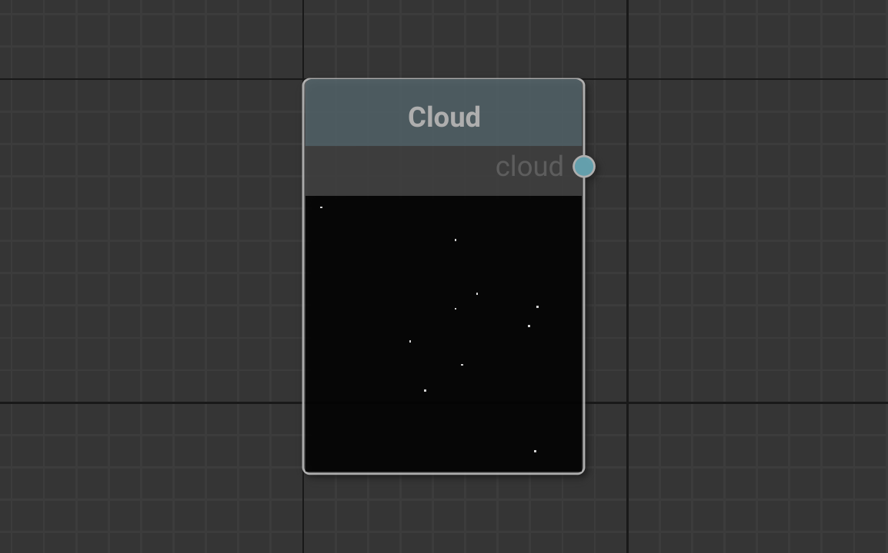  

### Category

Geometry/Cloud  

### Inputs

|Name|Type|Description|
| :--- | :--- | :--- |
  

### Outputs

|Name|Type|Description|
| :--- | :--- | :--- |
|cloud|CloudData|Set of points (x, y) and elevations z.|
  

### Parameters

|Name|Type|Description|
| :--- | :--- | :--- |
|cloud|HighMap Cloud Object|Cloud data.|

## CloudToArrayInterp

CloudToArrayInterp generates a smooth and continuous 2D elevation map from a set of scattered points using Delaunay linear interpolation.

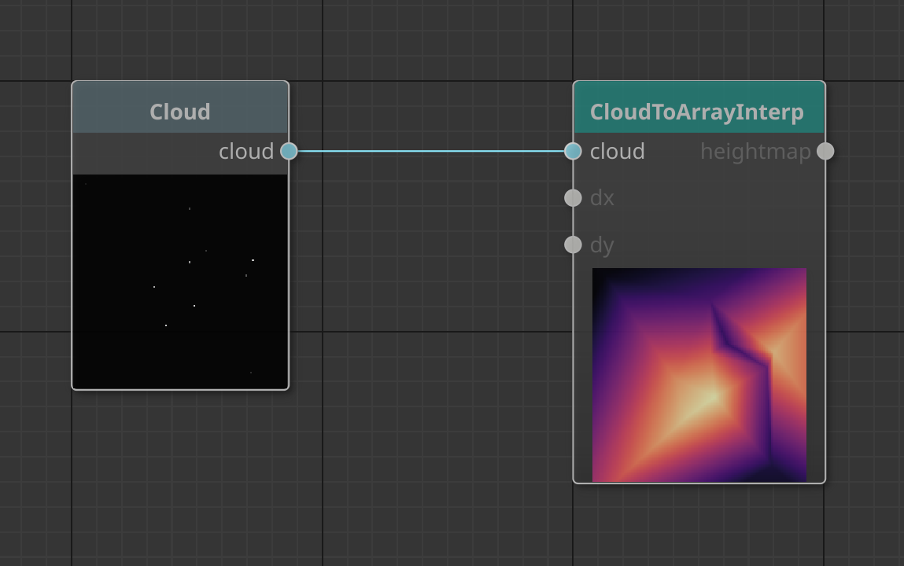  

### Category

Primitive/Authoring  

### Inputs

|Name|Type|Description|
| :--- | :--- | :--- |
|cloud|CloudData|Set of points (x, y) and elevations z.|
|dx|HeightMapData|Displacement with respect to the domain size (x-direction).|
|dy|HeightMapData|Displacement with respect to the domain size (y-direction).|
  

### Outputs

|Name|Type|Description|
| :--- | :--- | :--- |
|heightmap|HeightMapData|Interpolated heightmap.|
  

### Parameters

|Name|Type|Description|
| :--- | :--- | :--- |

## ColorizeCmap

ColorizeCmap generates a texture based on colormaps to assign colors to data values.

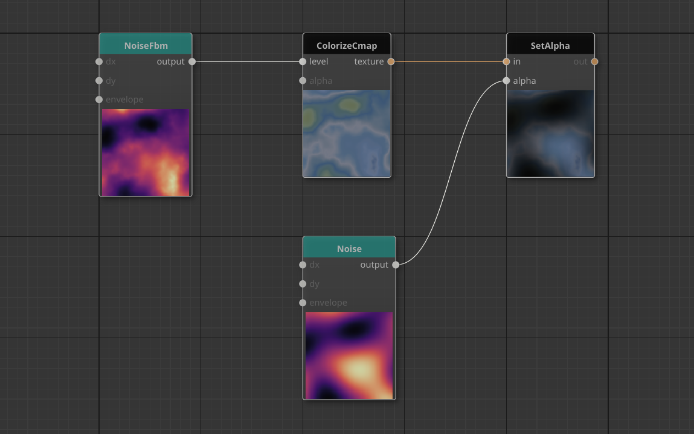  

### Category

Texture  

### Inputs

|Name|Type|Description|
| :--- | :--- | :--- |
|level|HeightMapData|Data values for color selection.|
|alpha|HeightMapData|Texture alpha map.|
  

### Outputs

|Name|Type|Description|
| :--- | :--- | :--- |
|texture|HeightMapRGBAData|Texture (RGBA).|
  

### Parameters

|Name|Type|Description|
| :--- | :--- | :--- |
|clamp_alpha|Bool|Clamp to [0, 1] to input alpha map.|
|colormap|Enumeration|Color mapping selection. Available values: adrceist, aneprosi, angghore, anilyftp, anthatly, ascaired, aselllfa, aveflili, blesiblh, blywixps, boustous, byapsahi, bychpmem, cecelldf, ceitwope, cesintho, coffrrea, ctthaton, dffygutu, dfvieryo, drctheet, drfftiee, dwinthed, eafbissf, eporepop, ewntherb, feredwnt, fffadeng, ffwatsan, fleoreha, fromsesh, ftapewon, gsercrts, haviarof, hendesth, imongsir, indthsad, inosulul, intoshee, iresetyl, isungror, itteloud, ivericed, lereitth, majucent, mburmats, mearesit, meppremb, mofhewon, nalymeve, noasbian, ofasnfoi, ofoffrmp, oleonowh, onaaloni, ontomayw, outtsthe, owwheplu, pechrede, pellaine, piventon, plfgsthi, rbonblnc, rredtthe, sarermat, seclytme, sfreante, sheshesa, sinabuse, sindwirt, snotheca, ssemeool, suttlseb, taldidov, teasitis, teieebit, tharetwe, thengici, therinon, thesihas, thisathe, thoeftsw, tiamatsp, tinusprr, tiomithe, tnymeewh, tonndind, trererat, ttyaveft, tyfotinm, ucerecen, ucererds, upeesith, usoerlea, veranghh, verdeisu, wadsuthe, wbegweic, whetitat, whhorefr, wminamin, wsatavin, yierahon.|
|reverse_alpha|Bool|Reverse the input alpha map.|
|reverse_colormap|Bool|Reverse the colormap range.|

## ColorizeGradient

ColorizeGradient generates a texture based on colormaps to assign colors to data values.

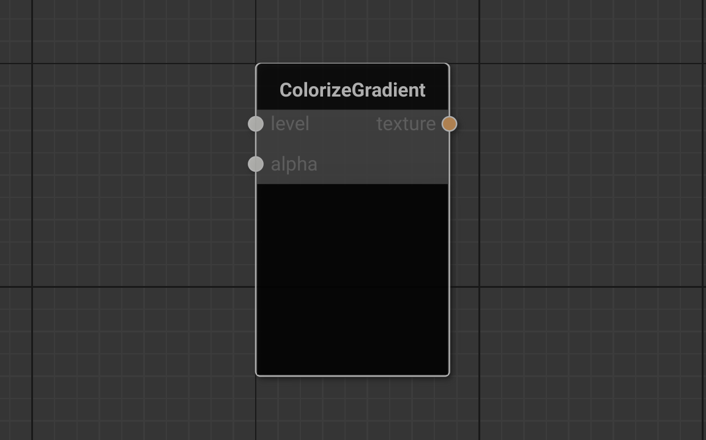  

### Category

Texture  

### Inputs

|Name|Type|Description|
| :--- | :--- | :--- |
|level|HeightMapData|Data values for color selection.|
|alpha|HeightMapData|Texture alpha map.|
  

### Outputs

|Name|Type|Description|
| :--- | :--- | :--- |
|texture|HeightMapRGBAData|Texture (RGBA).|
  

### Parameters

|Name|Type|Description|
| :--- | :--- | :--- |
|clamp_alpha|Bool|Clamp to [0, 1] to input alpha map.|
|gradient|Color gradient|Colormap as a manually defined color gradient.|
|reverse_alpha|Bool|Reverse the input alpha map.|
|reverse_colormap|Bool|Reverse the colormap range.|

## ColorizeSolid

ColorizeSolid generates an uniform texture based on an input color.

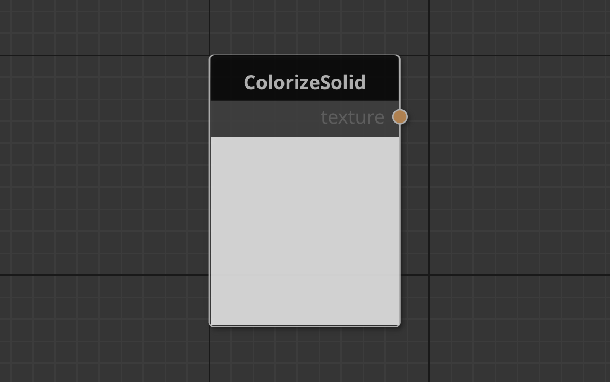  

### Category

Texture  

### Inputs

|Name|Type|Description|
| :--- | :--- | :--- |
  

### Outputs

|Name|Type|Description|
| :--- | :--- | :--- |
|texture|HeightMapRGBAData|Texture (RGBA).|
  

### Parameters

|Name|Type|Description|
| :--- | :--- | :--- |
|alpha|Float|Transparency as a scalar value|
|color|Color|Solid color.|

## CombineMask

CombineMask performs basic logical operations on a pair of heightmaps (assuming they are used as masks).

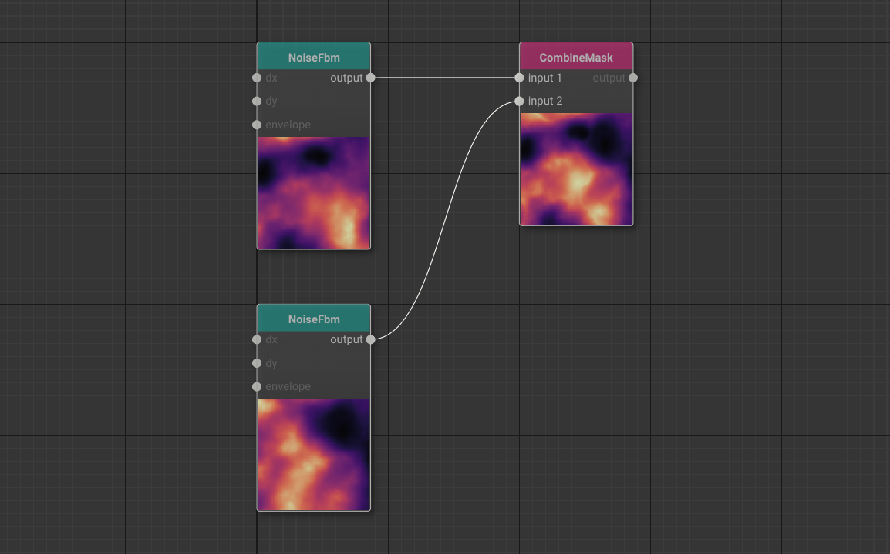  

### Category

Mask  

### Inputs

|Name|Type|Description|
| :--- | :--- | :--- |
|input 1|HeightMapData|Input mask.|
|input 2|HeightMapData|Input mask.|
  

### Outputs

|Name|Type|Description|
| :--- | :--- | :--- |
|output|HeightMapData|Combined mask.|
  

### Parameters

|Name|Type|Description|
| :--- | :--- | :--- |
|method|Enumeration|Combining method. Available values: exclusion, intersection, union.|

## Comment

Comment node is a passive node holding a comment text.

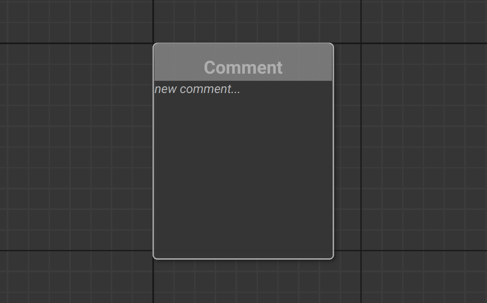  

### Category

Comment  

### Inputs

|Name|Type|Description|
| :--- | :--- | :--- |
  

### Outputs

|Name|Type|Description|
| :--- | :--- | :--- |
  

### Parameters

|Name|Type|Description|
| :--- | :--- | :--- |
|comment|String|Text comment.|

## Cos

Apply a cosine function to every values.

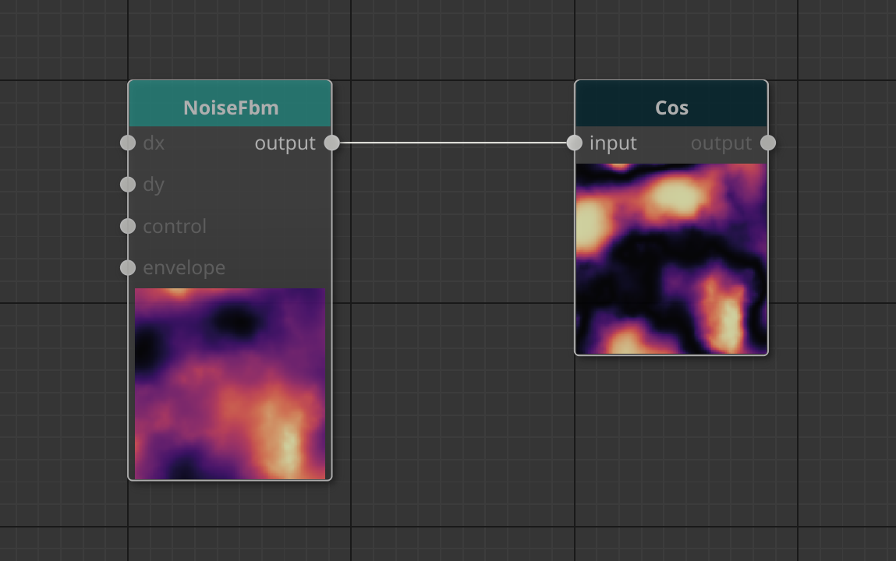  

### Category

Math/Base  

### Inputs

|Name|Type|Description|
| :--- | :--- | :--- |
|input|HeightMapData|Input heightmap.|
  

### Outputs

|Name|Type|Description|
| :--- | :--- | :--- |
|output|HeightMapData|Output heightmap.|
  

### Parameters

|Name|Type|Description|
| :--- | :--- | :--- |
|frequency|Float|Frequency.|
|phase_shift|Float|Phase shift.|

## DataPreview

DataPreview.

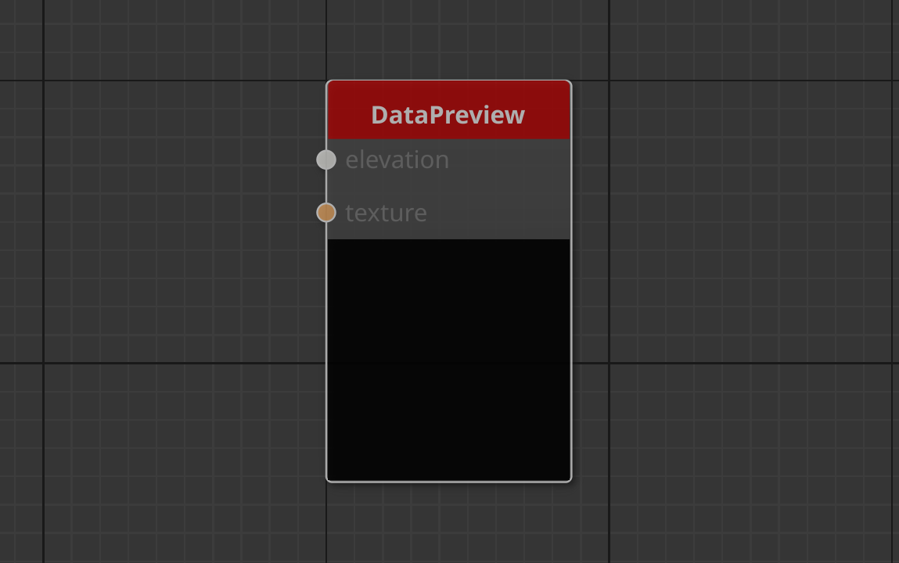  

### Category

Debug  

### Inputs

|Name|Type|Description|
| :--- | :--- | :--- |
|elevation|HeightMapData|Data values for elevation preview.|
|texture|HeightMapRGBAData|Data values for color preview.|
  

### Outputs

|Name|Type|Description|
| :--- | :--- | :--- |
  

### Parameters

|Name|Type|Description|
| :--- | :--- | :--- |

## Dendry

Dendry is a procedural model for dendritic patterns generation.

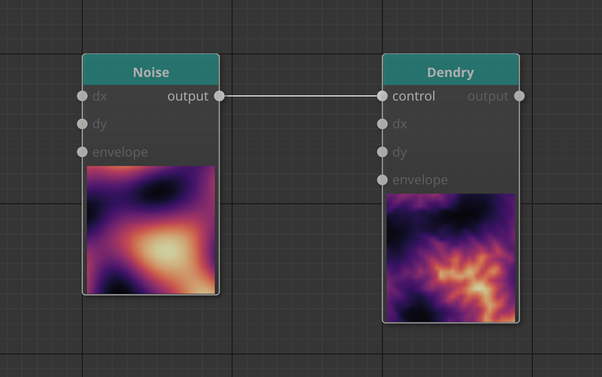  

### Category

Primitive/Coherent Noise  

### Inputs

|Name|Type|Description|
| :--- | :--- | :--- |
|control|HeightMapData|Global control heightmap that defines the overall shape of the output.|
|dx|HeightMapData|Displacement with respect to the domain size (x-direction).|
|dy|HeightMapData|Displacement with respect to the domain size (y-direction).|
|envelope|HeightMapData|Output noise amplitude envelope.|
  

### Outputs

|Name|Type|Description|
| :--- | :--- | :--- |
|output|HeightMapData|Generated noise.|
  

### Parameters

|Name|Type|Description|
| :--- | :--- | :--- |
|displacement|Float|Maximum displacement of segments.|
|eps|Float|Used to bias the area where points are generated in cells.|
|kw|Wavenumber|Noise wavenumbers (kx, ky) for each directions.|
|noise_amplitude_proportion|Float|Proportion of the amplitude of the control function as noise.|
|primitives_resolution_steps|Integer|Additional resolution steps in the primitive resolution.|
|resolution|Integer|Number of resolutions in the noise function.|
|seed|Random seed|Random seed number.|
|slope_power|Float|Additional parameter to control the variation of slope on terrains.|
|subsampling|Integer|Function evaluation subsampling, use higher values for faster computation at the cost of a coarser resolution.|

## DepressionFilling

DepressionFilling is used to fill depressions or sinks in an heightmap. It ensures that there are no depressions, i.e. areas within a digital elevation model that are surrounded by higher terrain, with no outlet to lower areas.

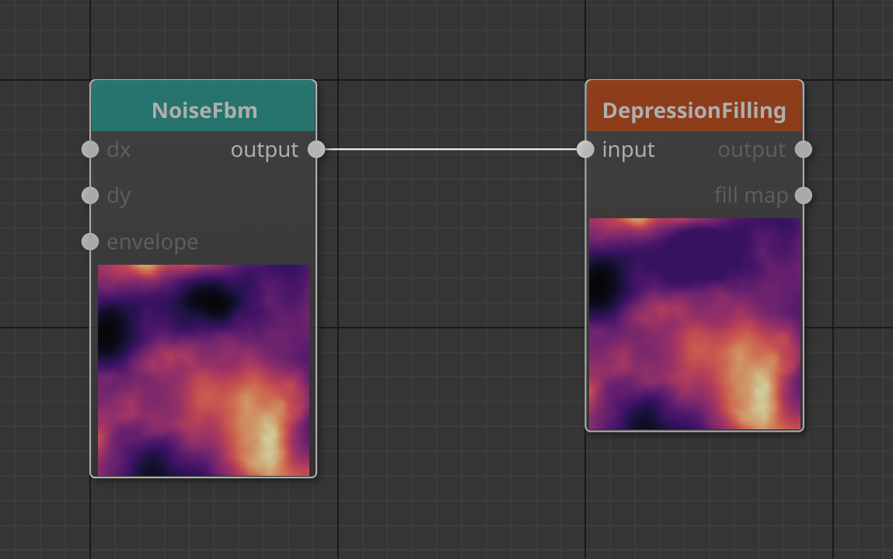  

### Category

Erosion  

### Inputs

|Name|Type|Description|
| :--- | :--- | :--- |
|input|HeightMapData|Input heightmap.|
  

### Outputs

|Name|Type|Description|
| :--- | :--- | :--- |
|output|HeightMapData|Filled heightmap.|
|fill map|HeightMapData|Filling map.|
  

### Parameters

|Name|Type|Description|
| :--- | :--- | :--- |
|epsilon|Float|Minimum slope tolerance.|
|iterations|Integer|Maximum number of iterations.|
|remap fill map|Bool|Remap to [0, 1] the filling map.|

## Dilation

Dilation expands the boundaries of objects in an image and fills in small gaps or holes in those objects. Use Cases: (+) Filling gaps: Dilation can be used to fill small gaps or holes in objects, making them more solid. (+) Merging objects: Dilation can help merge nearby objects or connect broken segments in an image.

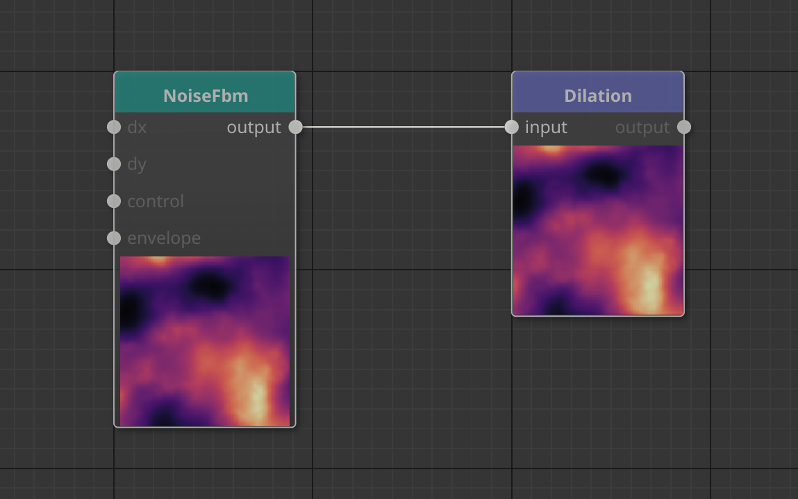  

### Category

Operator/Morphology  

### Inputs

|Name|Type|Description|
| :--- | :--- | :--- |
|input|HeightMapData|Input heightmap.|
  

### Outputs

|Name|Type|Description|
| :--- | :--- | :--- |
|output|HeightMapData|Dilated heightmap.|
  

### Parameters

|Name|Type|Description|
| :--- | :--- | :--- |
|radius|Float|Filter radius with respect to the domain size.|

## Erosion

Erosion removes small structures or noise from an image, and it also shrinks the boundaries of objects in an image. Use Cases: (+) Noise reduction: Erosion can help remove small, unwanted pixels or noise from the image. (+) Separating objects: Erosion can be used to separate touching or overlapping objects in an image by shrinking their boundaries.

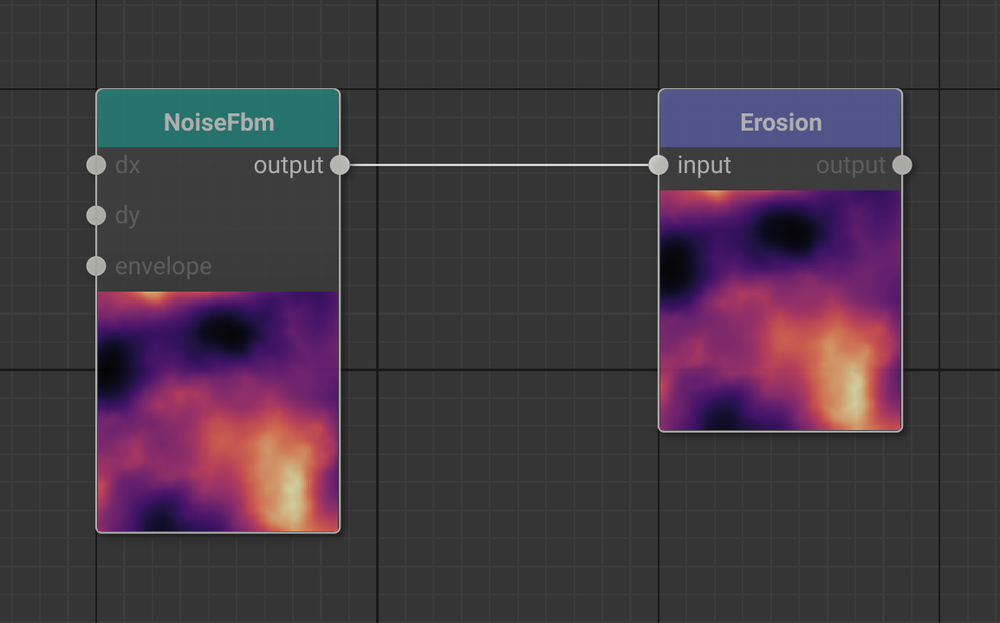  

### Category

Operator/Morphology  

### Inputs

|Name|Type|Description|
| :--- | :--- | :--- |
|input|HeightMapData|Input heightmap.|
  

### Outputs

|Name|Type|Description|
| :--- | :--- | :--- |
|output|HeightMapData|Dilated heightmap.|
  

### Parameters

|Name|Type|Description|
| :--- | :--- | :--- |
|radius|Float|Filter radius with respect to the domain size.|

## ExpandShrink

ExpandShrink is a maximum/minimum filter with a weighted kernel. It can be used to enhance or extract features while preserving the essential structure of the heightmap.

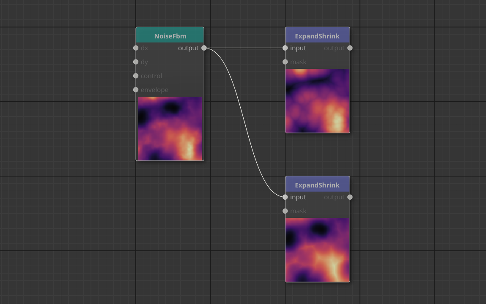  

### Category

Filter/Recast  

### Inputs

|Name|Type|Description|
| :--- | :--- | :--- |
|input|HeightMapData|Input heightmap.|
|mask|HeightMapData|Mask defining the filtering intensity (expected in [0, 1]).|
  

### Outputs

|Name|Type|Description|
| :--- | :--- | :--- |
|output|HeightMapData|Filtered heightmap.|
  

### Parameters

|Name|Type|Description|
| :--- | :--- | :--- |
|kernel|Enumeration|Weighting kernel. Available values: cone, cubic_pulse, lorentzian, smooth_cosine.|
|radius|Float|Filter radius with respect to the domain size.|
|shrink|Bool|Shrink (if true) or expand (if false).|

## ExportAsset

ExportAsset exporting both the heightmap and texture to a single asset.

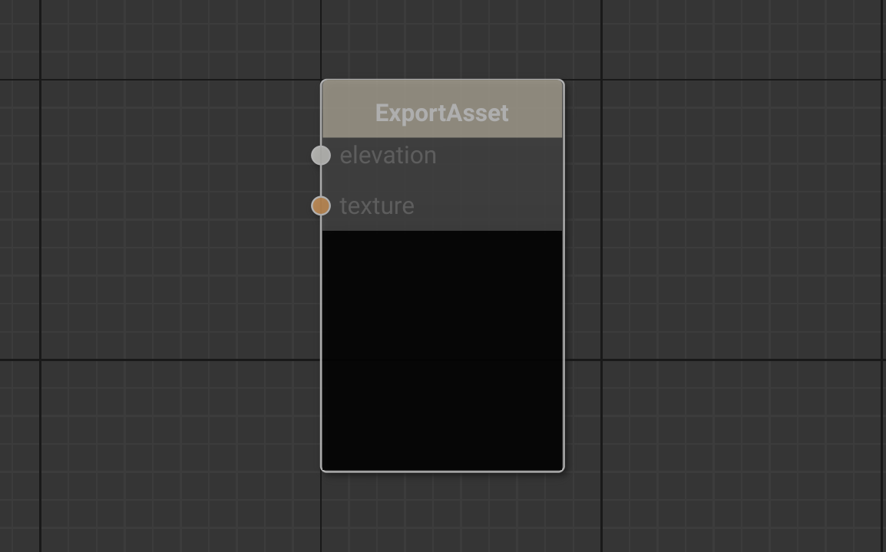  

### Category

IO/Files  

### Inputs

|Name|Type|Description|
| :--- | :--- | :--- |
|elevation|HeightMapData|Data values for elevation.|
|texture|HeightMapRGBAData|Data values for color.|
  

### Outputs

|Name|Type|Description|
| :--- | :--- | :--- |
  

### Parameters

|Name|Type|Description|
| :--- | :--- | :--- |
|auto_export|Bool|Decides whether the export is automatically performed when the node is updated.|
|elevation_scaling|Float|Elevation scaling.|
|export_format|Enumeration|Export format. Available values: Assimp Binary - *.assbin, Assxml Document - *.assxml, Autodesk 3DS (legacy) - *.3ds, Autodesk FBX (ascii) - *.fbx, Autodesk FBX (binary) - *.fbx, COLLADA - Digital Asset Exchange Schema - *.dae, Extensible 3D - *.x3d, GL Transmission Format (binary) - *.glb, GL Transmission Format - *.gltf, GL Transmission Format v. 2 (binary) - *.glb, GL Transmission Format v. 2 - *.gltf, Stanford Polygon Library (binary) - *.ply, Stanford Polygon Library - *.ply, Step Files - *.stp, Stereolithography (binary) - *.stl, Stereolithography - *.stl, The 3MF-File-Format - *.3mf, Wavefront OBJ format - *.obj, Wavefront OBJ format without material file - *.obj, X Files - *.x.|
|fname|Filename|Export file name.|
|max_error|Float|Maximum error (for optimized triangulated mesh).|
|mesh_type|Enumeration|Mesh type for the geometry. Available values: triangles, triangles (optimized).|

## ExportHeightmap

ExportHeightmap is an operator for exporting a heightmap in various file formats.

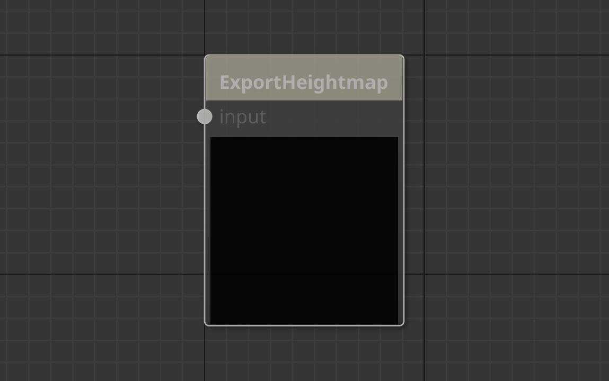  

### Category

IO/Files  

### Inputs

|Name|Type|Description|
| :--- | :--- | :--- |
|input|HeightMapData|Input heightmap.|
  

### Outputs

|Name|Type|Description|
| :--- | :--- | :--- |
  

### Parameters

|Name|Type|Description|
| :--- | :--- | :--- |
|auto_export|Bool|Decides whether the export is automatically performed when the node is updated.|
|fname|Filename|Export file name.|
|format|Enumeration|Export format. Available values: png (16 bit), png (8 bit), raw (16 bit, Unity).|

## ExportNormalMap

ExportNormalMap is an operator for exporting the normal map of an heightmap as a PNG image file.

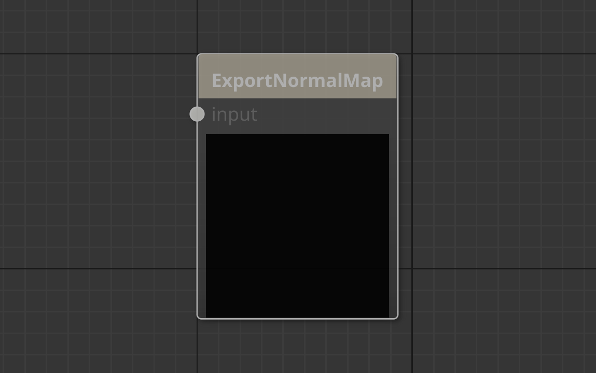  

### Category

IO/Files  

### Inputs

|Name|Type|Description|
| :--- | :--- | :--- |
|input|HeightMapData|Input heightmap.|
  

### Outputs

|Name|Type|Description|
| :--- | :--- | :--- |
  

### Parameters

|Name|Type|Description|
| :--- | :--- | :--- |
|16bit|Bool|Whether the output file is a 16bit PNG file (instead of 8bit).|
|auto_export|Bool|Decides whether the export is automatically performed when the node is updated.|
|fname|Filename|Export file name.|

## ExportTexture

ExportTexture is a texture to a PNG image file.

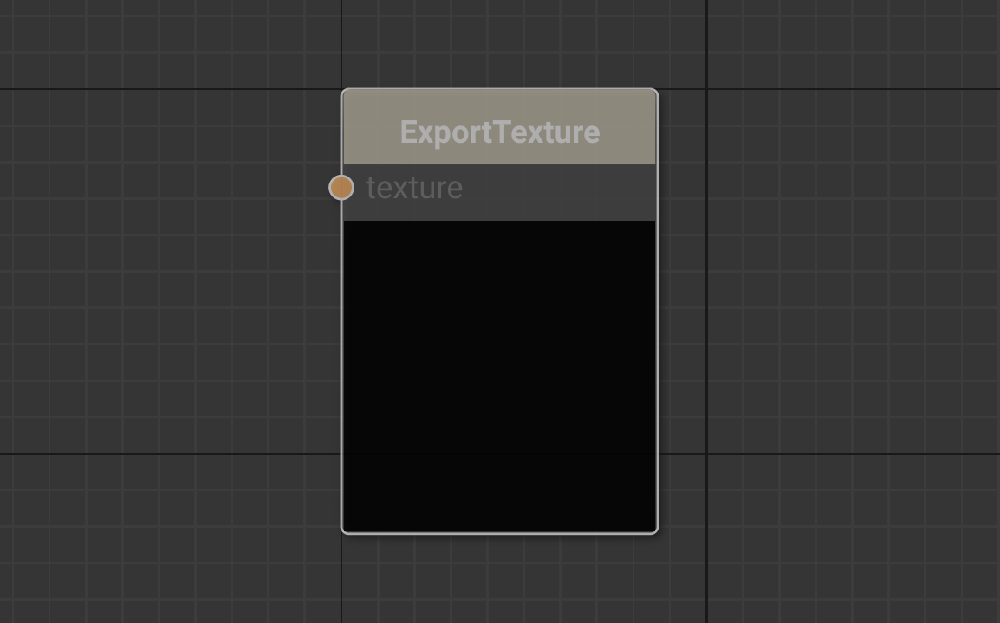  

### Category

IO/Files  

### Inputs

|Name|Type|Description|
| :--- | :--- | :--- |
|texture|HeightMapRGBAData|Input texture.|
  

### Outputs

|Name|Type|Description|
| :--- | :--- | :--- |
  

### Parameters

|Name|Type|Description|
| :--- | :--- | :--- |
|16 bit|Bool|Decides whether the output is an 8 bit or a 16 bit PNG file.|
|auto_export|Bool|Decides whether the export is automatically performed when the node is updated.|
|fname|Filename|Export file name.|

## Fold

Fold iteratively applies the absolute value function to the input field, effectively folding negative values to their positive counterparts.

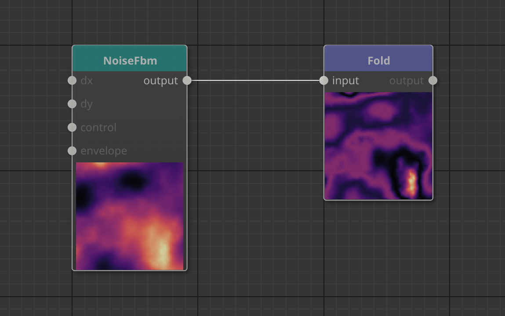  

### Category

Filter/Recast  

### Inputs

|Name|Type|Description|
| :--- | :--- | :--- |
|input|HeightMapData|Input heightmap.|
  

### Outputs

|Name|Type|Description|
| :--- | :--- | :--- |
|output|HeightMapData|Folded heightmap.|
  

### Parameters

|Name|Type|Description|
| :--- | :--- | :--- |
|iterations|Integer|Number of successive foldings.|
|k|Float|Smoothing parameter of the smooth absolute value.|

## Gain

Gain is a power law transformation altering the distribution of signal values, compressing or expanding certain regions of the signal depending on the exponent of the power law.

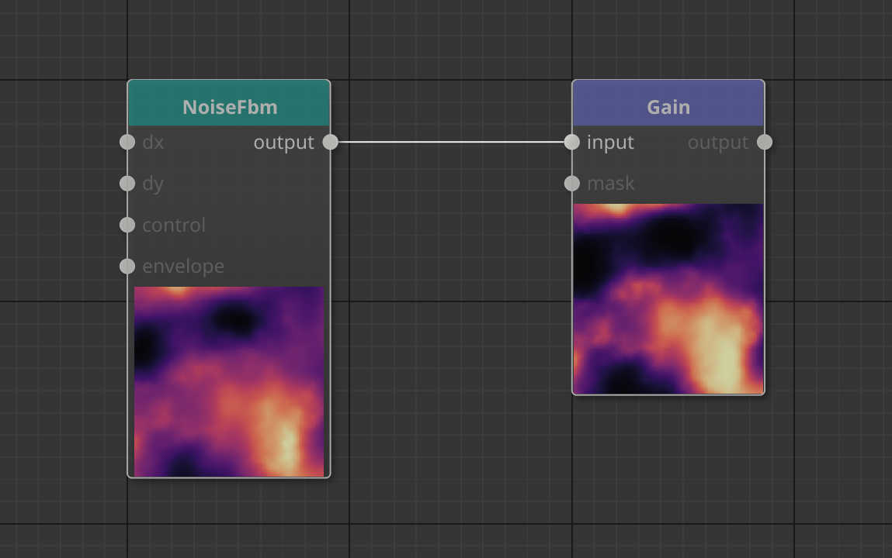  

### Category

Filter/Recurve  

### Inputs

|Name|Type|Description|
| :--- | :--- | :--- |
|input|HeightMapData|Input heightmap.|
|mask|HeightMapData|Mask defining the filtering intensity (expected in [0, 1]).|
  

### Outputs

|Name|Type|Description|
| :--- | :--- | :--- |
|output|HeightMapData|Filtered heightmap.|
  

### Parameters

|Name|Type|Description|
| :--- | :--- | :--- |
|gain|Float|Power law exponent.|

## GammaCorrection

Gamma correction involves applying a nonlinear transformation to the pixel values of the heightmap. This transformation is based on a power-law function, where each pixel value is raised to the power of the gamma value. The gamma value is a parameter that determines the degree and direction of the correction.

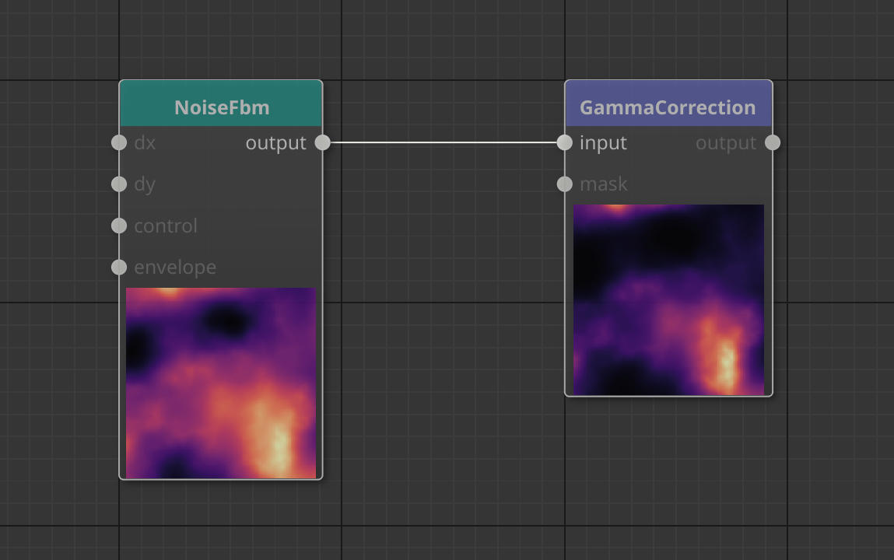  

### Category

Filter/Recurve  

### Inputs

|Name|Type|Description|
| :--- | :--- | :--- |
|input|HeightMapData|Input heightmap.|
|mask|HeightMapData|Mask defining the filtering intensity (expected in [0, 1]).|
  

### Outputs

|Name|Type|Description|
| :--- | :--- | :--- |
|output|HeightMapData|Filtered heightmap.|
  

### Parameters

|Name|Type|Description|
| :--- | :--- | :--- |
|gamma|Float|Gamma exponent.|

## GammaCorrectionLocal

Gamma correction involves applying a nonlinear transformation to the pixel values of the heightmap. For GammaCorrectionLocal, the transformation parameters are locally defined within a perimeter 'radius'.

  

### Category

Filter/Recurve  

### Inputs

|Name|Type|Description|
| :--- | :--- | :--- |
|input|HeightMapData|Input heightmap.|
|mask|HeightMapData|Mask defining the filtering intensity (expected in [0, 1]).|
  

### Outputs

|Name|Type|Description|
| :--- | :--- | :--- |
|output|HeightMapData|Filtered heightmap.|
  

### Parameters

|Name|Type|Description|
| :--- | :--- | :--- |
|gamma|Float|Gamma exponent.|
|k|Float|Smoothing factor (typically in [0, 1]).|
|radius|Float|Filter radius with respect to the domain size.|

## GaussianPulse

GaussianPulse generates a Gaussian pulse.

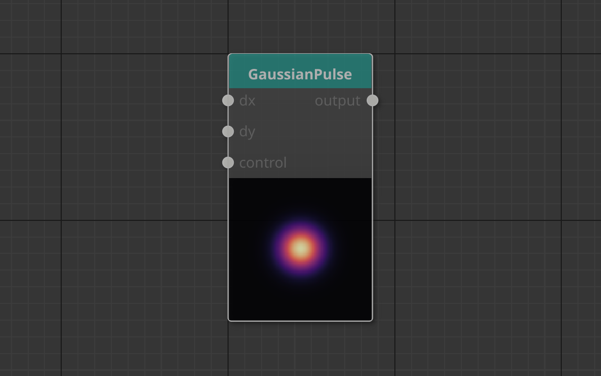  

### Category

Primitive/Function  

### Inputs

|Name|Type|Description|
| :--- | :--- | :--- |
|dr|HeightMapData|Displacement with respect to the domain size (radial direction).|
  

### Outputs

|Name|Type|Description|
| :--- | :--- | :--- |
|output|HeightMapData|Gaussian heightmap.|
  

### Parameters

|Name|Type|Description|
| :--- | :--- | :--- |
|center.x|Float|Center x coordinate.|
|center.y|Float|Center y coordinate.|
|radius|Float|Pulse half-width.|

## Gradient

Gradient provides insight into the spatial distribution of a function's gradient, conveying both direction and intensity of change across the xy-plane

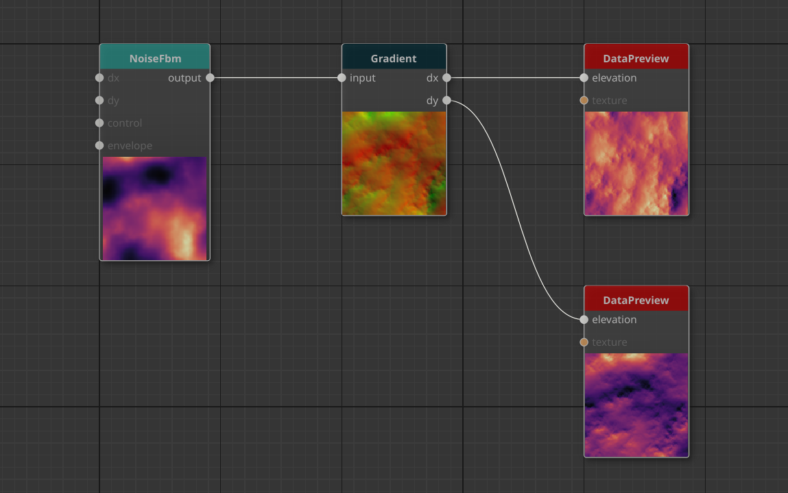  

### Category

Math/Gradient  

### Inputs

|Name|Type|Description|
| :--- | :--- | :--- |
|input|HeightMapData|Input heightmap.|
  

### Outputs

|Name|Type|Description|
| :--- | :--- | :--- |
|dx|HeightMapData|Gradient with respect to the x-direction.|
|dy|HeightMapData|Gradient with respect to the y-direction.|
  

### Parameters

|Name|Type|Description|
| :--- | :--- | :--- |

## GradientAngle

The gradient angle of a heightmap refers to the direction in which the elevation changes most rapidly at each point on the map. It represents the slope or inclination of the terrain surface relative to a horizontal plane

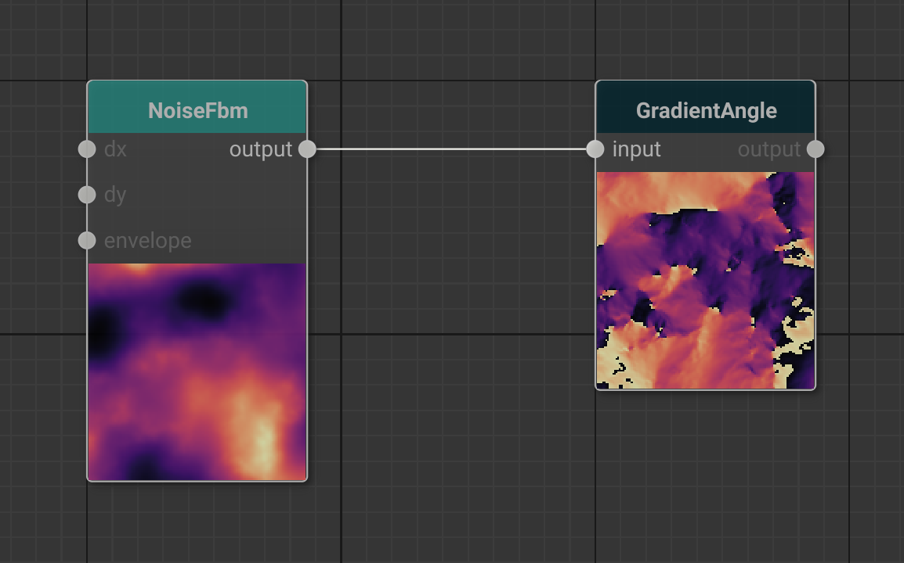  

### Category

Math/Gradient  

### Inputs

|Name|Type|Description|
| :--- | :--- | :--- |
|input|HeightMapData|Input heightmap.|
  

### Outputs

|Name|Type|Description|
| :--- | :--- | :--- |
|output|HeightMapData|Gradient angle.|
  

### Parameters

|Name|Type|Description|
| :--- | :--- | :--- |

## GradientNorm

The gradient norm of a heightmap refers to the magnitude or intensity of the rate of change of elevation at each point on the map. It represents the steepness or slope of the terrain surface, irrespective of its direction.

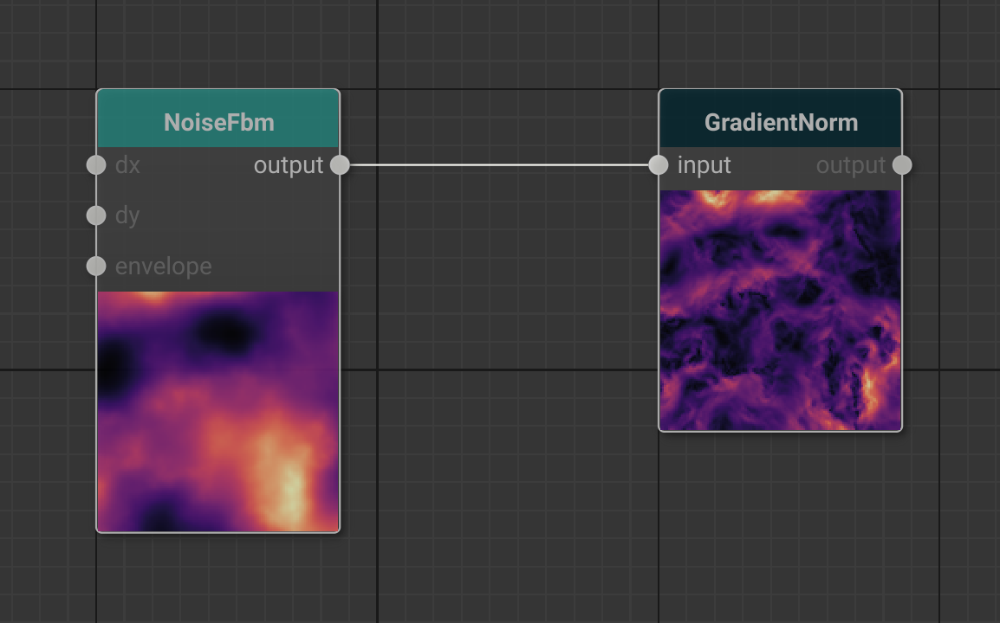  

### Category

Math/Gradient  

### Inputs

|Name|Type|Description|
| :--- | :--- | :--- |
|input|HeightMapData|Input heightmap.|
  

### Outputs

|Name|Type|Description|
| :--- | :--- | :--- |
|output|HeightMapData|Gradient norm.|
  

### Parameters

|Name|Type|Description|
| :--- | :--- | :--- |

## GradientTalus

Gradient talus refers to the local steepest downslope, or the direction in which the terrain descends most rapidly, at each point on the heightmap.

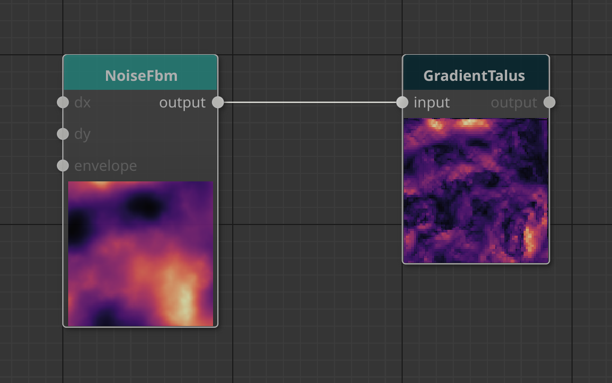  

### Category

Math/Gradient  

### Inputs

|Name|Type|Description|
| :--- | :--- | :--- |
|input|HeightMapData|Input heightmap.|
  

### Outputs

|Name|Type|Description|
| :--- | :--- | :--- |
|output|HeightMapData|Gradient talus.|
  

### Parameters

|Name|Type|Description|
| :--- | :--- | :--- |

## HeightmapToMask

Convert an heightmap to a mask (remap values).

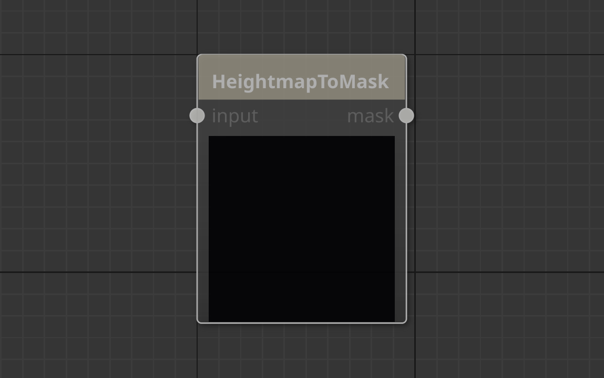  

### Category

Converter  

### Inputs

|Name|Type|Description|
| :--- | :--- | :--- |
|input|HeightMapData|Heightmap.|
  

### Outputs

|Name|Type|Description|
| :--- | :--- | :--- |
|mask|HeightMapData|Mask.|
  

### Parameters

|Name|Type|Description|
| :--- | :--- | :--- |

## HeightmapToRGBA

HeightmapToRGBA converts a series of heightmaps into an RGBA splatmap.

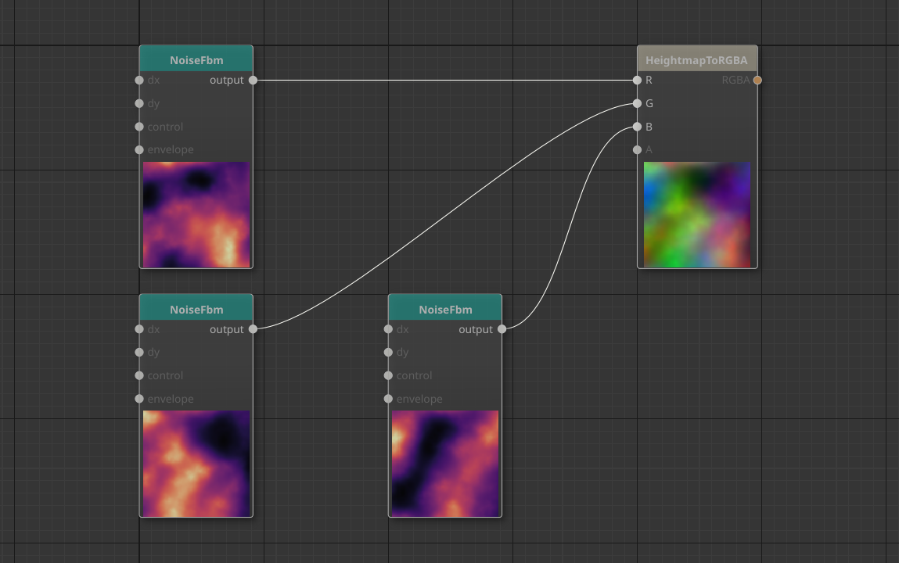  

### Category

Converter  

### Inputs

|Name|Type|Description|
| :--- | :--- | :--- |
|R|HeightMapData|Red channel.|
|G|HeightMapData|Green channel.|
|B|HeightMapData|Blue channel.|
|A|HeightMapData|Alpha channel.|
  

### Outputs

|Name|Type|Description|
| :--- | :--- | :--- |
|RGBA|HeightMapRGBAData|RGBA heightmap.|
  

### Parameters

|Name|Type|Description|
| :--- | :--- | :--- |

## HydraulicParticle

HydraulicParticle is a particle-based hydraulic erosion operator that simulates the erosion and sediment transport processes that occur due to the flow of water over a terrain represented by the input heightmap. This type of operator models erosion by tracking the movement of virtual particles (or sediment particles) as they are transported by water flow and interact with the terrain.

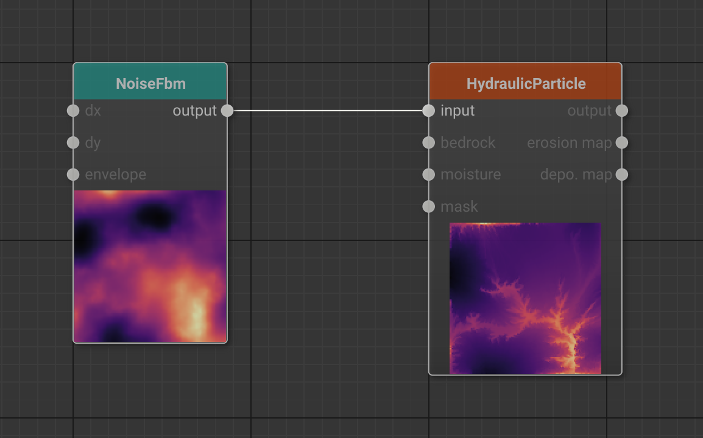  

### Category

Erosion/Hydraulic  

### Inputs

|Name|Type|Description|
| :--- | :--- | :--- |
|input|HeightMapData|Input heightmap.|
|bedrock|HeightMapData|Bedrock elevation, erosion process cannot carve the heightmap further down this point.|
|moisture|HeightMapData|Moisture map, influences the amount of water locally deposited.|
|mask|HeightMapData|Mask defining the filtering intensity (expected in [0, 1]).|
  

### Outputs

|Name|Type|Description|
| :--- | :--- | :--- |
|output|HeightMapData|Eroded heightmap.|
|erosion map|HeightMapData|Erosion map|
|depo. map|HeightMapData|Deposition map|
  

### Parameters

|Name|Type|Description|
| :--- | :--- | :--- |
|c_capacity|Float|Particle capacity.|
|c_deposition|Float|Particle deposition coefficient.|
|c_erosion|Float|Particle erosion cofficient.|
|c_radius|Integer|Particle radius (c_radius = 0 for a pixel-based algorithm and c_radius > 0 for a kernel-based algorithm, which can be significantly slower).|
|drag_rate|Float|Particle drag rate.|
|evap_rate|Float|Particle water evaporation rate.|
|nparticles|Integer|Number of simulated particles.|
|seed|Random seed|Random seed number.|

## HydraulicRidge

HydraulicRidge .

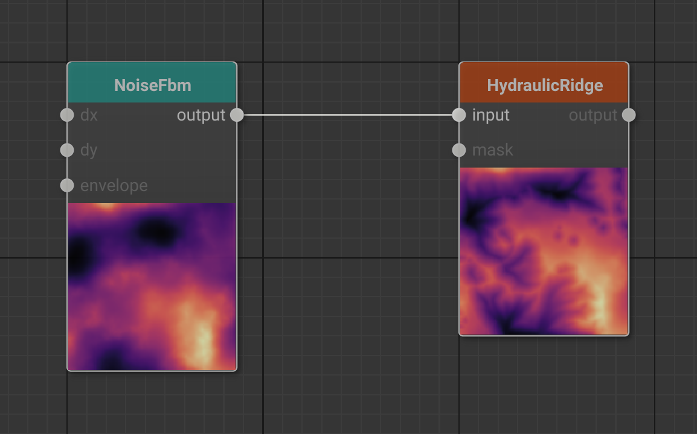  

### Category

Erosion/Hydraulic  

### Inputs

|Name|Type|Description|
| :--- | :--- | :--- |
|input|HeightMapData|Input heightmap.|
|mask|HeightMapData|Mask defining the filtering intensity (expected in [0, 1]).|
  

### Outputs

|Name|Type|Description|
| :--- | :--- | :--- |
|output|HeightMapData|Filtered heightmap.|
  

### Parameters

|Name|Type|Description|
| :--- | :--- | :--- |
|erosion_factor|Float|Erosion factor, generally in ]0, 10]. Smaller values tend to flatten the map.|
|intensity|Float|Intensity mask, expected in [0, 1] (applied as a post-processing).|
|noise_ratio|Float|Ridge talus noise ratio in [0, 1].|
|radius|Float|Pre-filter radius with respect to the domain size.|
|seed|Random seed|Random seed number.|
|smoothing_factor|Float|Smooothing factor in ]0, 1] (1 for no smoothing).|
|talus_global|Float|Ridge slope.|

## HydraulicStream

HydraulicStream is an hydraulic erosion operator using the flow stream approach and an infinite flow direction algorithm for simulating the erosion processes. Simulate water flow across the terrain using the infinite flow direction algorithm. As water flows over the terrain, flow accumulation representing the volume of water that passes through each point on the map, is computed to evaluate the erosive power of the water flow.

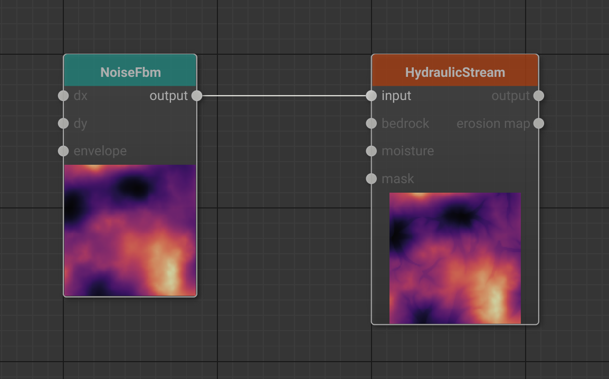  

### Category

Erosion/Hydraulic  

### Inputs

|Name|Type|Description|
| :--- | :--- | :--- |
|input|HeightMapData|Input heightmap.|
|bedrock|HeightMapData|Bedrock elevation, erosion process cannot carve the heightmap further down this point.|
|moisture|HeightMapData|Moisture map, influences the amount of water locally deposited.|
|mask|HeightMapData|Mask defining the filtering intensity (expected in [0, 1]).|
  

### Outputs

|Name|Type|Description|
| :--- | :--- | :--- |
|output|HeightMapData|Eroded heightmap.|
|erosion map|HeightMapData|Erosion map|
  

### Parameters

|Name|Type|Description|
| :--- | :--- | :--- |
|c_erosion|Float|Erosion intensity.|
|clipping_ratio|Float|Flow accumulation clipping ratio.|
|radius|Float|Carving kernel radius.|
|talus_ref|Float|Reference talus, with small values of talus_ref  leading to thinner flow streams.|

## HydraulicVpipes

HydraulicVpipes performs hydraulic erosion using a virtual pipe algorithm, which is a method that simulates erosion and sediment transport processes by mimicking the behavior of water flowing through a network of virtual pipes. This approach models erosion based on the principles of fluid dynamics and sediment transport, while also considering the local topography of the terrain represented by the input heightmap.

  

### Category

Erosion/Hydraulic  

### Inputs

|Name|Type|Description|
| :--- | :--- | :--- |
|input|HeightMapData|Input heightmap.|
|bedrock|HeightMapData|Bedrock elevation, erosion process cannot carve the heightmap further down this point.|
|moisture|HeightMapData|Moisture map, influences the amount of water locally deposited.|
|mask|HeightMapData|Mask defining the filtering intensity (expected in [0, 1]).|
  

### Outputs

|Name|Type|Description|
| :--- | :--- | :--- |
|output|HeightMapData|Eroded heightmap.|
|erosion map|HeightMapData|Erosion map|
|depo. map|HeightMapData|Deposition map|
  

### Parameters

|Name|Type|Description|
| :--- | :--- | :--- |
|c_capacity|Float|Particle capacity.|
|c_deposition|Float|Particle deposition coefficient.|
|c_erosion|Float|Particle erosion cofficient.|
|evap_rate|Float|Particle water evaporation rate.|
|iterations|Integer|Number of simulation iterations.|
|rain_rate|Float|Water evaporation rate.|
|water_height|Float|Total water height..|

## ImportHeightmap

ImportHeightmap imports an heighmap from a grayscale PNG 8bit file.

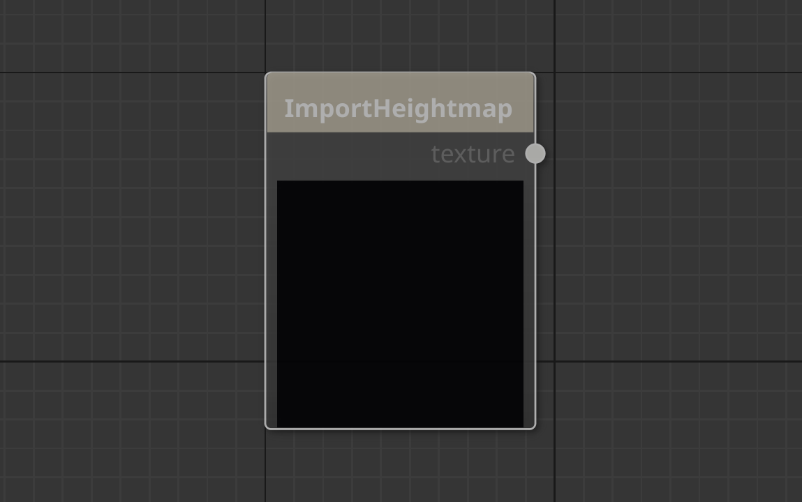  

### Category

IO/Files  

### Inputs

|Name|Type|Description|
| :--- | :--- | :--- |
  

### Outputs

|Name|Type|Description|
| :--- | :--- | :--- |
|texture|HeightMapData|Heightmap.|
  

### Parameters

|Name|Type|Description|
| :--- | :--- | :--- |
|fname|Filename|Import file name.|
|remap|Bool|Remap imported heightmap elevation to [0, 1].|

## Inverse

Inverse flips the sign of every values.

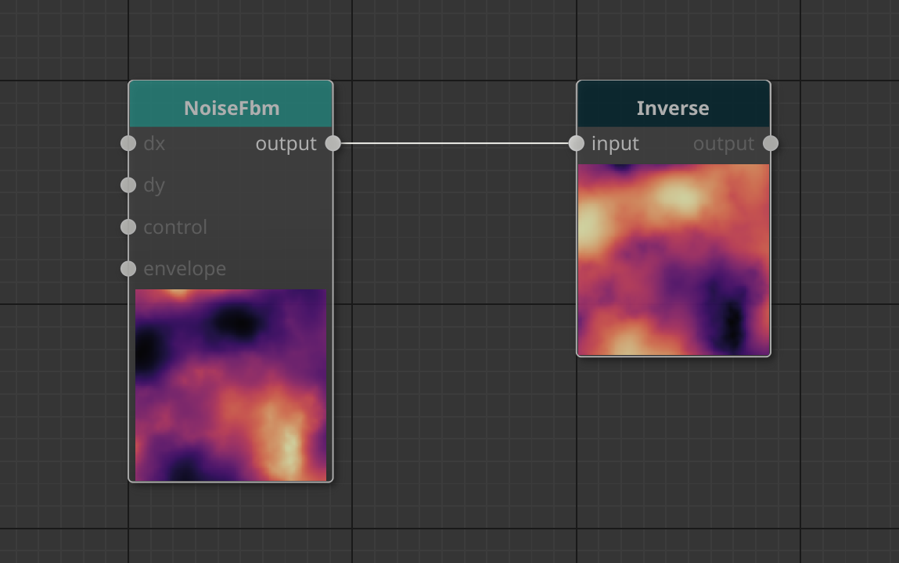  

### Category

Math/Base  

### Inputs

|Name|Type|Description|
| :--- | :--- | :--- |
|input|HeightMapData|Input heightmap.|
  

### Outputs

|Name|Type|Description|
| :--- | :--- | :--- |
|output|HeightMapData|Binary heightmap.|
  

### Parameters

|Name|Type|Description|
| :--- | :--- | :--- |

## Laplace

Laplace smoothing filter reduces noise and smooth out variations in pixel intensity while preserving the overall structure of an image.

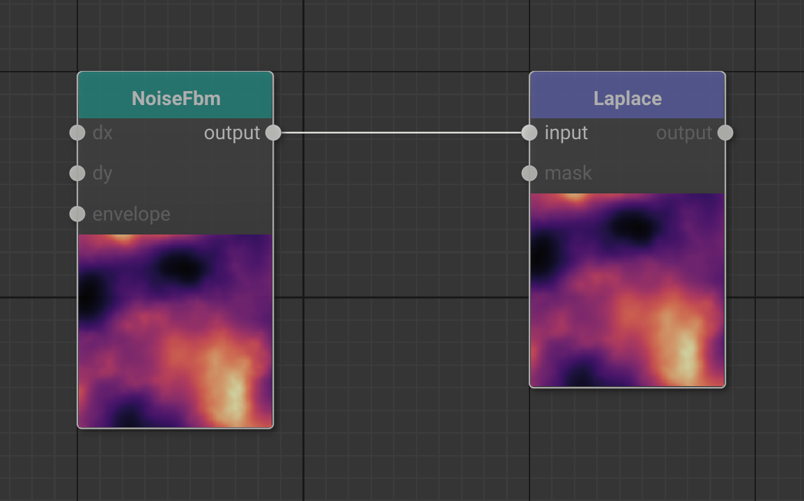  

### Category

Filter/Smoothing  

### Inputs

|Name|Type|Description|
| :--- | :--- | :--- |
|input|HeightMapData|Input heightmap.|
|mask|HeightMapData|Mask defining the filtering intensity (expected in [0, 1]).|
  

### Outputs

|Name|Type|Description|
| :--- | :--- | :--- |
|output|HeightMapData|Filtered heightmap.|
  

### Parameters

|Name|Type|Description|
| :--- | :--- | :--- |
|iterations|Integer|Number of successive filtering iterations.|
|sigma|Float|Filtering strength.|

## Lerp

The Lerp operator, short for linear interpolation, is a method for smoothly transitioning between two values over a specified range or interval.

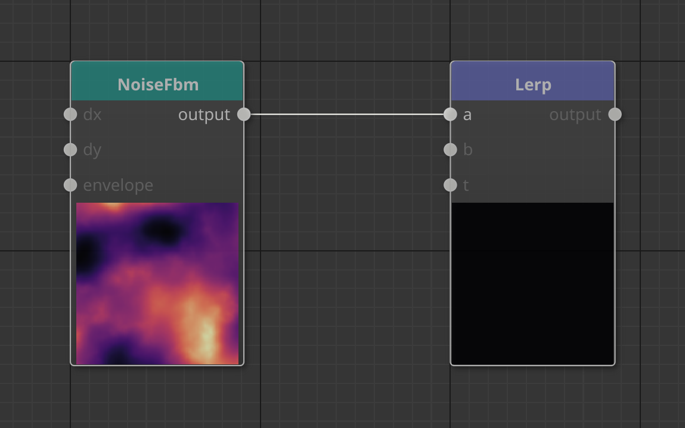  

### Category

Operator/Blend  

### Inputs

|Name|Type|Description|
| :--- | :--- | :--- |
|a|HeightMapData|Start heightmap (t = 0).|
|b|HeightMapData|End heightmap (t = 1).|
|t|HeightMapData|Lerp factor, expected in [0, 1].|
  

### Outputs

|Name|Type|Description|
| :--- | :--- | :--- |
|output|HeightMapData|Interpolated heightmap.|
  

### Parameters

|Name|Type|Description|
| :--- | :--- | :--- |
|t|Float|Lerp factor (in [0, 1]). Used only if the node input 't' is not set.|

## MakeBinary

MakeBinary is a thresholding operator. It transforms an input heightmap into a binary heightmap, where each pixel is assigned either a value of 0 or 1, depending on whether its intensity value surpasses a specified threshold.

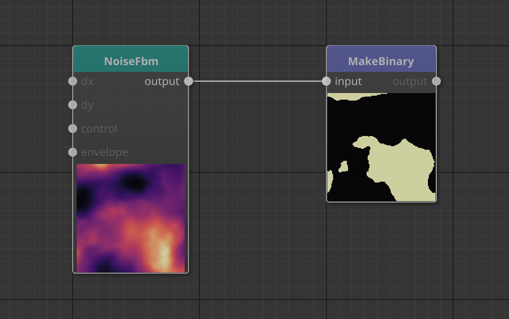  

### Category

Operator/Morphology  

### Inputs

|Name|Type|Description|
| :--- | :--- | :--- |
|input|HeightMapData|Input heightmap.|
  

### Outputs

|Name|Type|Description|
| :--- | :--- | :--- |
|output|HeightMapData|Binary heightmap.|
  

### Parameters

|Name|Type|Description|
| :--- | :--- | :--- |
|threshold|Float|Threshold value.|

## MakePeriodic

MakePeriodic makes the input heightmap tileable by building a smooth lineat transition at the boundaries.

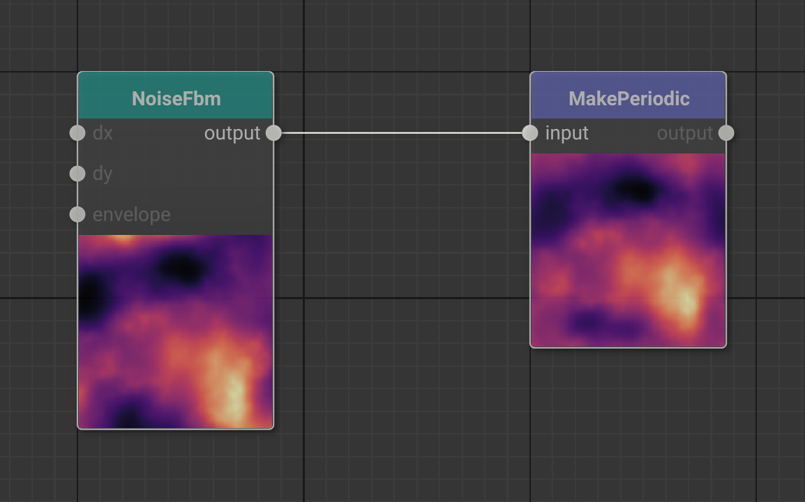  

### Category

Operator/Tiling  

### Inputs

|Name|Type|Description|
| :--- | :--- | :--- |
|input|HeightMapData|Input heightmap.|
  

### Outputs

|Name|Type|Description|
| :--- | :--- | :--- |
|output|HeightMapData|Binary heightmap.|
  

### Parameters

|Name|Type|Description|
| :--- | :--- | :--- |
|overlap|Float|Overlap ratio at the boundaries.|

## MakePeriodicStitching

MakePeriodicStitching makes the input heightmap tileable by seamlessly stitching together the domain boundaries.

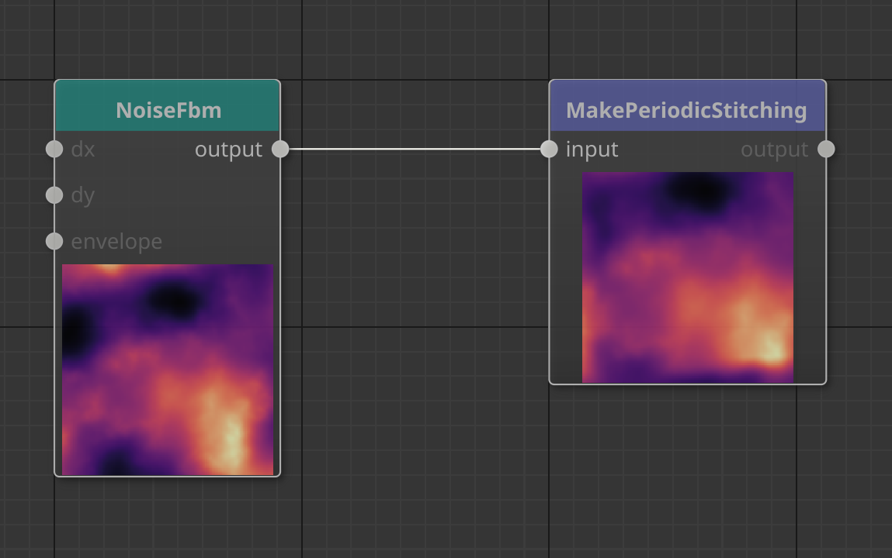  

### Category

Operator/Tiling  

### Inputs

|Name|Type|Description|
| :--- | :--- | :--- |
|input|HeightMapData|Input heightmap.|
  

### Outputs

|Name|Type|Description|
| :--- | :--- | :--- |
|output|HeightMapData|Binary heightmap.|
  

### Parameters

|Name|Type|Description|
| :--- | :--- | :--- |
|overlap|Float|Overlap ratio at the boundaries.|

## Median3x3

Median3x3 filter is a median filter with a 3x3 kernel used to reduce noise while preserving edges in an image. This process removes outliers and smooths the image without noise reduction and feature preservation in digital images.

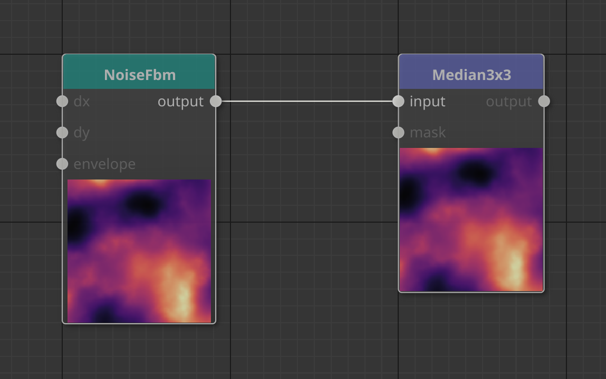  

### Category

Filter/Smoothing  

### Inputs

|Name|Type|Description|
| :--- | :--- | :--- |
|input|HeightMapData|Input heightmap.|
|mask|HeightMapData|Mask defining the filtering intensity (expected in [0, 1]).|
  

### Outputs

|Name|Type|Description|
| :--- | :--- | :--- |
|output|HeightMapData|Filtered heightmap.|
  

### Parameters

|Name|Type|Description|
| :--- | :--- | :--- |

## MixTexture

MixTexture enables the seamless integration of multiple textures by utilizing the alpha channel information to control the blending.

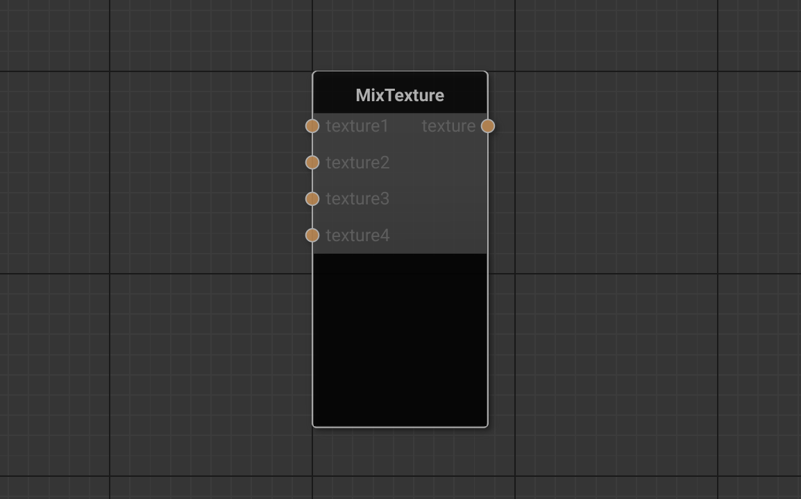  

### Category

Texture  

### Inputs

|Name|Type|Description|
| :--- | :--- | :--- |
|texture1|HeightMapRGBAData|Input texture.|
|texture2|HeightMapRGBAData|Input texture.|
|texture3|HeightMapRGBAData|Input texture.|
|texture4|HeightMapRGBAData|Input texture.|
  

### Outputs

|Name|Type|Description|
| :--- | :--- | :--- |
|texture|HeightMapRGBAData|Output texture.|
  

### Parameters

|Name|Type|Description|
| :--- | :--- | :--- |
|reset_output_alpha|Bool|Reset the output alpha channel to 1 (opaque).|
|use_sqrt_avg|Bool|Use square averaging for alpha-compositing (instead of linear averaging).|

## MorphologicalGradient

MorphologicalGradient calculates the difference between dilation and erosion of an image, resulting in the outline of objects. Use Cases: Edge detection, boundary extraction.

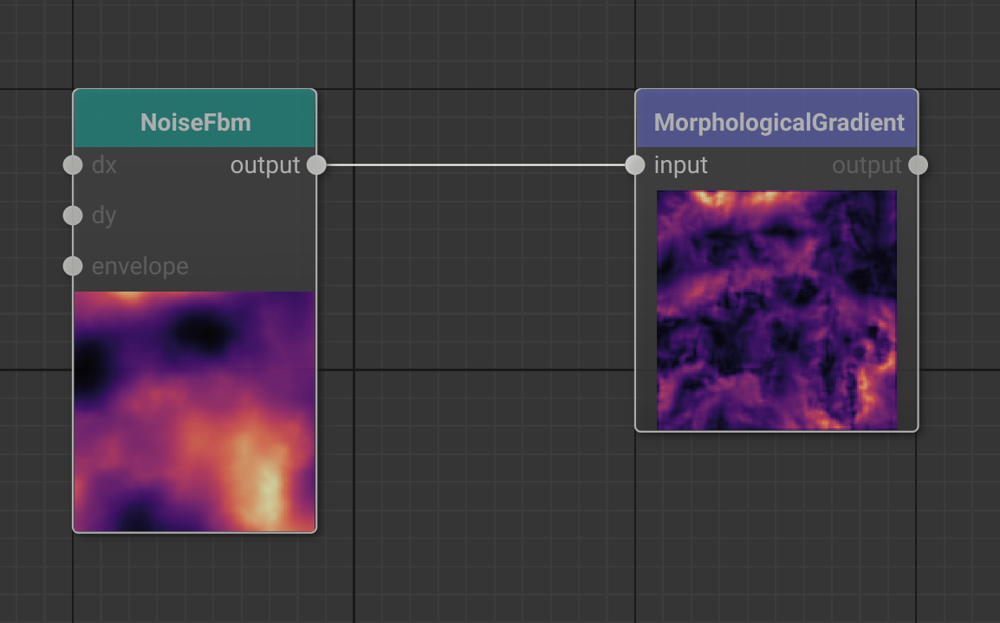  

### Category

Operator/Morphology  

### Inputs

|Name|Type|Description|
| :--- | :--- | :--- |
|input|HeightMapData|Input heightmap.|
  

### Outputs

|Name|Type|Description|
| :--- | :--- | :--- |
|output|HeightMapData|Gradient heightmap.|
  

### Parameters

|Name|Type|Description|
| :--- | :--- | :--- |
|radius|Float|Filter radius with respect to the domain size.|

## Noise

Noise node generates coherent and random-looking patterns.

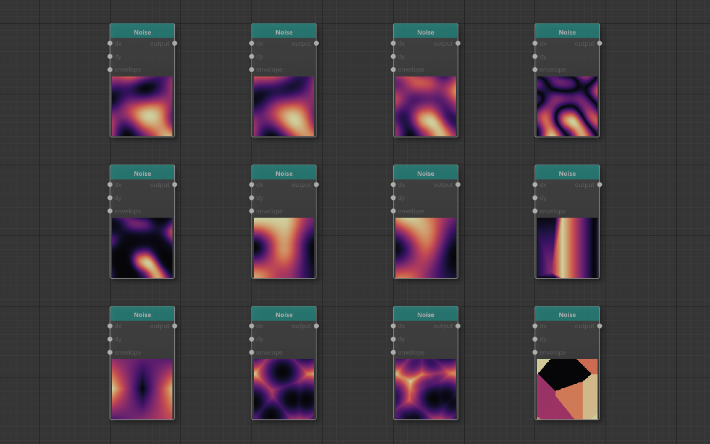  

### Category

Primitive/Coherent Noise  

### Inputs

|Name|Type|Description|
| :--- | :--- | :--- |
|dx|HeightMapData|Displacement with respect to the domain size (x-direction).|
|dy|HeightMapData|Displacement with respect to the domain size (y-direction).|
|envelope|HeightMapData|Output noise amplitude envelope.|
  

### Outputs

|Name|Type|Description|
| :--- | :--- | :--- |
|output|HeightMapData|Generated noise.|
  

### Parameters

|Name|Type|Description|
| :--- | :--- | :--- |
|kw|Wavenumber|Noise wavenumbers (kx, ky) for each directions.|
|noise_type|Enumeration|Base primitive noise. Available values: OpenSimplex2, OpenSimplex2S, Perlin, Perlin (billow), Perlin (half), Value, Value (cubic), Value (delaunay), Value (linear), Value (thinplate), Worley, Worley (doube), Worley (value).|
|seed|Random seed|Random seed number.|

## NoiseFbm

Fractal noise is a mathematical algorithm used to generate complex and detailed patterns characterized by self-similarity across different scales.

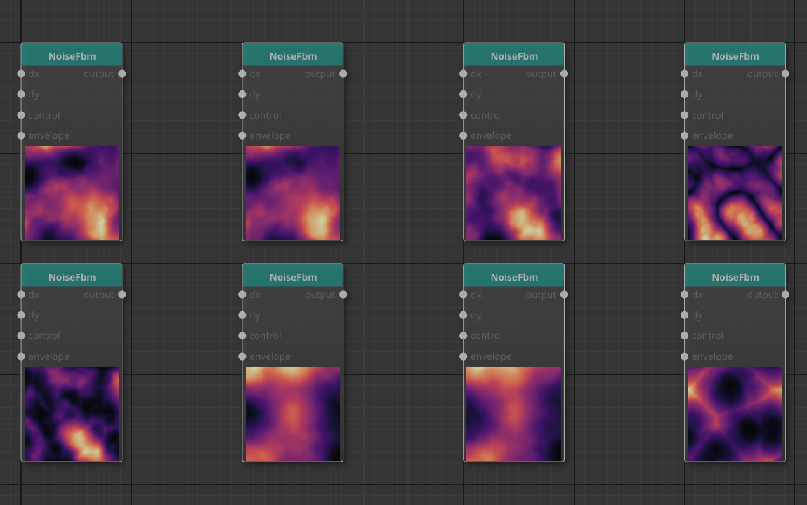  

### Category

Primitive/Coherent Noise  

### Inputs

|Name|Type|Description|
| :--- | :--- | :--- |
|dx|HeightMapData|Displacement with respect to the domain size (x-direction).|
|dy|HeightMapData|Displacement with respect to the domain size (y-direction).|
|envelope|HeightMapData|Output noise amplitude envelope.|
  

### Outputs

|Name|Type|Description|
| :--- | :--- | :--- |
|output|HeightMapData|Generated noise.|
  

### Parameters

|Name|Type|Description|
| :--- | :--- | :--- |
|kw|Wavenumber|Noise wavenumbers (kx, ky) for each directions.|
|lacunarity|Float|Wavenumber ratio between each octaves.|
|noise_type|Enumeration|Base primitive noise. Available values: OpenSimplex2, OpenSimplex2S, Perlin, Perlin (billow), Perlin (half), Value, Value (cubic), Worley, Worley (doube), Worley (value).|
|octaves|Integer|Number of octaves.|
|persistence|Float|Octave persistence.|
|seed|Random seed|Random seed number.|
|weight|Float|Octave weighting.|

## NoiseIq

NoiseIq, variant of NoiseFbm.

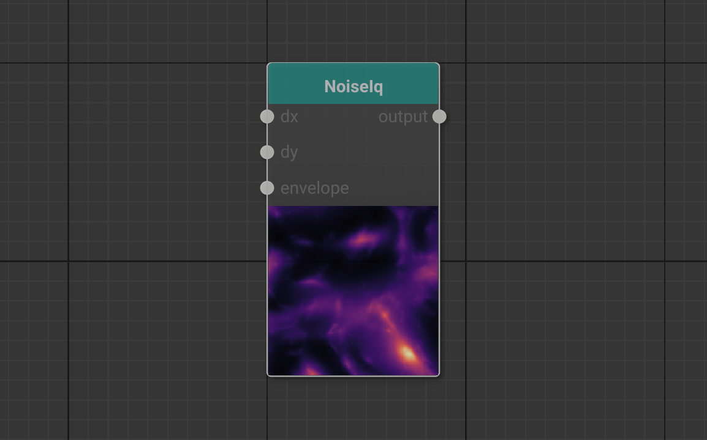  

### Category

Primitive/Coherent Noise  

### Inputs

|Name|Type|Description|
| :--- | :--- | :--- |
|dx|HeightMapData|Displacement with respect to the domain size (x-direction).|
|dy|HeightMapData|Displacement with respect to the domain size (y-direction).|
|envelope|HeightMapData|Output noise amplitude envelope.|
  

### Outputs

|Name|Type|Description|
| :--- | :--- | :--- |
|output|HeightMapData|Generated noise.|
  

### Parameters

|Name|Type|Description|
| :--- | :--- | :--- |
|gradient_scale|Float|Gradient influence scaling.|
|kw|Wavenumber|Noise wavenumbers (kx, ky) for each directions.|
|lacunarity|Float|Wavenumber ratio between each octaves.|
|noise_type|Enumeration|Base primitive noise. Available values: OpenSimplex2, OpenSimplex2S, Perlin, Perlin (billow), Perlin (half), Value, Value (cubic), Worley, Worley (doube), Worley (value).|
|octaves|Integer|Number of octaves.|
|persistence|Float|Octave persistence.|
|seed|Random seed|Random seed number.|
|weight|Float|Octave weighting.|

## NoiseJordan

NoiseJordan, variant of NoiseFbm.

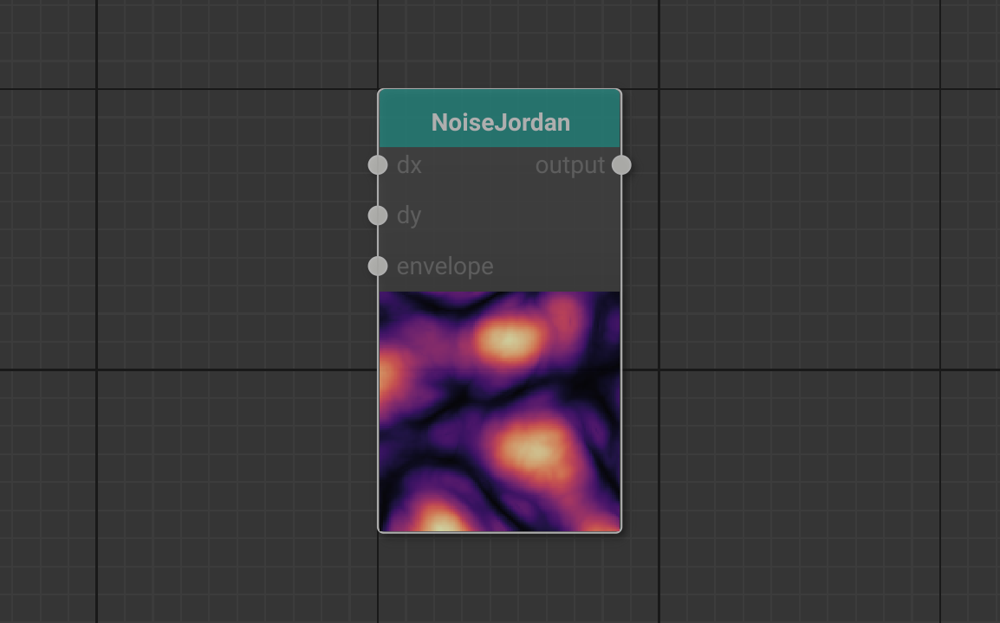  

### Category

Primitive/Coherent Noise  

### Inputs

|Name|Type|Description|
| :--- | :--- | :--- |
|dx|HeightMapData|Displacement with respect to the domain size (x-direction).|
|dy|HeightMapData|Displacement with respect to the domain size (y-direction).|
|envelope|HeightMapData|Output noise amplitude envelope.|
  

### Outputs

|Name|Type|Description|
| :--- | :--- | :--- |
|output|HeightMapData|Generated noise.|
  

### Parameters

|Name|Type|Description|
| :--- | :--- | :--- |
|damp0|Float|Damping initial value.|
|damp_scale|Float|Damping influence scaling.|
|kw|Wavenumber|Noise wavenumbers (kx, ky) for each directions.|
|lacunarity|Float|Wavenumber ratio between each octaves.|
|noise_type|Enumeration|Base primitive noise. Available values: OpenSimplex2, OpenSimplex2S, Perlin, Perlin (billow), Perlin (half), Value, Value (cubic), Worley, Worley (doube), Worley (value).|
|octaves|Integer|Number of octaves.|
|persistence|Float|Octave persistence.|
|seed|Random seed|Random seed number.|
|warp0|Float|Warping initial value.|
|warp_scale|Float|Warping influence scaling.|
|weight|Float|Octave weighting.|

## NoisePingpong

NoisePingPong, variant of NoiseFbm.

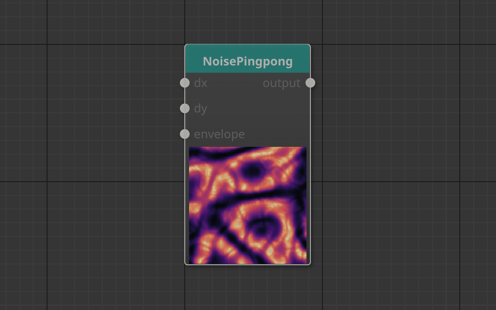  

### Category

Primitive/Coherent Noise  

### Inputs

|Name|Type|Description|
| :--- | :--- | :--- |
|dx|HeightMapData|Displacement with respect to the domain size (x-direction).|
|dy|HeightMapData|Displacement with respect to the domain size (y-direction).|
|envelope|HeightMapData|Output noise amplitude envelope.|
  

### Outputs

|Name|Type|Description|
| :--- | :--- | :--- |
|output|HeightMapData|Generated noise.|
  

### Parameters

|Name|Type|Description|
| :--- | :--- | :--- |
|kw|Wavenumber|Noise wavenumbers (kx, ky) for each directions.|
|lacunarity|Float|Wavenumber ratio between each octaves.|
|noise_type|Enumeration|Base primitive noise. Available values: OpenSimplex2, OpenSimplex2S, Perlin, Perlin (billow), Perlin (half), Value, Value (cubic), Worley, Worley (doube), Worley (value).|
|octaves|Integer|Number of octaves.|
|persistence|Float|Octave persistence.|
|seed|Random seed|Random seed number.|
|weight|Float|Octave weighting.|

## NoiseRidged

NoiseRidged, variant of NoiseFbm.

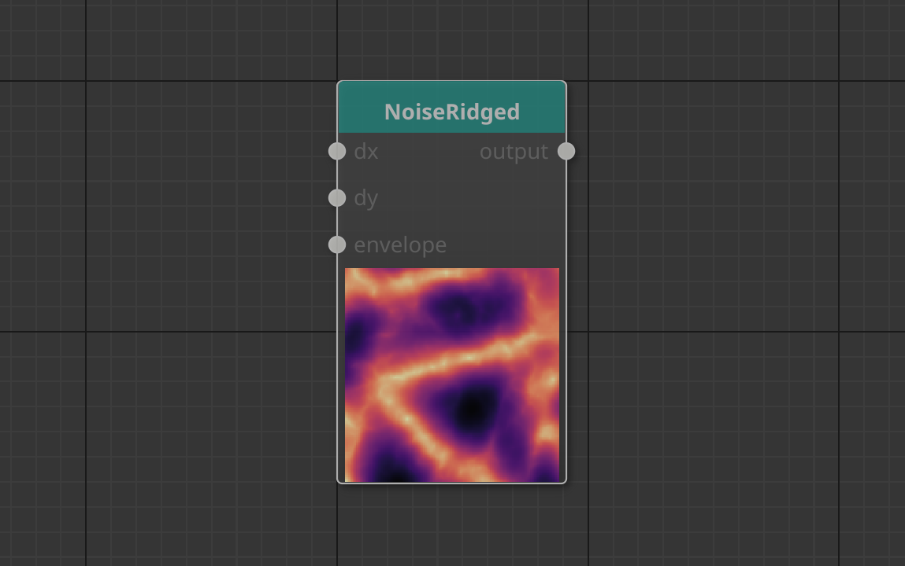  

### Category

Primitive/Coherent Noise  

### Inputs

|Name|Type|Description|
| :--- | :--- | :--- |
|dx|HeightMapData|Displacement with respect to the domain size (x-direction).|
|dy|HeightMapData|Displacement with respect to the domain size (y-direction).|
|envelope|HeightMapData|Output noise amplitude envelope.|
  

### Outputs

|Name|Type|Description|
| :--- | :--- | :--- |
|output|HeightMapData|Generated noise.|
  

### Parameters

|Name|Type|Description|
| :--- | :--- | :--- |
|k_smoothing|Float|Smoothing coefficient of the aboslute value.|
|kw|Wavenumber|Noise wavenumbers (kx, ky) for each directions.|
|lacunarity|Float|Wavenumber ratio between each octaves.|
|noise_type|Enumeration|Base primitive noise. Available values: OpenSimplex2, OpenSimplex2S, Perlin, Perlin (billow), Perlin (half), Value, Value (cubic), Worley, Worley (doube), Worley (value).|
|octaves|Integer|Number of octaves.|
|persistence|Float|Octave persistence.|
|seed|Random seed|Random seed number.|
|weight|Float|Octave weighting.|

## NoiseSwiss

NoiseSwiss, variant of NoiseFbm.

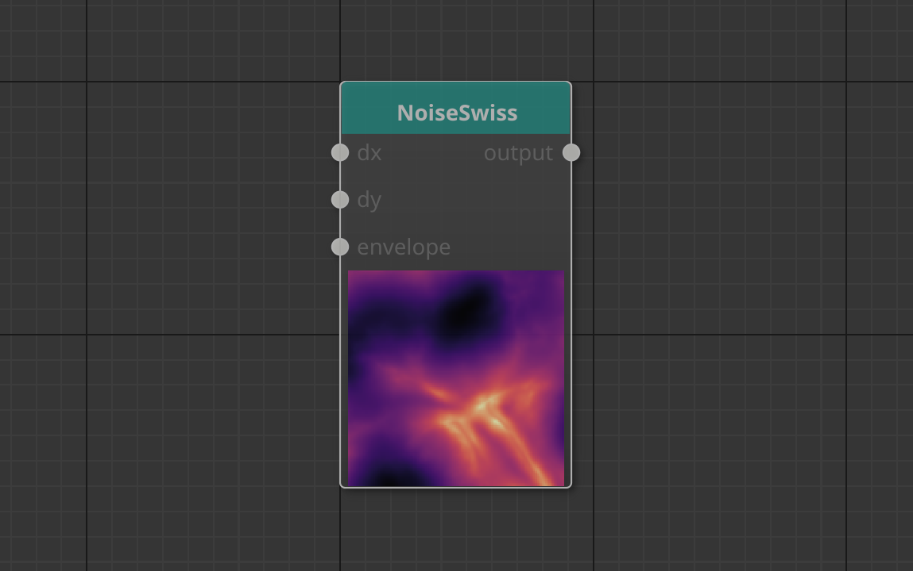  

### Category

Primitive/Coherent Noise  

### Inputs

|Name|Type|Description|
| :--- | :--- | :--- |
|dx|HeightMapData|Displacement with respect to the domain size (x-direction).|
|dy|HeightMapData|Displacement with respect to the domain size (y-direction).|
|envelope|HeightMapData|Output noise amplitude envelope.|
  

### Outputs

|Name|Type|Description|
| :--- | :--- | :--- |
|output|HeightMapData|Generated noise.|
  

### Parameters

|Name|Type|Description|
| :--- | :--- | :--- |
|kw|Wavenumber|Noise wavenumbers (kx, ky) for each directions.|
|lacunarity|Float|Wavenumber ratio between each octaves.|
|noise_type|Enumeration|Base primitive noise. Available values: OpenSimplex2, OpenSimplex2S, Perlin, Perlin (billow), Perlin (half), Value, Value (cubic), Worley, Worley (doube), Worley (value).|
|octaves|Integer|Number of octaves.|
|persistence|Float|Octave persistence.|
|seed|Random seed|Random seed number.|
|warp_scale|Float|Warping influence scaling.|
|weight|Float|Octave weighting.|

## NormalDisplacement

NormalDisplacement applies a displacement to the terrain along the normal direction.

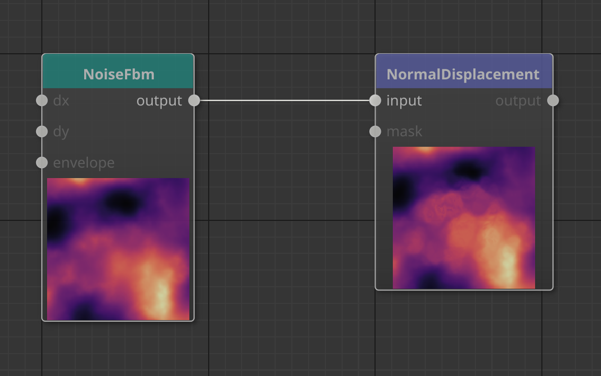  

### Category

Filter/Recast  

### Inputs

|Name|Type|Description|
| :--- | :--- | :--- |
|input|HeightMapData|Input heightmap.|
|mask|HeightMapData|Mask defining the filtering intensity (expected in [0, 1]).|
  

### Outputs

|Name|Type|Description|
| :--- | :--- | :--- |
|output|HeightMapData|Output heightmap.|
  

### Parameters

|Name|Type|Description|
| :--- | :--- | :--- |
|amount|Float|Displacement scaling.|
|iterations|Integer|Number of successive use of the operator.|
|radius|Float|Filter radius with respect to the domain size.|
|reverse|Bool|Reverse displacement direction.|

## Opening

Opening is a combination of erosion followed by dilation. It is primarily used for removing noise while preserving the shape and size of objects. Use Cases: Noise removal: Opening is effective in removing small, isolated noise regions while keeping the main objects intact. Smoothing object boundaries: Opening can help smooth the boundaries of objects in an image while preserving their overall shape.

  

### Category

Operator/Morphology  

### Inputs

|Name|Type|Description|
| :--- | :--- | :--- |
|input|HeightMapData|Input heightmap.|
  

### Outputs

|Name|Type|Description|
| :--- | :--- | :--- |
|output|HeightMapData|Dilated heightmap.|
  

### Parameters

|Name|Type|Description|
| :--- | :--- | :--- |
|radius|Float|Filter radius with respect to the domain size.|

## Path

Polyline definition.

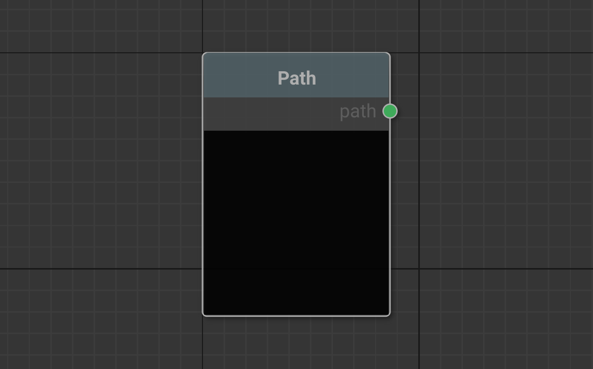  

### Category

Geometry/Path  

### Inputs

|Name|Type|Description|
| :--- | :--- | :--- |
  

### Outputs

|Name|Type|Description|
| :--- | :--- | :--- |
|path|PathData|Set of directed points (x, y) and elevations z.|
  

### Parameters

|Name|Type|Description|
| :--- | :--- | :--- |
|closed|Bool|Decides whether the path is open and closed on itself.|
|path|HighMap Path object|Path data.|

## PathBezier

PathBezier uses Bezier interpolation to replace sharp angles and straight segments with smooth, flowing curves.

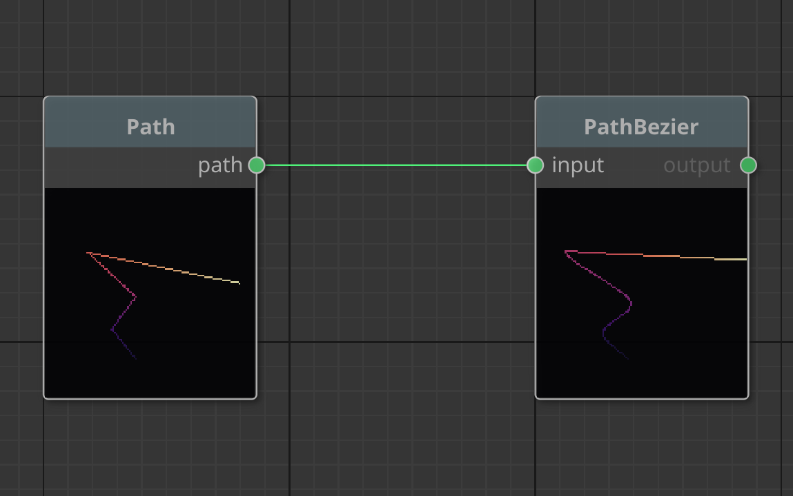  

### Category

Geometry/Path  

### Inputs

|Name|Type|Description|
| :--- | :--- | :--- |
|input|PathData|Input path.|
  

### Outputs

|Name|Type|Description|
| :--- | :--- | :--- |
|output|PathData|Output path.|
  

### Parameters

|Name|Type|Description|
| :--- | :--- | :--- |
|curvature_ratio|Float|Amount of curvature (usually in [-1, 1] and commonly > 0).|
|edge_divisions|Integer|Edge sub-divisions of each edge. After the operation, the path is remeshed based on this new sub-division.|

## PathBezierRound

PathBezierRound uses Bezier interpolation to replace sharp angles and straight segments with smooth, round and flowing curves. PathBezierRound is an alternative to PathBezier.

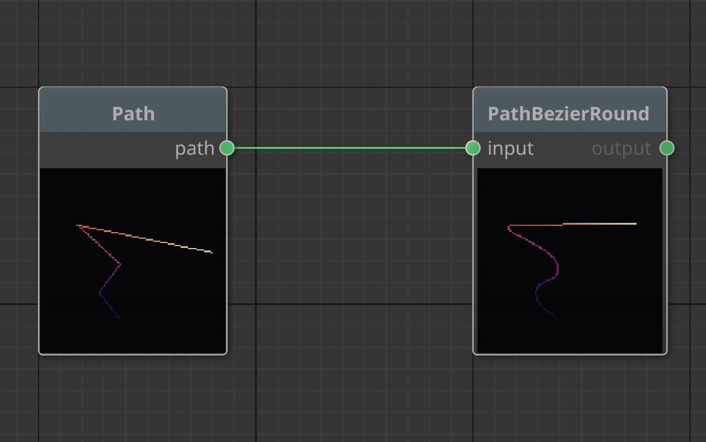  

### Category

Geometry/Path  

### Inputs

|Name|Type|Description|
| :--- | :--- | :--- |
|input|PathData|Input path.|
  

### Outputs

|Name|Type|Description|
| :--- | :--- | :--- |
|output|PathData|Output path.|
  

### Parameters

|Name|Type|Description|
| :--- | :--- | :--- |
|curvature_ratio|Float|Amount of curvature (usually in [-1, 1] and commonly > 0).|
|edge_divisions|Integer|Edge sub-divisions of each edge. After the operation, the path is remeshed based on this new sub-division.|

## PathBspline

PathBspline uses Bspline interpolation to replace sharp angles and straight segments with smooth, flowing curves.

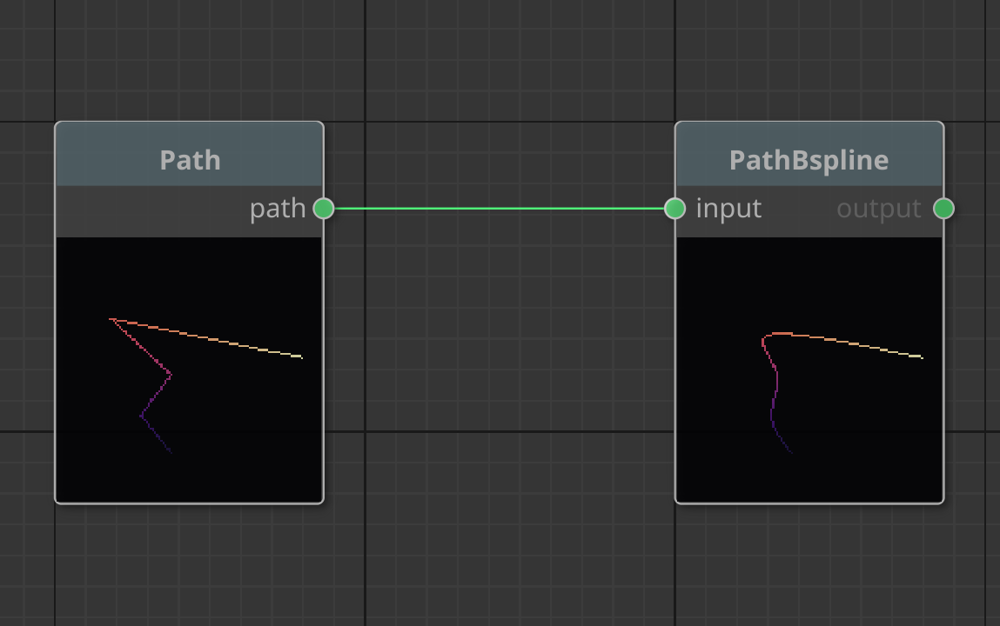  

### Category

Geometry/Path  

### Inputs

|Name|Type|Description|
| :--- | :--- | :--- |
|input|PathData|Input path.|
  

### Outputs

|Name|Type|Description|
| :--- | :--- | :--- |
|output|PathData|Output path.|
  

### Parameters

|Name|Type|Description|
| :--- | :--- | :--- |
|edge_divisions|Integer|Edge sub-divisions of each edge. After the operation, the path is remeshed based on this new sub-division.|

## PathFractalize

PathFractalize fractalizes a polyline using a mid-point displacement algorithm. The procedure involves iteratively modifying the polyline's geometry to increase its complexity, mimicking fractal characteristics.

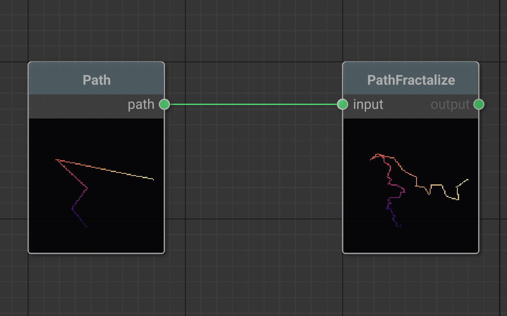  

### Category

Geometry/Path  

### Inputs

|Name|Type|Description|
| :--- | :--- | :--- |
|input|PathData|Input path.|
  

### Outputs

|Name|Type|Description|
| :--- | :--- | :--- |
|output|PathData|Output path.|
  

### Parameters

|Name|Type|Description|
| :--- | :--- | :--- |
|iterations|Integer|Number of mid-point displacement iterations.|
|orientation|Integer|Displacement orientation (0 for random inward/outward displacement, 1 to inflate the path and -1 to deflate the path).|
|persistence|Float|Noise persistence (with iteration number).|
|seed|Random seed|Random seed number.|
|sigma|Float|Half-width of the random Gaussian displacement, normalized by the distance between points.|

## PathSDF

PathSDF evaluates the signed distance function of a polyline. It assigns a signed distance value to every point in space. For points outside the polyline, the distance is positive, while for points inside, it's negative. The zero level set of this function precisely defines the polyline's path Project path points to an heightmap.

  

### Category

Geometry/Path  

### Inputs

|Name|Type|Description|
| :--- | :--- | :--- |
|path|PathData|Input path.|
  

### Outputs

|Name|Type|Description|
| :--- | :--- | :--- |
|sdf|HeightMapData|Signed distance as an heightmap.|
  

### Parameters

|Name|Type|Description|
| :--- | :--- | :--- |

## PathToHeightmap

PathToHeightmap Project path points to an heightmap.

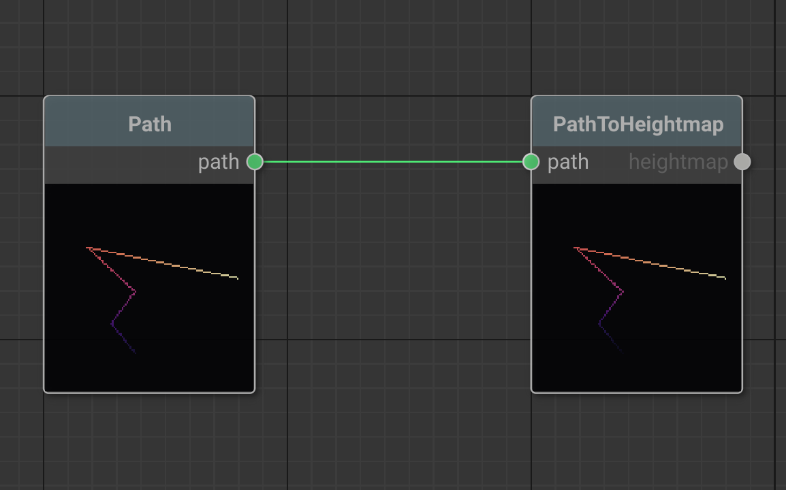  

### Category

Geometry/Path  

### Inputs

|Name|Type|Description|
| :--- | :--- | :--- |
|path|PathData|Input path.|
  

### Outputs

|Name|Type|Description|
| :--- | :--- | :--- |
|heightmap|HeightMapData|Output heightmap.|
  

### Parameters

|Name|Type|Description|
| :--- | :--- | :--- |
|filled|Bool|Whether the resulting path contour is filled (input Path needs to be closed).|

## Plateau

Plateau node manipulates the elevation values to create flats, elevated regions surrounded by steep slopes.

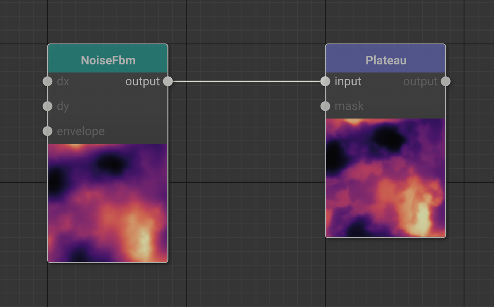  

### Category

Filter/Recurve  

### Inputs

|Name|Type|Description|
| :--- | :--- | :--- |
|input|HeightMapData|Input heightmap.|
|mask|HeightMapData|Mask defining the filtering intensity (expected in [0, 1]).|
  

### Outputs

|Name|Type|Description|
| :--- | :--- | :--- |
|output|HeightMapData|Filtered heightmap.|
  

### Parameters

|Name|Type|Description|
| :--- | :--- | :--- |
|factor|Float|Influence the cliff elevation profile.|
|radius|Float|Filter radius with respect to the domain size.|

## QuiltingExpand

QuiltingExpand is an operator based on quilting that changes the feature wavenumber of a heightmap by modifying the frequency or scale of features present in the heightmap using a quilting-like technique. This operator allows for the synthesis of heightmaps with different levels of detail or spatial frequency content.

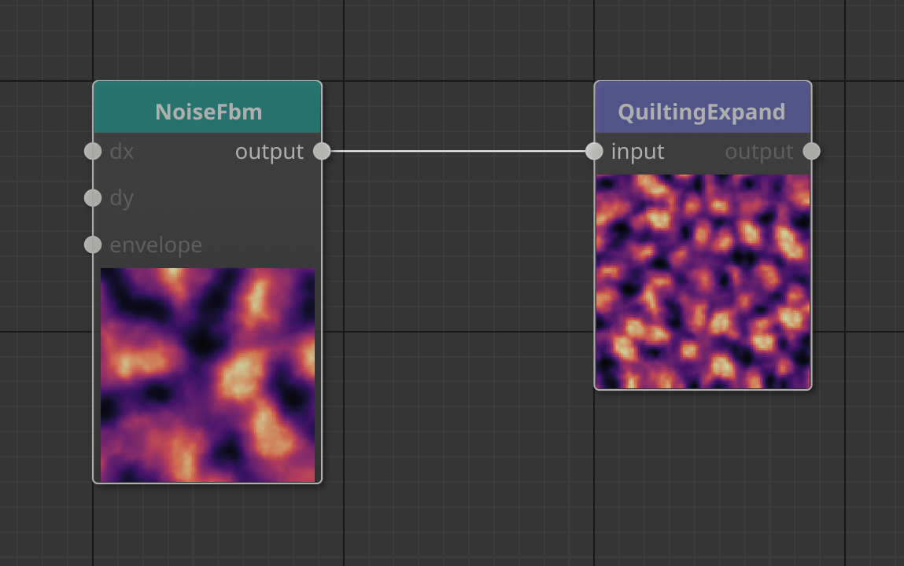  

### Category

Operator/Expand  

### Inputs

|Name|Type|Description|
| :--- | :--- | :--- |
|input|HeightMapData|Input heightmap.|
  

### Outputs

|Name|Type|Description|
| :--- | :--- | :--- |
|output|HeightMapData|Synthetized heightmap.|
  

### Parameters

|Name|Type|Description|
| :--- | :--- | :--- |
|expansion_ratio|Float|Determine the features expansion ratio of the new heightmap.|
|filter_width_ratio|Float|Smooth filter width with respect the overlap length.|
|overlap|Float|Overlap ratio between patches.|
|patch_flip|Bool|Allow patch flipping.|
|patch_rotate|Bool|Allow patch 90 degree rotation.|
|patch_transpose|Bool|Allow patch tranposition.|
|patch_width|Float|Decide on the size (with respect to the domain size) of the patches that will be used to create the new heightmap. This determines the level of detail and texture in the final result.|
|seed|Random seed|Random seed number.|

## QuiltingShuffle

QuiltingShuffle performs a quilting procedure and generates a new image by seamlessly stitching together patches from an existing image.

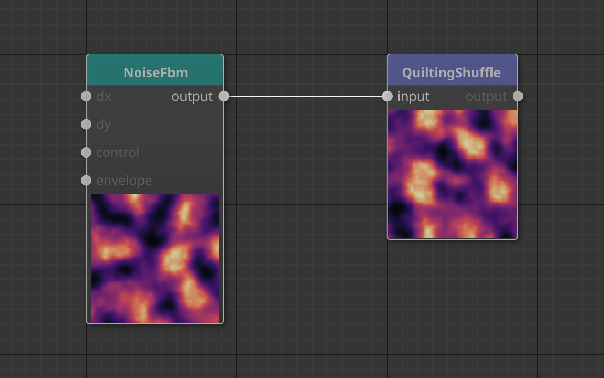  

### Category

Operator/Resynthesis  

### Inputs

|Name|Type|Description|
| :--- | :--- | :--- |
|input|HeightMapData|Input heightmap.|
  

### Outputs

|Name|Type|Description|
| :--- | :--- | :--- |
|output|HeightMapData|Synthetized heightmap.|
  

### Parameters

|Name|Type|Description|
| :--- | :--- | :--- |
|filter_width_ratio|Float|Smooth filter width with respect the overlap length.|
|overlap|Float|Overlap ratio between patches.|
|patch_flip|Bool|Allow patch flipping.|
|patch_rotate|Bool|Allow patch 90 degree rotation.|
|patch_transpose|Bool|Allow patch tranposition.|
|patch_width|Float|Decide on the size (with respect to the domain size) of the patches that will be used to create the new heightmap. This determines the level of detail and texture in the final result.|
|seed|Random seed|Random seed number.|

## RecastCliff

RecastCliff add cliffs in a heightmap by introducing sharp changes in elevation to simulate steep vertical terrain features such as cliffs or escarpments.

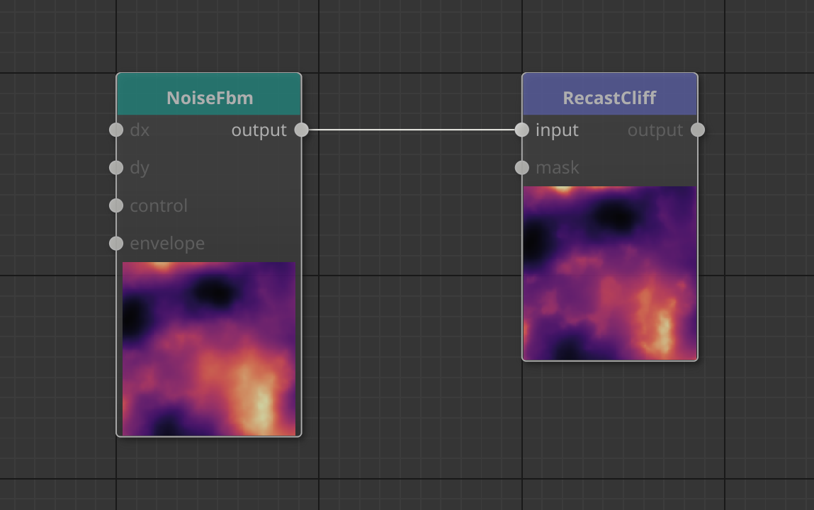  

### Category

Filter/Recast  

### Inputs

|Name|Type|Description|
| :--- | :--- | :--- |
|input|HeightMapData|Input heightmap.|
|mask|HeightMapData|Mask defining the filtering intensity (expected in [0, 1]).|
  

### Outputs

|Name|Type|Description|
| :--- | :--- | :--- |
|output|HeightMapData|Filtered heightmap.|
  

### Parameters

|Name|Type|Description|
| :--- | :--- | :--- |
|amplitude|Float|Cliff amplitude.|
|gain|Float|Gain, influence the cliff elevation profile.|
|radius|Float|Filter influence radius.|
|talus_global|Float|Reference talus at which the cliff are added.|

## RecurveKura

RecurveKura is an operator based on the Kumaraswamy distribution that can be used to adjust the amplitude levels of a dataset.

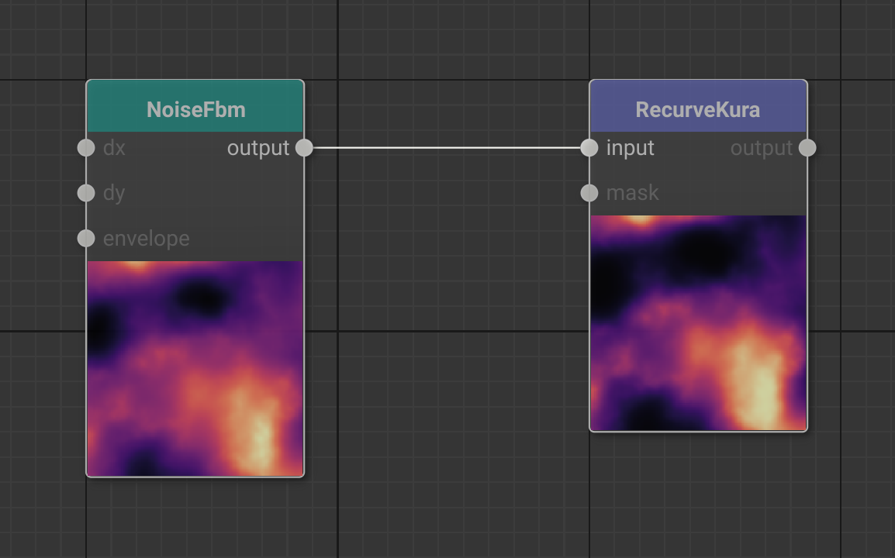  

### Category

Filter/Recurve  

### Inputs

|Name|Type|Description|
| :--- | :--- | :--- |
|input|HeightMapData|Input heightmap.|
|mask|HeightMapData|Mask defining the filtering intensity (expected in [0, 1]).|
  

### Outputs

|Name|Type|Description|
| :--- | :--- | :--- |
|output|HeightMapData|Filtered heightmap.|
  

### Parameters

|Name|Type|Description|
| :--- | :--- | :--- |
|a|Float|Primarily controls the rightward skewness and tail behavior of the distribution.|
|b|Float|Primarily controls the leftward skewness and tail behavior.|

## RecurveS

RecurveS applied a curve adjustment filter using a smooth S-shape curve.

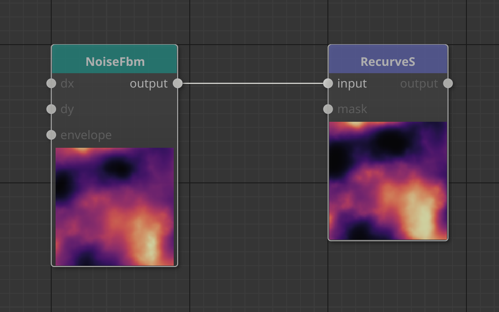  

### Category

Filter/Recurve  

### Inputs

|Name|Type|Description|
| :--- | :--- | :--- |
|input|HeightMapData|Input heightmap.|
|mask|HeightMapData|Mask defining the filtering intensity (expected in [0, 1]).|
  

### Outputs

|Name|Type|Description|
| :--- | :--- | :--- |
|output|HeightMapData|Filtered heightmap.|
  

### Parameters

|Name|Type|Description|
| :--- | :--- | :--- |

## RelativeElevation

RelativeElevation identifies heightmap relative elevation based on the surrounding heightmap values.

  

### Category

Features  

### Inputs

|Name|Type|Description|
| :--- | :--- | :--- |
|input|HeightMapData|Input heightmap.|
  

### Outputs

|Name|Type|Description|
| :--- | :--- | :--- |
|output|HeightMapData|Relative elevation.|
  

### Parameters

|Name|Type|Description|
| :--- | :--- | :--- |
|radius|Float|Filter radius with respect to the domain size.|

## Remap

The Remap operator is used to adjust the elevation values across the entire dataset, effectively changing the range of elevation data to match a desired output scale or to normalize the data.

  

### Category

Filter/Range  

### Inputs

|Name|Type|Description|
| :--- | :--- | :--- |
|input|HeightMapData|Input heightmap.|
  

### Outputs

|Name|Type|Description|
| :--- | :--- | :--- |
|output|HeightMapData|Remapped heightmap.|
  

### Parameters

|Name|Type|Description|
| :--- | :--- | :--- |
|remap|Value range|Target range: define the new minimum and maximum values to remap the elevation values to.|

## Rescale

The Rescale operator involves adjusting each data point by multiplying it with a predetermined constant.

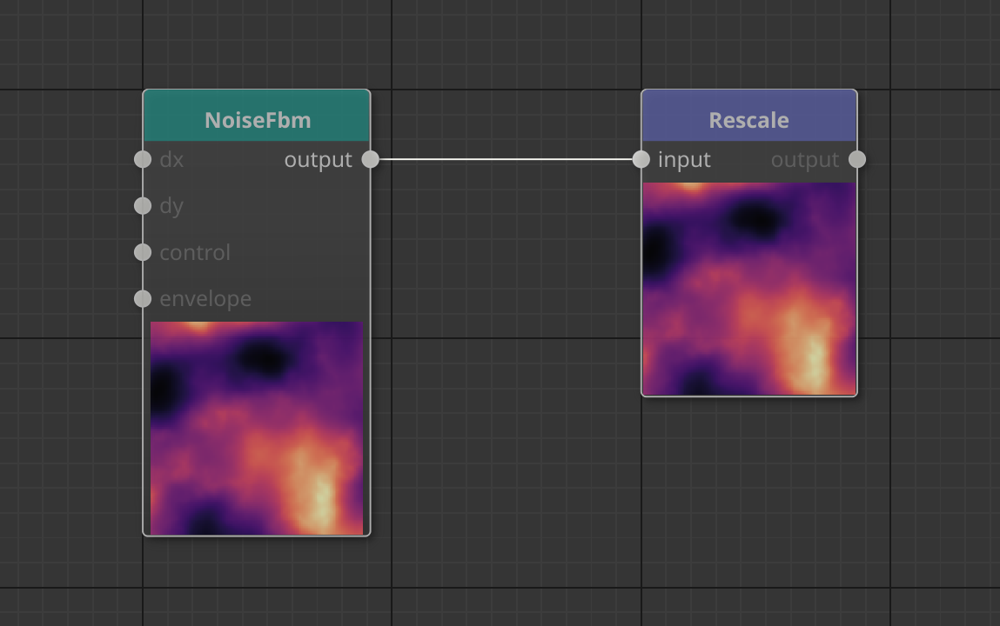  

### Category

Filter/Range  

### Inputs

|Name|Type|Description|
| :--- | :--- | :--- |
|input|HeightMapData|Input heightmap.|
  

### Outputs

|Name|Type|Description|
| :--- | :--- | :--- |
|output|HeightMapData|Rescaled heightmap.|
  

### Parameters

|Name|Type|Description|
| :--- | :--- | :--- |
|centered|Bool|Determine whether a mean offset is applied to the values to center the scaling.|
|scaling|Float|Constant by which each elevation values will be multiplied.|

## Rugosity

Rugosity identifies heightmap rugosity, i.e. the roughness or irregularity of the surface.

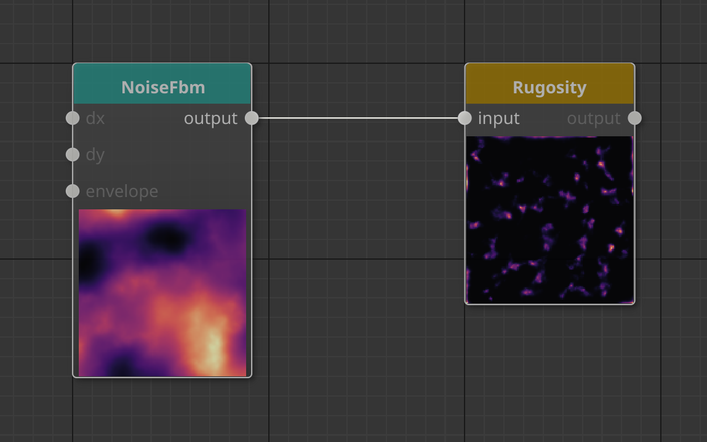  

### Category

Features  

### Inputs

|Name|Type|Description|
| :--- | :--- | :--- |
|input|HeightMapData|Input heightmap.|
  

### Outputs

|Name|Type|Description|
| :--- | :--- | :--- |
|output|HeightMapData|Rugosity.|
  

### Parameters

|Name|Type|Description|
| :--- | :--- | :--- |
|clamp_max|Bool|Decides whether the rugosity values are clamped.|
|radius|Float|Filter radius with respect to the domain size.|
|vc_max|Float|Rugosity clamping upper bound.|

## Saturate

Saturate limits the amplitude of a signal to a predefined range while keeping the initial input range.

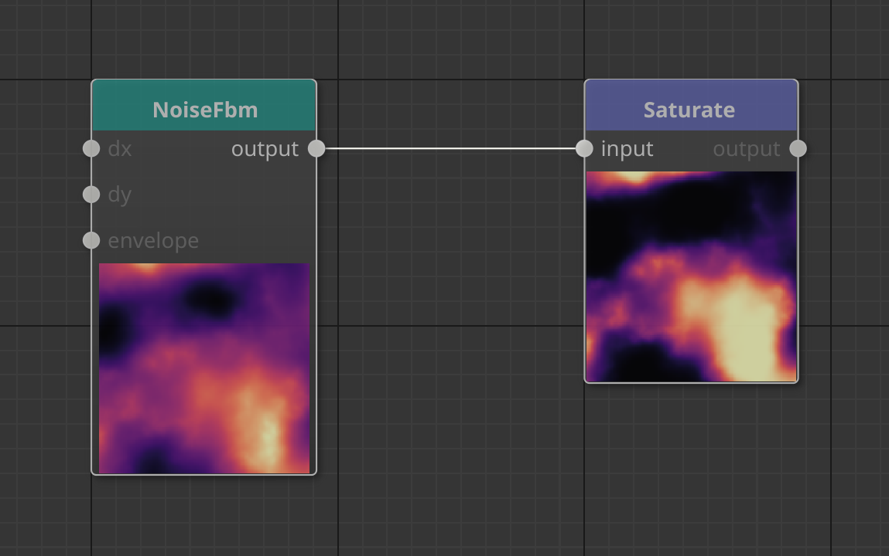  

### Category

Filter/Recurve  

### Inputs

|Name|Type|Description|
| :--- | :--- | :--- |
|input|HeightMapData|Input heightmap.|
  

### Outputs

|Name|Type|Description|
| :--- | :--- | :--- |
|output|HeightMapData|Saturated heightmap.|
  

### Parameters

|Name|Type|Description|
| :--- | :--- | :--- |
|k_smoothing|Float|Smoothing intensity.|
|range|Value range|Saturation range: define the minimum and maximum values of the saturation process.|

## ScanMask

ScanMask adjusts the brightness and contrast of an input mask.

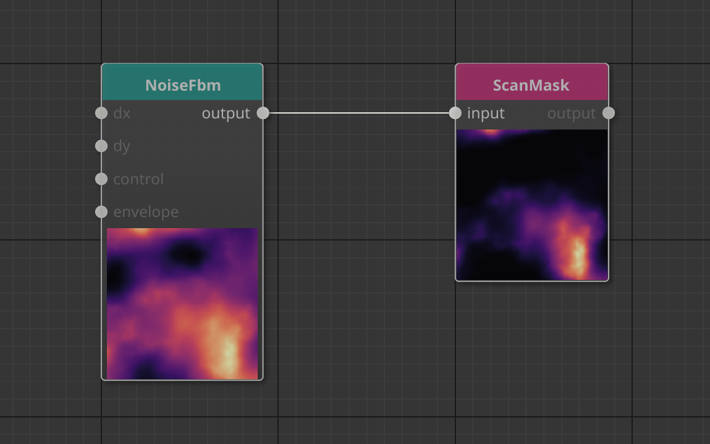  

### Category

Mask/Adjust  

### Inputs

|Name|Type|Description|
| :--- | :--- | :--- |
|input|HeightMapData|Input heightmap.|
  

### Outputs

|Name|Type|Description|
| :--- | :--- | :--- |
|output|HeightMapData|Adjusted heightmap.|
  

### Parameters

|Name|Type|Description|
| :--- | :--- | :--- |
|brightness|Float|Brightness adjustment.|
|contrast|Float|Contrast adjustment.|

## SelectCavities

SelectCavities analyzes the curvature of an heightmap to identify concave or convex features such as valleys, depressions, ridges, or peaks.

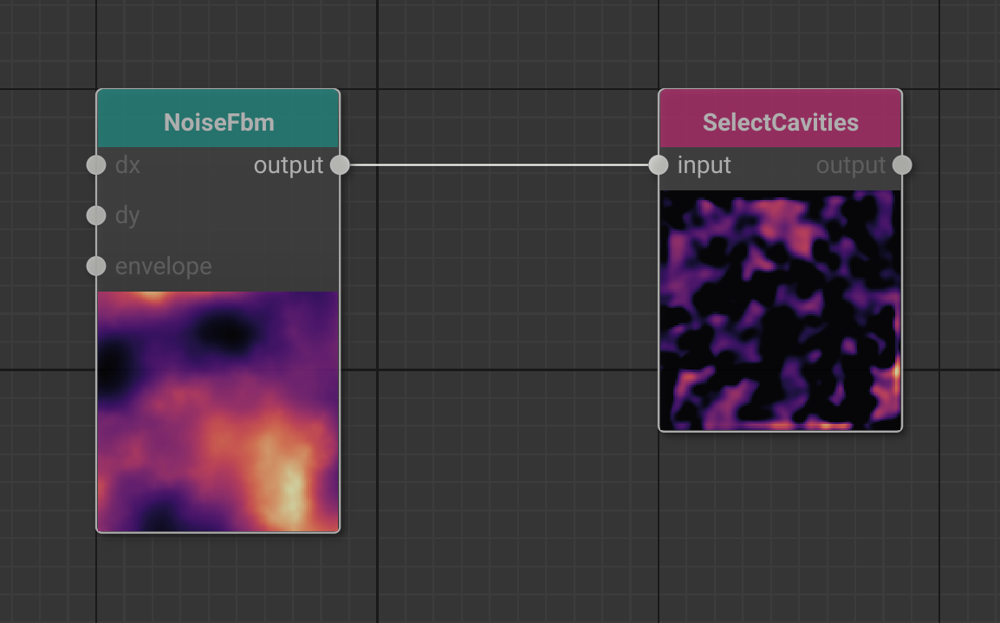  

### Category

Mask/Selector  

### Inputs

|Name|Type|Description|
| :--- | :--- | :--- |
|input|HeightMapData|Input heightmap.|
  

### Outputs

|Name|Type|Description|
| :--- | :--- | :--- |
|output|HeightMapData|Mask heightmap (in [0, 1]).|
  

### Parameters

|Name|Type|Description|
| :--- | :--- | :--- |
|concave|Bool|Decides whether concave or convex features are detected.|
|radius|Float|Detection radius with respect to the domain size.|

## SelectGt

SelectGt is a thresholding operator. It transforms an input heightmap into a binary heightmap, where each pixel is assigned either a value of 0 or 1, depending on whether its intensity value surpasses a specified threshold value.

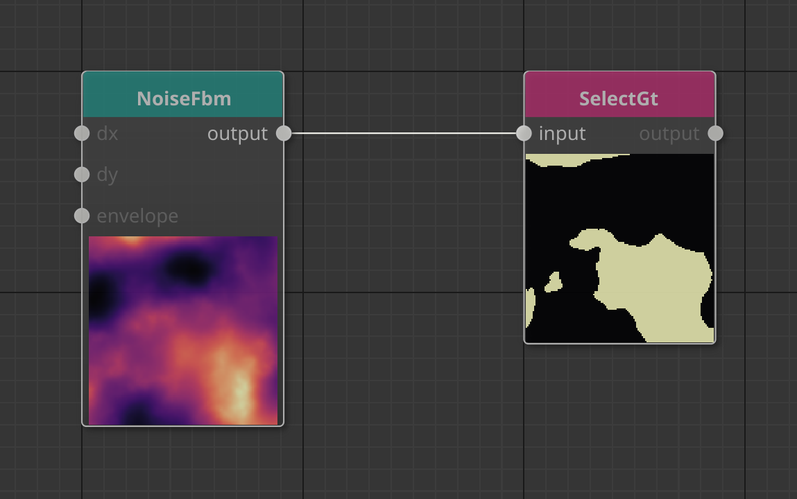  

### Category

Mask/Selector  

### Inputs

|Name|Type|Description|
| :--- | :--- | :--- |
|input|HeightMapData|Input heightmap.|
  

### Outputs

|Name|Type|Description|
| :--- | :--- | :--- |
|output|HeightMapData|Mask heightmap (in [0, 1]).|
  

### Parameters

|Name|Type|Description|
| :--- | :--- | :--- |
|value|Float|Selection value.|

## SelectInterval

SelectInterval is a thresholding operator. It transforms an input heightmap into a binary heightmap, where each pixel is assigned either a value of 0 or 1, depending on whether its intensity value is within an interval of values.

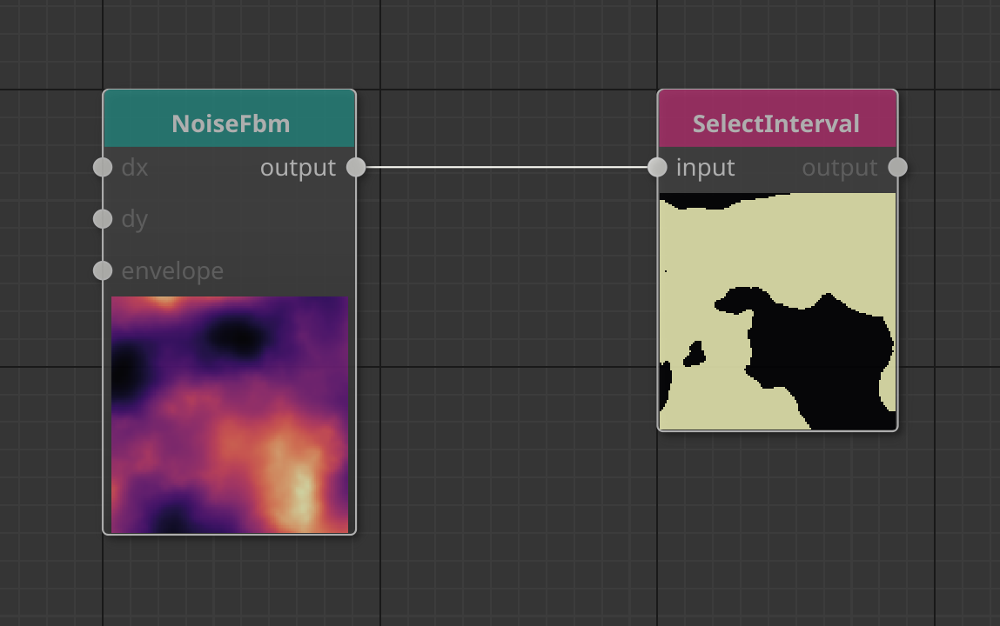  

### Category

Mask/Selector  

### Inputs

|Name|Type|Description|
| :--- | :--- | :--- |
|input|HeightMapData|Input heightmap.|
  

### Outputs

|Name|Type|Description|
| :--- | :--- | :--- |
|output|HeightMapData|Mask heightmap (in [0, 1]).|
  

### Parameters

|Name|Type|Description|
| :--- | :--- | :--- |
|value1|Float|Selection value, lower bound.|
|value2|Float|Selection value, upper bound.|

## SelectPulse

SelectPulse is a thresholding operator. It selects values within a specified range defined by the shape of a Gaussian pulse.

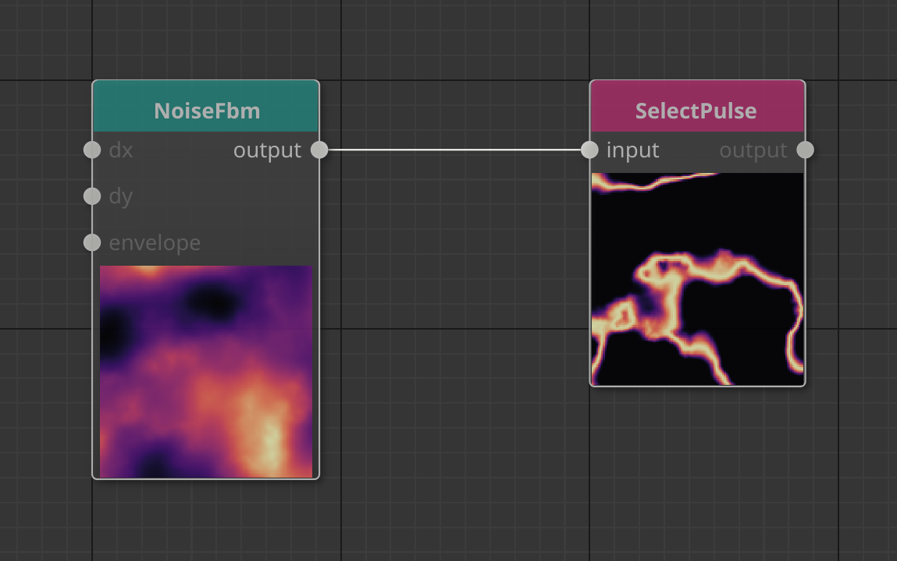  

### Category

Mask/Selector  

### Inputs

|Name|Type|Description|
| :--- | :--- | :--- |
|input|HeightMapData|Input heightmap.|
  

### Outputs

|Name|Type|Description|
| :--- | :--- | :--- |
|output|HeightMapData|Mask heightmap (in [0, 1]).|
  

### Parameters

|Name|Type|Description|
| :--- | :--- | :--- |
|sigma|Float|Selection half-width.|
|value|Float|Selection center value.|

## SetAlpha

SetAlpha adjusts the transparency of a texture based on an input alpha value, which can either be a single scalar or an array. When provided with a scalar alpha value, the function uniformly adjusts the transparency of the entire texture. Alternatively, when given an array of alpha values, it enables fine-grained control over the transparency of different parts of the texture, allowing for varied opacity across the texture's surface.

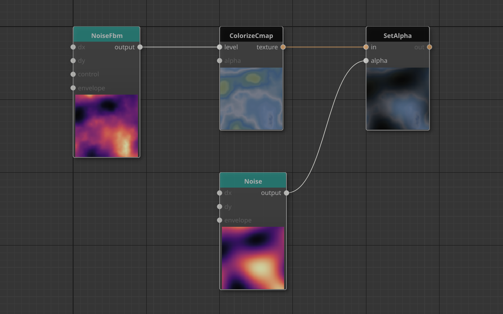  

### Category

Texture  

### Inputs

|Name|Type|Description|
| :--- | :--- | :--- |
|in|HeightMapRGBAData|Input texture.|
|alpha|HeightMapData|Transparency (expected to be in [0, 1]).|
  

### Outputs

|Name|Type|Description|
| :--- | :--- | :--- |
|out|HeightMapRGBAData|Texture with new transparency.|
  

### Parameters

|Name|Type|Description|
| :--- | :--- | :--- |
|alpha|Float|Transparency as a scalar value (overriden if this alpha input is set).|
|clamp_alpha|Bool|Clamp to [0, 1] to input alpha map.|

## SharpenCone

SharpenCone is a cone kernel-based sharpen operator enhancing sharpness by emphasizing edges and fine details using a radial gradient shape.

  

### Category

Filter/Smoothing  

### Inputs

|Name|Type|Description|
| :--- | :--- | :--- |
|input|HeightMapData|Input heightmap.|
|mask|HeightMapData|Mask defining the filtering intensity (expected in [0, 1]).|
  

### Outputs

|Name|Type|Description|
| :--- | :--- | :--- |
|output|HeightMapData|Filtered heightmap.|
  

### Parameters

|Name|Type|Description|
| :--- | :--- | :--- |
|radius|Float|Filter radius with respect to the domain size.|
|scale|Float|Sharpening intensity.|

## Slope

Slope is function used to represent continuous terrain slope.

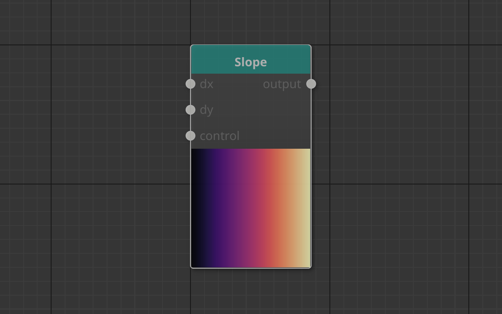  

### Category

Primitive/Function  

### Inputs

|Name|Type|Description|
| :--- | :--- | :--- |
|dr|HeightMapData|Displacement with respect to the domain size (normal direction).|
  

### Outputs

|Name|Type|Description|
| :--- | :--- | :--- |
|output|HeightMapData|Slope heightmap.|
  

### Parameters

|Name|Type|Description|
| :--- | :--- | :--- |
|angle|Float|Angle.|
|center.x|Float|Center x coordinate.|
|center.y|Float|Center y coordinate.|
|talus_global|Float|Slope slope...|

## SmoothCpulse

Smoothing using a cubic pulse kernel can be considered somewhat similar to Gaussian smoothing. This technique is used to reduce noise and smooth data. The cubic pulse kernel has a cubic decrease in influence with distance within a finite interval. It is zero beyond a certain radius, providing a compact support that affects only nearby points.

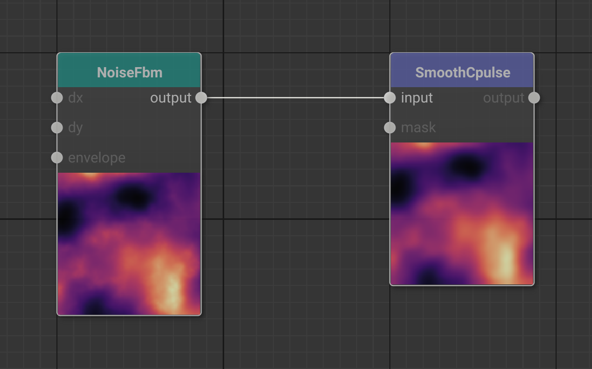  

### Category

Filter/Smoothing  

### Inputs

|Name|Type|Description|
| :--- | :--- | :--- |
|input|HeightMapData|Input heightmap.|
|mask|HeightMapData|Mask defining the filtering intensity (expected in [0, 1]).|
  

### Outputs

|Name|Type|Description|
| :--- | :--- | :--- |
|output|HeightMapData|Filtered heightmap.|
  

### Parameters

|Name|Type|Description|
| :--- | :--- | :--- |
|radius|Float|Filter radius with respect to the domain size.|

## SmoothFill

SmoothFill is a smoothing technique that takes the maximum between the input and the filtered field to simulate a sediment deposition effect.

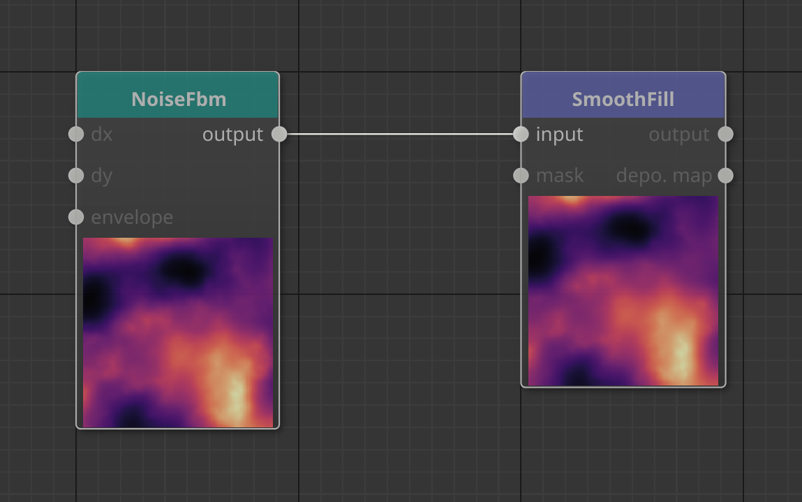  

### Category

Filter/Smoothing  

### Inputs

|Name|Type|Description|
| :--- | :--- | :--- |
|input|HeightMapData|Input heightmap.|
|mask|HeightMapData|Mask defining the filtering intensity (expected in [0, 1]).|
  

### Outputs

|Name|Type|Description|
| :--- | :--- | :--- |
|output|HeightMapData|Filtered heightmap.|
|depo. map|HeightMapData|Deposition map.|
  

### Parameters

|Name|Type|Description|
| :--- | :--- | :--- |
|k|Float|Smoothing intensity of the maximum operator.|
|normalized_map|Bool|Decides if the deposition map is normalized.|
|radius|Float|Filter radius with respect to the domain size.|

## SmoothFillHoles

SmoothFillHoles is a smoothing technique that restricts smoothing effect to convex regions.

  

### Category

Filter/Smoothing  

### Inputs

|Name|Type|Description|
| :--- | :--- | :--- |
|input|HeightMapData|Input heightmap.|
|mask|HeightMapData|Mask defining the filtering intensity (expected in [0, 1]).|
  

### Outputs

|Name|Type|Description|
| :--- | :--- | :--- |
|output|HeightMapData|Filtered heightmap.|
  

### Parameters

|Name|Type|Description|
| :--- | :--- | :--- |
|radius|Float|Filter radius with respect to the domain size.|

## SmoothFillSmearPeaks

SmoothFillSmearPeaks is a smoothing technique that restricts smoothing effect to concave regions.

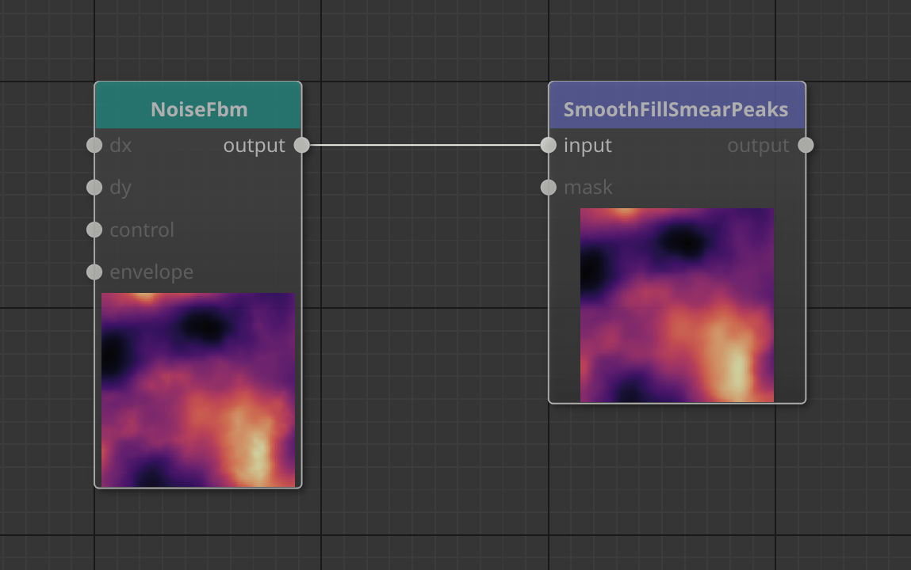  

### Category

Filter/Smoothing  

### Inputs

|Name|Type|Description|
| :--- | :--- | :--- |
|input|HeightMapData|Input heightmap.|
|mask|HeightMapData|Mask defining the filtering intensity (expected in [0, 1]).|
  

### Outputs

|Name|Type|Description|
| :--- | :--- | :--- |
|output|HeightMapData|Filtered heightmap.|
  

### Parameters

|Name|Type|Description|
| :--- | :--- | :--- |
|radius|Float|Filter radius with respect to the domain size.|

## Smoothstep3

Apply a 3rd-order smoothstep function to every values.

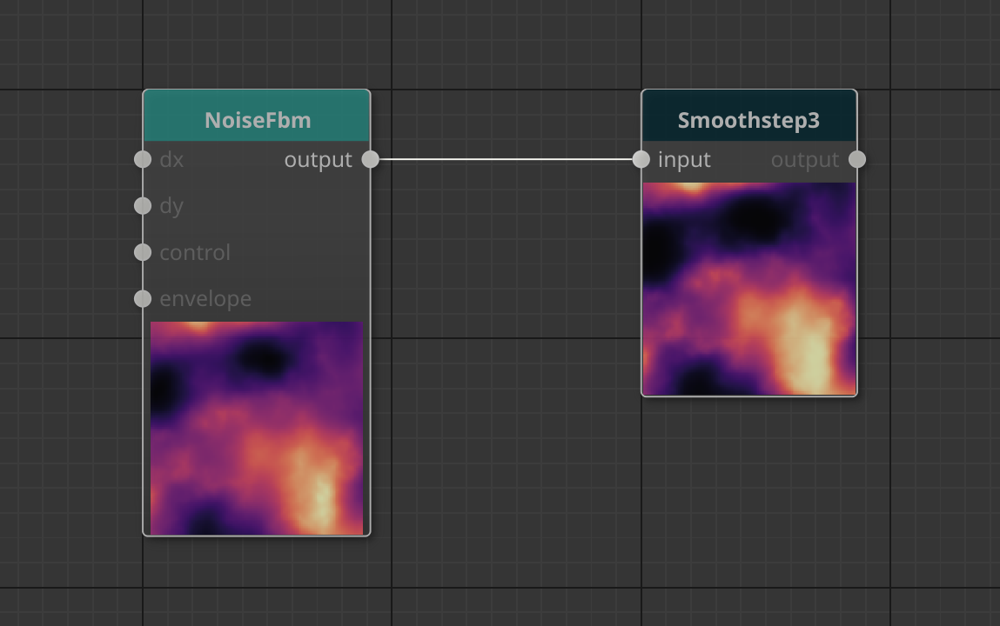  

### Category

Math/Base  

### Inputs

|Name|Type|Description|
| :--- | :--- | :--- |
|input|HeightMapData|Input heightmap.|
  

### Outputs

|Name|Type|Description|
| :--- | :--- | :--- |
|output|HeightMapData|Output heightmap.|
  

### Parameters

|Name|Type|Description|
| :--- | :--- | :--- |

## Smoothstep5

Apply a 5th-order smoothstep function to every values.

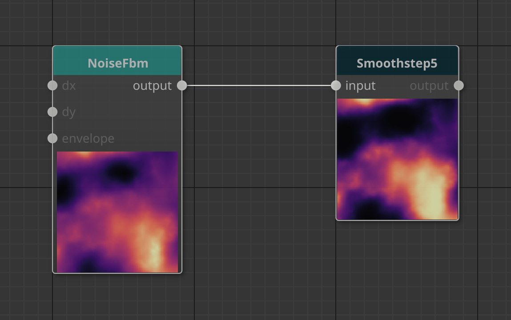  

### Category

Math/Base  

### Inputs

|Name|Type|Description|
| :--- | :--- | :--- |
|input|HeightMapData|Input heightmap.|
  

### Outputs

|Name|Type|Description|
| :--- | :--- | :--- |
|output|HeightMapData|Output heightmap.|
  

### Parameters

|Name|Type|Description|
| :--- | :--- | :--- |

## Step

Step is function used to represent a conceptualized escarpment, it serves as a tool for creating sharp, distinct changes in elevation.

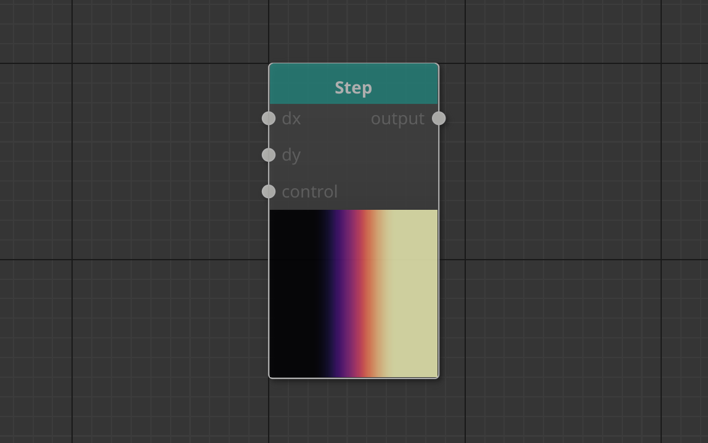  

### Category

Primitive/Function  

### Inputs

|Name|Type|Description|
| :--- | :--- | :--- |
|dr|HeightMapData|Displacement with respect to the domain size (normal direction).|
  

### Outputs

|Name|Type|Description|
| :--- | :--- | :--- |
|output|HeightMapData|Step heightmap.|
  

### Parameters

|Name|Type|Description|
| :--- | :--- | :--- |
|angle|Float|Angle.|
|center.x|Float|Center x coordinate.|
|center.y|Float|Center y coordinate.|
|talus_global|Float|Step slope.|

## Stratify

Stratify adds horizontal stratifications to the input heightmap.

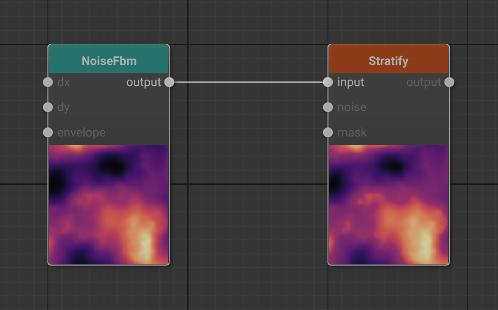  

### Category

Erosion/Stratify  

### Inputs

|Name|Type|Description|
| :--- | :--- | :--- |
|input|HeightMapData|Input heightmap.|
|noise|HeightMapData|Local elevation noise, value range expected to be scaled with the one of the input heightmap.|
|mask|HeightMapData|Mask defining the filtering intensity (expected in [0, 1]).|
  

### Outputs

|Name|Type|Description|
| :--- | :--- | :--- |
|output|HeightMapData|Eroded heightmap.|
  

### Parameters

|Name|Type|Description|
| :--- | :--- | :--- |
|gamma|Float|Reference value for the gamma correction applied to each strata, influence the cliff elevation profile.|
|gamma_noise|Float|Noise range for the gamma value.|
|n_strata|Integer|Numbner of strata.|
|seed|Random seed|Random seed number.|
|strata_noise|Float|Noise range for the strata elevations.|

## StratifyOblique

StratifyOblique adds oblique stratifications to the input heightmap.

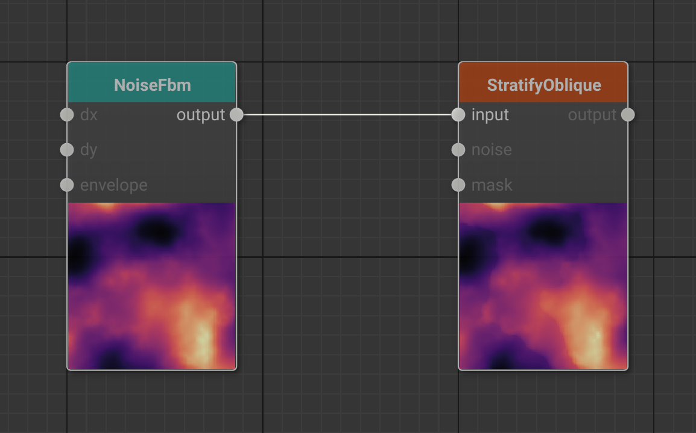  

### Category

Erosion/Stratify  

### Inputs

|Name|Type|Description|
| :--- | :--- | :--- |
|input|HeightMapData|Input heightmap.|
|noise|HeightMapData|Local elevation noise, value range expected to be scaled with the one of the input heightmap.|
|mask|HeightMapData|Mask defining the filtering intensity (expected in [0, 1]).|
  

### Outputs

|Name|Type|Description|
| :--- | :--- | :--- |
|output|HeightMapData|Eroded heightmap.|
  

### Parameters

|Name|Type|Description|
| :--- | :--- | :--- |
|angle|Float|Angle in the horizontal plane.|
|gamma|Float|Reference value for the gamma correction applied to each strata, influence the cliff elevation profile.|
|gamma_noise|Float|Noise range for the gamma value.|
|n_strata|Integer|Numbner of strata.|
|seed|Random seed|Random seed number.|
|strata_noise|Float|Noise range for the strata elevations.|
|talus_global|Float|Step slope.|

## ValleyWidth

ValleyWidth identifies valley lines and measure the width of the valley at each cross-section.

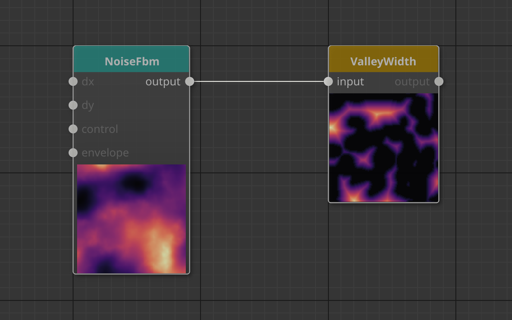  

### Category

Features  

### Inputs

|Name|Type|Description|
| :--- | :--- | :--- |
|input|HeightMapData|Input heightmap.|
  

### Outputs

|Name|Type|Description|
| :--- | :--- | :--- |
|output|HeightMapData|Valley width heightmap.|
  

### Parameters

|Name|Type|Description|
| :--- | :--- | :--- |
|radius|Float|Filter radius with respect to the domain size.|

## WaveDune

WaveDune mimics using a periodic function the formation and spatial distribution of transverse sand dunes on a terrain.

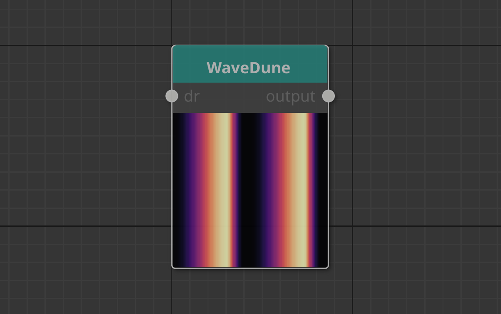  

### Category

Primitive/Function  

### Inputs

|Name|Type|Description|
| :--- | :--- | :--- |
|dr|HeightMapData|Displacement with respect to the domain size (normal direction).|
  

### Outputs

|Name|Type|Description|
| :--- | :--- | :--- |
|output|HeightMapData|WaveDune heightmap.|
  

### Parameters

|Name|Type|Description|
| :--- | :--- | :--- |
|angle|Float|Angle in the horizontal plane.|
|kw|Float|Noise wavenumbers (kx, ky) for each directions.|
|phase_shift|Float|Phase shift.|
|xbottom|Float|Relative position of the dune bottom, in [0, 1].|
|xtop|Float|Relative position of the dune top, in [0, 1].|

## WaveSine

WaveSine generates sine waves.

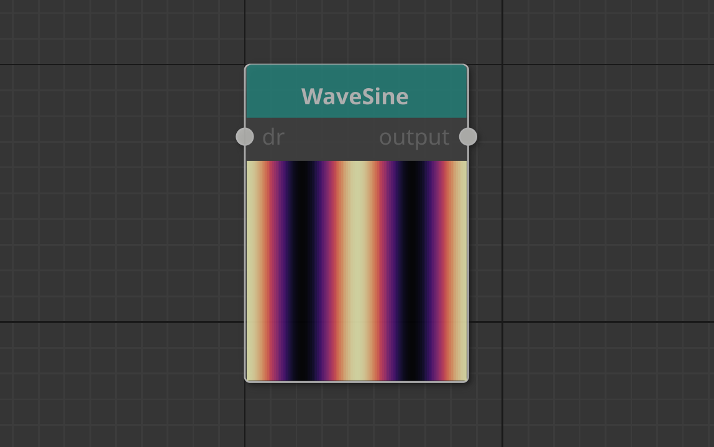  

### Category

Primitive/Function  

### Inputs

|Name|Type|Description|
| :--- | :--- | :--- |
|dr|HeightMapData|Displacement with respect to the domain size (normal direction).|
  

### Outputs

|Name|Type|Description|
| :--- | :--- | :--- |
|output|HeightMapData|WaveSine heightmap.|
  

### Parameters

|Name|Type|Description|
| :--- | :--- | :--- |
|angle|Float|Angle in the horizontal plane.|
|kw|Float|Noise wavenumbers (kx, ky) for each directions.|
|phase_shift|Float|Phase shift.|

## WaveSquare

WaveSquare generates square waves.

  

### Category

Primitive/Function  

### Inputs

|Name|Type|Description|
| :--- | :--- | :--- |
|dr|HeightMapData|Displacement with respect to the domain size (normal direction).|
  

### Outputs

|Name|Type|Description|
| :--- | :--- | :--- |
|output|HeightMapData|WaveSquare heightmap.|
  

### Parameters

|Name|Type|Description|
| :--- | :--- | :--- |
|angle|Float|Angle in the horizontal plane.|
|kw|Float|Noise wavenumbers (kx, ky) for each directions.|
|phase_shift|Float|Phase shift.|

## WaveTriangular

WaveTriangular generates triangular waves.

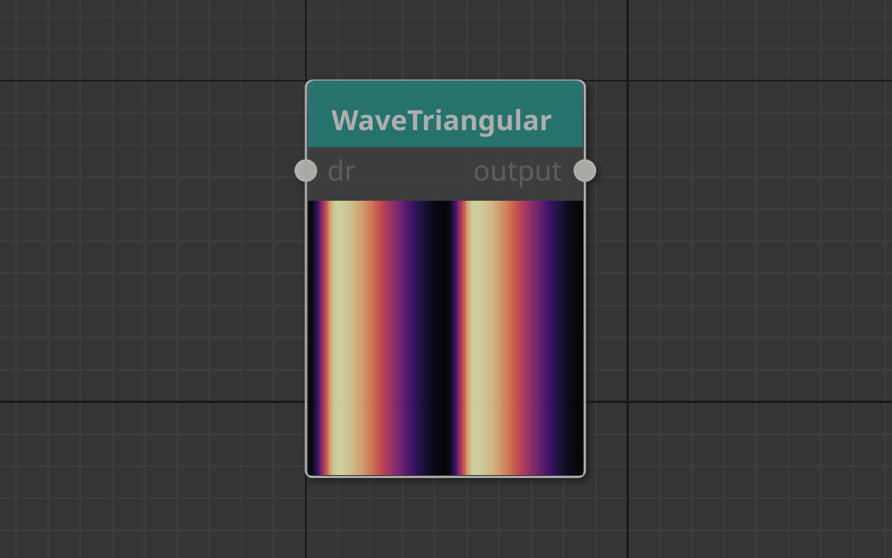  

### Category

Primitive/Function  

### Inputs

|Name|Type|Description|
| :--- | :--- | :--- |
|dr|HeightMapData|Displacement with respect to the domain size (normal direction).|
  

### Outputs

|Name|Type|Description|
| :--- | :--- | :--- |
|output|HeightMapData|WaveTriangular heightmap.|
  

### Parameters

|Name|Type|Description|
| :--- | :--- | :--- |
|angle|Float|Angle in the horizontal plane.|
|kw|Float|Noise wavenumbers (kx, ky) for each directions.|
|phase_shift|Float|Phase shift.|
|slant_ratio|Float|Decides on wave asymmetry, expected in [0, 1].|

## White

White noise operator generates a random signal with a flat power spectral density.

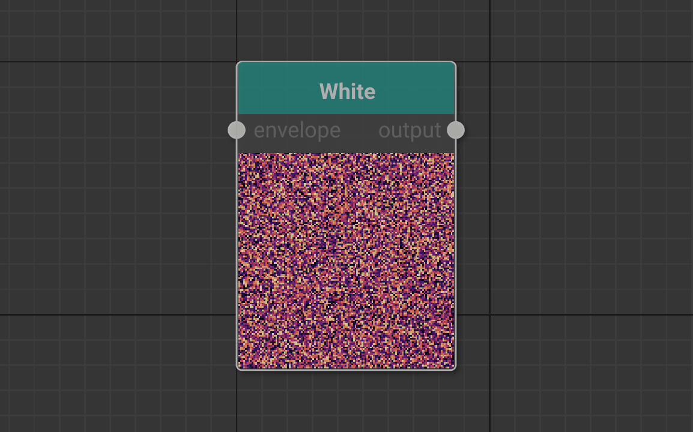  

### Category

Primitive/Random  

### Inputs

|Name|Type|Description|
| :--- | :--- | :--- |
|envelope|HeightMapData|Output noise amplitude envelope.|
  

### Outputs

|Name|Type|Description|
| :--- | :--- | :--- |
|output|HeightMapData|Generated noise.|
  

### Parameters

|Name|Type|Description|
| :--- | :--- | :--- |
|seed|Random seed|Random seed number.|

## ZeroedEdges

ZeroedEdges is an operator that enforces values close to zero at the domain edges.

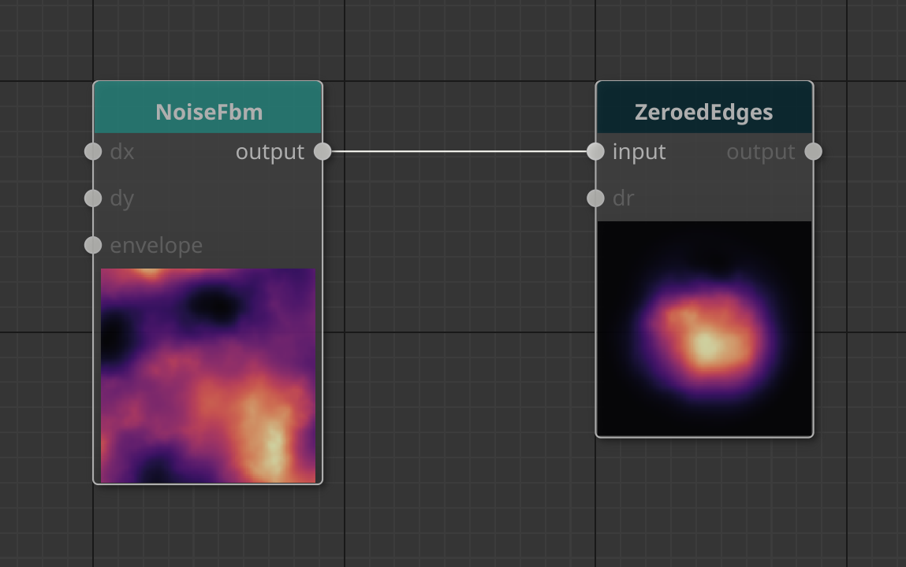  

### Category

Math/Boundaries  

### Inputs

|Name|Type|Description|
| :--- | :--- | :--- |
|input|HeightMapData|Input heightmap.|
|dr|HeightMapData|Mask defining the filtering intensity (expected in [0, 1]).|
  

### Outputs

|Name|Type|Description|
| :--- | :--- | :--- |
|output|HeightMapData|Filtered heightmap.|
  

### Parameters

|Name|Type|Description|
| :--- | :--- | :--- |
|sigma|Float|Shape half-width.|
