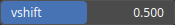

Abs Node
========

Apply an absolute function to every values.

# Category

Math/Base
# Inputs

|Name|Type|Description|
| :--- | :--- | :--- |
|input|Heightmap|Input heightmap.|

# Outputs

|Name|Type|Description|
| :--- | :--- | :--- |
|output|Heightmap|Output heightmap.|

# Parameters

|Name|Type|Description|
| :--- | :--- | :--- |
|vshift|Float|Reference value for the zero-equivalent value of the absolute value.|

# Example

No example available.