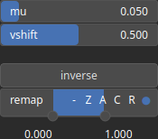

AbsSmooth Node
==============

Apply a smooth absolute value function to every values. The smooth absolute operator computes the absolute value of an input while providing a smooth transition around zero, ensuring continuity and smoothness in the output.

# Category

Math/Base
# Inputs

|Name|Type|Description|
| :--- | :--- | :--- |
|input|Heightmap|Input heightmap.|

# Outputs

|Name|Type|Description|
| :--- | :--- | :--- |
|output|Heightmap|Output heightmap.|

# Parameters

|Name|Type|Description|
| :--- | :--- | :--- |
|mu|Float|Smoothing intensity.|
|Gain|Float|No description|
|Invert Output|Bool|No description|
|Mix Factor|Float|No description|
|Mix Method|Enumeration|No description|
|Remap Range|Value range|No description|
|Saturation Range|Value range|No description|
|Smoothing Radius|Float|No description|
|vshift|Float|Reference value for the zero-equivalent value of the absolute value.|

# Example

No example available.  
# Note

Automatically included.
