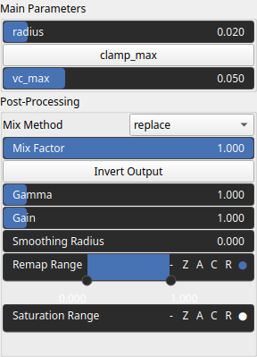

AccumulationCurvature Node
==========================

Computes the accumulation curvature of a heightmap, indicating how terrain shape influences water flow. Positive values suggest converging flow (e.g., channels or valleys), while negative values indicate diverging flow (e.g., ridges or hilltops).

# Category

Features/Landform
# Inputs

|Name|Type|Description|
| :--- | :--- | :--- |
|input|Heightmap|Input heightmap used for accumulation curvature analysis.|

# Outputs

|Name|Type|Description|
| :--- | :--- | :--- |
|output|Heightmap|Computed accumulation curvature of the input heightmap.|

# Parameters

|Name|Type|Description|
| :--- | :--- | :--- |
|clamp_max|Bool|No description|
|Gain|Float|Set the gain. Gain is a power law transformation altering the distribution of signal values, compressing or expanding certain regions of the signal depending on the exponent of the power law.|
|Gamma|Float|No description|
|Invert Output|Bool|Inverts the output values after processing, flipping low and high values across the midrange.|
|Remap Range|Value range|Linearly remaps the output values to a specified target range (default is [0, 1]).|
|Saturation Range|Value range|Modifies the amplitude of elevations by first clamping them to a given interval and then scaling them so that the restricted interval matches the original input range. This enhances contrast in elevation variations while maintaining overall structure.|
|Smoothing Radius|Float|Defines the radius for post-processing smoothing, determining the size of the neighborhood used to average local values and reduce high-frequency detail. A radius of 0 disables smoothing.|
|radius|Float|Defines the filter radius relative to the domain size, controlling the scale of curvature analysis.|
|vc_max|Float|No description|

# Example

No example available.