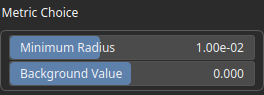

AreaRemove Node
===============

Removes connected regions whose area is below a threshold. The threshold is defined indirectly using a radius parameter, which is converted internally into an equivalent surface. The filter does not operate on a geometric radius directly, but on the area derived from it.

# Category

Operator/Morphology
# Inputs

|Name|Type|Description|
| :--- | :--- | :--- |
|input|VirtualArray|Input scalar field or mask in which connected regions are analyzed.|

# Outputs

|Name|Type|Description|
| :--- | :--- | :--- |
|output|VirtualArray|Output field where regions smaller than the computed area threshold have been removed.|

# Parameters

|Name|Type|Description|
| :--- | :--- | :--- |
|Background Value|Float|Value considered as background. Regions matching this value are treated as empty and ignored during area evaluation.|
|Minimum Radius|Float|Minimum equivalent radius used to compute the area threshold. Internally, this radius is converted to a surface, and regions with an area smaller than this value are removed.|

# Example

No example available.  
