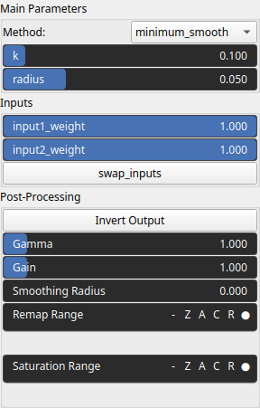

Blend Node
==========

The Blend operator takes two input heightmaps.

# Category

Operator/Blend
# Inputs

|Name|Type|Description|
| :--- | :--- | :--- |
|input 1|VirtualArray|Input heightmap.|
|input 2|VirtualArray|Input heightmap.|

# Outputs

|Name|Type|Description|
| :--- | :--- | :--- |
|output|VirtualArray|Output heightmap.|

# Parameters

|Name|Type|Description|
| :--- | :--- | :--- |
|Method:|Enumeration|Blending method. Available values: add, exclusion, gradients, maximum, maximum_smooth, minimum, minimum_smooth, multiply, multiply_add, negate, overlay, soft, substract.|
|input1_weight|Float|No description|
|input2_weight|Float|No description|
|k|Float|Smoothing intensity (if any).|
|Gain|Float|Mid-centered gain transformation applied to the elevation values. This is a non-linear recurve operator centered around the mid elevation (typically 0.5). Increasing the gain pushes values toward the minimum and maximum elevations, creating flatter low/high regions with a steeper transition around the midpoint.|
|Gamma|Float|Standard gamma correction applied to the elevation values. This is a monotonic power-law remapping that shifts emphasis toward low or high elevations, making the overall shape sharper or bulkier without changing its ordering.|
|Invert Output|Bool|Inverts the output values after processing, flipping low and high values across the midrange.|
|Remap Range|Value range|Linearly remaps the output values to a specified target range (default is [0, 1]).|
|Saturation Range|Value range|Modifies the amplitude of elevations by first clamping them to a given interval and then scaling them so that the restricted interval matches the original input range. This enhances contrast in elevation variations while maintaining overall structure.|
|Smoothing Radius|Float|Defines the radius for post-processing smoothing, determining the size of the neighborhood used to average local values and reduce high-frequency detail. A radius of 0 disables smoothing.|
|radius|Float|Filter radius with respect to the domain size (if any).|
|swap_inputs|Bool|No description|

# Example

No example available.