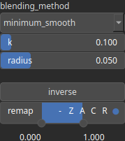

Blend Node
==========

The Blend operator takes two input heightmaps.

# Category

Operator/Blend
# Inputs

|Name|Type|Description|
| :--- | :--- | :--- |
|input 1|Heightmap|Input heightmap.|
|input 2|Heightmap|Input heightmap.|

# Outputs

|Name|Type|Description|
| :--- | :--- | :--- |
|output|Heightmap|Output heightmap.|

# Parameters

|Name|Type|Description|
| :--- | :--- | :--- |
|blending_method|Enumeration|Blending method. Available values: add, exclusion, gradients, maximum, maximum_smooth, minimum, minimum_smooth, multiply, multiply_add, negate, overlay, soft, substract.|
|input1_weight|Float|No description|
|input2_weight|Float|No description|
|inverse|Bool|Toggle inversion of the output values.|
|k|Float|Smoothing intensity (if any).|
|radius|Float|Filter radius with respect to the domain size (if any).|
|remap|Value range|Remap the operator's output to a specified range, defaulting to [0, 1].|
|swap_inputs|Bool|No description|

# Example

No example available.