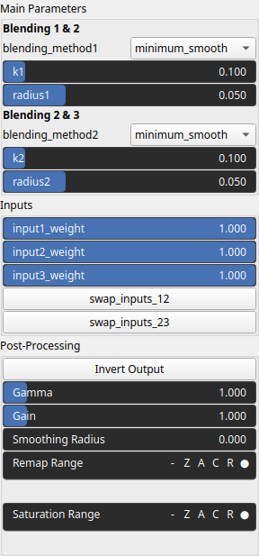

Blend3 Node
===========

No description available

# Category

Operator/Blend
# Inputs

|Name|Type|Description|
| :--- | :--- | :--- |
|input 1|Heightmap|No description|
|input 2|Heightmap|No description|
|input 3|Heightmap|No description|

# Outputs

|Name|Type|Description|
| :--- | :--- | :--- |
|output|Heightmap|No description|

# Parameters

|Name|Type|Description|
| :--- | :--- | :--- |
|blending_method1|Enumeration|No description|
|blending_method2|Enumeration|No description|
|input1_weight|Float|No description|
|input2_weight|Float|No description|
|input3_weight|Float|No description|
|inverse|Bool|No description|
|k1|Float|No description|
|k2|Float|No description|
|radius1|Float|No description|
|radius2|Float|No description|
|remap|Value range|No description|
|swap_inputs_12|Bool|No description|
|swap_inputs_23|Bool|No description|

# Example

No example available.