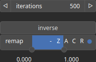

BlendPoissonBf Node
===================

TODO

# Category

Operator/Blend
# Inputs

|Name|Type|Description|
| :--- | :--- | :--- |
|input 1|Heightmap|Primary heightmap input.|
|input 2|Heightmap|Secondary heightmap input for blending.|
|mask|Heightmap|Mask heightmap controlling blending regions.|

# Outputs

|Name|Type|Description|
| :--- | :--- | :--- |
|output|Heightmap|Resulting heightmap after Poisson blending.|

# Parameters

|Name|Type|Description|
| :--- | :--- | :--- |
|inverse|Bool|Toggle inversion of the output values.|
|iterations|Integer|Number of solver iterations for the Poisson blending process.|
|remap|Value range|Remap the operator's output to a specified range, defaulting to [0, 1].|

# Example

No example available.