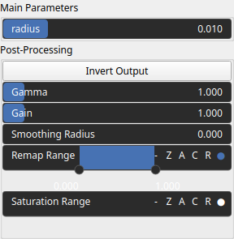

Border Node
===========

Highlights terrain boundaries by subtracting the eroded version of a DEM from the original. Useful for detecting ridges, valleys, and sharp elevation transitions in terrain analysis.

# Category

Operator/Morphology
# Inputs

|Name|Type|Description|
| :--- | :--- | :--- |
|input|Heightmap|Heightmap input on which the morphological border operation is applied.|

# Outputs

|Name|Type|Description|
| :--- | :--- | :--- |
|output|Heightmap|Resulting heightmap after computing the morphological border.|

# Parameters

|Name|Type|Description|
| :--- | :--- | :--- |
|Gain|Float|No description|
|Invert Output|Bool|No description|
|Remap Range|Value range|No description|
|Saturation Range|Value range|No description|
|Smoothing Radius|Float|No description|
|radius|Float|Filter radius with respect to the domain size.|

# Example

No example available.