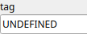

Broadcast Node
==============

Makes the input heightmap available to other graph nodes using a shared tag.

# Category

Routing
# Inputs

|Name|Type|Description|
| :--- | :--- | :--- |
|input|Heightmap|Heightmap data to be shared with other graph nodes.|

# Outputs

|Name|Type|Description|
| :--- | :--- | :--- |
|thru|Heightmap|Pass-through of the input heightmap, unchanged.|

# Parameters

|Name|Type|Description|
| :--- | :--- | :--- |
|tag|String|Identifier used to reference this heightmap in other graph nodes.|

# Example

No example available.