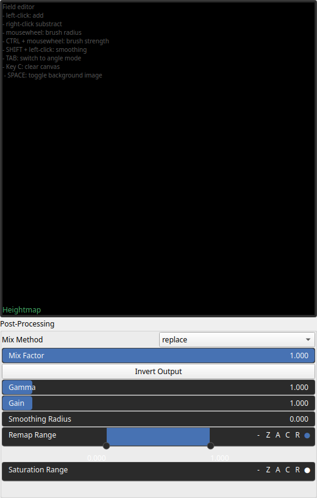

Brush Node
==========

A manual brush tool for directly painting heightmaps, allowing interactive terrain editing.

# Category

Primitive/Authoring
# Outputs

|Name|Type|Description|
| :--- | :--- | :--- |
|out|Heightmap|The generated heightmap from brush strokes.|

# Parameters

|Name|Type|Description|
| :--- | :--- | :--- |
|Heightmap|Array|The heightmap data representing the painted terrain.|
|post_gain|Float|Set the gain. Gain is a power law transformation altering the distribution of signal values, compressing or expanding certain regions of the signal depending on the exponent of the power law.|
|post_inverse|Bool|Inverts the output values after processing, flipping low and high values across the midrange.|
|post_remap|Value range|Linearly remaps the output values to a specified target range (default is [0, 1]).|
|post_smoothing_radius|Float|Defines the radius for post-processing smoothing, determining the size of the neighborhood used to average local values and reduce high-frequency detail. A radius of 0 disables smoothing.|

# Example

No example available.