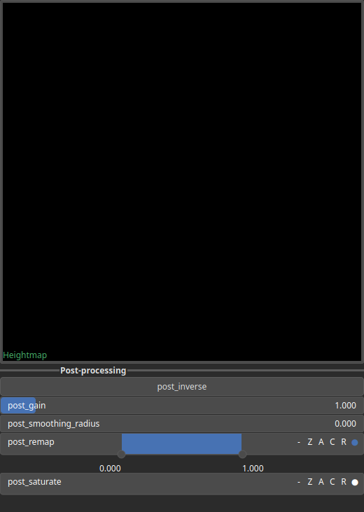

Brush Node
==========

A manual brush tool for directly painting heightmaps, allowing interactive terrain editing.

# Category

Primitive/Authoring
# Inputs

|Name|Type|Description|
| :--- | :--- | :--- |
|background|Heightmap|No description|

# Outputs

|Name|Type|Description|
| :--- | :--- | :--- |
|out|Heightmap|The generated heightmap from brush strokes.|

# Parameters

|Name|Type|Description|
| :--- | :--- | :--- |
|Heightmap|Array|The heightmap data representing the painted terrain.|
|Gain|Float|Set the gain. Gain is a power law transformation altering the distribution of signal values, compressing or expanding certain regions of the signal depending on the exponent of the power law.|
|Gamma|Float|No description|
|Invert Output|Bool|Inverts the output values after processing, flipping low and high values across the midrange.|
|Mix Factor|Float|No description|
|Mix Method|Enumeration|No description|
|Remap Range|Value range|Linearly remaps the output values to a specified target range (default is [0, 1]).|
|Saturation Range|Value range|Modifies the amplitude of elevations by first clamping them to a given interval and then scaling them so that the restricted interval matches the original input range. This enhances contrast in elevation variations while maintaining overall structure.|
|Smoothing Radius|Float|Defines the radius for post-processing smoothing, determining the size of the neighborhood used to average local values and reduce high-frequency detail. A radius of 0 disables smoothing.|

# Example

No example available.