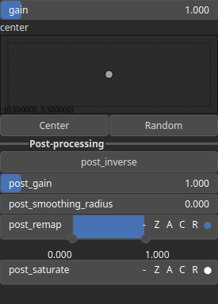

Bump Node
=========

Bump generates a smooth transitions between zero-valued boundaries and the center of the domain.

# Category

Primitive/Function
# Inputs

|Name|Type|Description|
| :--- | :--- | :--- |
|control|Heightmap|Control parameter, acts as a multiplier for the weight parameter.|
|dx|Heightmap|Displacement with respect to the domain size (x-direction).|
|dy|Heightmap|Displacement with respect to the domain size (y-direction).|
|envelope|Heightmap|No description|

# Outputs

|Name|Type|Description|
| :--- | :--- | :--- |
|output|Heightmap|Bump heightmap.|

# Parameters

|Name|Type|Description|
| :--- | :--- | :--- |
|center|Vec2Float|Reference center within the heightmap.|
|gain|Float|Shape control parameter.|
|post_gain|Float|No description|
|post_inverse|Bool|No description|
|post_remap|Value range|No description|
|post_smoothing_radius|Float|No description|

# Example

