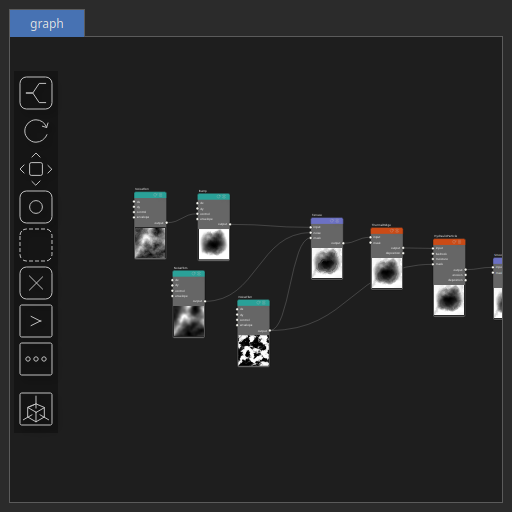

Bump Node
=========

Bump generates a smooth transitions between zero-valued boundaries and the center of the domain.

# Category

Primitive/Function
# Inputs

|Name|Type|Description|
| :--- | :--- | :--- |
|control|Heightmap|Control parameter, acts as a multiplier for the weight parameter.|
|dx|Heightmap|Displacement with respect to the domain size (x-direction).|
|dy|Heightmap|Displacement with respect to the domain size (y-direction).|
|envelope|Heightmap|Output noise amplitude envelope.|

# Outputs

|Name|Type|Description|
| :--- | :--- | :--- |
|output|Heightmap|Bump heightmap.|

# Parameters

|Name|Type|Description|
| :--- | :--- | :--- |
|center|Vec2Float|Reference center within the heightmap.|
|gain|Float|Shape control parameter.|
|post_gain|Float|Set the gain. Gain is a power law transformation altering the distribution of signal values, compressing or expanding certain regions of the signal depending on the exponent of the power law.|
|post_inverse|Bool|Inverts the output values after processing, flipping low and high values across the midrange.|
|post_remap|Value range|Linearly remaps the output values to a specified target range (default is [0, 1]).|
|post_smoothing_radius|Float|Defines the radius for post-processing smoothing, determining the size of the neighborhood used to average local values and reduce high-frequency detail. A radius of 0 disables smoothing.|

# Example

[Bump.hsd](../images/nodes/Bump.hsd)

