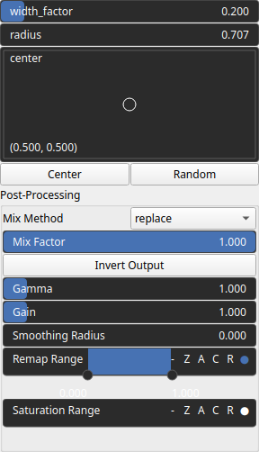
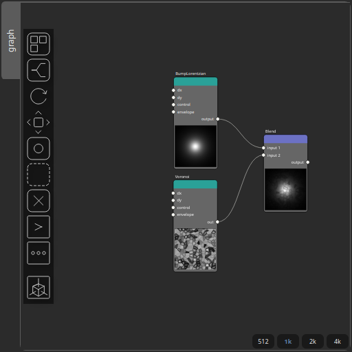

BumpLorentzian Node
===================

No description available

# Category

Primitive/Function
# Inputs

|Name|Type|Description|
| :--- | :--- | :--- |
|control|Heightmap|Control parameter, acts as a multiplier for the weight parameter.|
|dx|Heightmap|Displacement with respect to the domain size (x-direction).|
|dy|Heightmap|Displacement with respect to the domain size (y-direction).|
|envelope|Heightmap|Heightmap used as a post-process amplitude multiplier for the generated noise.|

# Outputs

|Name|Type|Description|
| :--- | :--- | :--- |
|output|Heightmap|Filtered heightmap.|

# Parameters

|Name|Type|Description|
| :--- | :--- | :--- |
|center|Vec2Float|Reference center within the heightmap.|
|Gain|Float|Set the gain. Gain is a power law transformation altering the distribution of signal values, compressing or expanding certain regions of the signal depending on the exponent of the power law.|
|Gamma|Float|No description|
|Invert Output|Bool|Inverts the output values after processing, flipping low and high values across the midrange.|
|Mix Factor|Float|No description|
|Mix Method|Enumeration|No description|
|Remap Range|Value range|Linearly remaps the output values to a specified target range (default is [0, 1]).|
|Saturation Range|Value range|Modifies the amplitude of elevations by first clamping them to a given interval and then scaling them so that the restricted interval matches the original input range. This enhances contrast in elevation variations while maintaining overall structure.|
|Smoothing Radius|Float|Defines the radius for post-processing smoothing, determining the size of the neighborhood used to average local values and reduce high-frequency detail. A radius of 0 disables smoothing.|
|radius|Float|Filter radius with respect to the domain size.|
|width_factor|Float|No description|

# Example

Corresponding Hesiod file: [BumpLorentzian.hsd](../../examples/BumpLorentzian.hsd). Use [Ctrl+I] in the node editor to import a hsd file within your current project. 

> **Note:** Example files are kept up-to-date with the latest version of [Hesiod](https://github.com/otto-link/Hesiod).
> If you find an error, please [open an issue](https://github.com/otto-link/Hesiod/issues).

