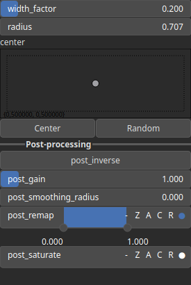

BumpLorentzian Node
===================

No description available

# Category

Primitive/Function
# Inputs

|Name|Type|Description|
| :--- | :--- | :--- |
|control|Heightmap|No description|
|dx|Heightmap|No description|
|dy|Heightmap|No description|
|envelope|Heightmap|No description|

# Outputs

|Name|Type|Description|
| :--- | :--- | :--- |
|output|Heightmap|No description|

# Parameters

|Name|Type|Description|
| :--- | :--- | :--- |
|center|Vec2Float|No description|
|post_gain|Float|No description|
|post_inverse|Bool|No description|
|post_remap|Value range|No description|
|post_smoothing_radius|Float|No description|
|radius|Float|No description|
|width_factor|Float|No description|

# Example

