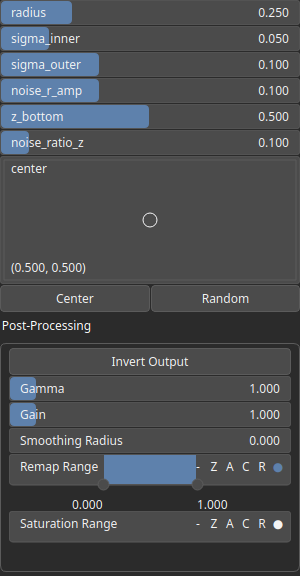

Caldera Node
============

Caldera generates a volcanic caldera landscape.

# Category

Primitive/Geological
# Inputs

|Name|Type|Description|
| :--- | :--- | :--- |
|dr|VirtualArray|Displacement with respect to the domain size (normal direction).|

# Outputs

|Name|Type|Description|
| :--- | :--- | :--- |
|output|VirtualArray|Caldera heightmap.|

# Parameters

|Name|Type|Description|
| :--- | :--- | :--- |
|center|Vec2Float|Reference center within the heightmap.|
|noise_r_amp|Float|Noise amplitude for the radial displacement.|
|noise_ratio_z|Float|Noise amplitude for the vertical displacement.|
|Gain|Float|Mid-centered gain transformation applied to the elevation values. This is a non-linear recurve operator centered around the mid elevation (typically 0.5). Increasing the gain pushes values toward the minimum and maximum elevations, creating flatter low/high regions with a steeper transition around the midpoint.|
|Gamma|Float|Standard gamma correction applied to the elevation values. This is a monotonic power-law remapping that shifts emphasis toward low or high elevations, making the overall shape sharper or bulkier without changing its ordering.|
|Invert Output|Bool|Inverts the output values after processing, flipping low and high values across the midrange.|
|Remap Range|Value range|Linearly remaps the output values to a specified target range (default is [0, 1]).|
|Saturation Range|Value range|Modifies the amplitude of elevations by first clamping them to a given interval and then scaling them so that the restricted interval matches the original input range. This enhances contrast in elevation variations while maintaining overall structure.|
|Smoothing Radius|Float|Defines the radius for post-processing smoothing, determining the size of the neighborhood used to average local values and reduce high-frequency detail. A radius of 0 disables smoothing.|
|radius|Float|Crater radius.|
|sigma_inner|Float|Crater inner lip half-width.|
|sigma_outer|Float|Crater outer lip half-width.|
|z_bottom|Float|Crater bottom elevation.|

# Example

No example available.  
