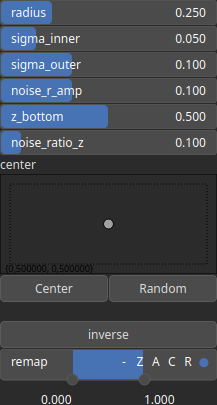

Caldera Node
============

Caldera generates a volcanic caldera landscape.

# Category

Primitive/Geological
# Inputs

|Name|Type|Description|
| :--- | :--- | :--- |
|dr|Heightmap|Displacement with respect to the domain size (normal direction).|

# Outputs

|Name|Type|Description|
| :--- | :--- | :--- |
|output|Heightmap|Caldera heightmap.|

# Parameters

|Name|Type|Description|
| :--- | :--- | :--- |
|center|Vec2Float|Reference center within the heightmap.|
|inverse|Bool|Toggle inversion of the output values.|
|noise_r_amp|Float|Noise amplitude for the radial displacement.|
|noise_ratio_z|Float|Noise amplitude for the vertical displacement.|
|radius|Float|Crater radius.|
|remap|Value range|Remap the operator's output to a specified range, defaulting to [0, 1].|
|sigma_inner|Float|Crater inner lip half-width.|
|sigma_outer|Float|Crater outer lip half-width.|
|z_bottom|Float|Crater bottom elevation.|

# Example

