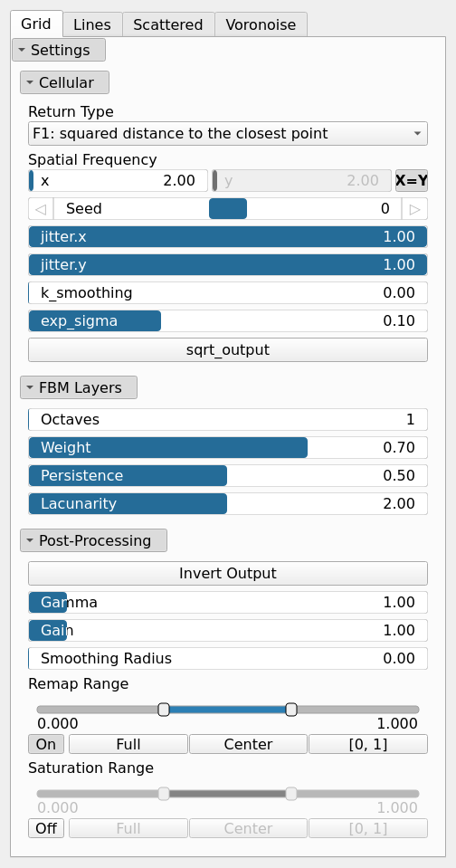
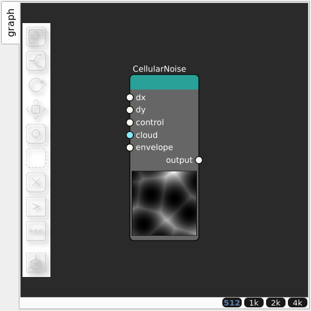

CellularNoise Node
==================

Generates cellular (Voronoi-type) noise. Unifies the former Voronoi/Voronoise/Vorolines/VorolinesFbm/Vororand nodes: the cellular variant is selected by the settings group, with the base parameters shared between variants.

## Category

Primitive/Coherent
## Inputs

|Name|Type|Description|
| :--- | :--- | :--- |
|cloud|Cloud|Optional input cloud providing the base points of the cellular pattern; overrides the internally generated points.|
|control|VirtualArray|Control parameter, acts as a multiplier for the weight parameter.|
|dx|VirtualArray|Displacement with respect to the domain size (x-direction).|
|dy|VirtualArray|Displacement with respect to the domain size (y-direction).|
|envelope|VirtualArray|Heightmap used as a post-process amplitude multiplier for the generated noise.|

## Outputs

|Name|Type|Description|
| :--- | :--- | :--- |
|output|VirtualArray|Generated noise.|

## Parameters

Parameters common to all groups (Grid, Lines, Scattered, Voronoise):
|Name|Type|Description|
| :--- | :--- | :--- |
|Seed|Random seed number|Random seed number. The random seed is an offset to the randomized process. A different seed will produce a new result.|
|Invert Output|Bool|Inverts the output values after processing, flipping low and high values across the midrange.|
|Gamma|Float|Standard gamma correction applied to the elevation values. This is a monotonic power-law remapping that shifts emphasis toward low or high elevations, making the overall shape sharper or bulkier without changing its ordering.|
|Gain|Float|Mid-centered gain transformation applied to the elevation values. This is a non-linear recurve operator centered around the mid elevation (typically 0.5). Increasing the gain pushes values toward the minimum and maximum elevations, creating flatter low/high regions with a steeper transition around the midpoint.|
|Smoothing Radius|Float|Defines the radius for post-processing smoothing, determining the size of the neighborhood used to average local values and reduce high-frequency detail. A radius of 0 disables smoothing.|
|Remap Range|Value range|Linearly remaps the output values to a specified target range (default is [0, 1]).|
|Saturation Range|Value range|Modifies the amplitude of elevations by first clamping them to a given interval and then scaling them so that the restricted interval matches the original input range. This enhances contrast in elevation variations while maintaining overall structure.|

### Grid

|Name|Type|Description|
| :--- | :--- | :--- |
|Return Type|Enumeration|Determines the output type.|
|Spatial Frequency|Wavenumber|Base spatial frequencies in the X and Y directions. The frequencies are defined with respect to the entire domain: for example, kw = 2 produces two full oscillations across the domain width (and similarly for the Y direction).|
|jitter.x|Float|Amount of random jitter along the X-axis applied to Voronoi seed positions.|
|jitter.y|Float|Amount of random jitter along the Y-axis applied to Voronoi seed positions.|
|k_smoothing|Float|Kernel smoothing factor; controls how sharp or soft the transitions between cells are.|
|exp_sigma|Float|Exponential smoothing applied to the computed distances; higher values soften the cell boundaries.|
|sqrt_output|Bool|Applies a square root to the output distances, compressing high values and sharpening the cell interiors.|
|Octaves|Integer|The number of octaves for fractal noise generation. More octaves add finer details to the terrain.|
|Weight|Float|Controls how much higher FBM octaves contribute to the noise based on local elevation. A higher weight suppresses high-frequency octaves at low elevations and increases their influence at higher elevations, producing terrain where fine details appear mainly near peaks while lower areas remain smoother.|
|Persistence|Float|The amplitude scaling factor for subsequent noise octaves. Lower values reduce the contribution of higher octaves.|
|Lacunarity|Float|The frequency scaling factor for successive noise octaves. Higher values increase the frequency of each successive octave.|

### Lines

|Name|Type|Description|
| :--- | :--- | :--- |
|Return Type|Enumeration|Determines the output type.|
|density|Float|Number of base points per unit area used to define the cellular pattern.|
|k_smoothing|Float|Kernel smoothing factor; controls how sharp or soft the transitions between cells are.|
|exp_sigma|Float|Exponential smoothing applied to the computed distances; higher values soften the cell boundaries.|
|angle|Float|Expressed in degrees.|
|angle_span|Float|Maximum angular deviation from the base angle; controls how much the generated line orientations vary.|
|sqrt_output|Bool|Applies a square root to the output distances, compressing high values and sharpening the cell interiors.|
|Octaves|Integer|The number of octaves for fractal noise generation. More octaves add finer details to the terrain.|
|Weight|Float|Controls how much higher FBM octaves contribute to the noise based on local elevation. A higher weight suppresses high-frequency octaves at low elevations and increases their influence at higher elevations, producing terrain where fine details appear mainly near peaks while lower areas remain smoother.|
|Persistence|Float|The amplitude scaling factor for subsequent noise octaves. Lower values reduce the contribution of higher octaves.|
|Lacunarity|Float|The frequency scaling factor for successive noise octaves. Higher values increase the frequency of each successive octave.|

### Scattered

|Name|Type|Description|
| :--- | :--- | :--- |
|Return Type|Enumeration|Determines the output type.|
|density|Float|Number of base points per unit area used to define the cellular pattern.|
|variability|Float|Controls the per-cell random value variability used when coloring cells.|
|k_smoothing|Float|Kernel smoothing factor; controls how sharp or soft the transitions between cells are.|
|exp_sigma|Float|Exponential smoothing applied to the computed distances; higher values soften the cell boundaries.|
|sqrt_output|Bool|Applies a square root to the output distances, compressing high values and sharpening the cell interiors.|

### Voronoise

|Name|Type|Description|
| :--- | :--- | :--- |
|Spatial Frequency|Wavenumber|Base spatial frequencies in the X and Y directions. The frequencies are defined with respect to the entire domain: for example, kw = 2 produces two full oscillations across the domain width (and similarly for the Y direction).|
|u|Float|Jitter blending factor: 0 keeps the base points on a regular grid, 1 applies full random jitter to each cell point.|
|v|Float|Value blending factor: interpolates between hard cellular output and a smoothed per-cell value, softening the cell boundaries.|

## Example

Corresponding Hesiod file: [CellularNoise.hsd](../../examples/CellularNoise.hsd). Use [Ctrl+I] in the node editor to import a hsd file within your current project.

!!! note
    Example files are kept up-to-date with the latest version of [Hesiod](https://github.com/otto-link/Hesiod).
    If you find an error, please [open an issue](https://github.com/otto-link/Hesiod/issues).

