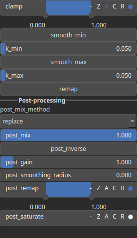

Clamp Node
==========

Clamp restrict a value within a specified range. Essentially, it ensures that a value does not exceed a defined upper limit or fall below a defined lower limit.

# Category

Filter/Range
# Inputs

|Name|Type|Description|
| :--- | :--- | :--- |
|input|Heightmap|Input heightmap.|

# Outputs

|Name|Type|Description|
| :--- | :--- | :--- |
|output|Heightmap|Clamped heightmap.|

# Parameters

|Name|Type|Description|
| :--- | :--- | :--- |
|clamp|Value range|Clamping range.|
|k_max|Float|Upper bound smoothing intensity.|
|k_min|Float|Lower bound smoothing intensity.|
|remap|Bool|Remap the operator's output to a specified range, defaulting to [0, 1].|
|smooth_max|Bool|Activate smooth clamping for the upper bound.|
|smooth_min|Bool|Activate smooth clamping for the lower bound.|

# Example

