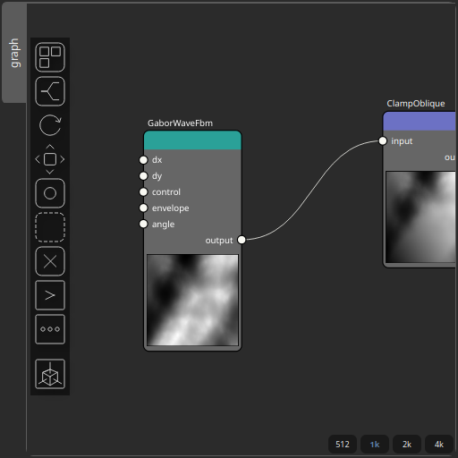

ClampOblique Node
=================

Clamps the input heightmap against an oblique plane defined by angle, slope, and center, with optional smoothing.

# Category

Filter/Range
# Inputs

|Name|Type|Description|
| :--- | :--- | :--- |
|input|Heightmap|Input heightmap or scalar field to be clamped against the oblique plane.|

# Outputs

|Name|Type|Description|
| :--- | :--- | :--- |
|output|Heightmap|Resulting heightmap after applying the oblique clamping operation.|

# Parameters

|Name|Type|Description|
| :--- | :--- | :--- |
|Angle|Float|Angle of the oblique plane, defining its orientation.|
|Center|Vec2Float|Center point of the oblique plane used for clamping.|
|Smoothing|Float|Smoothness factor controlling the softness of the clamp (0 for a sharp clamp).|
|Gain|Float|Set the gain. Gain is a power law transformation altering the distribution of signal values, compressing or expanding certain regions of the signal depending on the exponent of the power law.|
|Gamma|Float|No description|
|Invert Output|Bool|Inverts the output values after processing, flipping low and high values across the midrange.|
|Mix Factor|Float|Mixing factor for blending input and output values. A value of 0 uses only the input, 1 uses only the output, and intermediate values perform a linear interpolation.|
|Mix Method|Enumeration|Method used to combine input and output values. Options include linear interpolation (default), min, max, smooth min, smooth max, add, and subtract.|
|Remap Range|Value range|Linearly remaps the output values to a specified target range (default is [0, 1]).|
|Saturation Range|Value range|Modifies the amplitude of elevations by first clamping them to a given interval and then scaling them so that the restricted interval matches the original input range. This enhances contrast in elevation variations while maintaining overall structure.|
|Smoothing Radius|Float|Defines the radius for post-processing smoothing, determining the size of the neighborhood used to average local values and reduce high-frequency detail. A radius of 0 disables smoothing.|
|Slope|Float|Slope intensity of the oblique plane used for clamping.|
|Clamp Mode|Bool|If enabled, applies a max-clamp; otherwise applies a min-clamp.|
|Clamp Value|Float|Offset applied to the generated oblique plane before clamping.|

# Example

Corresponding Hesiod file: [ClampOblique.hsd](../../examples/ClampOblique.hsd). Use [Ctrl+I] in the node editor to import a hsd file within your current project. 

> **Note:** Example files are kept up-to-date with the latest version of [Hesiod](https://github.com/otto-link/Hesiod).
> If you find an error, please [open an issue](https://github.com/otto-link/Hesiod/issues).

