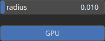

Closing Node
============

Closing is a combination of dilation followed by erosion. It is primarily used for closing small holes or gaps in mask.

# Category

Operator/Morphology
# Inputs

|Name|Type|Description|
| :--- | :--- | :--- |
|input|Heightmap|Input heightmap.|

# Outputs

|Name|Type|Description|
| :--- | :--- | :--- |
|output|Heightmap|Dilated heightmap.|

# Parameters

|Name|Type|Description|
| :--- | :--- | :--- |
|GPU|Bool|Toogle GPU acceleration on or off.|
|radius|Float|Filter radius with respect to the domain size.|

# Example

No example available.