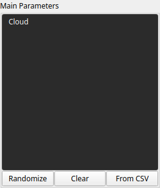

Cloud Node
==========

Set of points.

## Category

Geometry/Cloud
## Inputs

|Name|Type|Description|
| :--- | :--- | :--- |
|background|VirtualArray|Input heightmap.|

## Outputs

|Name|Type|Description|
| :--- | :--- | :--- |
|cloud|Cloud|Set of points (x, y) and elevations z.|

## Parameters

|Name|Type|Description|
| :--- | :--- | :--- |
|Cloud|Cloud|Cloud data.|

## Example

Corresponding Hesiod file: [Cloud.hsd](../../examples/Cloud.hsd). Use [Ctrl+I] in the node editor to import a hsd file within your current project.

!!! note
    Example files are kept up-to-date with the latest version of [Hesiod](https://github.com/otto-link/Hesiod).
    If you find an error, please [open an issue](https://github.com/otto-link/Hesiod/issues).

