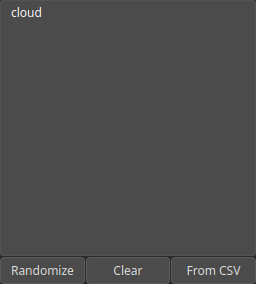

Cloud Node
==========

Set of points.

# Category

Geometry/Cloud
# Inputs

|Name|Type|Description|
| :--- | :--- | :--- |
|background|Heightmap|No description|

# Outputs

|Name|Type|Description|
| :--- | :--- | :--- |
|cloud|Cloud|Set of points (x, y) and elevations z.|

# Parameters

|Name|Type|Description|
| :--- | :--- | :--- |
|cloud|Cloud|Cloud data.|

# Example

