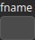

CloudFromCsv Node
=================

No description available

# Category

Geometry/Cloud
# Outputs

|Name|Type|Description|
| :--- | :--- | :--- |
|cloud|Cloud|No description|

# Parameters

|Name|Type|Description|
| :--- | :--- | :--- |
|fname|Filename|No description|

# Example

