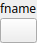

CloudFromCsv Node
=================

No description available

## Category

Geometry/Cloud
## Outputs

|Name|Type|Description|
| :--- | :--- | :--- |
|cloud|Cloud|Set of points (x, y) and elevations z.|

## Parameters

|Name|Type|Description|
| :--- | :--- | :--- |
|fname|Filename|Export file name.|

## Example

Corresponding Hesiod file: [CloudFromCsv.hsd](../../examples/CloudFromCsv.hsd). Use [Ctrl+I] in the node editor to import a hsd file within your current project.

!!! note
    Example files are kept up-to-date with the latest version of [Hesiod](https://github.com/otto-link/Hesiod).
    If you find an error, please [open an issue](https://github.com/otto-link/Hesiod/issues).

