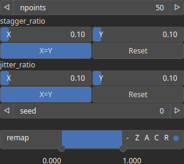

CloudLattice Node
=================

Generate a grid lattice set of points.

# Category

Geometry/Cloud
# Outputs

|Name|Type|Description|
| :--- | :--- | :--- |
|cloud|Cloud|Set of points (x, y) and elevations z.|

# Parameters

|Name|Type|Description|
| :--- | :--- | :--- |
|jitter_ratio|Wavenumber|Point jittering (noise) in x and y directions.|
|npoints|Integer|Number of points.|
|remap|Value range|Remap the operator's output to a specified range, defaulting to [0, 1].|
|Seed|Random seed number|Random seed number. The random seed is an offset to the randomized process. A different seed will produce a new result.|
|stagger_ratio|Wavenumber|Point offset in x and y directions for every two lines or columns.|

# Example

No example available.