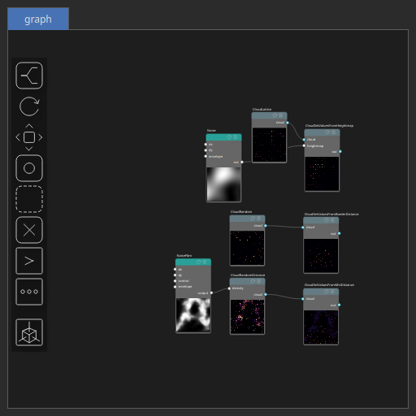

CloudRandom Node
================

Random point set: Generates a specified number of uniformly distributed random points, each with a value in [0, 1], using one of several methods: fully random (pure randomness, may cause clustering), Halton sequence (quasi-random, evenly distributed), Hammersley sequence (optimized, well-spaced for fixed point counts), or Latin hypercube sampling (stratified, uniform coverage).

# Category

Geometry/Cloud
# Outputs

|Name|Type|Description|
| :--- | :--- | :--- |
|cloud|Cloud|Set of points (x, y) and elevations z.|

# Parameters

|Name|Type|Description|
| :--- | :--- | :--- |
|method|Enumeration|Generation method.|
|npoints|Integer|Number of points.|
|remap|Value range|Remap the point values to a specified range, defaulting to [0, 1].|
|Seed|Random seed number|Random seed number. The random seed is an offset to the randomized process. A different seed will produce a new result.|

# Example

Corresponding Hesiod file: [CloudRandom.hsd](../../examples/CloudRandom.hsd). Use [Ctrl+I] in the node editor to import a hsd file within your current project. 

> **Note:** Example files are kept up-to-date with the latest version of [Hesiod](https://github.com/otto-link/Hesiod).
> If you find an error, please [open an issue](https://github.com/otto-link/Hesiod/issues).

