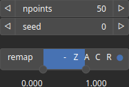

CloudRandomDensity Node
=======================

CloudRandomDensity: Generates random points based on a 2D density field in [0, 1], where the value at each location represents its density, using a fully random distribution; each point is also assigned a random value in [0, 1].

# Category

Geometry/Cloud
# Inputs

|Name|Type|Description|
| :--- | :--- | :--- |
|density|Heightmap|Output noise amplitude envelope.|

# Outputs

|Name|Type|Description|
| :--- | :--- | :--- |
|cloud|Cloud|Set of points (x, y) and elevations z.|

# Parameters

|Name|Type|Description|
| :--- | :--- | :--- |
|npoints|Integer|Number of points.|
|remap|Value range|Remap the point values output to a specified range, defaulting to [0, 1].|
|Seed|Random seed number|Random seed number. The random seed is an offset to the randomized process. A different seed will produce a new result.|

# Example

No example available.