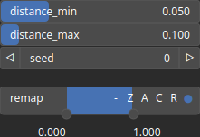

CloudRandomDistance Node
========================

No description available

# Category

Geometry/Cloud
# Inputs

|Name|Type|Description|
| :--- | :--- | :--- |
|density|Heightmap|Output noise amplitude envelope.|

# Outputs

|Name|Type|Description|
| :--- | :--- | :--- |
|cloud|Cloud|Set of points (x, y) and elevations z.|

# Parameters

|Name|Type|Description|
| :--- | :--- | :--- |
|distance_max|Float|No description|
|distance_min|Float|No description|
|remap|Value range|Remap the point values to a specified range, defaulting to [0, 1].|
|seed|Random seed number|No description|

# Example

No example available.