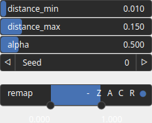

CloudRandomPowerLaw Node
========================

No description available

# Category

Geometry/Cloud
# Outputs

|Name|Type|Description|
| :--- | :--- | :--- |
|cloud|Cloud|No description|

# Parameters

|Name|Type|Description|
| :--- | :--- | :--- |
|alpha|Float|No description|
|distance_max|Float|No description|
|distance_min|Float|No description|
|remap|Value range|No description|
|seed|Random seed number|No description|

# Example

