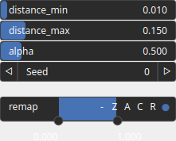

CloudRandomPowerLaw Node
========================

No description available

## Category

Geometry/Cloud
## Outputs

|Name|Type|Description|
| :--- | :--- | :--- |
|cloud|Cloud|Set of points (x, y) and elevations z.|

## Parameters

|Name|Type|Description|
| :--- | :--- | :--- |
|alpha|Float|No description|
|distance_max|Float|No description|
|distance_min|Float|No description|
|remap|Value range|Remap the point values to a specified range, defaulting to [0, 1].|
|Seed|Random seed number|Random seed number. The random seed is an offset to the randomized process. A different seed will produce a new result.|

## Example

Corresponding Hesiod file: [CloudRandomPowerLaw.hsd](../../examples/CloudRandomPowerLaw.hsd). Use [Ctrl+I] in the node editor to import a hsd file within your current project.

!!! note
    Example files are kept up-to-date with the latest version of [Hesiod](https://github.com/otto-link/Hesiod).
    If you find an error, please [open an issue](https://github.com/otto-link/Hesiod/issues).

