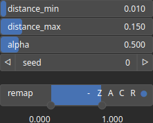

CloudRandomPowerLaw Node
========================

No description available

# Category

Geometry/Cloud
# Outputs

|Name|Type|Description|
| :--- | :--- | :--- |
|cloud|Cloud|Set of points (x, y) and elevations z.|

# Parameters

|Name|Type|Description|
| :--- | :--- | :--- |
|alpha|Float|No description|
|distance_max|Float|No description|
|distance_min|Float|No description|
|remap|Value range|Remap the operator's output to a specified range, defaulting to [0, 1].|
|seed|Random seed number|Random seed number.|

# Example

No example available.