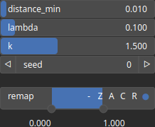

CloudRandomWeibull Node
=======================

No description available

# Category

Geometry/Cloud
# Outputs

|Name|Type|Description|
| :--- | :--- | :--- |
|cloud|Cloud|Set of points (x, y) and elevations z.|

# Parameters

|Name|Type|Description|
| :--- | :--- | :--- |
|distance_min|Float|No description|
|k|Float|Smoothing intensity (if any).|
|lambda|Float|No description|
|remap|Value range|Remap the point values to a specified range, defaulting to [0, 1].|
|Seed|Random seed number|Random seed number. The random seed is an offset to the randomized process. A different seed will produce a new result.|

# Example

No example available.