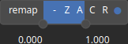

CloudRemapValues Node
=====================

CloudRemapValues remap the range of the cloud point values.

# Category

Geometry/Cloud
# Inputs

|Name|Type|Description|
| :--- | :--- | :--- |
|input|Cloud|Input cloud.|

# Outputs

|Name|Type|Description|
| :--- | :--- | :--- |
|output|Cloud|Output cloud with new value range.|

# Parameters

|Name|Type|Description|
| :--- | :--- | :--- |
|remap|Value range|Remap the operator's output to a specified range, defaulting to [0, 1].|

# Example

