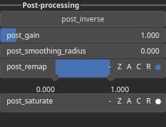

CloudSDF Node
=============

CloudSDF evaluates the signed distance function of a set of points. It assigns a signed distance value to every point in space.

# Category

Geometry/Cloud
# Inputs

|Name|Type|Description|
| :--- | :--- | :--- |
|cloud|Cloud|Input cloud.|
|dx|Heightmap|Displacement with respect to the domain size (x-direction).|
|dy|Heightmap|Displacement with respect to the domain size (y-direction).|

# Outputs

|Name|Type|Description|
| :--- | :--- | :--- |
|sdf|Heightmap|Signed distance as an heightmap.|

# Parameters

|Name|Type|Description|
| :--- | :--- | :--- |
|inverse|Bool|Toggle inversion of the output values.|
|remap|Bool|Remap the operator's output to a specified range, defaulting to [0, 1].|

# Example

