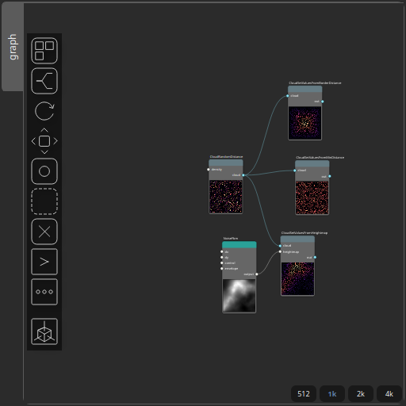

CloudSetValuesFromHeightmap Node
================================

No description available

# Category

Geometry/Cloud
# Inputs

|Name|Type|Description|
| :--- | :--- | :--- |
|cloud|Cloud|Set of points (x, y) and elevations z.|
|heightmap|Heightmap|No description|

# Outputs

|Name|Type|Description|
| :--- | :--- | :--- |
|out|Cloud|Set of points (x, y) and elevations z.|

# Example

Corresponding Hesiod file: [CloudSetValuesFromHeightmap.hsd](../../examples/CloudSetValuesFromHeightmap.hsd). 

> **Note:** Example files are kept up-to-date with the latest version of [Hesiod](https://github.com/otto-link/Hesiod).
> If you find an error, please [open an issue](https://github.com/otto-link/Hesiod/issues).

