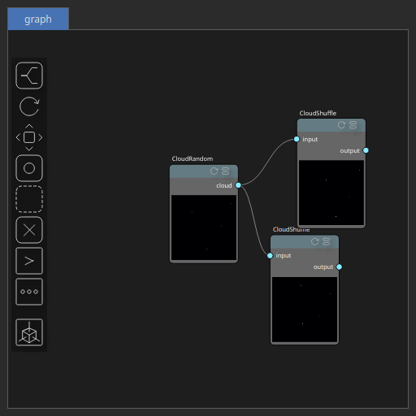

CloudShuffle Node
=================

No description available

# Category

Geometry/Cloud
# Inputs

|Name|Type|Description|
| :--- | :--- | :--- |
|input|Cloud|No description|

# Outputs

|Name|Type|Description|
| :--- | :--- | :--- |
|output|Cloud|No description|

# Parameters

|Name|Type|Description|
| :--- | :--- | :--- |
|dv|Float|No description|
|dx|Float|No description|
|dy|Float|No description|
|seed|Random seed number|No description|

# Example

Corresponding Hesiod file: [CloudShuffle.hsd](../../examples/CloudShuffle.hsd). Use [Ctrl+I] in the node editor to import a hsd file within your current project. 

> **Note:** Example files are kept up-to-date with the latest version of [Hesiod](https://github.com/otto-link/Hesiod).
> If you find an error, please [open an issue](https://github.com/otto-link/Hesiod/issues).

