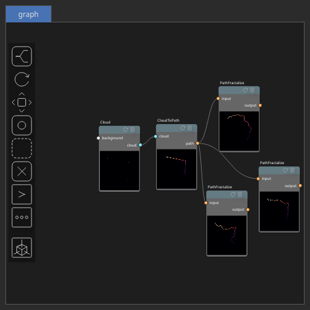

CloudToPath Node
================

CloudToPath convert a Cloud to a Path.

# Category

Geometry/Cloud
# Inputs

|Name|Type|Description|
| :--- | :--- | :--- |
|cloud|Cloud|Input cloud.|

# Outputs

|Name|Type|Description|
| :--- | :--- | :--- |
|path|Path|Output path.|

# Parameters

|Name|Type|Description|
| :--- | :--- | :--- |
|closed|Bool|Decides whether the path is open and closed on itself.|
|reorder_nns|Bool|Decides whether the path points are reordered using a nearest neighbor search.|

# Example

Corresponding Hesiod file: [CloudToPath.hsd](../../examples/CloudToPath.hsd). Use [Ctrl+I] in the node editor to import a hsd file within your current project. 

> **Note:** Example files are kept up-to-date with the latest version of [Hesiod](https://github.com/otto-link/Hesiod).
> If you find an error, please [open an issue](https://github.com/otto-link/Hesiod/issues).

