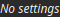

CloudToVectors Node
===================

No description available

# Category

Geometry/Cloud
# Inputs

|Name|Type|Description|
| :--- | :--- | :--- |
|cloud|Cloud|No description|

# Outputs

|Name|Type|Description|
| :--- | :--- | :--- |
|v|vector<float>|No description|
|x|vector<float>|No description|
|y|vector<float>|No description|

# Example

No example available.