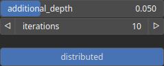
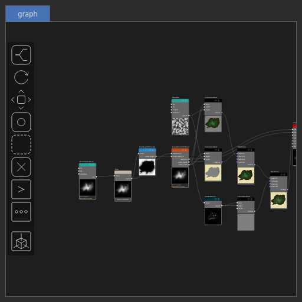

CoastalErosionDiffusion Node
============================

No description available

# Category

Erosion/Water
# Inputs

|Name|Type|Description|
| :--- | :--- | :--- |
|elevation_in|Heightmap|No description|
|water_depth_in|Heightmap|No description|

# Outputs

|Name|Type|Description|
| :--- | :--- | :--- |
|elevation|Heightmap|No description|
|water_depth|Heightmap|Output water depth map representing flooded areas.|
|water_mask|Heightmap|No description|

# Parameters

|Name|Type|Description|
| :--- | :--- | :--- |
|additional_depth|Float|No description|
|distributed|Bool|No description|
|iterations|Integer|No description|

# Example

Corresponding Hesiod file: [CoastalErosionDiffusion.hsd](../../examples/CoastalErosionDiffusion.hsd). Use [Ctrl+I] in the node editor to import a hsd file within your current project. 

> **Note:** Example files are kept up-to-date with the latest version of [Hesiod](https://github.com/otto-link/Hesiod).
> If you find an error, please [open an issue](https://github.com/otto-link/Hesiod/issues).

