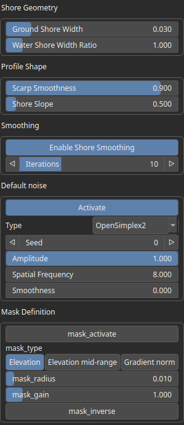
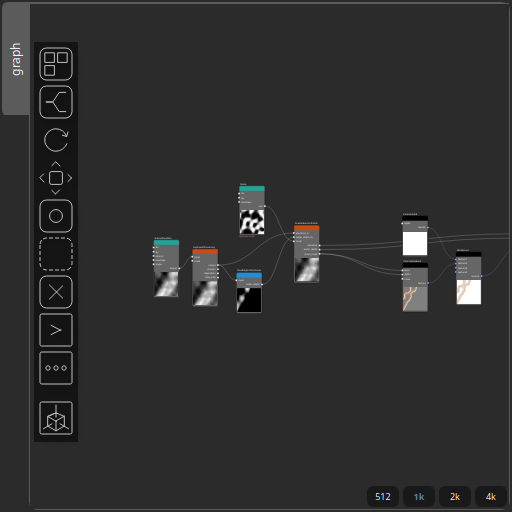

CoastalErosionProfile Node
==========================

Applies a coastal erosion profile to a terrain elevation field, carving a shoreline shape using ground- and water-distance transforms and optional post-filtering.

# Category

Erosion/Water
# Inputs

|Name|Type|Description|
| :--- | :--- | :--- |
|elevation_in|Heightmap|Input terrain elevation to which the coastal profile will be applied.|
|mask|Heightmap|Optional mask defining where the coastal transformation is allowed to operate.|
|water_depth_in|Heightmap|Input water depth map used to maintain water surface height consistency.|

# Outputs

|Name|Type|Description|
| :--- | :--- | :--- |
|elevation|Heightmap|Output modified terrain elevation after applying the coastal erosion profile.|
|shore_mask|Heightmap|Output mask (values in [0,1]) indicating the shoreline region influenced by the coastal transformation.|
|water_depth|Heightmap|Output water depth map, adjusted to preserve water surface height after terrain changes.|

# Parameters

|Name|Type|Description|
| :--- | :--- | :--- |
|Enable Shore Smoothing|Bool|If true, applies Laplacian smoothing restricted to the shoreline region after the coastal profile is applied.|
|Enable Parallel Processing|Bool|If true, distributes the computation for parallel processing of the erosion profile (may lead to artifacts in some configurations).|
|Scarp Strength|Float|Ratio in [0,1] defining how much of the ground-side profile is a vertical scarp instead of a sloped shore.|
|Ground Shore Width|Float|Horizontal extent over which the ground-side coastal profile is applied, with respect to a unit domain.|
|Water Shore Width Ratio|Float|Ratio controlling how far the underwater slope extends relative to the shore width.|
|Shore Slope|Float|Ground-side slope magnitude of the coastal profile, in elevation units per domain width.|

# Example

Corresponding Hesiod file: [CoastalErosionProfile.hsd](../../examples/CoastalErosionProfile.hsd). Use [Ctrl+I] in the node editor to import a hsd file within your current project. 

> **Note:** Example files are kept up-to-date with the latest version of [Hesiod](https://github.com/otto-link/Hesiod).
> If you find an error, please [open an issue](https://github.com/otto-link/Hesiod/issues).

