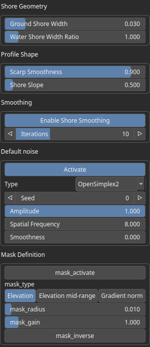
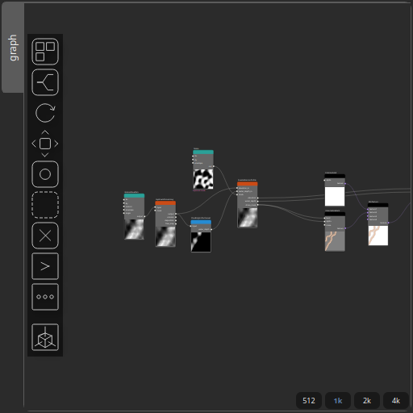

CoastalErosionProfile Node
==========================

Applies a coastal erosion profile to a terrain elevation field, carving a shoreline shape using ground- and water-distance transforms and optional post-filtering.

# Category

Erosion/Water
# Inputs

|Name|Type|Description|
| :--- | :--- | :--- |
|elevation_in|VirtualArray|Input terrain elevation to which the coastal profile will be applied.|
|mask|VirtualArray|Optional mask defining where the coastal transformation is allowed to operate.|
|noise|VirtualArray|No description|
|water_depth_in|VirtualArray|Input water depth map used to maintain water surface height consistency.|

# Outputs

|Name|Type|Description|
| :--- | :--- | :--- |
|elevation|VirtualArray|Output modified terrain elevation after applying the coastal erosion profile.|
|shore_mask|VirtualArray|Output mask (values in [0,1]) indicating the shoreline region influenced by the coastal transformation.|
|water_depth|VirtualArray|Output water depth map representing flooded areas.|

# Parameters

|Name|Type|Description|
| :--- | :--- | :--- |
|Enable Shore Smoothing|Bool|If true, applies Laplacian smoothing restricted to the shoreline region after the coastal profile is applied.|
|Activate|Bool|Enables or disables the built-in drainage noise. If an external noise input is provided, it overrides this default noise.|
|Spatial Frequency|Float|Base spatial frequencies in the X and Y directions.|
|Amplitude|Float|Noise amplitude.|
|Type|Enumeration|Noise type.|
|Seed|Random seed number|Random seed number. The random seed is an offset to the randomized process. A different seed will produce a new result.|
|Smoothness|Float|Controls the resulting smoothness of the fractal layering process.|
|mask_activate|Bool|Enables or disables the internal mask. If the node's 'mask' input is connected, this setting is bypassed and the input mask is used instead.|
|mask_gain|Float|Controls the intensity or influence of the internal mask. Bypassed if the 'mask' input is connected.|
|mask_inverse|Bool|Inverts the internal mask, applying the operator where the mask is low. Ignored if a 'mask' input is provided.|
|mask_radius|Float|Defines the smoothing radius for the internal mask. A value of 0 disables smoothing. This is bypassed if the 'mask' input is used.|
|mask_type|Choice|Specifies how the internal mask is computed: 'Elevation' uses height, 'Gradient Norm' uses slope, and 'Elevation mid-range' selects the middle portion of the height range. This parameter is ignored when a 'mask' input is connected.|
|Iterations|Integer|No description|
|Scarp Smoothness|Float|Ratio in [0,1] defining how much of the ground-side profile is a vertical scarp instead of a sloped shore.|
|Ground Shore Width|Float|Horizontal extent over which the ground-side coastal profile is applied, with respect to a unit domain.|
|Water Shore Width Ratio|Float|Ratio controlling how far the underwater slope extends relative to the shore width.|
|Shore Slope|Float|Ground-side slope magnitude of the coastal profile, in elevation units per domain width.|

# Example

Corresponding Hesiod file: [CoastalErosionProfile.hsd](../../examples/CoastalErosionProfile.hsd). Use [Ctrl+I] in the node editor to import a hsd file within your current project. 

> **Note:** Example files are kept up-to-date with the latest version of [Hesiod](https://github.com/otto-link/Hesiod).
> If you find an error, please [open an issue](https://github.com/otto-link/Hesiod/issues).

  
