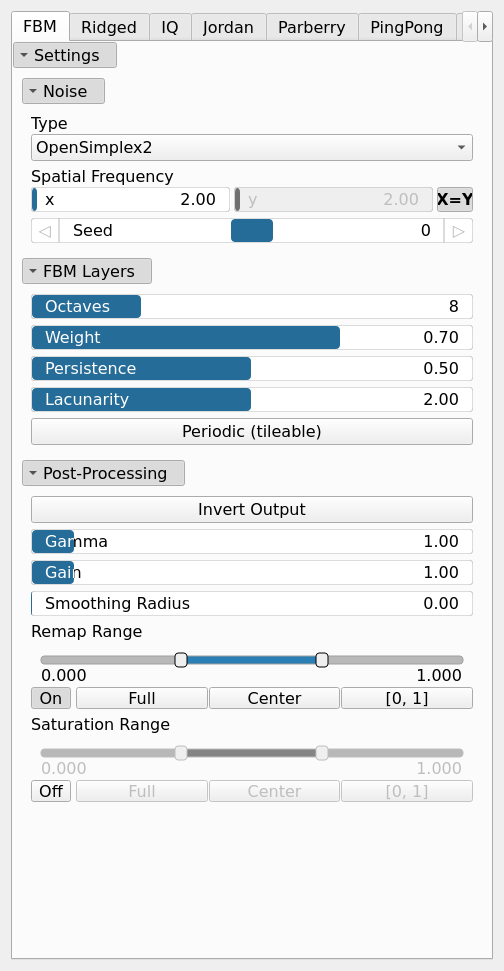
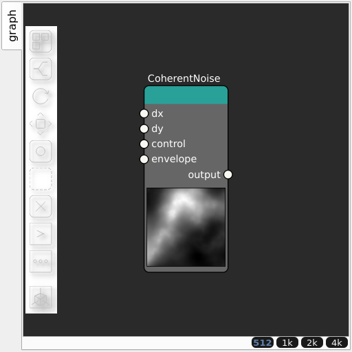

CoherentNoise Node
==================

Generates coherent fractal noise. Unifies the former Noise/NoiseFbm/NoiseRidged/NoiseIq/NoiseJordan/NoiseParberry/NoisePingpong/NoiseSwiss nodes: the fractal variant is selected by the settings group, with the base parameters shared between variants.

## Category

Primitive/Coherent
## Inputs

|Name|Type|Description|
| :--- | :--- | :--- |
|control|VirtualArray|Control parameter, acts as a multiplier for the weight parameter.|
|dx|VirtualArray|Displacement with respect to the domain size (x-direction).|
|dy|VirtualArray|Displacement with respect to the domain size (y-direction).|
|envelope|VirtualArray|Heightmap used as a post-process amplitude multiplier for the generated noise.|

## Outputs

|Name|Type|Description|
| :--- | :--- | :--- |
|output|VirtualArray|Generated noise.|

## Parameters

Parameters common to all groups (FBM, Ridged, IQ, Jordan, Parberry, PingPong, Swiss):
|Name|Type|Description|
| :--- | :--- | :--- |
|Spatial Frequency|Wavenumber|Base spatial frequencies in the X and Y directions. The frequencies are defined with respect to the entire domain: for example, kw = 2 produces two full oscillations across the domain width (and similarly for the Y direction).|
|Seed|Random seed number|Random seed number. The random seed is an offset to the randomized process. A different seed will produce a new result.|
|Octaves|Integer|The number of octaves for fractal noise generation. More octaves add finer details to the terrain.|
|Weight|Float|Controls how much higher FBM octaves contribute to the noise based on local elevation. A higher weight suppresses high-frequency octaves at low elevations and increases their influence at higher elevations, producing terrain where fine details appear mainly near peaks while lower areas remain smoother.|
|Persistence|Float|The amplitude scaling factor for subsequent noise octaves. Lower values reduce the contribution of higher octaves.|
|Lacunarity|Float|The frequency scaling factor for successive noise octaves. Higher values increase the frequency of each successive octave.|
|Invert Output|Bool|Inverts the output values after processing, flipping low and high values across the midrange.|
|Gamma|Float|Standard gamma correction applied to the elevation values. This is a monotonic power-law remapping that shifts emphasis toward low or high elevations, making the overall shape sharper or bulkier without changing its ordering.|
|Gain|Float|Mid-centered gain transformation applied to the elevation values. This is a non-linear recurve operator centered around the mid elevation (typically 0.5). Increasing the gain pushes values toward the minimum and maximum elevations, creating flatter low/high regions with a steeper transition around the midpoint.|
|Smoothing Radius|Float|Defines the radius for post-processing smoothing, determining the size of the neighborhood used to average local values and reduce high-frequency detail. A radius of 0 disables smoothing.|
|Remap Range|Value range|Linearly remaps the output values to a specified target range (default is [0, 1]).|
|Saturation Range|Value range|Modifies the amplitude of elevations by first clamping them to a given interval and then scaling them so that the restricted interval matches the original input range. This enhances contrast in elevation variations while maintaining overall structure.|

### FBM

|Name|Type|Description|
| :--- | :--- | :--- |
|Type|Enumeration|Base primitive noise. Available values: OpenSimplex2, OpenSimplex2S, Perlin, Perlin (billow), Perlin (half), Value, Value (cubic), Worley, Worley (doube), Worley (value).|
|Periodic (tileable)|Bool|When enabled the noise is made tileable: the lattice is wrapped at a period derived from kw, and kw is snapped to integer cells so the wrap aligns with the noise frequency. Applies to lattice noise types only (no effect on Simplex); seamless fbm tiling additionally requires an integer lacunarity (the default 2).|

### Ridged

|Name|Type|Description|
| :--- | :--- | :--- |
|Type|Enumeration|Base primitive noise. Available values: OpenSimplex2, OpenSimplex2S, Perlin, Perlin (billow), Perlin (half), Value, Value (cubic), Worley, Worley (doube), Worley (value).|
|k_smoothing|Float|Smoothing coefficient of the absolute value (Ridged/Swiss variants); softens the crease at the ridge lines.|

### IQ

|Name|Type|Description|
| :--- | :--- | :--- |
|Type|Enumeration|Base primitive noise. Available values: OpenSimplex2, OpenSimplex2S, Perlin, Perlin (billow), Perlin (half), Value, Value (cubic), Worley, Worley (doube), Worley (value).|
|gradient_scale|Float|Scaling of the noise gradient feedback (IQ variant); higher values deepen the valleys carved by the gradient term.|

### Jordan

|Name|Type|Description|
| :--- | :--- | :--- |
|Type|Enumeration|Base primitive noise. Available values: OpenSimplex2, OpenSimplex2S, Perlin, Perlin (billow), Perlin (half), Value, Value (cubic), Worley, Worley (doube), Worley (value).|
|warp0|Float|Initial warp scale applied at the first octave (Jordan variant); controls how strongly the noise gradients displace subsequent octaves.|
|damp0|Float|Initial damping scale applied at the first octave (Jordan variant); controls how strongly early octaves attenuate subsequent detail.|
|warp_scale|Float|Warping influence scaling.|
|damp_scale|Float|Damping scale factor applied across successive octaves (Jordan variant).|

### Parberry

|Name|Type|Description|
| :--- | :--- | :--- |
|mu|Float|Gradient magnitude exponent.|

### PingPong

|Name|Type|Description|
| :--- | :--- | :--- |
|Type|Enumeration|Base primitive noise. Available values: OpenSimplex2, OpenSimplex2S, Perlin, Perlin (billow), Perlin (half), Value, Value (cubic), Worley, Worley (doube), Worley (value).|

### Swiss

|Name|Type|Description|
| :--- | :--- | :--- |
|Type|Enumeration|Base primitive noise. Available values: OpenSimplex2, OpenSimplex2S, Perlin, Perlin (billow), Perlin (half), Value, Value (cubic), Worley, Worley (doube), Worley (value).|
|warp_scale|Float|Warping influence scaling.|

## Example

Corresponding Hesiod file: [CoherentNoise.hsd](../../examples/CoherentNoise.hsd). Use [Ctrl+I] in the node editor to import a hsd file within your current project.

!!! note
    Example files are kept up-to-date with the latest version of [Hesiod](https://github.com/otto-link/Hesiod).
    If you find an error, please [open an issue](https://github.com/otto-link/Hesiod/issues).

