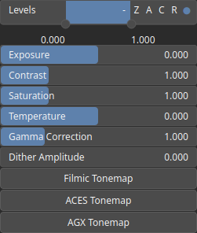

ColorAdjust Node
================

No description available

# Category

Texture
# Inputs

|Name|Type|Description|
| :--- | :--- | :--- |
|texture in|VirtualTexture|No description|

# Outputs

|Name|Type|Description|
| :--- | :--- | :--- |
|texture out|VirtualTexture|No description|

# Parameters

|Name|Type|Description|
| :--- | :--- | :--- |
|ACES Tonemap|Bool|No description|
|AGX Tonemap|Bool|No description|
|Contrast|Float|No description|
|Dither Amplitude|Float|No description|
|Exposure|Float|No description|
|Filmic Tonemap|Bool|No description|
|Gamma Correction|Float|No description|
|Levels|Value range|No description|
|Saturation|Float|No description|
|Temperature|Float|No description|

# Example

No example available.