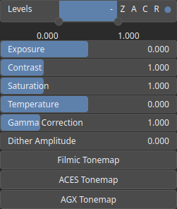

ColorAdjust Node
================

Applies color correction and tonemapping to a texture, including levels, exposure, contrast, saturation, temperature, gamma, and optional dithering.

## Category

Texture
## Inputs

|Name|Type|Description|
| :--- | :--- | :--- |
|texture_in|VirtualTexture|No description|

## Outputs

|Name|Type|Description|
| :--- | :--- | :--- |
|texture_out|VirtualTexture|No description|

## Parameters

|Name|Type|Description|
| :--- | :--- | :--- |
|ACES Tonemap|Bool|Applies ACES filmic tonemapping for high dynamic range compression.|
|AGX Tonemap|Bool|Applies AGX tonemapping with smooth contrast and saturation compression.|
|Contrast|Float|Adjusts contrast around the midrange (0.5).|
|Dither Amplitude|Float|Amount of noise added.|
|Exposure|Float|Applies exposure adjustment in stops (power-of-two scaling).|
|Filmic Tonemap|Bool|Applies simple filmic (Reinhard) tonemapping.|
|Gamma|Float|Applies gamma correction (power-law transformation).|
|Levels|Value range|Defines input value range remapping before processing (min/max normalization).|
|Saturation|Float|Controls color intensity (0 = grayscale, 1 = original).|
|Temperature|Float|Shifts color balance between warm (red) and cool (blue) tones.|

## Example

Corresponding Hesiod file: [ColorAdjust.hsd](../../examples/ColorAdjust.hsd). Use [Ctrl+I] in the node editor to import a hsd file within your current project.

!!! note
    Example files are kept up-to-date with the latest version of [Hesiod](https://github.com/otto-link/Hesiod).
    If you find an error, please [open an issue](https://github.com/otto-link/Hesiod/issues).

